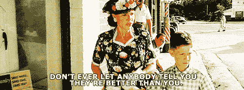
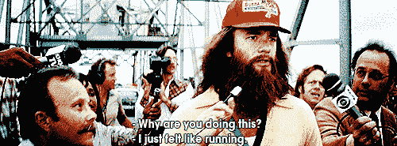
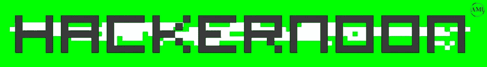

# 黑客如何开始他们的下午？

> 原文：<https://medium.com/hackernoon/how-hackers-start-their-afternoons-7d97a0478c74>

## [Hacker Noon](http://hackernoon.com) (之前是 Medium.com 的“黑客日报”)发布科技故事，how-tos，I-dids &在太平洋标准时间每天中午发布。

黑客应该如何开始他们的下午？

世界正在改变。这一直都是事实。但是看看它在过去五年里变化得有多快——乘车共享、虚拟现实、[、AirPods](https://hackernoon.com/the-age-of-apple-is-over-b4570e2a2955#.3w49a99uv) ，这一切都在发生！没有什么是停滞的。世界不会静止不动。你也不知道。

我们发布了病毒明星关于科技文化的帖子和顶级科技公司的内部观点。我们从始至终都和公司在一起。我们出版了[玛丽莎·梅耶尔带给雅虎的不能被前雅虎人](https://hackernoon.com/what-marissa-mayer-brought-to-yahoo-that-cant-be-bought-or-sold-4ee82382e4ee#.u8jl7hzbq)[买卖的东西，这是让我的整个公司由 Breather 首席执行官](https://medium.com/u/d37d27c050e6#.50w8purez)[这是当你丢失 iPhone 时苹果应该告诉你的](https://medium.com/u/8a18c164a8cf#.op9ht839r)(由[谷歌正在迫使 Routebuilder 关闭](https://medium.com/u/112d130c7c83#.t2okde8gu)(由[为什么你不应该在脸书](https://medium.com/u/745f4dd56f0#.3gaclwa00)上分享链接(由[或为风险投资公司](https://medium.com/u/f9e27197ffb5#.phmmgp3pq)诞生的成功新闻来源。这是一个成功的新闻来源，因为它为其投资社区和潜在投资社区精选了有价值的新闻。他们的新闻来源有效地给了他们所重视的社区以新闻影响力。简而言之，黑客新闻，就像每个出版物都有兴趣一样，我们钦佩他们如何为自己的兴趣服务。此外，我们最近一直排名第一(Arthur Levy[“我不在乎你对薪酬的理解有多好”](https://hackernoon.com/i-dont-care-how-well-you-code-understand-your-compensation-a1e810973c5e#.a7ty7irh5))。

我们所有人都受制于市场环境和我们对市场环境中新闻的看法。当我们看着镜子里的自己时，我们在寻找八分钟腹肌、七分钟腹肌、六分钟腹肌、五分钟腹肌和故事本身之间的界限。

# 谢谢！

关于如何让更多相关的人阅读和分享想法，我们有更多令人兴奋的想法。但我们不可能独自完成。我们要感谢 1，200 多名作家，包括 Kapor Capital 的 Mitch Freada Kapor，Ello 的首席建筑师 Jay Zeschin，Foundry 的 Brad Feld，以及很多很多比我更有资格写科技事件和未来的人。

在将社区发展到 24，000+人的过程中，我们打破了东西，迭代了，迭代失败了，交了朋友，听了，没听，被别人耍了，然后又被别人耍了，惹怒了[你的朋友@ Medium](https://medium.com/u/59cb2e9f3b38?source=post_page-----7d97a0478c74--------------------------------) ，和[你的朋友@ Medium](https://medium.com/u/59cb2e9f3b38?source=post_page-----7d97a0478c74--------------------------------) 交了朋友，喝了点 Fernet。

最终，读者让我们的世界运转起来。所以如果你想让我们报道什么，我们会考虑的。[推特@HackerNoon。](http://twitter.com/hackernoon)与此同时，去见见&关注我们的一些读者。这是实时发布黑客正午消息的人的名单。

系好安全带。这将是一次有趣的旅程。

# 2 张 gif 中讲述的关于科技媒体行业的理念:

# 强制性第三 gif“增加推荐”

直到下一次，

[大卫·斯穆克](https://commerce.coinbase.com/checkout/e73d40ea-bd59-406e-931e-d1e969243c91)，[哈克农](http://hackernoon.com)

