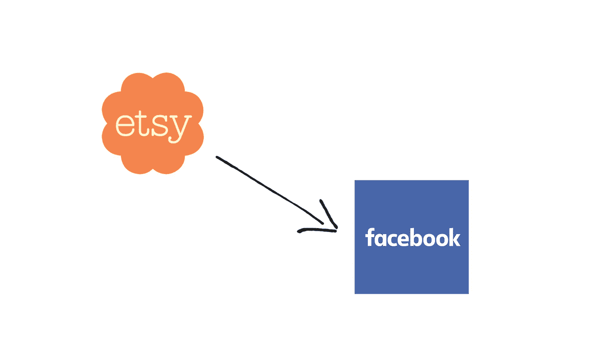
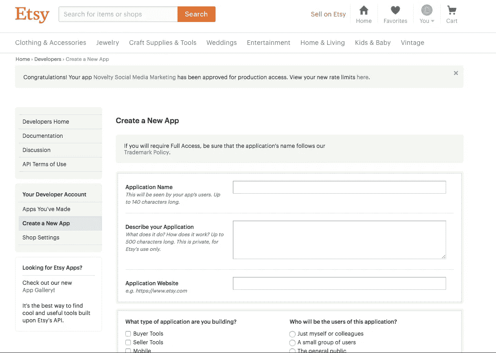
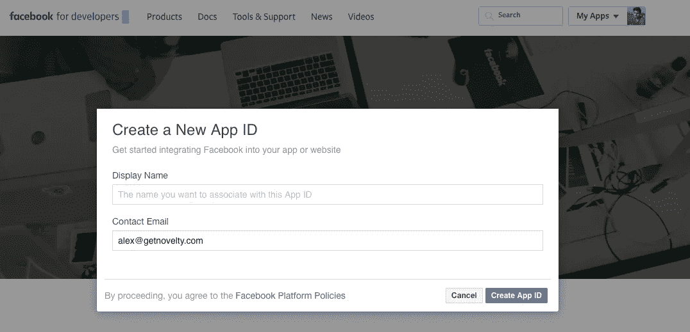
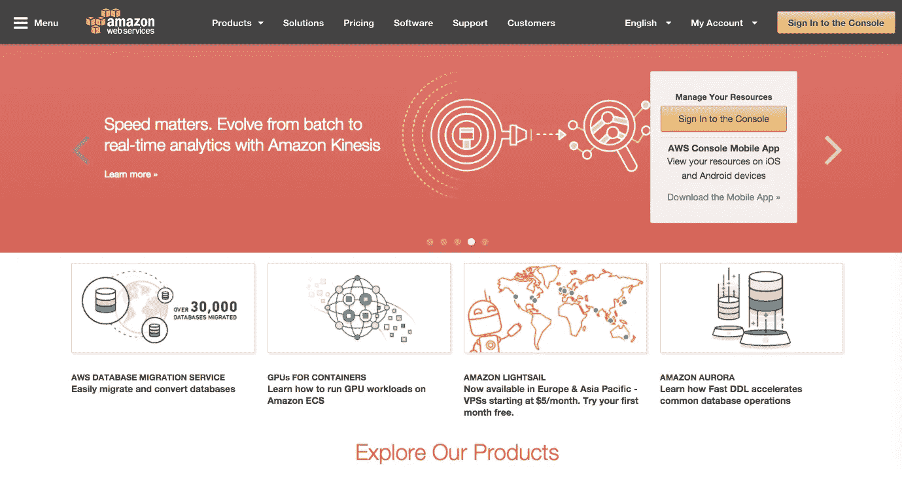
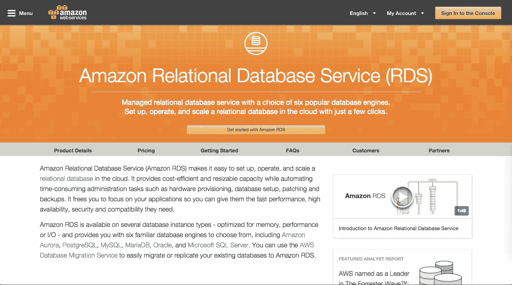
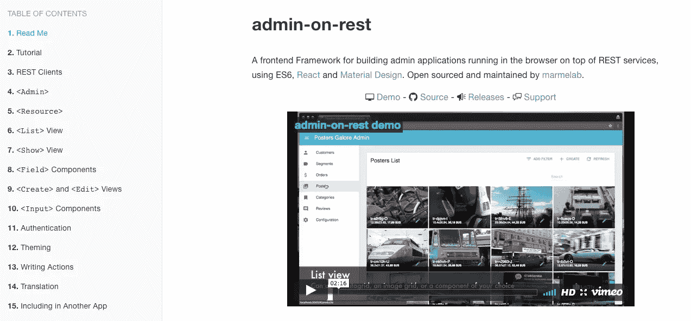
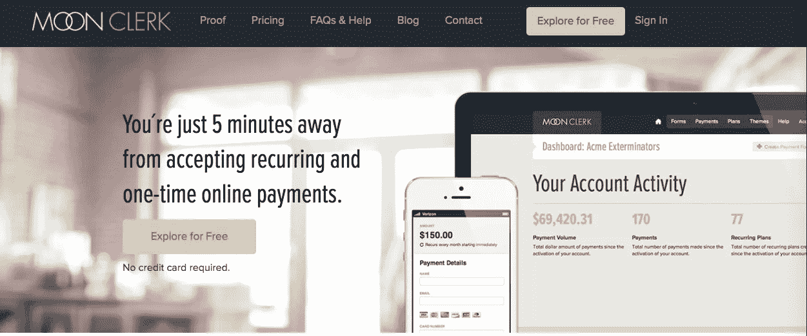

# 侵入我妻子的 Etsy 业务如何导致我的第一个 SaaS 产品

> 原文：<https://medium.com/hackernoon/how-hacking-my-wifes-etsy-business-led-to-my-first-saas-product-354fd79a674d>

想听听我最喜欢的结婚福利吗？小心，这很傻…你准备好了吗？

# 获取我妻子的数据。

大约四个月前，我在寻找我的下一个副业。我妻子很快主动让我处理她在脸书的 Etsy 产品广告。她想在 Etsy 上发布自己的商品，并利用产品图片、标题和描述快速创建[营销](https://hackernoon.com/tagged/marketing)活动。经过一夜痛苦地搜索 Etsy 上使用的相同图像，同时复制/粘贴无尽的描述和标题，我开始对自己说，*“一定有更简单的方法”*。**我的工程大脑启动了。**

那天晚上剩下的时间我都在研究 Etsy 和脸书 API。如果你不确定 API 是什么，它对你有好处，你可能有自己的生活，和你的闺蜜们一起享受无尽的含羞草早餐。从本质上来说，这是程序员从 Etsy 和脸书等公司获取数据的一种(有时)免费的方式。我把两者结合起来。我可以使用 Etsy API 获取我妻子的列表，并以编程方式将它们转移到脸书广告。耶科技！

第二天早上醒来，老婆很惊讶，问进展如何。我温和地回答，

嗯，我昨晚没能创作出你的广告，但是…我确实做了一些研究..”

她打断了我。

***“等等！*** *所以我们还没有创建广告？”*

然后，我继续告诉她我有多懒，为什么手动搜索她在列表中使用的相同图像来创建广告会花费很长时间，为什么将标题和描述复制并粘贴到广告活动中会花费很长时间。我还指出，脸书的广告经理是一个痛苦的使用！你见过那东西吗！？我当时并不知道，但我正在提出我的价值主张。我试图找到适合市场的产品。她的眼睛开始变得模糊，但最终，她同意了这个想法。所以我开始工作。

我首先使用 Etsy 的开发者平台创建了一个应用程序。Etsy 为开发人员提供了一种轻松访问 API 的方式。它们使用 API 密钥为您提供基本的访问权限，以便您可以立即开始工作。

有两种类型的访问权限，**临时访问权限**和**完全访问权限。**临时访问允许对任何未经验证的资源进行只读访问。**完全访问**允许无限制 Etsy 成员的认证读/写访问。你还可以在他们的应用程序库中列出你的应用程序。尽管我的应用程序不需要写访问，但我仍然需要访问经过认证的资源，比如图像、商店信息等。所以我请求并获得了我的 API 密钥。下一步是使用 OAuth 建立一个认证流。

在搜索 Etsy 的 OAuth 文档时，我注意到每个例子都是用 PHP 编写的。这是什么 2007 年？我计划用 Python 写我的后端。所以我花了几个小时把他们的 PHP 代码翻译成 Python。我使用了 [requests-oauthlib](https://requests-oauthlib.readthedocs.io/en/latest/oauth2_workflow.html) 库来获取我的访问令牌。

大约在这个时候，该产品的其他一些领域开始成形。首先，为了制作脸书广告，我需要使用他们的开发者平台创建一个脸书应用程序。所以我去了 www.developers.facebook.com，开始了这个过程。你必须创建他们所谓的应用程序 ID。

其次，我需要在某个地方托管我的应用程序。我开始考虑不同的云解决方案，并决定选择亚马逊网络服务。我使用 AWS 是因为这是我最喜欢的。我使用 Python/Django 作为我的后端，有一些关于使用 AWS CLI 创建弹性 Beanstalk 应用程序的好文档。

第三，我需要一个后端数据库来存储 API 密钥和额外的全局应用程序信息。所以我在我的弹性 Beanstalk 环境中添加了一个 Amazon RDS 数据库。使用本[文档](http://docs.aws.amazon.com/elasticbeanstalk/latest/dg/create-deploy-python-rds.html)作为指南，这实际上非常容易设置。最困难的部分是决定使用什么样的分层存储。我选择了最便宜的。我想在不花费大量时间进行不成熟的优化的情况下得到一个工作原型。MVP(最小可行产品)的要点是简单地把它拿出来，并随着你的进展进行优化。

第四，我需要我的网站前端。我之前一直在我所有的客户端 JavaScript 项目中使用 AngularJS，但是我一直在阅读 ReactJS，所以我决定尝试一下。为了让事情变得简单，我决定使用一个名为 [admin-on-rest](https://github.com/marmelab/admin-on-rest) 的“管理框架”。admin-on-rest 框架提供了我所需要的一切。它有一个易于使用的 ES6 模块，用于与 JSON APIs 交互。它有一个管理风格的用户界面，内置了菜单栏和路由。我用亚马逊 S3 托管了一个“静态网站”，使用这个[伟大的媒体报道](/@omgwtfmarc/deploying-create-react-app-to-s3-or-cloudfront-48dae4ce0af#.vmzdtqbrv)作为指南。

最后，我需要设置一种接受付款的方式。像大多数开发人员一样，我甚至没有考虑过我工作的商业方面。这是从一个附带项目开始的，我慢慢开始看到它的价值。我开始想，*“见鬼，如果我妻子的 Etsy 商店可以从这个工具中受益，那么其他人也可以。”我还没有一个具体的支付模式。所以我开始思考一些想法。我很快想出了一个免费增值模式，允许用户创建脸书广告，以有限的方式与平台互动，同时鼓励他们升级。我使用了 [Moonclerk 的](https://www.moonclerk.com/)易于使用的 API 和表单创建器来快速建立支付管道。Moonclerk 没有围绕着 [Stripe API](https://stripe.com/docs) 开发一堆逻辑，而是为你抽象出所有这些。这确实加快了开发过程。好的一面是，它允许我以后切换到使用 Stripe 的自定义实现。*

接下来的几个月，我利用晚上、周末和午休时间制作了一个工作原型。如果你在这两个月里碰到我，我很抱歉。任何开发人员都知道，当你深陷一个项目时，它往往会消耗你的幸福。我和家人的关系受到了影响。我会发现，当我的老板、妻子或优步司机在说话时，我会把他们拒之门外，却发现自己在思考下一个数据库查询、REST 端点或营销 API 调用。我开始陷入一种小小的沮丧之中，这种沮丧只有在深夜向 Github 提交代码时才会释放出来。

在整个开发过程中，我也试图找到我的目标受众并与之互动。我加入了脸书的一些 Etsy 团体，开始和一些女士(和一些男士)聊天，并开始了解他们在为自己的商店吸引流量方面的痛点。很多人都提到了 SEO 和广告，所以我知道我的思路是对的。

喝了数不尽的咖啡，数不清的手掌和几根白发之后，我有了一个运行在 AWS 上的 SaaS 应用程序。我用 Squarespace 拼凑了一个[营销网站](https://www.getnovelty.com/novelty-blog/introducing-novelty)，底部有一个注册表单。我货比三家，并开始建立我的测试用户名单！

这就是我们今天的处境。我们已经获得了一些牵引力和少量的日常用户。我很快认识到，制造人们想要的东西是一场马拉松。将你的产品展示在人们面前，倾听他们的意见，并重复有意义的功能需求，这需要不懈的努力。注册用户很容易，让他们掏出信用卡是一件完全不同的事情，有着不同的挑战，坦率地说，我很不擅长，并且仍在努力完善。我从来没有想过营销渠道和支付模式之类的问题。这是一次经历了很多起起落落的地狱般的学习经历，而且才过了 4 个月！

我很高兴能够扩展这个平台，将更多的社交媒体渠道包括进来，比如 Pinterest、Instagram 和 Twitter。此外，还包括对易贝和亚马逊等其他在线零售平台的支持。

如果你有任何问题、意见、抱怨等，请联系我……即使你想告诉我**这是 SaaS 历史上最糟糕的主意**我也乐意倾听。我完全支持人们实际使用的建筑产品！

有兴趣了解更多关于我的 SaaS 平台的信息吗？查看 [NewClick，我们为 Etsy 卖家打造的广告平台](https://newclick.io)

想进一步了解作者？点击[这里](http://alexdaro.com/)

想多了解一下我老婆的 Etsy 店？点击[这里](https://www.etsy.com/shop/SenimanCalligraphy)