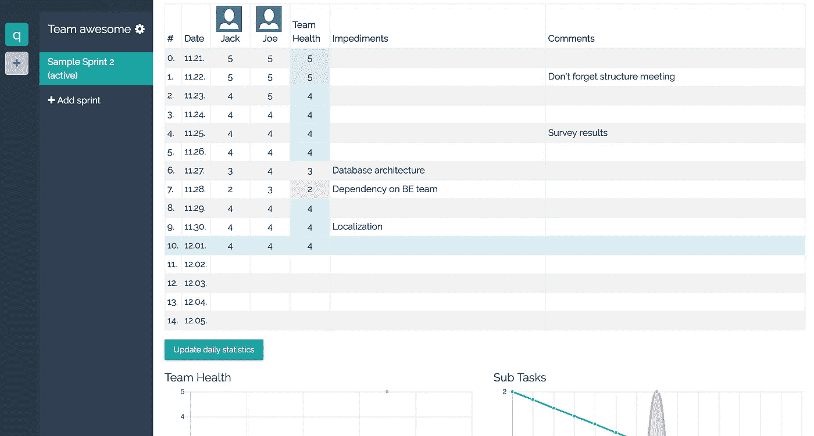
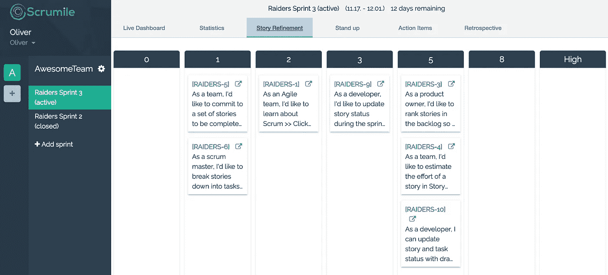
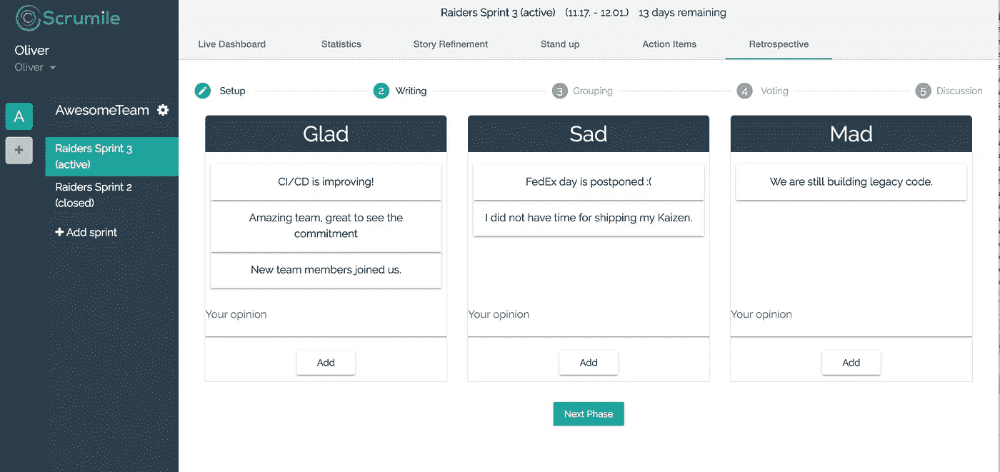
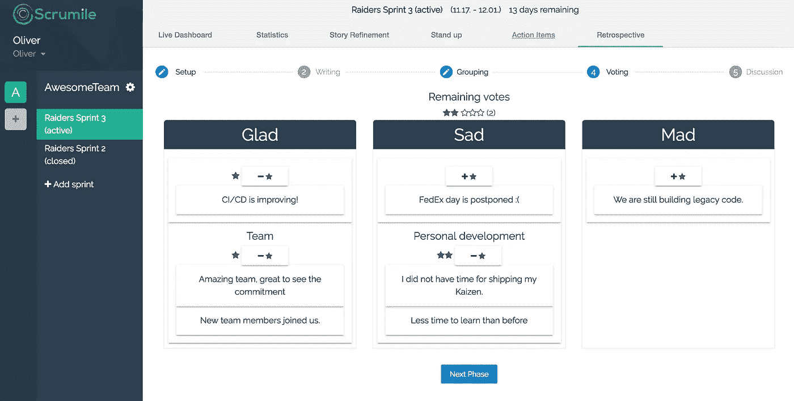
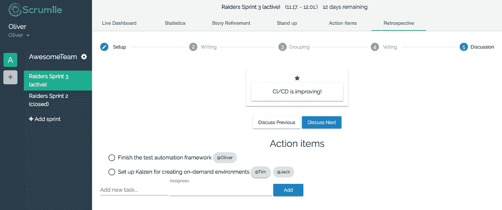

# 我如何用 Scrumile 自动化我团队的敏捷和 Scrum 过程

> 原文：<https://medium.com/hackernoon/how-i-automated-my-teams-agile-and-scrum-processes-with-scrumile-6e497895ecf5>

我是一名敏捷蔻驰，在一家大约有 800 名员工的 SaaS 公司工作。我指导两个 Scrum 团队，自然地，我接受了我的工作包括大量必须做的手工工作——天哪，我错了:)

作为我的角色，我需要阅读大量的文章来保持自己的最新状态，我总是为自己从来没有回报社区而感到难过，所以我决定写这篇文章，以便我可以帮助我的同事，并对社区这些年来给予我的帮助做出一点回报。

回到我的队伍中。:)像大多数公司一样，我们的团队使用 JIRA 进行项目管理。JIRA 在很多方面都很棒，但对我作为敏捷蔻驰的工作帮助有限。我的工作是发展我的团队，我主要依靠数据驱动的决策来实现这一点。

因此，为了能够衡量我的团队的冲刺进度，我已经开始使用谷歌工作表，它做得很好，但显然需要我与 JIRA 手动同步数据。这样做了一年，我真的习惯了复制数据的日常琐事。

临近年底，我通常会回顾这一年，我意识到我在管理任务上花了太多时间，比如手动在谷歌表单上填写数据。

我开始寻找一些解决方案，结果令人印象深刻，几乎所有的工具都有自己的项目管理系统，而不是依赖 JIRA。遗憾的是，从 JIRA 系统转换到另一个系统对整个公司来说是不现实的。

当我发现一个叫做[scrum ile](https://www.scrumile.com)(【https://www.scrumile.com】T2)的新工具时，我几乎放弃了搜索。(虽然有点难找:()我下载了它，并能够在 2 分钟内使它与我们的内部 JIRA 一起工作。它的工作不需要任何 JIRA 方面的设置，这在我的情况下是非常可取的。

很明显，这个工具还处于早期阶段，但它已经包含了许多我在使用了 1 个 sprint (2 周)后就已经喜欢上的功能。

所以我真正喜欢的功能是:

**单口相声**它非常接近我在谷歌表单中的数据，但至少现在我不用手动从 JIRA 复制数据了

Image from [www.scrumile.com](http://www.scrumile.com) website

这是一个很好的工具，可以帮助团队在泳道中进行评估，这很好，但最棒的是我们可以在网上进行，因为我的一个团队有一个远程成员，所以这个工具很快就成功了。

Image from www.scrumile.com website

**行动项目**将团队的行动项目和受托人放在一起很有趣——尽管我们通常使用 [Todoist](https://todoist.com) 来实现这一目的。

在线团队回顾现在这是 Scrumile 大放异彩的地方。你可以和你的远程团队成员进行多种类型的回顾技术。将您的想法分组、投票、讨论结果并创建行动项目，您可以在“行动项目”选项卡中跟进。

Image from [www.scrumile.com](http://www.scrumile.com) website

Image from [www.scrumile.com](http://www.scrumile.com) website

Image from [www.scrumile.com](http://www.scrumile.com) website

总之 [Scrumile](https://www.scrumile.com) 是一个工具，它解决了我的问题，并提供了更多，我已经成功地自动化了我们的过程，为我节省了宝贵的时间。除了这个工具仍然需要很多改进的事实之外，Scrumile 确实让我的生活变得更容易了。

希望通过这篇文章，我可以给社区一点回报。

菲尔·t。