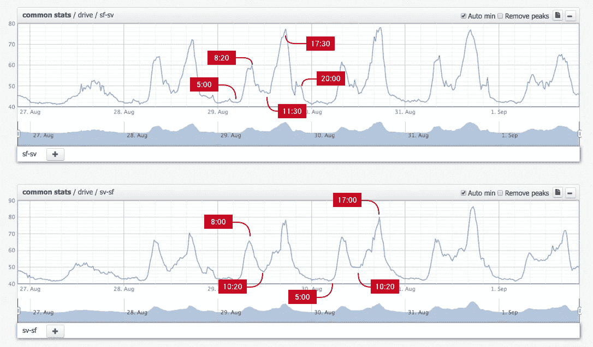
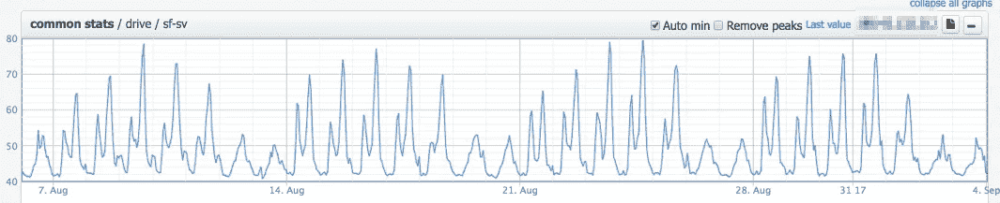

# 我是如何在日常通勤中战胜交通堵塞的

> 原文：<https://medium.com/hackernoon/how-i-beat-the-traffic-on-my-daily-commute-d4f687f12c5b>

在 ITSumma，我们为高流量网站做了如此多的监控和分析，很自然地，这种心态会蔓延到另一个高流量的情况:我的日常通勤。所以我决定写一篇有趣的小博文，告诉大家我是如何找到上班和回家的最佳时间的。

我几乎每天都开车从加州的桑尼维尔到旧金山(哈里森/第八名)，因为我不打卡，所以我对开车去那里的时间很灵活，所以天生善于分析的我跳到谷歌地图上，查看他们的交通数据，以找到我通勤的最佳时间。

这是我拍的一张截图，有一些有用的“提示”:

big thank you for captions goes to Dmitry Lozhkin, I just can’t do it normal

8 月 27 日是星期天，所以交通相当清淡，但随着工作周的开始，你可以看到一个非常规律的模式出现:早上 5 点左右开始高峰，8 点左右达到高峰，之后在 10:30 到中午之间稍微下降。那里大约有 40 到 50 分钟的时间，你可以在第二波交通高峰到来之前冲过去了。如果我像一个好的打卡工一样在下午 5 点下班，那么我将花将近 1.5 个小时回到森尼维尔。

所以，我的结论是这样的:从顺丰开车去山谷的最佳时间是晚上 8 点以后；晚上 10 点到午夜之间交通流量会有小幅增加，这通常代表道路施工，而仍然有一些交通。同样有趣的是，这种模式精确到分钟:几乎每天上班的最佳时间是 10:30——不是 10:15，也不是 10:45。还有一点要提的是，交通高峰出现在一周的中间，如下图所示，所以你往返通勤的最佳选择是在周一、周二和周五。

我希望这个小故事能激励你在日常生活中更善于分析，让事情变得更顺利。记住:分析是你的朋友！