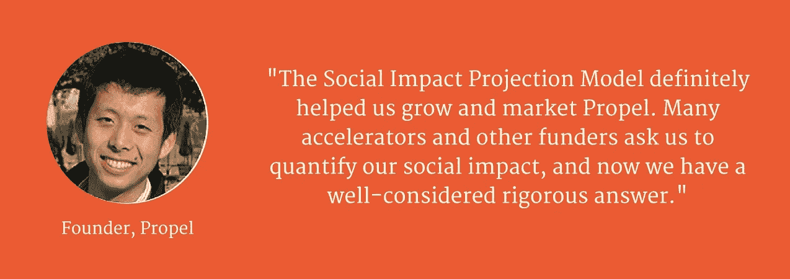
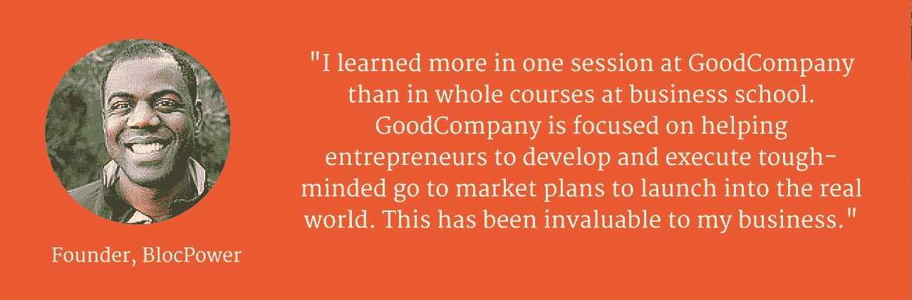

# 我如何成为影响力亿万富翁

> 原文：<https://medium.com/hackernoon/how-i-became-an-impact-billionaire-d361c67f9dff>

从组织上来说，加入支持者的行列是很诱人的，但是我对奖励原始概念和高尚意图的效用(和激励结构)持保留意见

假期盘点时，我意识到我已经成为亿万富翁了。也就是说，GoodCompany Ventures 这个我和其他许多人在过去五年中培育的非营利组织已经创造了超过 100 万美元的社会影响。下面是我们如何发现杠杆模型来完成它的。

**起源**

2009 年，在经历了国际发展法和[技术](https://hackernoon.com/tagged/technology) [风险投资](https://hackernoon.com/tagged/venture-capital)的职业生涯后，我加入了一群志同道合的人，一起构想新形式的社会企业。“交叉业务组”对社会影响业务有很好的想法，但没有人来执行这个想法。我们意识到，限制社会企业发展的资源不是商业和金融头脑，甚至不是资本，而是高质量的企业家。我们看到的大多数寻求融资的“社会企业家”拥有创业成功所必需的激情、资源和领域知识，但他们主要依靠情感来吸引当时可用的少量“影响力投资”。我们得出的结论是，利用我们技能的最佳方式是获取创业原材料，并用可扩展的商业模式和可投资的资本策略来武装它们。

这个小组将成为 GoodCompany Ventures 的联合创始人，在 2009 年表达了其最初的使命，即“培训社会企业家，以满足风险投资者的期望”。我认为这是一个皮格马利翁实验:我们能不能找一个“行善者”，给他们 12 周的密集商业改造，然后把他们作为可投资的企业家传给我们的风险投资朋友？

> 同等程度地歪曲社会服务和投资部门的假设和行为，并打破它们之间的鸿沟，吸引了我，因为这是创造性的、破坏性的和必要的。

随着时间的推移，我们以企业家为中心的密集干预战略已被证明是一个非常有效的发展社会影响的模式。

**我们如何衡量成功**

当我们创办 GCV 时，我们渴望与有前途的企业家合作，他们为未满足的社会需求提供有价值的创新。几乎根据定义，某些社会需求仍未得到满足的原因是，从历史上看，这些问题不能由私营部门有利可图地解决。我们选择合作的许多创新都涉及到将新技术应用于老问题，从而改变了满足这些需求的成本。我们设计课程的主要挑战是:( I)调查创新创造的“价值包络”,( ii)探索市场空间和结构，在价值包络中找到一个参与者，作为收入来源,( iii)设计一个业务和运营模型来扩大影响，以及(iv)开发一个财务模型和资本战略来为业务提供资金。

也就是说，我们是行业不可知论者，不能用每家公司特定社会产出的总和来衡量我们项目的成功。我们对每位企业家的唯一共同目标是让他们的设计适合规模和资金。我们可以测量。

**结果**

我们衡量成功的标准非常简单。这些结果是基于我们最近的校友调查，其中不包括我们最近的队列的结果。同样值得注意的是，由于这些都是早期阶段的高增长公司，随着我们校友葡萄酒的成熟，业绩将继续增长。

**产出:**截至 2015 年，我们已有 84 家社会企业从 6 个加速器项目群组中毕业。

**成功率:**我们 48%的毕业生吸引了私人资本。这听起来像是一个失败的记录，但根据考夫曼基金会的研究，不到 0.1%的初创企业获得了资金，他们研究的近一半加速器未能产生一家受资助的公司。GCV 帮助企业家战胜困难。

资助:我们前五批的毕业生已经筹集了近 6000 万美元的资金来解决社会问题。许多公司获得了顶级风险投资公司的资金，如安德森·霍洛维茨基金和首轮资本公司。这在 2009 年似乎是遥不可及的，但在过去的五年里，世界已经朝着我们的方向强劲发展——我们企业家的素质和投资者对社会主题的开放程度不断提高。我们相信我们为这一势头做出了贡献。

**影响**

为了估计我们的社会影响，我们需要从我们的基本结果中做一些推断。这导致一些大的数字，但每一步都很清楚，并提供了假设供您判断。

收入:我们将从收入开始衡量毕业生的规模。从 6000 万美元的投资开始，我们可以有把握地假设该集团的预计收入至少为 6 亿美元。如果没有至少 1000 万美元的五年累计收入预测，没有人筹集过 100 万美元的风险资本。如果你不是早期投资者，你必须相信我的话。如果是这样，您会发现收入潜力与资本的比例为 10:1，这是一个很低的估计。

影响:如果我们的毕业生即将获得 6 亿美元的收入，我们能假设他们的社会影响是什么？作为 GCV 课程的基础，我们喜欢把创新创造的价值视为根本；它预先存在盈利/非营利的非此即彼的区别。只有当我们设计并运用商业模式来实现这一价值时，经济价值才被划分为(a)您获取并货币化的部分，即“收入”,和(b)您未获取(或选择不获取)的部分，即“社会影响”,这是作为积极的社会外部性产生的。

> “影响市场”是那些很难设想或实施可行的收入模式的市场，这是一个重复的说法，所以仅仅衡量收入严重低估了价值创造。作为一种经济手段，也作为许多社会企业家的个人信念，收入不过是摇摇尾巴。

老实说，衡量社会影响的系统还不成熟。在 GCV 课程中，作为(I)设计优化收入和影响的商业模式(ii)检查两者之间的权衡以及(iii)与将收入理解为达到影响目的的手段的企业家和投资者互动的工具，我们开发了一个内部社会影响预测模型。

2015 年，我们开始与投资团体、其他社会加速器一起，并在影响会议的研讨会上，对我们的社会影响预测模型进行外部测试。我们对结果感到兴奋，并希望明年向公众推广。就本分析而言，一个结果非常一致。我们量化了社会企业产生的影响超过其收入的程度；通常是 6–10 倍。将我们调查结果的中点(8.3 倍)应用于 GCV 企业家 6 亿美元的收入估计，我们的毕业生的预期影响将达到 50 亿美元。

**归属**

我们将为自己在创造 50 亿美元的社会影响中发挥的任何作用而感到自豪。企业家的成功在多大程度上归功于 GCV 的干预(或任何加速器)令人惊讶地难以评估。结果绝大多数受到选择偏见的影响，很难创建一个控制组，评估早期公司成功的时间框架是以年为单位来衡量的。

我们相信我们的贡献超过了大多数加速器，因为我们在结构和目的上不同。作为一个 501(c)3 非营利组织，GCV 不是一个投资驱动的项目(如 YCombinator、TechStars 等)。)因此，我们提供股权来吸引“敲钟人”。我们的校友中很少有人会在他们来的州找到投资。我们不是在寻找上篮。我们忽略了已经资金雄厚的企业家，我们忽略了许多有吸引力的乐活和企业社会责任活动，这些活动(适当地)被列入社会企业类别，但都是基于成熟的商业模式。我们选择那些有大规模影响潜力，但“需要努力”的企业家和创新。这种“工作”是我们的团队来到办公室要做的事情，也是我们团队的动力所在。无论是挑战个人将自己从一名行善者重新设想为一名商业领袖，还是发现一种收入模式来支持非营利实验的规模，或者设计一种融资结构来将成本和风险转移给公共部门市场的新支付者，我们都有许多校友的例子，如果没有我们与他们合作的机会和荣誉，他们的预期社会影响将为零。

在未来的队列中，我们希望使用社会影响预测模型来衡量每个企业家的预测影响能力之前和之后的状态，这将使我们能够隔离 GCV 干预的影响。目前，我们拥有的最佳“归因”数字是基于宾夕法尼亚大学费尔斯研究所的一项案例研究，该研究将我们毕业生至少 25%的成功归因于 GCV 课程的干预。

> 为了保守和整数，让我们把这个比例降低到 20%。如果我们的毕业生创造的 50 亿美元社会影响中有 20%可归因于我们的项目，那么 GCV 已经创造了 10 亿美元的社会影响。

**杠杆计算**

GoodCompany 最初是一个由志愿者驱动的小型实验，由我在“交叉业务小组”的联合创始人领导。这个群体已经扩大到包括投资者、商业领袖、律师、设计师和 MBA 学生提供的无数小时的专业知识，他们的实物贡献受到我们提供的与鼓舞人心的企业家合作的机会的激励。

随着我们的成长，我们依赖于来自我们地区风险社区的小额捐赠，随着我们业务范围的扩大，我们吸引了来自奈特基金会、哈洛兰慈善机构和彭博慈善机构的更多捐赠。我们感谢我们的捐助者。

总之，在我们五年的历史中，我们依靠的外部捐款不到 50 万美元。你可以把这解释为证据，证明我们吸引实物支持的能力使我们能够运营一个异常精简的组织，或者证明我们不是非常雄心勃勃的筹资者。两个都是真的。

我分享这个数字的原因是为了进行最后的计算。如果 50 万美元的捐助支持产生了 10 亿美元的社会影响，那么我们就创建了一个杠杆模型，每投入 1 美元的项目，就会产生 2000 倍的社会影响。这是一个相当不寻常的说法，这就是为什么我在试图有条不紊和透明地得出这个说法时洒了这么多墨水。

也许你认为我在某个地方错了 10 倍？也许你认为预期收入与投入资本的比率是 1:1，而不是 10:1？也许你认为社会企业获取了他们创造的大部分价值作为收入，所以收入与社会外部性的比率是 1:0.8，而不是 1:8？也许你认为 GCV 对其毕业生成功的贡献是微不足道的 2.5%，而不是 25%。你可能错了，但即使我错了一个数量级，我仍会为我们为捐赠者创造了 200 倍的社会回报而感到自豪。

我们的捐助者投资回报率如此之高的原因是，我们的影响模型受益于多步乘数效应:我们使用我们的捐助者资金来(I)有选择地寻找新颖、高影响力的创新，(ii)提高我们的企业家吸引私人投资者资金的能力，(ii)扩大社会企业的规模，从而(iii)产生更大的社会外部性。

在实践中，(I)我们的捐助者在 GCV 的 50 万美元投资使(ii)我们的企业家能够获得他们筹集的 6000 万美元，(iii)这反过来将推动 6 亿美元规模的社会企业，(iv)这将产生 50 亿美元的社会影响。随着这些年来这些企业的持续增长，这些结果与捐赠的比率将继续增长。

回想我们是如何开始的以及如何实现的，我感到非常欣慰的是，我们的创始前提，即旨在提高个体社会变革推动者规模能力的密集干预，已被证明是一种影响巨大的战略。

这是一个很难支持的战略。从根本上说，当你不能提前确定产出时，很难激发对通用创新的支持。更具体到我们的战略，随着社会企业领域的蓬勃发展，我们已经看到无数黑客马拉松、奖学金、奖项和研讨会的出现，所有这些都是支持社会企业家的低成本、高容量和高可见性的战略。

从组织上来说，加入支持者的行列是很诱人的，但我对奖励原始概念和高尚意图的效用(和激励结构)持保留意见。大多数初创企业两者都很丰富，很明显，两者都不足以击败达到规模的惨淡几率。我们的经历加深了我的信念，即要转变一个企业家(实际的和自我感知的)大规模影响的能力——放弃追求下一个 10 万美元的奖金或赠款，投入追求 1000 万美元投资资本所需的工作——需要一个长期的、结构化的干预过程。这种转变需要一种坚定的个人关系，这样企业家才能停止推销我们，让我们打开“引擎盖”，并相信我们可以重新组装他们最个人的希望和梦想的引擎。这不可能发生在周末的研讨会上。你可以从这个视频中感受到这个过程，用企业家自己的话来说。

GCV 的模式是一种高度个性化、低量、高投入的战略，但我确信它是回报最丰厚的。这让我成为了一个影响力亿万富翁。

如果你想知道我们计划如何将这种影响模式推向下一个层次，你可以在 www.goodcompanygroup.org 的[了解更多关于我们的工作。](http://www.goodcompanygroup.org)

> [黑客中午](http://bit.ly/Hackernoon)是黑客如何开始他们的下午。我们是 [@AMI](http://bit.ly/atAMIatAMI) 家庭的一员。我们现在[接受投稿](http://bit.ly/hackernoonsubmission)并乐意[讨论广告&赞助](mailto:partners@amipublications.com)机会。
> 
> 如果你喜欢这个故事，我们推荐你阅读我们的[最新科技故事](http://bit.ly/hackernoonlatestt)和[趋势科技故事](https://hackernoon.com/trending)。直到下一次，不要把世界的现实想当然！

