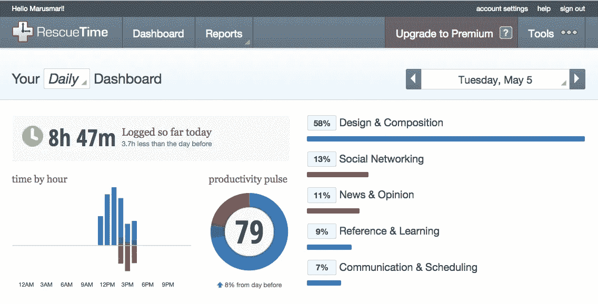
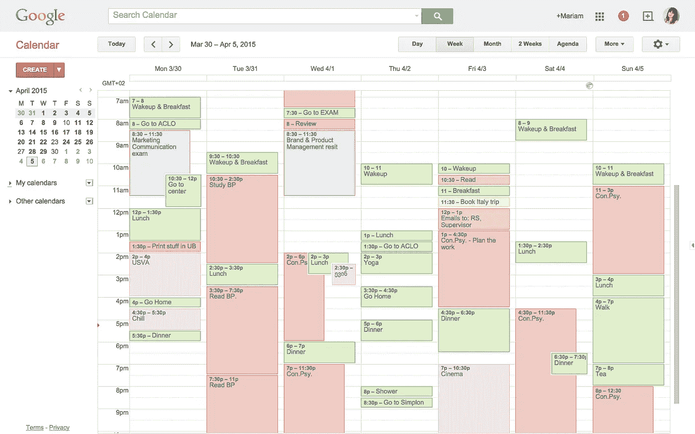
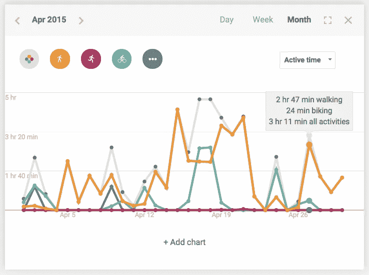
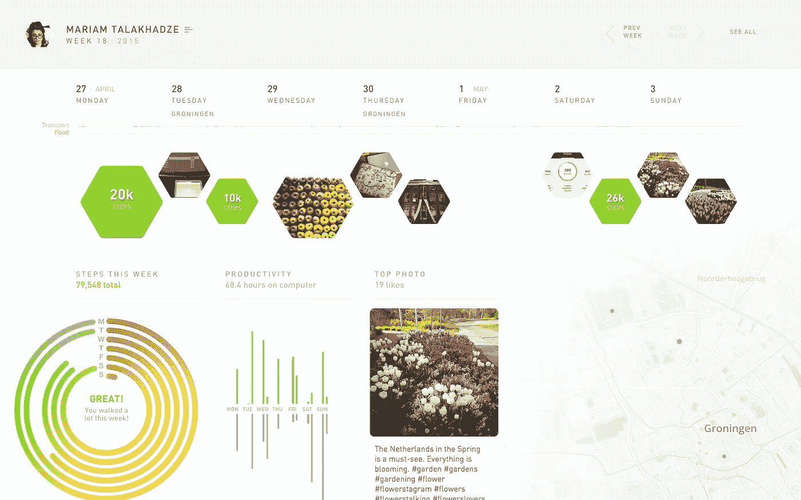

# 我是如何对生产力“着迷”的

> 原文：<https://medium.com/hackernoon/how-i-became-obsessed-with-productivity-d8833b94bc05>

## 我使用的应用和工具

[Bench Accounting](https://unsplash.com/@benchaccounting)

我们都有这样的时刻，当我们意识到，我们已经漫不经心地滚动[脸书](https://hackernoon.com/tagged/facebook)或[推特](https://hackernoon.com/tagged/twitter)40 分钟了，没有做任何实际的工作。我经常这样，直到几年前的一天，我决定我必须改变一些事情。

当我担任社交媒体经理时，我对自己的工作效率感到最困惑(我长期从事与脸书营销和博客相关的咨询工作)。因为在脸书被认为是我的工作，所以我真的很难跟踪我是把时间花在实际工作上还是和朋友聊天上。(*更新*:现在我使用 RescueTime 的高级服务，它允许以不同的方式标记网站内的子页面。)

随着时间的推移，我学会了如何更好地管理我的生产力，现在我自豪地在我的 RescueTime 应用程序上查看我 70-90%的生产力脉搏。

生活追踪出现在智能手机时代，现在是一种趋势。有许多应用程序和设备可以跟踪几乎任何东西，但我想分享几个免费的应用程序，我发现它们对我的日常工作很有用，也很重要。

## 1.重新计算时间

如果你对你的时间花在了什么上感兴趣，这个应用程序就是为你准备的。你可以[为你所有的设备下载](https://www.rescuetime.com/get_rescuetime)一个简单的应用程序，并跟踪你进行的每一项活动。它提供了很好的每日、每周、每月报告(年度报告包含在 Premium 帐户中)和一个简单的生产力脉冲，显示你一天中到目前为止做了什么。

这是一个非常受欢迎的应用程序，所以你可以将它与其他几个生活追踪器集成在一起。

If I exceed productivity pulse of 50, I consider myself productive

## 2.[谷歌日历](http://calendar.google.com)

有些人可能觉得这已经过时了，但我离不开它。每个星期天，我都会提前安排一周的时间，甚至是吃饭和睡觉。我可能永远不会精确地遵循时间表——随着时间的推移会发生一些变化——但它让我现实地看到我到底需要多少时间去做那些没有效率的事情，比如通勤、吃饭、洗澡等等。，这样我就可以更好地计划生产性的事情。

它也像个人日志一样工作。我可以随时查看我的日历，找出我在特定的时间在做什么。

One of the crazy exams weeks

## 3.[生命总和](http://lifesum.com)

我最近买了这个。我记录我所有的食物摄入量，它会自动与 Google Fit 同步，并从总卡路里目标中扣除我每天燃烧的卡路里。这是我迄今为止见过的最好的卡路里计数器和健身应用程序。

## 4.移动和 Google Fit

这两个是我一天的绝对必需品。即使我只是在公园里漫不经心地散步，它们也能让我感到富有成效。我有一个新的“困扰”,每天完成一万步，每当我这样做的时候，Google Fit 就会用烟花来祝贺我。这太有趣了！☺

为什么两个都用？因为，虽然它们都可以跟踪你的脚步和动作，但它们的功能略有不同。在*招式*中，我可以在地图上看到自己的轨迹，还可以标记出来自*四方*的地点。在 *Google Fit* 中，我可以设定每天的目标，它会给我每周、每月和每年的报告。

Google Fit

## 5.陀螺仪

几个月前我发现了这个。你可以连接你所有的生产力和生活追踪应用，它会给你很好的数据表示，你不想停止观看。

Screenshot of my Weekly Report on Gyroscope

这些应用程序帮助我更好地安排和监控我的日子。他们让我走上正轨，提升我的情绪，因为我觉得比以前更有生产力和效率。