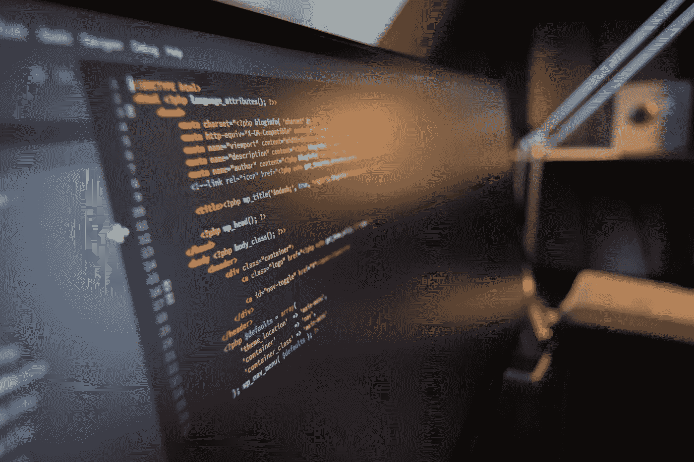
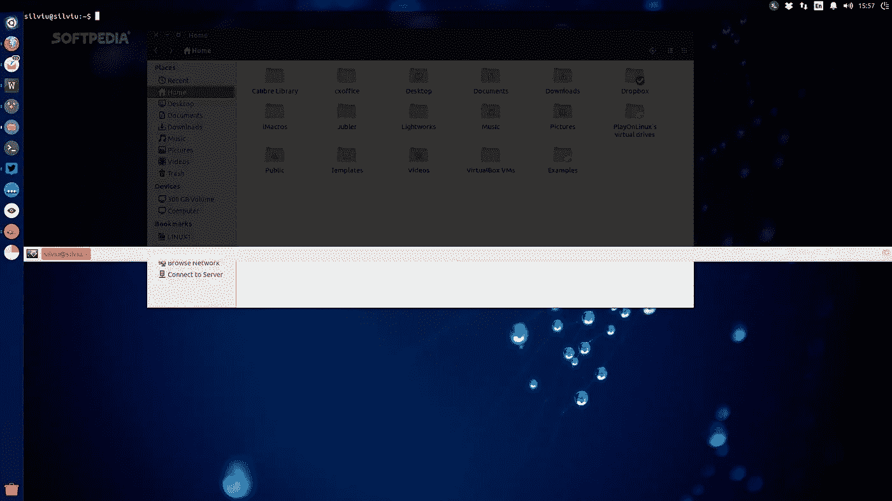
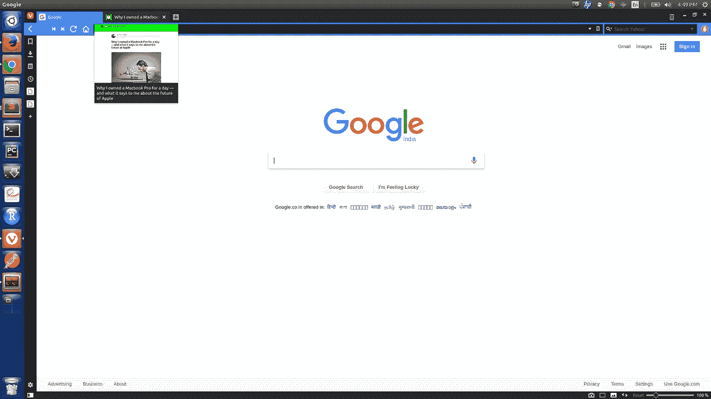
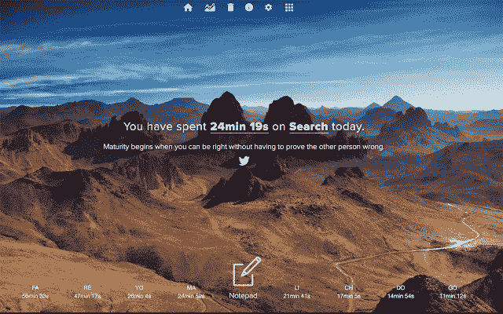
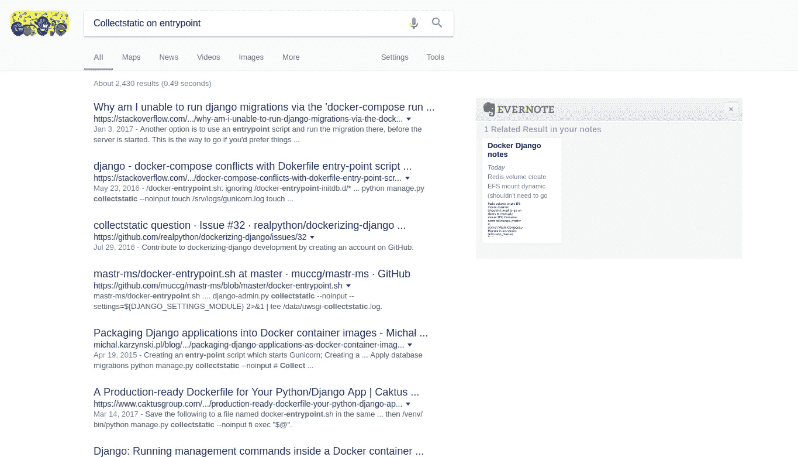
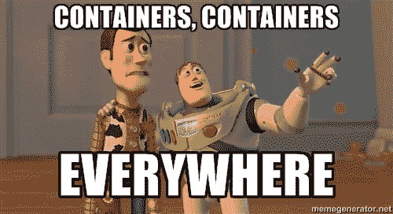
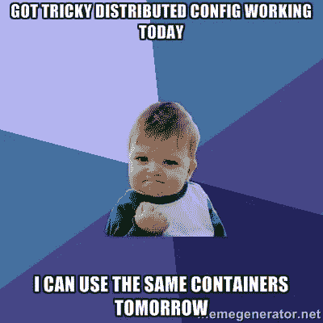

# 我如何提升我的开发环境来专注于手头的任务

> 原文：<https://medium.com/hackernoon/how-i-boost-my-development-environment-to-focus-on-task-at-hand-9dbfc13b7829>



作为一名开发人员，我发现手动安装软件、在 shells 中重复键入长命令、在一个应用程序和另一个应用程序之间切换的无休止的 Alt+tab、每次在 localhost 表单上键入用户名和密码都是实际工作中的额外负担。

这篇文章试图整合我从 HackerNews、StackExchange、AskUbuntu 和其他与生产力相关的博客文章中读到的各种生产力工具、技巧和快捷方式。大多数人可能已经看到了其中的大部分，但我很高兴有人发现了一些新的和有用的东西。

这个列表包含了几个外部链接，可以参考它们的详细信息、深入的用法和技巧。

这是我日常使用的一些工具和技巧，在我的联想 Z-50 Ubuntu 16.04 上，有时在 MacBook 上，大部分时间都在使用 Python。然而，它的大部分也可以被应用/转换成一般的体验。

# 少切换，少打字，多做事

> 我并不反对裁员。但是我已经说过了。

## **终端**

我很早就意识到的几件事情之一是，使用 Ubuntu 的默认终端会导致我在打开许多终端标签和窗口时进行大量的标签切换，这需要额外的时间才能找到正确的标签。在对终端进行试验后，我最终使用了[](https://github.com/Guake/guake)**。这是一个下拉终端，我将它与快捷方式绑定在一起。它支持命名标签(这样你就不会在生产中 rm -rf，把它和其他实例混淆:P)和[可定制的启动脚本](https://github.com/Guake/guake/issues/795)来一次加载你的整个项目和尾日志。**

****

**Guake 在大多数情况下都工作得很好，直到去年，我不得不在一个项目上工作，该项目需要我在 3-4 台不同的机器上运行 [htop](http://hisham.hm/htop/) 、[监视文件大小](https://stackoverflow.com/questions/10555066/watch-file-size-on-linux)和尾部日志。虽然按下一个键就可以使用 Guake，但我仍然需要在里面切换标签。**

**所以，在我的第二个屏幕上，我最终使用了 [**终结者**](https://gnometerminator.blogspot.in/p/introduction.html) 。它支持多个终端在一个窗口，[自定义布局](https://askubuntu.com/questions/158159/how-do-i-get-terminator-to-start-up-with-my-custom-layout)，广播每个按键到多个终端。保留布局意味着，只需通过开发/登台配置打开 terminator，我就可以加载我需要的一切&不必 ssh 到多个窗口并手动运行命令。**

****

**在 Guake 和 Terminator 上，我都使用了[**zsh+oh-my-zsh**](https://github.com/robbyrussell/oh-my-zsh)**，**一个支持各种[插件和快捷方式](https://coderwall.com/p/1y_j0q/zsh-oh-my-zsh-my-top-tips-for-daily-use)的强大 shell。**

## ****错别字****

**为了克服终端中的错别字，有一天我意外地登陆了 [**thefuck**](https://github.com/nvbn/thefuck) 。它也可以作为一个 [oh-my-zsh 插件](https://github.com/robbyrussell/oh-my-zsh/blob/master/plugins/thefuck/README.md)(对于那些对使用 F-word 感到不舒服的人，按 Esc 键两次)。如果你和我一样感到过于自信，你可以用*require _ confirmation:False*设置来配置它，停止要求确认。:)**

****

## ****Git-hooks****

**在提交时，有时我必须将提交附加到 Asana 或 Trello 票上，有时我还需要添加详细的描述(除了提交消息之外)，以开始关于 Asana/Trello 的讨论。Git 对 post-commit-hooks 的支持允许从我的命令行向 Asana 发送 commit 消息和一段额外的讨论。**

## **别名**

**我一直在定义许多别名来创建几乎任何一组 [bash 命令](https://blackbricksoftware.com/bit-on-bytes/160-using-aliases-to-increae)的捷径。对我来说，一个强大的用例是它们减少了长命令或命令链中的拼写错误的机会(并且骂人(#thefuck)对纠正长链没有多大帮助:P)。我的 *~/中的几个别名。zshrc* 例如:**

```
# To check the contents of a key in redis, I don't need to 
# login to 'redis-cli -a XXX' > 'select db 13' > 'get mykey'
# 1\. I can simply type 'mykey' from shell.
# 2\. Makes it easier to set 'watch -n 10 mykey' on terminator split 
alias mykey='echo "select 13\nget mykey" | redis-cli -a $MY_REDIS_PASSWORD'# Whenever I load my redis-cli I directly load with db 12, instead
# of writing 'select 12' or typing password every-time
alias rcli='redis-cli -a $MY_REDIS_PASSWORD -n 12'
alias mcli='mongo -u test -p $MY_MONGO_PASSWORD my_db--authenticationDatabase admin'alias rs='python manage.py runserver'
alias sp='python manage.py shell_plus'
alias pthn='ps axf| grep python'
alias ga='git add '
alias gs='git status'
alias gc='git commit -m '# Don't ask :(
alias xkill="kill -9 $(ps axf | grep 'celery' | awk '{print $1}')"# SSH aliases, to avoid confusion in IP Addresses & pem files
alias my_dev_web='ssh -i /home/ubuntu/pem/api-web.pem ubuntu@XXX.XXX.XXX.XXX'
```

## ****键盘快捷键****

**Ubuntu 允许配置自定义[键盘快捷键](https://help.ubuntu.com/stable/ubuntu-help/keyboard-shortcuts-set.html)。有时，当我感到沮丧时，我确实会使用我的 *Ctrl+Alt+Del* 覆盖来执行类似于“*restart-supervisor&&flush-redis*的命令，以重启我的 Django 服务器、所有的芹菜队列并刷新队列中所有的现有数据，所有这些都在后台进行。注意，这也支持别名，比如我的自定义函数 *flush-redis* 。**

## ****浏览器****

**我有时觉得在测试时填写相同的登录凭证和表单是一种罪恶的享受。 [**自动填充**](https://chrome.google.com/webstore/detail/autofill/nlmmgnhgdeffjkdckmikfpnddkbbfkkk?hl=en) 和 [**表单填充**](https://chrome.google.com/webstore/detail/form-filler/bnjjngeaknajbdcgpfkgnonkmififhfo?hl=en) 帮助带走一些痛苦。[使用适当的环境设置创建集合](https://www.getpostman.com/docs/postman/collections/creating_collections)(在 [**Postman**](https://chrome.google.com/webstore/detail/fhbjgbiflinjbdggehcddcbncdddomop) 内)可以在测试 API 时带来超高的生产率。**

**对于更高级的修补和自动化，我最终使用了[**Tampermonkey**](https://chrome.google.com/webstore/detail/tampermonkey/dhdgffkkebhmkfjojejmpbldmpobfkfo)**脚本。****

# ****避免分心，整理和组织****

****我试着用两种不同的浏览器来区分办公室工作和个人事务。维瓦尔第(Vivaldi)**是我这几天正在试用的一款浏览器，看起来很有前景。它支持很多功能，如内置记事本，标签预览&分组等。******

************

******Tab preview in vivaldi******

******然而，在大多数时间里，我使用非常华丽的 Chrome 浏览器，并加载了一些扩展。******

## ******避免分心******

******[**存到口袋**](https://chrome.google.com/webstore/detail/save-to-pocket/niloccemoadcdkdjlinkgdfekeahmflj) **:** 结合[口袋](http://getpocket.com/)，抵制诱惑，立即阅读那些黑客新闻讨论和文章，并保存它们供以后阅读。******

****[**屏蔽网站**](https://chrome.google.com/webstore/detail/block-site/eiimnmioipafcokbfikbljfdeojpcgbh?hl=en) **:** 或任何其他网站屏蔽程序，以屏蔽任何与工作无关的内容，如“facebook.com”、“gmail.com”、“whatsapp.com”。如果需要，我会在第二个浏览器中打开它们。****

## ****从… 清理无用之物****

****[**OneTab**](https://chrome.google.com/webstore/detail/onetab/chphlpgkkbolifaimnlloiipkdnihall?hl=en)**:**将所有打开的标签页合并成一个标签页，进行整理，也可以导出。与其在 100 多个打开的标签中筛选，不如每天/每周简单地将它们一个一个地整理出来。****

****[**书签管理器**](https://chrome.google.com/webstore/detail/bookmark-manager/gmlllbghnfkpflemihljekbapjopfjik?hl=en) :由 google 提供，是标准书签管理器的素材设计升级。****

## ****组织****

****[**无限**](https://chrome.google.com/webstore/detail/be-limitless/jdpnljppdhjpafeaokemhcggofohekbp?hl=en) **:** 除了 new-tab 上令人敬畏的背景，它还能追踪不同类别网站所花的时间(可定制)。还附带一个记事本和待办事项列表。****

********

****Evernote Web Clipper :如果你还没有使用 Evernote，现在是开始使用的好时机。这个网页裁剪器不仅可以帮助保存文章/片段，还可以在 Evernote 中运行私人搜索，并在每次谷歌搜索时显示结果。任何我第二次搜索 stackoverflow 的命令/代码片段，我都会将其剪辑到 Evernote。****

********

# ****一致的库安装****

********

****Docker 是一个开发、发布和运行应用程序的开放平台。一开始可能会有点吓人，但努力肯定会有回报。****

****虽然 docker 有非常广泛的用途，其中一个主要的优势是确保所有的团队成员和制作环境有完全相同的 T2 技术栈和 T4 环境。我必须强调这一点有多重要，因为我自己曾多次求助于 stackoverflow 来快速修复一个新的测试/登台设置中的库安装错误，但后来才意识到库依赖确实被安装了，但使用了不同的版本，从而导致了问题。****

****[Docker hub](https://hub.docker.com) 包含像 [ELK](https://hub.docker.com/r/sebp/elk/) 、 [Kafka cluster](https://github.com/spotify/docker-kafka) 到 [Tensorflow](https://hub.docker.com/r/tensorflow/tensorflow/) 这样的栈的现成图像。我建议在为一个兼职项目/黑客马拉松制作原型之前，先在 docker hub 上搜索一下。尽管在概念验证之后，在构建现有映像或在生产模式中开始使用它之前，一定要有所保留并保持自信。****

****另一个用例是使用 [docker+swarm](https://www.toptal.com/devops/software-deployment-docker-swarm-tutorial) 的集群部署。尽管有更好的选择可用，但是使用 swarm 提供了一种快速且简单的方式来部署应用集群，节省了在不同机器上手动/半自动安装的大量时间。****

********

****就是这样！我希望这篇文章对你有用。如果你有其他很酷的工具/技巧，请在评论中分享。毕竟这是一个永无止境的探索，所有的兴奋都在于尝试，然后决定什么最适合你。:)****

****非常感谢您抽出时间。下次再见，祝你有美好的一天！****