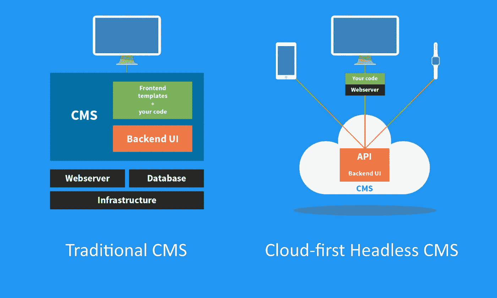

# 我如何建立一个 CMS，为什么你不应该

> 原文：<https://medium.com/hackernoon/how-i-built-a-cms-and-why-you-shouldnt-daff6042413a>

## 在过去的 15 年里，我写了五个内容管理系统，并建立了一个领先的 CMS 软件公司。现在让我告诉你为什么你不应该写自己的 CMS。

Image source: [https://pixabay.com/en/girl-kids-africa-animals-asia-1822525/](https://pixabay.com/en/girl-kids-africa-animals-asia-1822525/)

> “编写自己的 CMS 就像养自己的大象——对大多数人来说，参观动物园更容易。”

# 一个不存在的市场

早在 2000 年，我在大学学习，做内部网开发人员，在内部网发布用静态 HTML 编写的内容。这是我的第一份“编程”工作，我真的很喜欢——有几个星期。

然后，工作的重复性和手工性就变得很明显了。所以我开始用经典的 ASP 编写一个应用程序，允许用户自己管理内容。我根本不知道所谓的内容管理系统的存在，所以我不知不觉地发明了自己的系统。

当时，**很少有产品化的 CMS 系统**可供购买，往往花费数十万美元。

所以毫不奇怪，考虑到软件类别的规模和不可访问性，我并不是唯一一个试图通过创建自己的 CMS 来最小化挫折和最大化效率的人。

# 将 CMS 产品化

到 2004 年，几乎每个网络代理公司都在建立自己的内容管理系统，通常为每个客户定制。这导致了大量的修改，管理起来简直是一场噩梦。

“这没有任何意义，”我心想。我已经写了几个单一用途的 CMS 系统，再次感到无聊。"如果我写一个可以用于任何网站的 CMS 会怎么样？"

所以，我开了自己的公司，Kentico Software，有一个非常简单的愿景:**建立一个 CMS，世界上任何开发者都可以用它来创建任何网站。**

# 惊喜:人们还在编写自己的定制 CMS！

13 年后，我仍然对选择构建自己的 CMS 的人数感到震惊。

现在有太多成熟的 CMS 产品，用于各种项目，有各种风格:从免费开源到企业级商业产品，从最佳产品到一体化套件。

那么为什么有人会自己写呢？

答案其实很简单:他们这样做是出于沮丧。

我明白了。传统的面向网络的 CMS 系统充满了缺陷和限制。但事实是:**这些挫折不再有效。**

我知道；这听起来很虚伪…写我自己的 CMS 对我有效，为什么对他们无效呢？

让我解释一下。

# 无头架构使得定制 CMS 过时

在过去的 15 年里，CMS 市场和技术已经发生了转变，以跟上数字环境的变化和客户对多设备的期望。

现在，下一代 CMS 技术——云第一的无头 CMS——正准备给内容管理行业带来一场革命。

与传统的 CMS 系统不同， [**无头 CMS**](https://kenticocloud.com/blog/what-is-headless-cms) 产品只专注于内容管理，通过 API 让内容对任何应用可用。

由于它们缺少通常决定内容应该如何显示的**“头”**，一个无头的 CMS 把这个设计元素完全留给了开发者。

Cloud-first headless CMS removes many limits of traditional CMS solutions

这就是为什么开发人员编写自己的定制 CMS 不是一个好主意——除非；他们也想成为 CMS 供应商。

但我说起来容易。我不是一个面临多重挫折，并寻找许多理由为什么定制 CMS 将是一条路要走的人。

所以我们依次来看主要原因，看看它们为什么过时。

# 原因 1:标准 CMS 限制了我的创造力

当你与前端开发人员交谈时，他们对 CMS 的头号抱怨是它**弄乱了他们的 HTML 代码**并让他们寻找变通办法。

但这已经结束了:headless CMS 给了你绝对的自由，它在生成的 HTML 代码中没有任何足迹。您需要做的就是使用您最喜欢的编程语言调用它的 REST API，从存储库中检索内容。

然后，如何显示内容就完全取决于你了！

# 原因 2:标准 CMS 接口太复杂

许多传统的 CMS 系统在过去的十年里有了很大的发展。尽管他们都是从提供一个很好的内容管理解决方案的想法开始的，但是当他们扩展到像电子商务、营销自动化、预订系统、电子邮件营销等领域时，他们中的大多数人都没能避免一个功能蠕变。

虽然对于一些用户来说，把所有东西都放在一个地方可能很方便，但对于新用户来说，学习 CMS 是一个挑战。如果他们只想管理内容，那么太多的选项会影响他们的工作效率

新的无头 CMS 产品来自一个不同的角度:他们意识到他们只是微服务拼图的一部分，他们专注于提供一个更加精简的用户界面，专注于内容。

同时，他们通常提供一个内容管理 API，允许你在他们的内容库之上**创建你自己的编辑界面**。

当您想要创建一个更加简化的 UI 或者在您自己的应用程序中集成内容编辑功能，而不是将您的用户重定向到另一个界面时，这可能非常方便。

# 原因 3:标准 CMS 太贵

"我们不想为一个商业 CMS 支付$X，所以我们决定写我们自己的."这可能是你从一些开发者那里听到的。

除非你需要比真正的 CMS 更简单的东西(比如管理新闻列表)，**从长远来看，你不可能用定制的 CMS 省钱**。

今天，你可以从**选择一整套免费开源 CMS** ，或者你可以选择云优先的无头 CMS，它提供**基于消费的定价**，这将总是超过开发和运行你自己的 CMS 的成本。

# 原因 4:标准 CMS 不安全

对于许多组织来说， [CMS 安全是一场噩梦](http://www.zdnet.com/article/fbi-expect-isis-hacks-if-you-dont-patch-wordpress-plugins/)。所以一些开发人员认为，“如果我们自己编写 CMS，我们会让黑客找到一个漏洞变得更加复杂。”

这就是我们所说的**默默无闻的安全**。

诚然，黑客可能会利用一个已知的安全问题，**一个广泛使用的 CMS 通常会经过严格测试**。事实上，安全问题的主要来源是公司没有将最新的补丁应用到所使用的各种插件上。

有了云优先的无头 CMS，你永远都是最新版本。CMS 由供应商直接托管，供应商了解代码和基础设施，可以适当关注安全性。

# 原因 5:标准 CMS 不适合我的架构

在某些情况下，这曾经是一个合理的理由。大多数传统的 CMS 解决方案被期望用作构建的中心平台，这意味着您的应用程序代码与 CMS 紧密耦合，如本文前面的图片所示。

您受到 CMS 平台、编程语言、升级周期、可伸缩性和安全性的限制。

难怪这么多软件架构师不走这条路！相反，他们要么**在 CMS 和他们的应用程序之间创建了一个代理层**,要么——令人惊讶！—他们自己写 CMS。

幸运的是，headless CMS 架构允许您使用 API 轻松地访问内容，并按照您喜欢的方式编写应用程序。

# 原因 6:我们代理的 CMS 上仍然有很多客户

许多数字代理继续为他们的客户运行他们自己的 CMS。

他们中的一些人甚至故意用它来把他们的客户锁在里面，这样他们就不能轻易地换一家代理公司。

一般来说，拥有自己 CMS 的机构绝对没有优势。除非他们渴望成为 CMS 供应商，否则他们应该尽快逃离自己的 CMS。

幸运的是，我接触过的大多数机构都意识到这不是一条路，他们无法用自己专有的 CMS 在市场上保持竞争力。

然而，他们害怕**做出信仰上的跳跃**，把他们的客户转移到标准的 CMS。

在某些情况下，这也是一个情感或政治决定。CMS 是由代理创始人在很多年前写的，或者是他们最好的开发者的孩子，毕竟，他是唯一知道 CMS 如何工作的人。

我的建议是:**在你的机构变得过时之前迈出大胆的一步！**

为您的客户选择一款现代 CMS，并强调它能为他们带来的诸多好处。

给你的开发者一个新的玩具来玩！提示:大多数开发者很快就会爱上无头 CMS。

# …定制 CMS 是合理的两个原因

公平地说，有些情况下编写自己的 CMS 仍然是有意义的，或者这是唯一的出路:

*   **内容管理是你的核心业务:**如果你是一家像 Medium 这样的公司，你可能希望拥有对内容管理的绝对控制权。如果你是一家拥有数十种出版物的大型媒体公司，并且需要一个完全定制的工作流程，你可能想要编写自己的 CMS(或者至少创建一个定制的编辑 UI)。然而，世界上很少有公司符合这一类别，并能够证明正在进行的投资是合理的。
*   **独特的安全性或合规性要求:**同样，在内容存储、安全性、软件架构或基础设施方面，有一些组织需要遵守特定的规则，而这些规则不允许他们使用标准的 CMS。

即使你符合这些场景中的一些，你也应该记住，你花在构建定制 CMS 上的每一个小时都可以用来创造你的竞争优势**，而不是重新发明轮子**。

# 避免编写自己的 CMS，除非有明确的商业案例

**人们总是低估构建一个真正的 CMS 所付出的努力。**

您的第一个想法可能是“CMS 有什么复杂的？我只是使用一个文档数据库，并在此基础上构建一些编辑界面。”

是的，这是一个简单的开始，但它不是一个真正的 CMS。一旦开始添加层，比如内容建模、版本控制、语言变体、工作流、权限、内容交付、搜索等。您发现自己正在开发和管理一个相当复杂的解决方案。

**到现在，应该很清楚自己写 CMS 很烂。这是一个很好的编程练习，但是它不是你的核心业务——除非你是一个 CMS 供应商。**

> 完全披露:我是 Kentico Software 的创始人，这是一家领先的 CMS 供应商，它支持 [Kentico Cloud，即云优先的无头 CMS](https://kenticocloud.com) 。虽然我写这篇文章的初衷是好的，但我的观点可能有失偏颇。
> 
> 如果你喜欢这篇文章，请鼓掌，分享或发表你的评论。我保证回答所有问题。