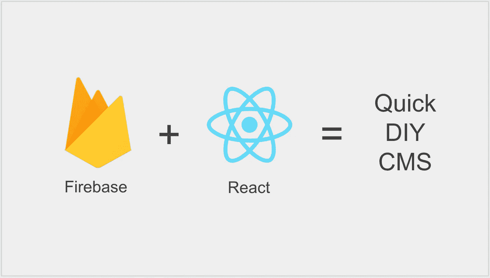
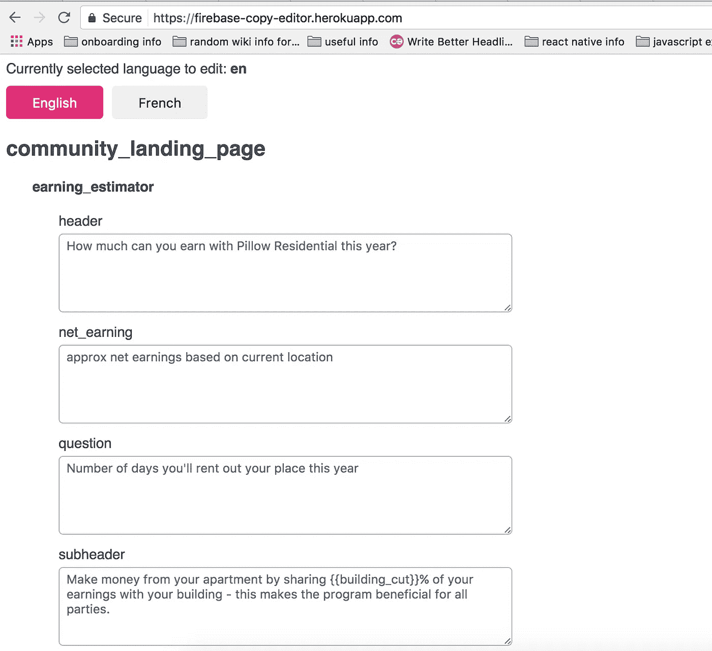
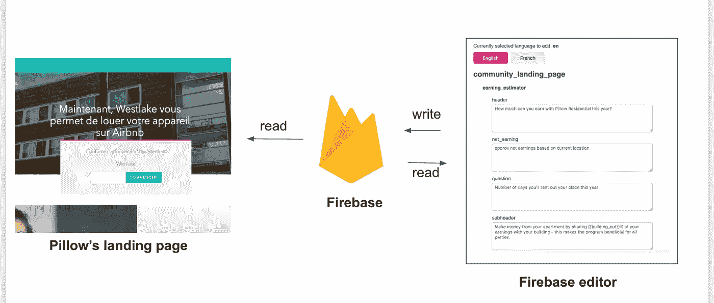

# 我如何在一天之内为 React 应用程序构建了一个内容管理系统

> 原文：<https://medium.com/hackernoon/how-i-built-a-content-management-system-for-a-react-app-in-one-day-269df17f5509>



DYI content management system with Firebase & React

## Firebase + React =快速 DIY CMS

有两种处理网站内容的方法:

1.  使用 CMS。
2.  代码本身中的副本/图像 URL 中的硬代码。

第二种选择一开始更快，对于在一个国家运营的早期创业公司来说也不错。然而，随着公司规模的扩大，两大问题将会浮出水面并不断加剧。

这两个问题中的第一个，我其实在工作中亲身经历过多次。

## 问题 1:工程师浪费了时间

每次需要进行内容更改时，产品团队都需要向工程师寻求帮助，而工程师则需要:

1.  停下他们正在做的事情
2.  钻研代码
3.  更改副本
4.  创建拉式请求
5.  请审阅 PR
6.  合并到母版
7.  部署

整个过程最多需要半小时到四十五分钟。然而，机会成本要大得多，因为工程师本可以把时间花在更重要的任务上。

如果换副本是瞬间的，岂不是很神奇？

## 问题 2:国际化

如果英文版本是硬编码的，网站只能以英文显示。如果公司在非英语国家走向国际，这肯定会是一个问题。

# 解决办法

这两个问题的解决方案是一个好的内容管理系统。

[枕头](http://pillow.com)，我现在工作的地方，上周举行了一次黑客马拉松。主题是生产力。我认为建立一个 CMS 来解决第一个问题会让产品和工程团队更有效率。

此外，我希望我的 CMS 不仅能解决第一个问题，还能在将来提供处理第二个问题的方法。

一天？是的，这就是建立一个简单有效的 CMS 所需要的一切。

## 工艺:React + Firebase

Firebase 是一个实时的 NoSQL 云托管数据库。任何人都可以注册一个 gmail 帐户，创建一个项目，并向数据库添加数据。

因为 NoSQL 的结构，我认为这将是一个伟大的方式来存储网站副本。这是我在黑客马拉松期间为构建 Pillow 的登录页面所做的工作:


Screenshot of json data structure

Pillow 的网站已经用 React 建立起来了，这让我的工作轻松了很多。

在这方面，我所需要做的就是安装 [re-base](https://github.com/tylermcginnis/re-base) ，设置一些配置，并替换硬拷贝。是一个 npm 包，它提供了方便的方法来轻松地与 Firebase 同步数据。回购有很好的设置文件，所以我不会在这里进入太多的细节。

我用了`listenTo`函数和 Firebase 同步。然后，我使用 dispatch 将数据加载到状态中。因此，`re-base`与 Redux 配合得很好。

```
componentWillMount() {
    const { dispatch } = this.props base.listenTo('en', {
      context: this,
      then(copies) {
        dispatch( loadCopies( language, copies ) )
      },
      onFailure(error) {
        console.log('error', error)
      }
    })
}
```

我的`loadCopies`动作调用一个 reducer 返回一个加载了副本的新状态。

在我的组件的 render 方法中，我使用了存储在状态中的副本，而不是任何硬编码的东西。

我还构建了一个独立的 Rails 应用程序，它有一个用于编辑 Firebase 数据的 UI。因此，CMS 与主应用程序完全分离，防止主应用程序变成一个更大的庞然大物。



Screenshot of my Rails app for editing content

我再次使用 React 和 re-base 来处理 Firebase sync。

```
componentWillMount() {
    const that = this
    firebase.auth().signInWithPopup(provider).then(function(result) {

    const user = result.user if (user.email.indexOf('[@pillow](http://twitter.com/pillow).com') > -1) {
       base.syncState(EN, {
          context: that,
          state: EN,
          onFailure(error) {
            console.log('error', error)
          }
        }) base.syncState(FR, {
          context: that,
          state: FR,
          onFailure(error) {
            console.log('error', error)
          }
        })
      }
    }).catch(function(error) {
      // Handle Errors here.
      console.log("ERROR", error)
    })
```

*(请原谅这里的一些“粗鲁”，我确实在一个工作日内做到了这一点。)*

`syncState`功能是“双向街道”它监听 Firebase 中的变化，然后更新组件的状态。如果组件状态得到更新(例如由`this.setState`更新)，这种变化会自动同步到 Firebase。

在我的 Firebase 编辑器应用程序中，存储在 Firebase 中的每个值都显示在一个`textarea`中。因此，整个 DOM 结构是基于 Firebase 数据动态生成的。当`textarea`中的值发生变化时，它会触发组件状态的变化，进而更新数据库。

总之，CMS 逻辑看起来是这样的:



Check out my mad powerpoint skill

观看我的 CMS 工作时的屏幕录像:

[https://www.youtube.com/watch?v=SNDvfpr3r1s](https://www.youtube.com/watch?v=SNDvfpr3r1s)

现在，你可能会问，为什么我要建立自己的 CMS？

没有什么神奇的原因，我这么做是因为:

1.  只需很少的努力就可以让它与我们现有的 React 前端 web 应用程序一起工作。
2.  不需要第三方服务。
3.  这是免费的，免费是好事。从技术上讲，Firebase 对 1GB 的数据是免费的，但我很想看到 Pillow 有一天在网站上有超过 1GB 的文本。
4.  最后，我只是认为这将是一个很好的学习机会。的确如此！

如果你喜欢这个故事，给我一些掌声！:)