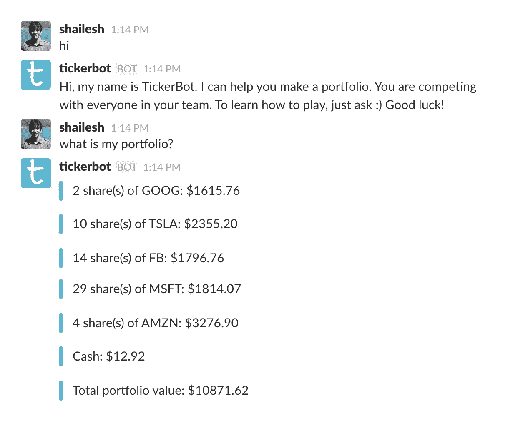
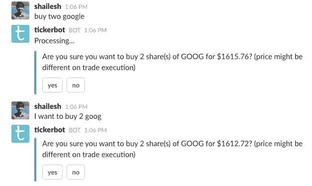
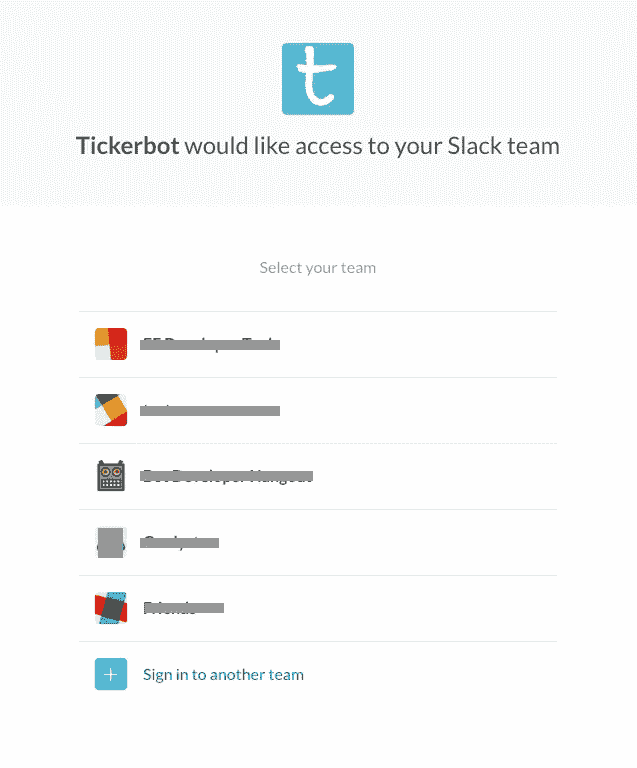
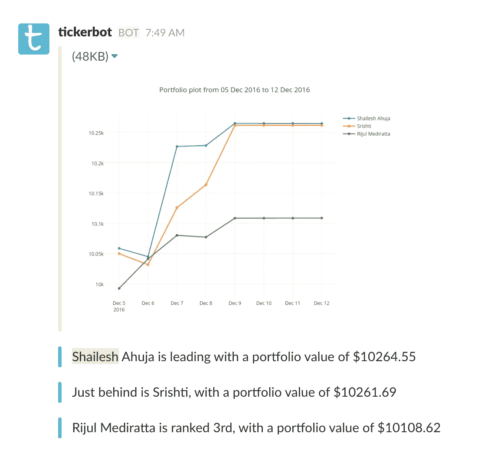
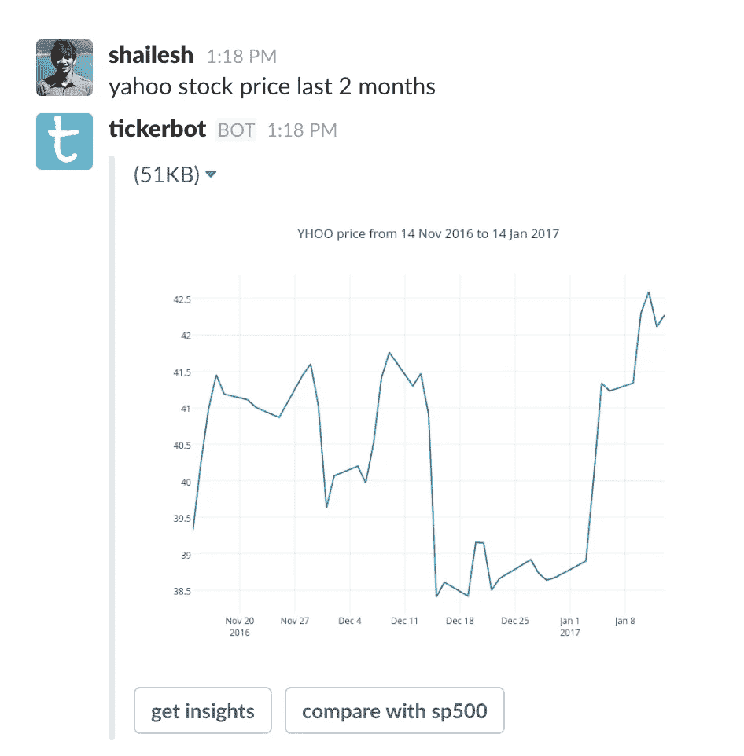

# 我如何在 Slack 上建立一个对话游戏

> 原文：<https://medium.com/hackernoon/how-i-built-a-conversation-game-on-slack-in-a-week-with-no-money-bd0c4d3bb4a6>

 [## 更新:添加到时差

### Tickerbot 现已在 Slack 应用目录上上线。试试吧！

slack.com](https://slack.com/oauth/authorize?scope=bot&client_id=85403973076.103667105557) 

由于信息公司开放了他们的 API，对话应用程序(又名“聊天机器人”)最近被赋予了生命。除了 WhatsApp，所有主要平台都允许开发者开发和发布应用。由于让人们下载新应用的难度越来越大，还有什么比利用现有应用的受欢迎程度更好的方式来吸引观众呢！

Slack 就是这些消息平台中的一个。对于团队来说，这是一个神奇的工具，现在被各种类型和规模的组织广泛使用。但它与其他应用程序不同，因为一旦团队管理员安装了该应用程序，团队中的所有用户都可以使用它。我决定利用这一点为懈怠团队建立一个对话游戏。它叫做 [TickerBot](http://talkai.xyz/tickerbot.html) 。基本上，它允许你用实时价格投资股票(当然是假的$$$)。您可以通过买卖股票来管理您的投资组合，获得股票的实时和历史价格图，并获得团队中表现最佳者的每日更新。

我的目标是以最少的努力和零成本构建一个简洁友好的应用程序。现在让我们深入研究一下用于各种零件的工具。

## **API。AI —自然语言处理(NLP)和对话管理**

没有 NLP 的对话式 app 有什么好？我不希望用户键入确切的命令来执行一个动作。用户应该可以自由地输入他们想要的任何内容，应用程序需要理解用户的意图。API。人工智能(最近被谷歌收购)有一个出色的基于机器学习的自然语言处理模型，允许你根据上下文管理对话流。免费计划允许您创建无限的私人代理，但限制为每秒一个查询(QPS)。它还具有与 Slack 的一键式集成，允许您快速部署应用程序。坏处呢？API。AI 不稳定。随机错误，没有事先信息的后端突然变化是非常常见的。

*扩展注意事项—* 1 QPS 对于成千上万的用户来说是不够的。那么解决方法是什么呢？对于这个 app 来说，很多用户输入都很简单，不需要任何高级的 NLP。只有发送超过 2 个单词的输入才能节省大量的 API 调用。如果需要，我可以存储处理过的模式和来自 API 的响应。人工智能，从而随着时间的推移减少它的需求。就对话管理而言，它不是火箭科学。由于他们框架中的一些限制，我已经部分地自己做了。

## **Slack——用于异步响应、认证的 API，当然还有 Slack 应用本身**

API。人工智能需要快速反应(最多 5 秒)。此外，我只能对每个用户输入响应一次。不幸的是，我使用的外部 API 花费了大量的处理时间，并且我需要将我的响应分解成多个消息。由于他们没有给你安装你的应用的 slack 团队的 OAuth 证书(这很可悲，因为技术上你拥有证书)，我不得不放弃一键式集成，直接使用 Slack API 来发送异步响应。要发送这些消息，我需要 OAuth 凭证和收件人的用户 ID。文件是一个痛苦的经历。我不得不多次阅读每一页，以了解我需要在哪里使用哪个 API。我想这不是他们的错，他们最近长得真的很快。

*扩展考虑事项—*slack 应用商店提供了一个扩展你的应用程序和增加受众的绝佳场所。OAuth 需要正确实现，以允许新团队使用您的应用程序。

## [**剧情**](http://Plot.ly) **—剧情优美**

[Plot.ly](http://Plot.ly) 拥有最好的 python 库(至少我是这么认为的)，可以绘制简单、功能丰富且美观的图形。他们有清晰的文档，他们的 API 简单易懂。我用它来绘制历史股票价格和投资组合表现。缺点是绘图和图像转换是在他们的服务器上完成的。发送图形数据和接收图像链接大约需要 10-30 秒。直接离线获取绘图图像是不可能的，免费的在线版本限制为每天 50 次 API 调用(尽管仍然很慷慨)。

*扩展考虑事项—* 要么购买 [plot.ly](http://plot.ly) pro，要么寻找变通方法。在我有限的时间里，我无法让这个离线工作。不过我还有一些想法，比如将图形转换成 matplotlib，或者破解他们支持的离线 HTML 版本。

## **雅虎财经，Quandl —财务数据**

我从优秀的雅虎金融开始。它提供了世界范围内各种股票的历史每日价格，也提供了实时的当前价格。当然是免费的。但问题是他们的文档不清楚，现在甚至这项服务的未来也不清楚。我也开始随机出现一些错误。Quandl 是唯一一个提供免费数据的服务。然而，它只提供了美国和印度股票的历史价格。最后，我用 quandl(雅虎作为备份)获得历史价格，用雅虎获得实时价格。

*扩展考虑—* Quandl 免费 API 限制为 2K 调用/ 10 分钟和 50K /天，非常慷慨。雅虎自己的未来是未知的，所以我不认为它是严肃 app 的正确选择。要么奇迹般地很快出现一场免费、轻松访问金融数据的开源运动，要么我不得不支付过高的费用来获得访问权。说真的，访问这些数据是瓶颈，也是最令人沮丧的。

## **Django，AWS —开发和部署**

感谢开源社区和亚马逊，在这一节我只有好话要说。Python 让生活变得简单。我使用了标准的 django+gunicorn+nginx 设置。为了异步发送消息，我广泛使用了 celery + rabbitMQ。芹菜很方便。我也尝试过使用亚马逊 SQS，但是在我第一次尝试时，它并不可靠，所以我切换回 rabbitMQ 作为消息代理。我需要 SSL 与 Slack API 通信，所以我使用了 Let's Encrypt，它提供了免费的 SSL 认证。它的安装速度非常快，令人惊讶的是，它根本不需要任何成本。此外，AWS 免费提供服务器(EC2)和数据库(RDS)服务。

*扩展考虑事项—* 基础设施将需要扩展。意味着把$$$给 AWS。我可以在 EC2 实例上产生更多的芹菜工人，使用 AWS 自动伸缩、负载平衡等。不过 AWS 既方便又便宜。

## **发布项目想法**

这是我在 [Entrepreneur First](http://joinef.com/) 创建公司时开发的。这个项目是在对对话机器人进行技术研究时得到的灵感。对于手头的任务来说，这是完全没有必要的，但是作为一个喜欢把碎片拼在一起做一些很酷的东西的软件工程师，我就是控制不住自己。建立一家公司需要更具体的业务和市场发展，我也最终没有追求这个空间(哎呀！).我意识到构建生产级机器人并不难。你不用去处理错综复杂的前端开发(没有 HTML、CSS、JS；呵呵)。

你可以在 [Github](https://github.com/shaileshahuja/tickerbot) 查看代码。欢迎提问、建议、评论或投稿:)

 [## 更新:添加到时差

### Tickerbot 现已在 Slack 应用目录上上线。试试吧！

slack.com](https://slack.com/oauth/authorize?scope=bot&client_id=85403973076.103667105557)