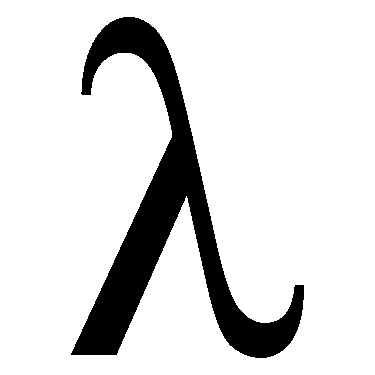
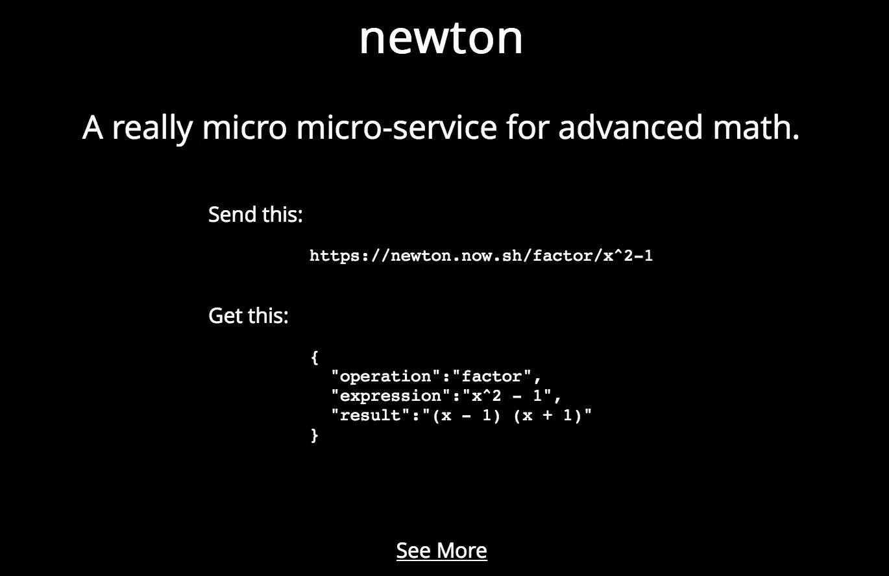
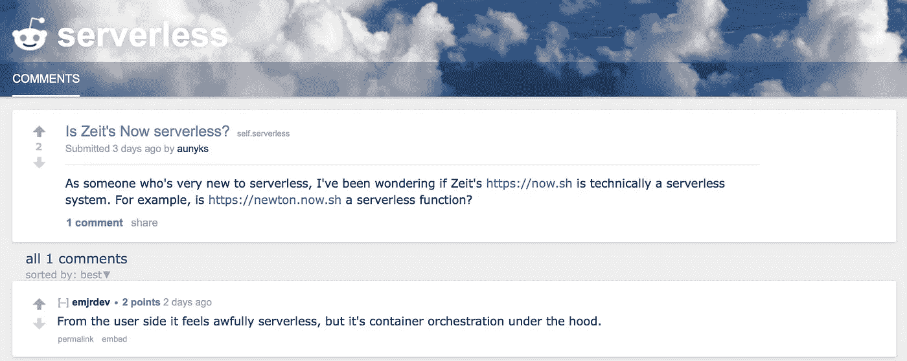

# 我是如何在不知道的情况下构建一个无服务器函数的

> 原文：<https://medium.com/hackernoon/how-i-built-a-serverless-function-without-knowing-it-58b1e65b4422>

## 我认为*

满满一周考试后的周末。我筋疲力尽，只等着高中毕业。但是，像任何其他开发人员一样，我有一种冲动，想继续开始另一个周末项目。我正在学习 AP 微积分中一些非常有趣的东西，但是我有时厌倦了在作业中做代数。我对自己说:*为什么不做一些能帮我做数学作业的东西呢？*

Not a bad idea

这就是我想建立[牛顿的想法，一个真正的数学微服务](https://newton.now.sh)。我想让开发人员更容易做数学，而不受代码库大小或他们首选语言中不存在的 API 的约束。

**那么是什么让它变得有趣呢？当然，除了超级酷和功能强大之外，Newton 除了源文件之外不需要任何存储空间。它不访问或修改数据库，甚至不动态创建配置文件或任何类似的东西。每个请求和响应都受到现在的 HTTPS 加密技术的保护。另外，它只运行在简单的 GET 请求上。**

我并不认为这些特征有多重要，但在与技术社区进行了一些互动后，我认为牛顿是一个[无服务器](https://hackernoon.com/tagged/severless)函数。

Eric Elliott 给出了一个意想不到但信息丰富的回复。牛顿符合这些特征。Zeit 目前将全球主机抽象化，以满足网络上的机器。Newton 是一个相对较小的包(~3.3kB)，所以它适合小大脑，就像我说的，它不访问或处理持久内存。对我来说好像没有服务器。

还有别的吗？

那就成交了。我现在使用，因为除了代码如何运行之外，我不用担心任何事情。牛顿做一件事:数学。

等等，数学是很多东西。

我们明白了。但是为了确保万无一失，我选择了无服务器。

呃，这个答案对我来说已经够好了。

所以，最后我做了一个小的无服务器功能作为周末项目，帮我做数学作业，帮别人做很酷的东西。Newton 已经变得比我最初预期的更受欢迎，我很想见证它的发展，看看其他人如何利用它。

别忘了:**它是无服务器的，*我想是*** 。

感谢阅读！一如既往，你很棒。

*关于无服务器架构的更多信息，从这里***开始。**

******

> *[黑客中午](http://bit.ly/Hackernoon)是黑客如何开始他们的下午。我们是 AMI 家庭的一员。我们现在[接受投稿](http://bit.ly/hackernoonsubmission)并乐意[讨论广告&赞助](mailto:partners@amipublications.com)机会。*
> 
> *如果你喜欢这个故事，我们推荐你阅读我们的[最新科技故事](http://bit.ly/hackernoonlatestt)和[趋势科技故事](https://hackernoon.com/trending)。直到下一次，不要把世界的现实想当然！*

**