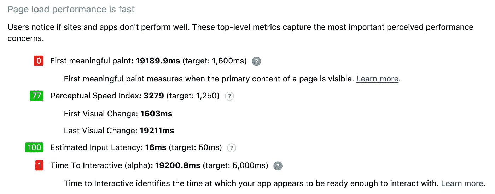
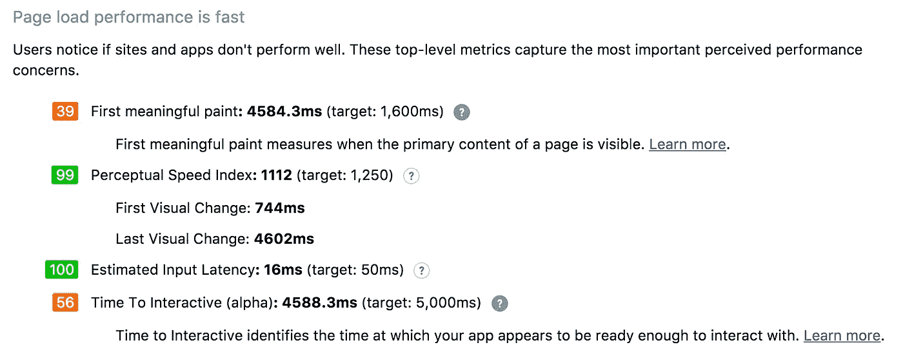
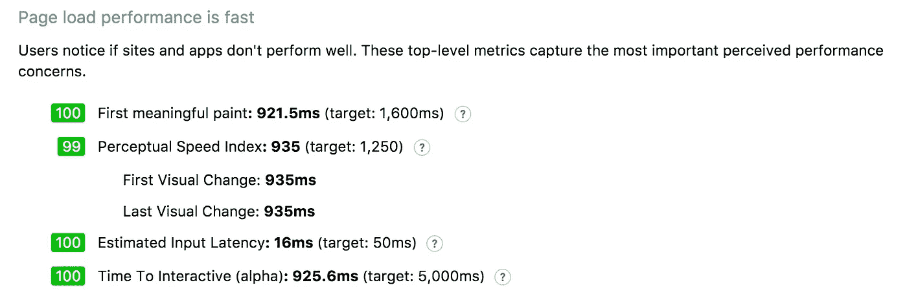
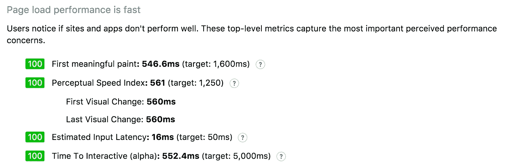
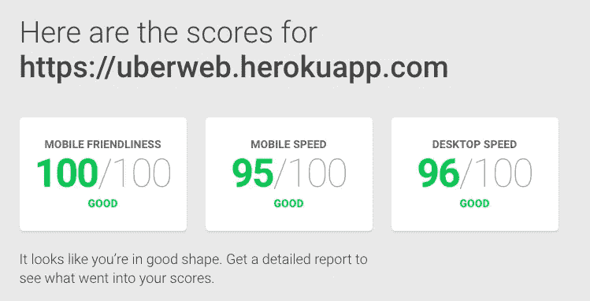

# 我如何为移动网络建立一个超快的优步克隆

> 原文：<https://medium.com/hackernoon/how-i-built-a-super-fast-uber-clone-for-mobile-web-863680d2100f>

这篇文章是关于我的[学习](https://hackernoon.com/tagged/learning)使用[让优步移动网络尽可能快地反应](https://hackernoon.com/tagged/react)的性能技巧。

Flipkart Lite 推出已经一年了，Housing Go 推出也有几个月了，我一直对移动网络的未来很感兴趣，我想尝试一下。

首先，我需要一个可以实现 perf 技术的应用程序，优步最近刚刚推出了他们的新设计的应用程序，它看起来很有前途，所以我决定使用 React 克隆这个应用程序。

我花了一些时间来构建应用程序的基本实现，我使用了[https://github.com/uber/react-map-gl](https://github.com/uber/react-map-gl)来绘制地图，并使用`svg-overlay`来创建从源和目的地以及`html-overlay.`的路径

下面是有基本交互的 app 的 gif。

现在我有了基本的应用程序，我开始改进它的性能。

我已经用 [Chrome Lighthouse](https://github.com/GoogleChrome/lighthouse) 检查了 web app 在各个阶段的表现。

最初的加载时间是这样的。

# 为了提高上面的属性，我使用了下面的技巧

***代码分割——将加载时间从 19 秒减少到 4 秒*** 我做的第一件事是使用 [webpack 代码分割](https://webpack.github.io/docs/code-splitting.html)技术，根据路线将应用程序分成不同的块，并加载特定路线所需的内容。

我通过使用`react-router`的`getComponent` api 做到了这一点，其中我只在请求路线时才需要组件。

我还使用 webpack 中的 [CommonChunkPlugin](https://webpack.github.io/docs/list-of-plugins.html#commonschunkplugin) 提取了供应商代码。

有了这个，我把加载时间从 19 秒减少到了 4 秒。

Performance metrics using code splitting

***2。服务器端渲染—将加载时间从 4 秒减少到 921 毫秒*** 然后，我通过在服务器上渲染初始路线并传递给客户端来实现 SSR。

我在后端使用了 Express，并使用了`react-router`的`match` api

多亏了 SSR，现在加载时间是 921 毫秒。

Performance metrics using SSR

***3。压缩静态资产—*** ***将加载时间从 921 毫秒减少到 546 毫秒*** 然后我决定压缩所有的静态文件，这是通过使用 webpack 中的 [CompressionPlugin](https://github.com/webpack/compression-webpack-plugin) 实现的

和 [express-static-gzip](https://github.com/tkoenig89/express-static-gzip) 来提供来自服务器的压缩文件，如果没有找到所需的文件，则退回到未压缩状态。

耶，我保存了将近 400 毫秒。干得好，纳伦德拉！

Performance metrics after compressing the assets

***4。缓存—帮助将重复访问的加载时间从大约 500 毫秒缩短到大约 300 毫秒*** 现在，我已经将我的 web 应用程序的性能从 19 秒提高到 546 毫秒，我希望缓存静态资产，以便加快重复访问的速度。

我通过在支持服务人员的浏览器上使用`sw-toolbox`来做到这一点

和不支持的浏览器的标题。

通过这样做，我将重复访问时间缩短了大约 200 毫秒。

Repeat visit without service worker

Repeat visit with service worker

**5。预加载然后加载** 我在`head`标签中使用了`<link rel="preload" ... as="script">`，在不支持预加载的浏览器中使用了`prefetch`。在主体的最后，我在一个常规的`<script>`标签中加载了应用程序 JS。
有关预加载和预取的更多信息，请访问[https://css-tricks.com/prefetching-preloading-prebrowsing/](https://css-tricks.com/prefetching-preloading-prebrowsing/)

最后用谷歌页面速度测试，这是结果

Scores from [PageSpeed Insights](https://testmysite.thinkwithgoogle.com/intl/en-in)

这对我是一个很好的学习，我知道我可以优化更多，并将继续探索。绩效改进是一个持续的过程，这只是我所取得成就的一个基准。试试你的应用程序，让我知道你的故事。

github:[https://github.com/narendrashetty/uber-mobile-web](https://github.com/narendrashetty/uber-mobile-web)
现场演示:[https://uberweb.herokuapp.com/](https://uberweb-v2.herokuapp.com/)或者
[https://uberweb-v2.herokuapp.com/](https://uberweb-v2.herokuapp.com/)

请在您的手机浏览器上观看演示，并与我分享您的意见。(因为我在 heroku 上托管了它，所以当它没有人访问时就会关闭。如果一开始加载不了也不要失去耐心:P 这么讽刺)。

保持性能就像下棋一样，走错一步就会前功尽弃。

感谢您的阅读，如果您喜欢这篇文章，请点击“推荐”或在下面写一个回复。你可以在推特上联系我 [@narendra_shetty](https://twitter.com/narendra_shetty) 。

> [黑客中午](http://bit.ly/Hackernoon)是黑客如何开始他们的下午。我们是 [@AMI](http://bit.ly/atAMIatAMI) 家庭的一员。我们现在[接受投稿](http://bit.ly/hackernoonsubmission)并乐意[讨论广告&赞助](mailto:partners@amipublications.com)机会。
> 
> 如果你喜欢这个故事，我们推荐你阅读我们的[最新科技故事](http://bit.ly/hackernoonlatestt)和[趋势科技故事](https://hackernoon.com/trending)。直到下一次，不要把世界的现实想当然！

