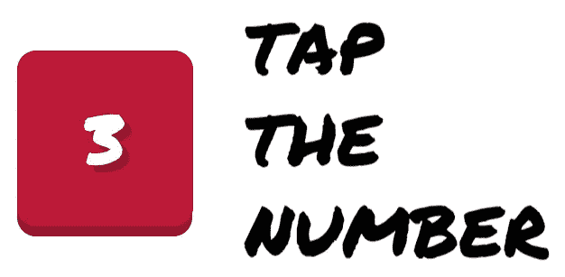

# 我如何使用 React-Native 构建一个超级简单的游戏

> 原文：<https://medium.com/hackernoon/how-i-built-a-super-simple-game-using-react-native-67bdade50373>

今天我在 App Store 上发布了一个简单的 React-Native 游戏，目的是提供一些如何处理像这样的小型 React-Native 项目的技巧。当然，这款游戏是完全开源的，你可以在 [GitHub](https://github.com/mmazzarolo/tap-the-number) 和 [App Store](https://itunes.apple.com/us/app/tap-the-number/id1206517840?l=it&ls=1&mt=8) 上找到资源库。

Protip:你可以在 [GitHub 的 README.md](https://github.com/mmazzarolo/tap-the-number) 和[我的个人网站](http://mmazzarolo.com/blog/how-i-built-a-super-simple-game-using-react-native/)上找到这篇相同的媒体文章。考虑到前面有一些代码，它们可能看起来更舒服。

点击号码！是一个简单的 React-Native 游戏，你必须按特定的顺序点击出现在屏幕上的方块。

即使开发这款游戏并没有花费太多时间(我想我应该花了 20 个小时),但这是一次有趣的经历，我想分享一些技巧和一些我在开发过程中发现的复杂性信息。

# 堆栈和依赖关系

## 反应-自然

Tap 这个数字完全是用 [**React-Native**](https://facebook.github.io/react-native/) 构建的，鉴于我喜欢 React/React-Native，并且我在当前的工作场所每天都在使用它，这对我来说是一个显而易见的选择。
React-Native 自带 [**Jest**](https://facebook.github.io/jest/) ，与 React 耦合时大放异彩的测试框架。
相关依赖关系:

## 状态管理:MobX

我开始使用 [**Redux**](http://redux.js.org/docs/introduction/) 来处理状态管理，但是过了一段时间我注意到，作为一个简单的项目，它正在减慢我的速度，所以我抓住机会，实现了 [**MobX**](https://github.com/mobxjs/mobx) 。
[这不是我第一次用 MobX](https://github.com/GPMDP/google-play-music-desktop-remote) ，但是这次我试着用了它的`provider`和`inject` à la Redux，真的很喜欢！
相关依赖关系:

## 静态类型检查:流类型

[**Flowtype**](https://flowtype.org/) 是一个静态类型检查器。我已经用了一段时间了，它节省了我很多时间。我怎么称赞都不为过。

我强烈建议你试一试，或者最好还是坚持几天，看看它的真正好处。

相关依赖关系:

## 林挺:埃斯林特和更漂亮

我过去浪费了太多时间来调整我的 ESlint 配置。
现在我对最小 ESlint 配置**和更漂亮的**非常满意，它们负责我的应用程序的所有代码样式。
相关依赖关系:****

## ****从绝对路径导入:巴别插件模块解析器****

****我使用[**babel-plugin-module-resolver**](https://github.com/tleunen/babel-plugin-module-resolver)从`src`路径导入文件。相关依赖关系:****

## ****播放音频文件:反应-原生-声音****

****如果你需要在一个 React-Native 应用程序中播放一个音频文件，你必须使用某种外部库，因为它还没有在 React-Native 中实现。
对我来说[**react-native-sound**](https://github.com/zmxv/react-native-sound)是目前最完整的库，在这个应用程序上运行良好。****

****附注:我直接从 Github Master 分支中调出这个库，因为 NPM 上可用的最新版本还不支持 React-Native 0.40。****

****相关依赖关系:****

## ****简单动画:反应-原生-可动画****

****对于简单的动画[**react-native-animatable**](https://github.com/oblador/react-native-animatable)是 React-Native 上事实上的标准。
相关依赖关系:****

# ****项目结构****

****别再依赖了！让我们看看项目结构:****

****一开始，我使用的项目结构可能看起来过于复杂，但是这种设置几乎立刻就有了回报(下面继续)。****

# ****一点历史****

****我带着完全不同的想法开始开发这个游戏:我想用 [**React-Native ART**](https://github.com/facebook/react-native/tree/master/Libraries/ART) 和[玩一会儿，如果你仔细看看提交历史](https://github.com/mmazzarolo/tap-the-number/commit/9ab03803babecd38d4e320782a0c826623241c4b)你会发现在某个时候我甚至实现了一个[动画，类似于 Twitter 的 heart one](http://browniefed.com/blog/react-native-how-to-create-twitter-exploding-hearts/) 在点击磁贴时。
不幸的是，我不得不放弃这个想法，因为当你运行多个动画时，React-Native 会有小的滞后(在我的例子中，当快速点击瓷砖时)，但由于[本机驱动程序](https://facebook.github.io/react-native/blog/2017/02/14/using-native-driver-for-animated.html)，似乎有些事情正在改变。****

****当时，我已经创建了游戏引擎和一些组件，所以，我没有放弃这个项目，而是决定把它变成这个游戏。****

# ****有趣的东西****

## ****配置文件是你的朋友****

****我试图在`config`目录中收集描述应用程序行为的所有变量。
例如，`config/metrics.js`公开了所有的应用程序维度:****

****这种设置，加上热重新加载，即使对于这样一个简单的游戏来说也非常方便，因为我已经能够将我需要更改的大多数变量集中在一个目录中。****

## ****相对尺寸****

****React-Native 不是一个游戏开发框架，如果你试图用它来构建一个游戏，你会错过的一件事是处理相机/视口的正确方法。
敲击数字是一个简单的游戏，所以使用相对维度对于它的用例来说已经足够了。
使用相对尺寸意味着您应该相对于设备大小(或其父设备)来定义尺寸，而不是使用逻辑像素单位(React-Native 的默认单位)来定义视图的尺寸。
遵循这种方法将使你的游戏在更大/更小的设备上自动调整大小(甚至在平板电脑上！)但在我看来它也有很多弊端:****

*   ****应用程序越成长，你需要定义和跟踪的维度就越多；****
*   ****处理屏幕旋转可能会变得困难(点击游戏只能在纵向模式下工作)；****
*   ****如果您正在使用一些本机组件，您可能无法调整它们的大小；****

****说到尺寸，在 Tap The Number 中，我做了一件让我有点惭愧的事情:我将游戏引擎与设备尺寸捆绑在一起，正如你在`utils/boardUtils.js`的`getRandomTilePosition`中看到的:****

****当应用程序初始化游戏棋盘时，上述函数使用 while 循环搜索可用的棋子位置。
我知道这个功能[可以通过许多不同的方式进行优化](http://jsfiddle.net/fZtdt/13/)，如果设备的宽高比不合理，它可能会中断，但是考虑到:****

*   ****我针对的只是 iOS(> = iPhone 5)；****
*   ****棋盘上最多有 6 张牌；****
*   ****平铺尺寸是设备宽度的 28%；****

****…为了简单起见，我决定选择这个解决方案(也为了保持代码的可读性，但是如果它看起来太不合理，请随时纠正我)。****

****最后一件事:记住，React-Native `<Text />`组件不会根据设备大小缩放文本。
这是我总是在内置的`<Text />`组件上使用自定义包装器的原因之一，这样我可以很容易地改变它的默认行为/字体/颜色。
要获得缩放后的字体大小，您应该执行以下操作:****

# ****MobX(和 src/utils)提示****

****老实说，我喜欢 Redux，我每天都在使用它，但是对于像这样简单的应用程序，MobX 已经足够了。事实上，如果你对中间件或者对调度动作的集中模式不感兴趣，在我看来 MobX 可能是比 Redux 更好的选择。****

****我最近开始在 MobX 上使用的一个东西是`provider` + `inject`组合，它提供了一个很好的连接组件到商店的抽象(类似于 Redux 的`mapStateToProps`)。****

****我发现的另一件非常有用的事情是滥用`src/utils`和`src/services`文件夹:根据我的经验，MobX 操作往往会变得混乱，所以我更喜欢通过减少代码的冗长来使它们易于阅读。
谈论我的实用程序功能...我有点难过，因为它们不是超级纯的——它们在内部使用`src/config`文件——但是如果你的应用程序比我的大，我建议你让它们接受那些配置作为参数，使它们可测试。****

****附注:如果你需要计算一个可观察的值，尽可能使用`@computed`值(就像 Redux 的选择器一样)。****

# ****动画，第 1 部分:我使用的动画库****

****在“点击数字”中，我用三种不同的方式制作了组件动画:****

*******React-Native-Animatable*******

****是 React-Native 动画 API 的包装器，它公开了许多简单的动画，并允许您以编程和声明的方式使用它们，拥抱 React 的理念。
如果你不需要复杂的动画、插值或计时，`react-native-animatable`是一个可靠的选择。****

*******React-原生动画 API*******

****我在《T2》中使用了动画 API 来制作时间条动画:我想达到一种需要一些手动调整的效果，而动画 API 是最灵活的。具体来说，我想将时间条的宽度和颜色从灰色变为红色。****

*******React-Native layout animation***
layout animation 是一种强大的方式，无需指定动画行为，即可制作布局变化之间的过渡动画。在调用`setState`之前，你只需调用`LayoutAnimation.spring()`或[其他可用配置中的一个](https://facebook.github.io/react-native/docs/layoutanimation.html)，React-Native 将为布局发生变化的组件制作动画。
你可以在`src/components/Tile.js`中看到一个例子，我通过在`this.setState({ isTouched: true });`之前调用`LayoutAnimation.spring()`来制作瓷砖深度的动画。正如你可能已经猜到的，LayoutAnimation 的缺点是它提供的控制比其他动画选择要少得多。****

****否则你将不得不跟踪组件状态中的动画状态(例如:`this.setState({ isContainerFadingOut: true })`，这给组件的生命周期增加了不必要的复杂性。****

# ****动画，第 2 部分:反应和动画****

****这里我就开门见山了:****

****在我看来，动画和 React(和 React-Native)相处得不好，而且永远不会。****

****我知道这可能是一个有争议的观点，但是在 React-Native(以及 React，例如 React-Motion)上尝试了许多不同的库之后，我仍然认为动画违背了声明式 React 模式。不要误解我的意思，你仍然可以在使用小动画的时候获得干净的代码，但是当你开始一个接一个地链接动画时，你会以编程的方式结束:****

****否则你将不得不跟踪组件状态中的动画状态(例如:`this.setState({ isContainerFadingOut: true })`,这会给组件的生命周期增加不必要的复杂性。****

****…最后一点意见:我不认为动画的命令性和 React 的“声明性”之间的冲突可以轻易解决(尽管我会非常高兴被证明是错误的):毕竟，制作**动画是很难的。******

# ****Android 支持****

****我原本也打算在 [Android](https://hackernoon.com/tagged/android) 上发布这个游戏，但是我遇到了一些我无法轻易解决的问题。
最令人恼火的是我无法在 Android 上使用自定义字体:我尝试使用`react-native link`(在 iOS 上运行良好)链接资产文件夹，并手动添加字体，但似乎[一些字体根本无法正确链接](https://github.com/facebook/react-native/issues/7301)，而其他字体即使使用第一种方法也运行良好。我面临的另一个问题是动画响应迟缓(特别是在使用 LayoutAnimation 时)，但我想我可以通过进一步调查这个问题来轻松解决这个问题。****

# ****感谢…****

****我根本不是一个有创造力的人:我在这个应用程序中使用的每一个东西都只是我之前已经看过的东西的重复。
所以，事不宜迟，这里是我能想到的所有用来构建这个简单游戏的资源:****

*   ****[iOS 资产的资产目录创建者](https://itunes.apple.com/it/app/asset-catalog-creator-free/id866571115?mt=12)；****
*   ****[我在](https://freeios7.com/download/freeios7.com_apple_wallpaper_geometry-white_ipad_retina.jpg) [Google](https://hackernoon.com/tagged/google) 图片上找到的游戏背景图片(不好意思，不知道作者是谁)；****
*   ****[freesound.org](https://freesound.org/browse/tags/sound-effects/)为音效；****
*   ****[这幅松弛的图像](https://raw.githubusercontent.com/mmazzarolo/tap-the-number/master/extra/slack-tiles.png)激发了瓷砖的设计灵感；****
*   ****Mostaza，我工作的初创公司，感谢所有的支持(也感谢 App Store 账户！)****
*   ****我在这篇文章中已经链接和讨论过的所有库；****

****叉，评论和批评是热烈欢迎的，我只是希望这个应用程序的例子迟早会对某人有所帮助！****

************************

> ****[黑客中午](http://bit.ly/Hackernoon)是黑客如何开始他们的下午。我们是 [@AMI](http://bit.ly/atAMIatAMI) 家庭的一员。我们现在[接受投稿](http://bit.ly/hackernoonsubmission)，并乐意[讨论广告&赞助](mailto:partners@amipublications.com)机会。****
> 
> ****如果你喜欢这个故事，我们推荐你阅读我们的[最新科技故事](http://bit.ly/hackernoonlatestt)和[趋势科技故事](https://hackernoon.com/trending)。直到下一次，不要把世界的现实想当然！****

********