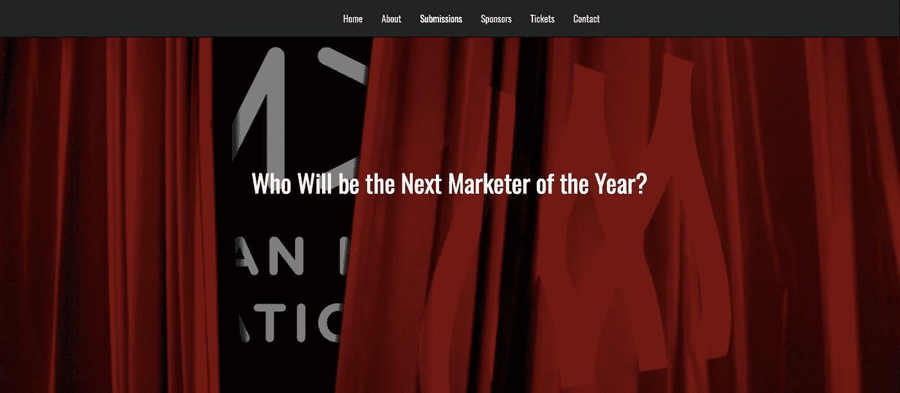
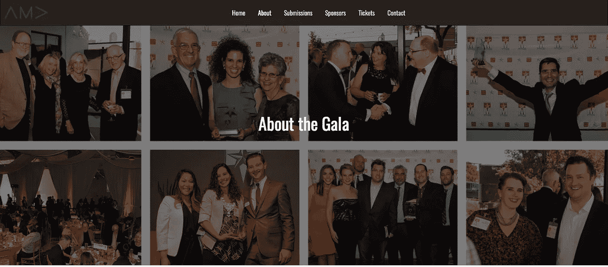
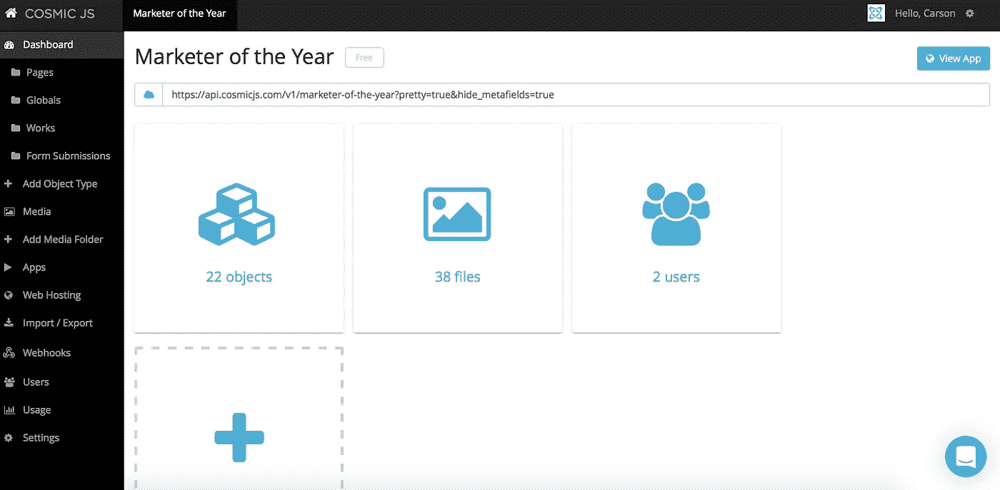
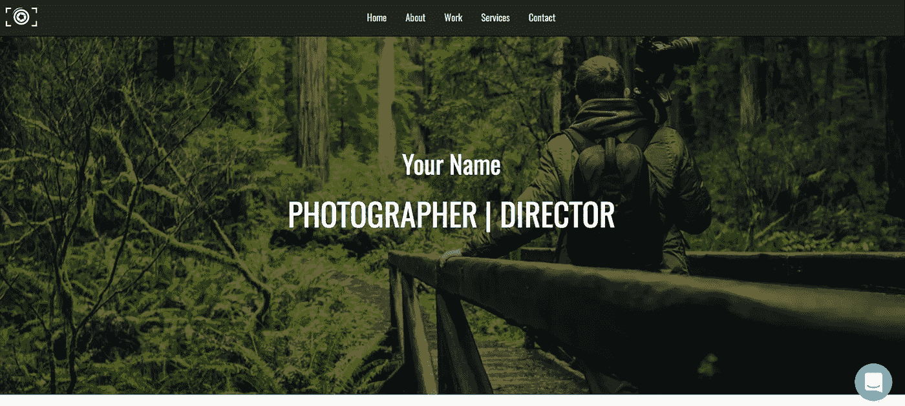

# 我如何用 4 个步骤建立一个活动微型网站

> 原文：<https://medium.com/hackernoon/how-i-built-an-event-microsite-in-4-steps-71588b11d602>

在这篇博客中，我将向你展示我是如何挑选一个现有的代码库(内容就绪应用程序)并将其缩减到我自己的活动微型网站中的。这个微型网站是为即将到来的[年度营销人员晚会](http://moy.dfwama.com/submissions)准备的，我的[美国营销协会分会](http://dfwama.com/)将于 5 月举办，因此我们知道这只是一个季节性部署，可以很容易地备份、删除或转换为新活动的皮肤。

这个漂亮的事件微型站点是使用服务器上的 Node.js 和前端的 Bootstrap 构建的。它对手机完全敏感，包括一个联系表单和一个由 [Photoswipe](http://photoswipe.com/) 支持的图库部分。

对于这个示例应用程序，我将使用 [Cosmic JS](https://cosmicjs.com/) 。Cosmic JS 是一个 [API 优先的 CMS](https://cosmicjs.com/) ，它使得管理和构建网站和应用程序更加快速和直观。通过将内容从代码中分离出来，Cosmic JS 增强了开发人员的灵活性，同时确保内容编辑人员能够以最适合他们的方式规划和部署内容。我们将使用 Cosmic JS 来安装我们的示例应用程序，部署和更新来自基于云的内容管理平台的内容。

**完全披露**:我已经使用[宇宙 JS 摄影应用](https://cosmicjs.com/apps/photography-website/demo)作为一个内容就绪应用，为我的活动进行部署和编辑。我这样做的理由是，内容就绪应用程序中的每个页面都支持大型照片阵列，而我不必做任何繁重的工作或编辑。我为我的新应用程序删除了 gallery 部分，并简单地复制了一个第三级页面，这样我的站点地图就合我的意了。

如果你还没有，那就从[报名](https://cosmicjs.com/signup)参加[宇宙 JS](https://cosmicjs.com/) 开始吧。下面提供了有用的资源来简化您的开发操作。

> [摄影 App 页面](https://cosmicjs.com/apps/photography-website)
> 
> [摄影 App 演示](https://cosmicjs.com/apps/photography-website/demo)
> 
> [GitHub 上的摄影 App 代码库](https://github.com/cosmicjs/cosmicapp-photography-website)

# 1.创建新的存储桶

您的 bucket 的名称是您正在构建的网站、项目、客户端或 web 应用程序的名称。

# 2.安装摄影应用程序

一旦你注册并命名了你的桶，你将被提示从头开始或者“查看一些应用”。对于这个博客，我简单地点击了右键“查看一些应用程序”，这样我就可以开始安装[宇宙 JS 摄影应用程序](https://cosmicjs.com/apps/photography-website)。

# 应用程序安装选项

[Cosmic JS](https://cosmicjs.com/) 让你能够在编程语言之间进行过滤，比如 [Node.js](https://cosmicjs.com/carson-gibbons/edit-object/Node.js) 、 [PHP](https://cosmicjs.com/apps) 、 [React](https://cosmicjs.com/apps) 、 [AngularJS](https://cosmicjs.com/apps) 等等。

只需点击[摄影网站](https://cosmicjs.com/apps/photography-website)图标下方的“安装”即可开始，或者访问[宇宙 JS 应用页面](https://cosmicjs.com/apps)。

# 3.部署到 Web

我点击了“部署到 Web”。然后，我可以在部署 web 应用程序时编辑对象。您将收到一封电子邮件，确认您的 web 应用程序的部署。如果您在部署过程中遇到任何问题，您可能会被转到 [Cosmic JS 故障排除页面](https://cosmicjs.com/troubleshooting)。

# 部署分支机构确认模式

我从一个回购中提取，我的分支被澄清，我有一个与我在步骤 1 中创建的 slug / bucket 名称相匹配的部署位置。

# 4.编辑全局对象

编辑是在宇宙 JS 仪表盘中实现的梦想。要了解更多关于如何在考虑编辑内容的情况下构建 [Cosmic JS](https://cosmicjs.com/) 的信息，请阅读[在考虑内容编辑器的情况下构建](https://cosmicjs.com/blog/building-with-the-content-editor-in-mind)。

主[章节网站](http://dfwama.com/)是一个 WordPress 网站，其域名信息与 GoDaddy 在一起。我们希望能够将活动微型网站功能作为主网站的子域，因此只需 GoDaddy 域名注册商的登录信息，我们就能够升级桶，以包括自定义域名，创建一个子域，并让[部署桶](http://moy.dfwama.com/)在我们想要的 URL:【www.moy.dfwama.com】T4 运行。

这个微型站点还具有联系其他 API 和应用程序的能力。例如，奖项类别的提交包含在 [Submittable](https://dfwama.submittable.com/submit) 中，但是我可以将所有可提交的微型站点复制并粘贴到 Cosmic JS 内容编辑器中，为我们的微型站点提供可链接的类别。每个类别很自然地默认为点击进入一个类别的详细页面，我认为这很棒。查看[提交类别。](http://moy.dfwama.com/submissions)

# 之前(内容就绪应用程序)

# 之后(生产活动微型网站)

就像注册、创建新的存储桶、安装 web 应用程序、编辑对象和部署一样简单！我收到了访问我的 web 应用程序的确认电子邮件，还看到了我的桶升级选项，如自定义域、一键式 SSL、webhooks 和本地化。

[Cosmic JS](https://cosmicjs.com/) 是一个 API 第一的基于云的内容管理平台，可以轻松管理应用和内容。如果你对 Cosmic JS API 有任何疑问，请联系 Twitter 或 Slack 的创始人。

[卡森·吉本斯](https://twitter.com/carsoncgibbons)是[宇宙 JS](https://cosmicjs.com/) 的联合创始人& CMO，宇宙 JS 是一个 API 第一的基于云的[内容管理平台](https://cosmicjs.com/)，它将内容与代码分离，允许开发人员用他们想要的任何编程语言构建流畅的应用程序和网站。

> [黑客中午](http://bit.ly/Hackernoon)是黑客如何开始他们的下午。我们是 [@AMI](http://bit.ly/atAMIatAMI) 家庭的一员。我们现在[接受投稿](http://bit.ly/hackernoonsubmission)，并乐意[讨论广告&赞助](mailto:partners@amipublications.com)机会。
> 
> 如果你喜欢这个故事，我们推荐你阅读我们的[最新科技故事](http://bit.ly/hackernoonlatestt)和[趋势科技故事](https://hackernoon.com/trending)。直到下一次，不要把世界的现实想当然！

