# 我如何在 3500 万年内建立并部署一个 WebGL 游戏到一个新网站

> 原文：<https://medium.com/hackernoon/how-i-built-and-deployed-a-webgl-game-to-a-new-website-in-35m-15b2e8339c31>

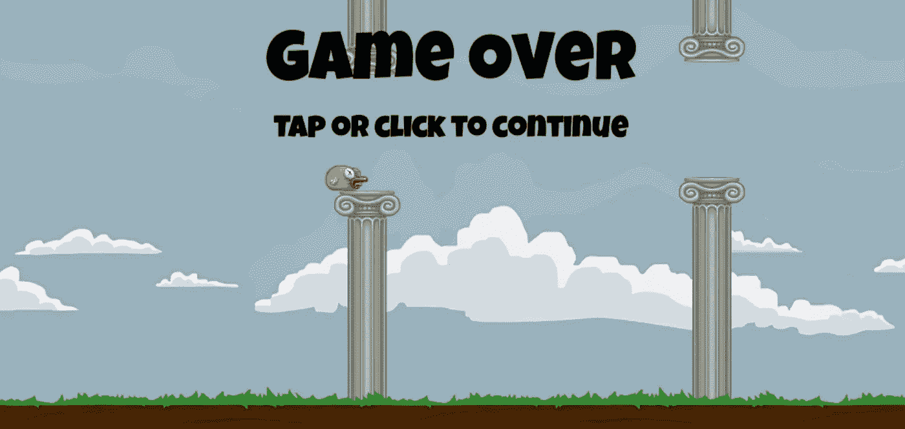

注意:它也有一个 CDN，一个自定义域，在等待一些进度条的时候我有时间抓了一片披萨！我是这样做的。

先看[结果](http://unitywebgl.com/)。(暂时还不支持移动，抱歉！)

我用了两个很棒的技术来完成这个——T2 的 Unity3d 和 T4 的亚马逊网络服务。

*10/14/17:在我们开始之前，有一个小提示……我最近推出了一个名为*[*smelle . io*](https://simmer.io)*的网站，它让在网络上获得游戏的过程比使用 AWS 简单得多。看看吧！*

[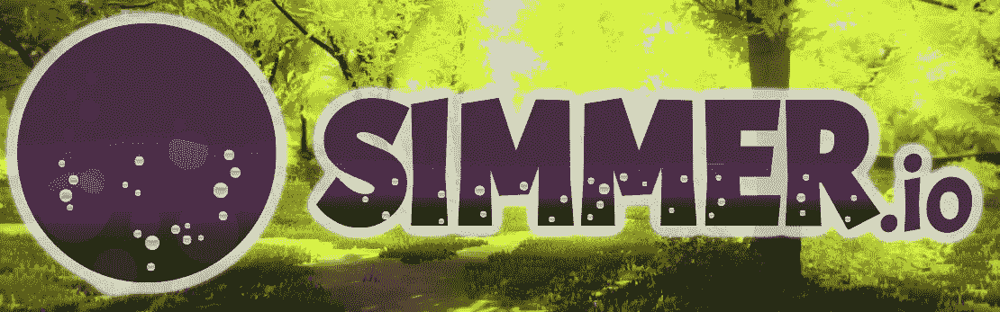](https://simmer.io)

开始吧:我启动了我的 Unity 副本，并创建了一个新的 2D 项目

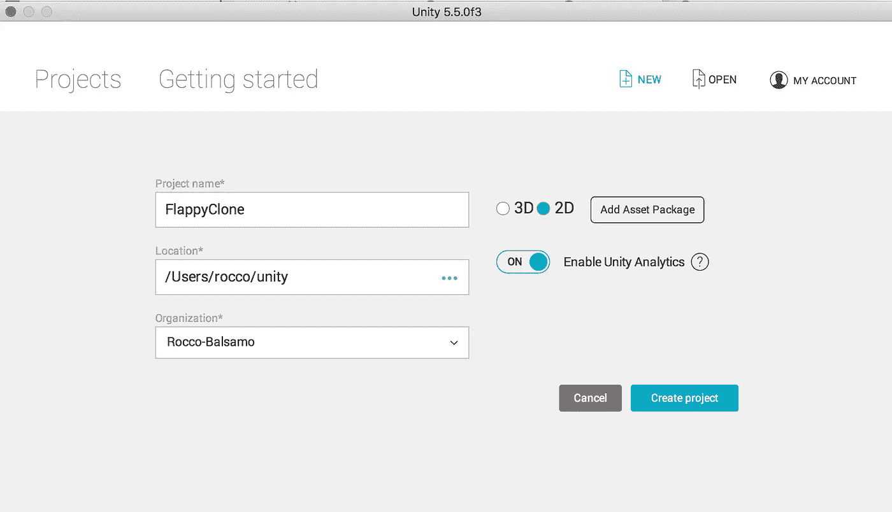

然后我在 Unity 的[资产商店](https://www.assetstore.unity3d.com/en/#!/content/80330)上找到了 Flappy Bird 演示，并导入了它。

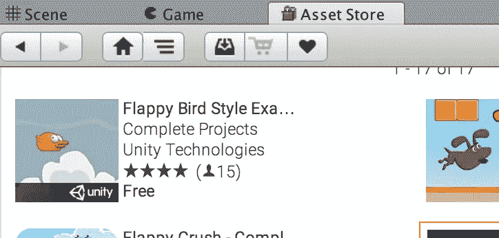

接下来，我打开了资产文件夹中的“主”场景

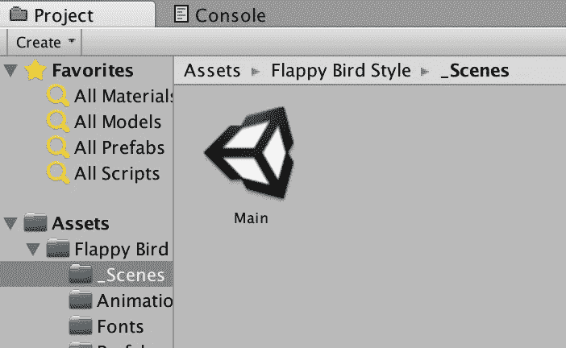

然后我从文件菜单中选择了“构建并运行”:

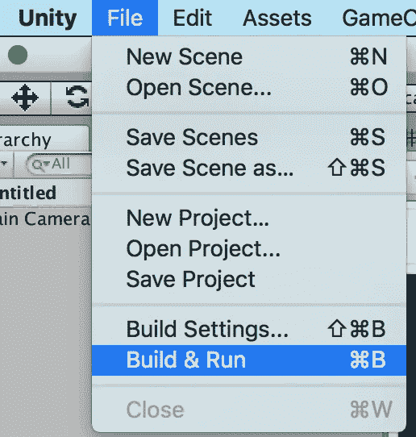

接下来，我选择“WebGL”作为目标平台，并开始构建:

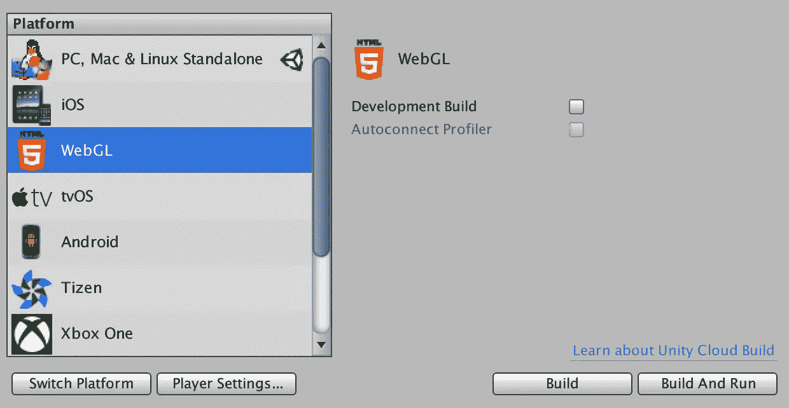

输入文件夹名后，我等了一会儿 Unity“将托管程序集转换成 c++”*…不管那是什么意思*

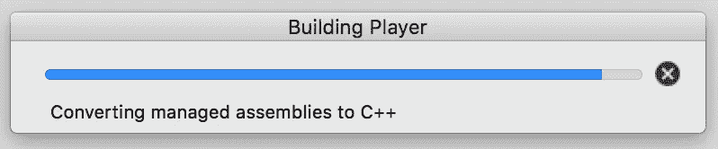

与此同时，我启动了我的 AWS(亚马逊网络服务)账户，选择了“托管一个静态网站”。

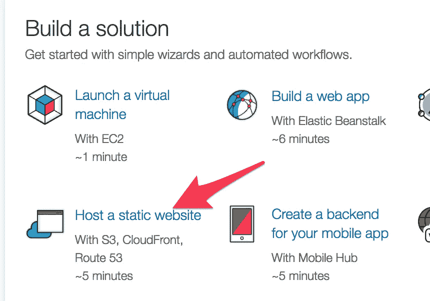

As a side note AWS, has gotten WAY friendlier in the past year. Great Job [@awscloud](https://twitter.com/awscloud)!

…我创建了一个新网站:

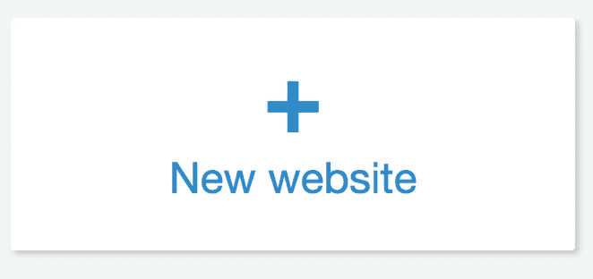

好吧！Unity 已完成将管理的千兆瓦电容器转换为 C++。而且，它们一定是很棒的电容器，因为现在我有 flappy 在本地服务器上运行！

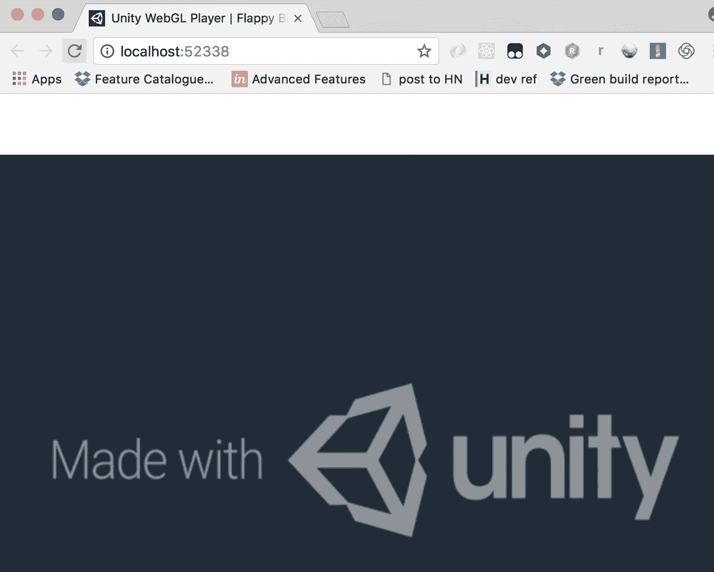

我打开了之前在 Unity 中选择的构建文件夹，并根据自己的喜好调整了 HTML 输出。

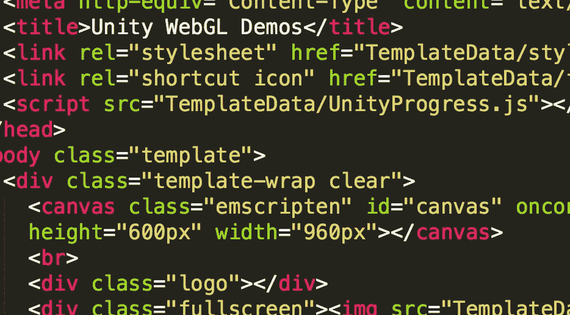

然后我将文件夹中的内容压缩到。zip 并将其放入 AWS。

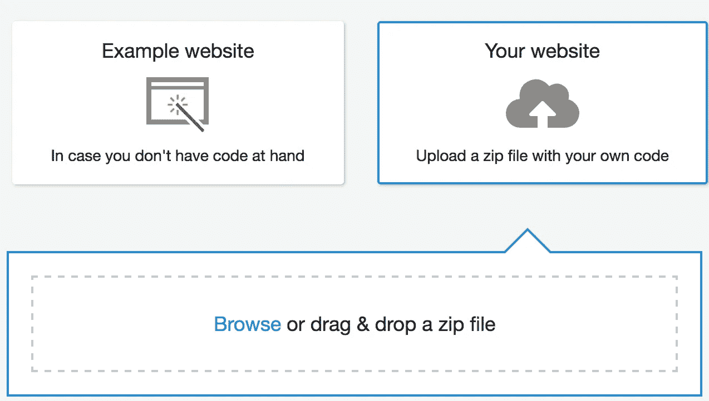

回到 AWS，我点击了“先睹为快”

然后 dayyyyum 网上就有了！

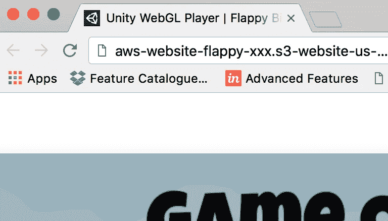

到目前为止花费的时间…15 分钟。但我真的不太喜欢疯狂的 aws-website-flappy-xyz-yada-yada-website-us.amazonaws.com 地址，所以我买了一个域名(12 美元)，就在亚马逊界面上:

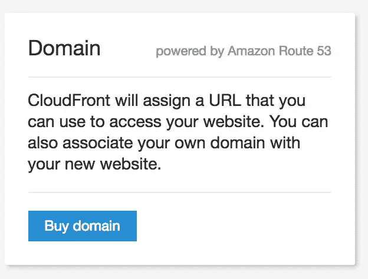

我填写了一些表格，以低于我晚餐的价格获得了域名。

仅此而已。我不得不等待 20 分钟来传播 Amazon Cloudfront 和域名。所以我开始吃有我最喜欢的配料的披萨:

我回来后**很快失去了**在 flappy bird 在我的新网站:[**http://unitywebgl.com/**](http://unitywebgl.com/)。我得把它交给 AWS 和 Unity。他们让互联网变得比拍打翅膀更容易。

您有兴趣了解更多关于 Unity web GL 的信息吗？我现在提供一个关于 Udemy 的四小时 60+讲座课程。 [WebGL with Unity 终极指南](https://www.udemy.com/webgl-with-unity-the-ultimate-guide-to-games-in-the-browser/?couponCode=MEDIUM11)以超过 90%的价格向我的媒体读者提供。就点这一段的链接！

第 2 部分现在可用:[安全 Flappy Bird。10 分钟后 HTTPS](/@theroccob/secure-flappy-bird-https-just-got-insanely-easy-on-aws-6fe1d41ed12f)。

> [黑客中午](http://bit.ly/Hackernoon)是黑客如何开始他们的下午。我们是阿妹家庭的一员。我们现在[接受投稿](http://bit.ly/hackernoonsubmission)并乐意[讨论广告&赞助](mailto:partners@amipublications.com)的机会。
> 
> 如果你喜欢这个故事，我们推荐你阅读我们的[最新科技故事](http://bit.ly/hackernoonlatestt)和[趋势科技故事](https://hackernoon.com/trending)。直到下一次，不要把世界的现实想当然！

