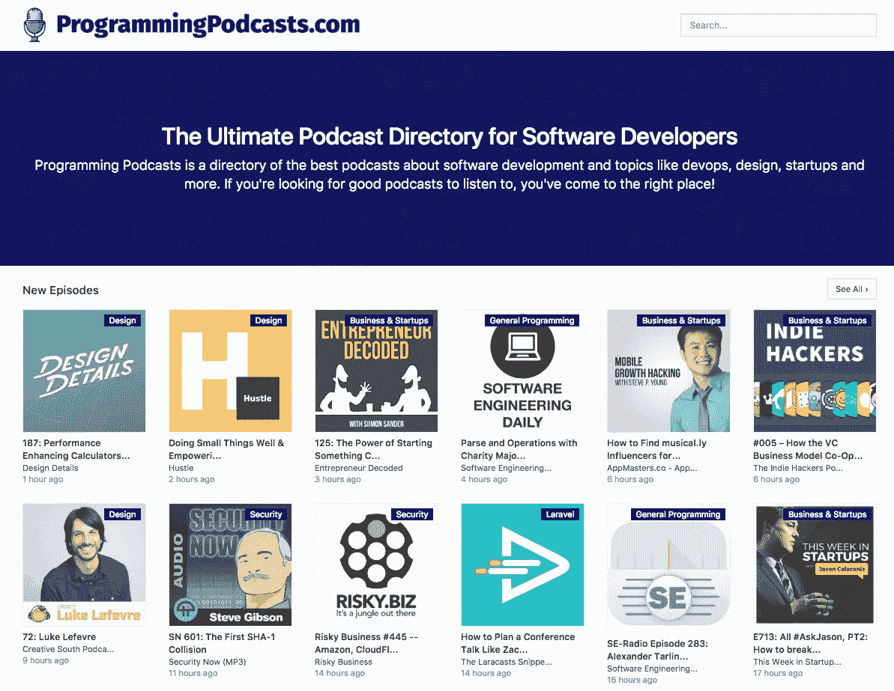
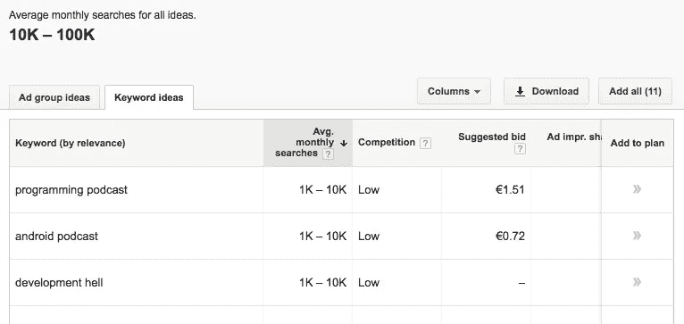
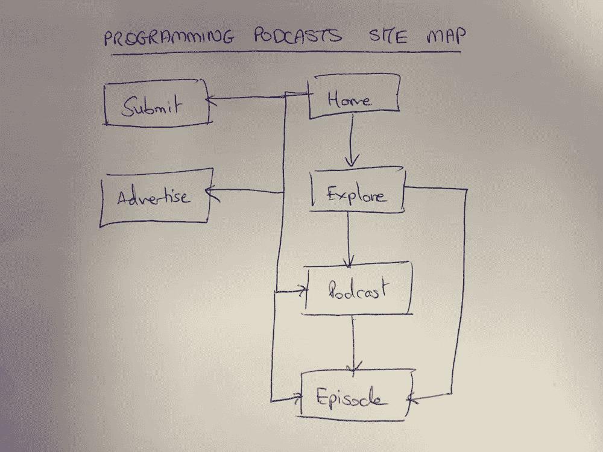
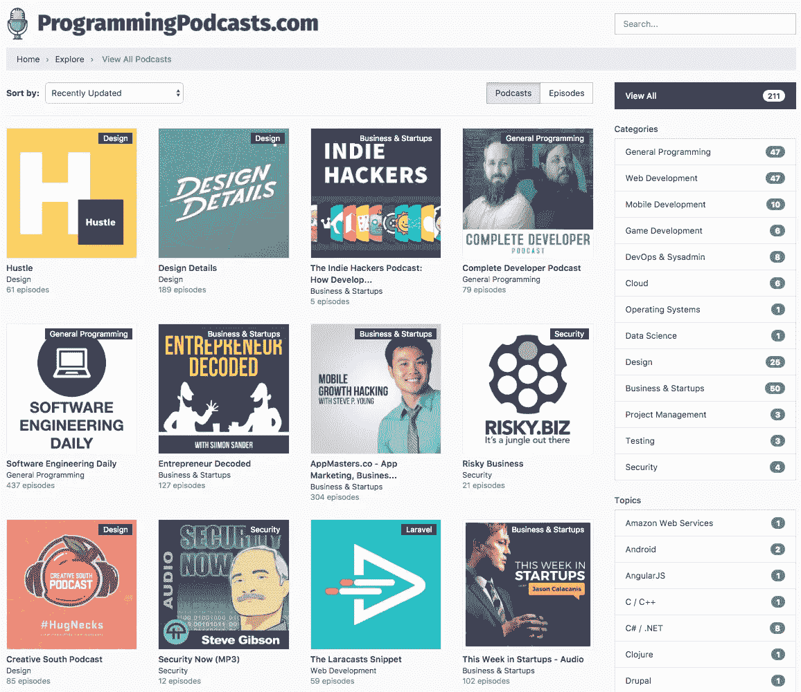
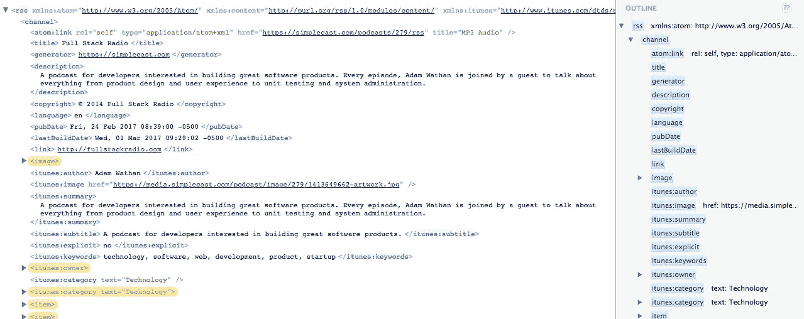
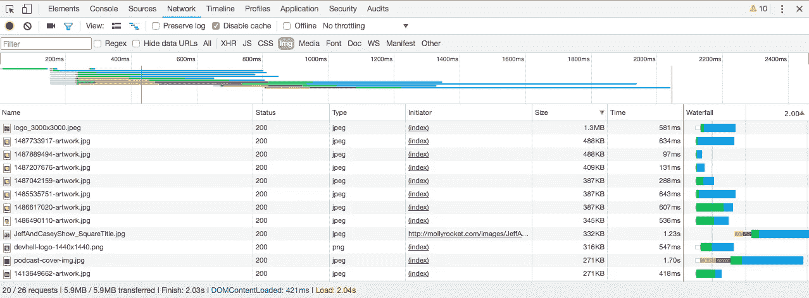
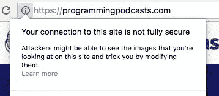
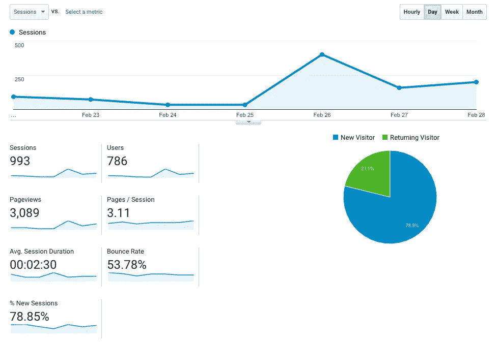

# 我如何建立编程播客

> 原文：<https://medium.com/hackernoon/how-i-built-programming-podcasts-8089a0800a38>

The end result in all its glory, Programming Podcasts

虽然我从播客出现的时候就已经知道它了，但只是在过去的六个月里，我才成为这种媒体的超级粉丝。这一切都是从 Laravel 播客开始的，这是我在与 T2 交谈后开始收听的一个节目，戈登·默里促使我去看看。我几乎立刻就被吸引住了，开始在每天上下班的车上听这几集，最终也在健身房听。

我很快遇到了一个相当大的问题——发现新的播客，尤其是在软件开发领域，是一件非常痛苦的事情。iTunes 的分类没有超越“技术”，当你在谷歌上搜索时，你会看到 BuzzFeed 风格的 *15 个顶级播客*、 *11 个我听的播客*和 *42 个面向开发者和程序员的播客*文章。这些都是很棒的列表，但是为了确定我是否真的会听任何播客，我现在不得不一个一个地浏览每个网站并查看一集。

我知道我可以通过建立一个[播客](https://hackernoon.com/tagged/podcast)目录来解决这个问题，这个目录展示了专注于软件开发和相关主题的播客，如开发运维、设计和创业。

# 决定我是否应该建造

我开始了很多项目，但完成的很少。通常这是因为在短时间内对这个概念感到厌倦。有时是因为我对主题不感兴趣，或者我没有解决我自己的问题。其他时候是因为过了一段时间后，很明显没有人真正想要我正在做的东西。

有了这个想法，我就知道它至少会有一个忠实的用户——我。但我想知道其他人是否会觉得它有用——这将决定我是否应该在它上面花上几个小时。我用 Google AdWords 的[关键词规划器](https://adwords.google.com/KeywordPlanner)来研究相关搜索词每月有多少次搜索。

Google AdWords Keyword Planner

这个话题平均每月有 1 万到 10 万次搜索，我觉得有足够多的观众来证明为自己以外的人做点什么是有道理的。

# 想出一个名字

因为这个网站是一个目录，而且因为我觉得获得流量的最好方法是通过有机搜索和 SEO，所以这个网站有一个描述性的名字是很重要的。没有虚构的品牌词或需要大量营销的东西——与人们搜索的内容高度相关的东西。

我下定决心要为这个网站注册一个. com 的名字，programmingpodcasts.com 能来纯粹是运气。鉴于该关键词在谷歌搜索结果中的强劲表现，以及它与网站内容的高度相关性，我决定购买它。

# 基本场地力学

我想让网站尽可能简单——目标是让找到播客和剧集变得容易，所以我决定从一开始就避免任何多余的内容。因此，网站的结构不会太深。我绘制了以下结构:

Site Map

在首页，网站会有一个最新剧集的列表，邮件列表的注册表单和网站上最受欢迎的播客列表。我希望该网站提供的一个关键好处是对播客进行可靠的分类——比 iTunes 提供的分类更精细。我决定定义两种分类法:

*   **类别**——这些是宽泛的领域，如*通用编程*、 *Web 开发*、 *DevOps* 和*设计*
*   **主题** —这些是具体的[编程](https://hackernoon.com/tagged/programming)语言、框架或产品，如 *JavaScript* 、 *Ruby* 、 *PHP* 、 *React* 、*亚马逊 Web 服务*和 *Laravel*

首页上有一个类别和主题的列表，深入查看这些列表将只显示所选分类中的播客或剧集。

“Explore”页面将根据用户的选择进行调整，以显示所有项目或特定类别、主题或搜索结果。它将允许根据日期、流行程度或字母顺序对结果进行排序。它还可以让用户在播客列表和剧集列表之间切换视图。

Exploring the directory

钻取播客会显示该播客的信息和剧集列表。钻取到一集将显示单个集的信息。无论在哪里向用户展示一集，他们都可以选择在浏览器中播放音频。在发布时，这只是一个简单的 HTML5 音频元素，使用本地浏览器控件进行播放，但我计划在未来做得更好。

# 堆栈

在过去的几年里，我已经用 [Laravel](https://laravel.com/) PHP 框架构建了几乎所有我参与的项目。当我第一次遇到 Laravel 时，我真的被它迷住了。我从大学开始就没有用过 PHP，对它没有太多美好的回忆。从那以后，我使用了所有的东西，从 Oracle 和 PL/SQL 到 ASP.NET MVC 和 C#，从 Node.js 和 Express 到 Ruby 和 Sinatra。自 PHP4 的黑暗时代以来，PHP 已经走过了漫长的道路，但 Laravel 是迄今为止我使用过的最令人印象深刻的 Web 框架。这是一个内置电池的框架，它提供了构建 Web 应用程序所需的几乎所有东西——但它仍然足够灵活，可以在您需要时为您让路。

在花了几年时间开发繁重的客户端 JavaScript 应用程序之后，最近几年我又重新爱上了根本不需要太多 JavaScript 的应用程序。不要误解我的意思，我坚信有时候使用 React、Vue 或 Angular 是合理的——但对于许多项目来说，它们完全是多余的。所以一开始，编写播客完全不需要 JavaScript。毕竟，这是一个内容网站，为什么我真的需要它？当我启动网站时，唯一的 JavaScript 代码是防止多个 HTML5 音频元素同时播放。

对于搜索，我想提供适当的全文搜索，没有蹩脚的 MySQL `LIKE '%:query%'`子句，会错过大量的相关结果。使用[拉勒维尔侦察兵](https://laravel.com/docs/5.4/scout)和[阿尔戈利亚](https://www.algolia.com/)，这总共花了五分钟。对于这样的项目来说，Algolia 有点贵，所以我可能需要考虑其他解决方案，但是几乎不需要设置和配置就可以启动并运行，这是我见过的最快的。

至于部署，我决定一开始就保持简单。使用 [Laravel Forge](https://forge.laravel.com/) ，我部署到一个单独的 Linode 盒子。如果该网站起飞，将数据库移动到它自己的机器上，实现负载平衡，并在需要时添加多个 Web 和队列工作服务器，这将是非常简单的。Forge 使整个部署过程变得轻而易举。它将为您提供一个 Linode box、DigitalOcean droplet 或 AWS EC2 实例，安装并配置相关软件，然后进行设置，以便您只需推送至 Git 存储库即可进行部署。它还使自动提供和更新 SSL 证书变得完全没有痛苦。

我还使用 S3 来存储播客和剧集图片，并使用 CloudFront CDN 来提供这些图片。更多关于为什么我需要这样做。

# 用提要填充数据库

这个项目最吸引我的一个方面是，鉴于播客分发的性质，应该有可能让整个网站自动运行。几乎每个播客都有一个 RSS 源，要在 iTunes 上列出来，需要在源中显示哪些数据有具体的指导方针——包括高分辨率的封面图像。RSS XML 解析起来很简单，我发现我看过的几乎每个播客都发布了一致可靠的提要。

RSS FTW

一旦我有了一个播客的提要 URL，我就可以从 XML 中获取我需要的所有内容。因此，标题、描述、主持人的名字以及每集的所有细节都可以很容易地从提要中提取出来并添加到数据库中。然后，计划的作业会定期检查新的剧集(和播客)，并自动将它们添加到数据库中。

在收集 RSS 提要 URL 之后，我需要做的唯一手工工作是:

*   获取播客的 iTunes URL
*   选择播客的类别和相关主题

我设定了 200 个播客的发布目标——这足以让目录感觉完整，但不会太高，手动添加 iTunes URLs 和类别会太费时间。我确实写了一个小脚本，它会转到 feed 的网站，寻找 iTunes 链接，如果找到了，就会呈现给我——但我仍然手动检查一切，以确保在发布前一切正常。

有了 200 个播客的目标，我开始填充目录。我之前提到的许多列表都派上了用场，我编写了一个脚本，可以在网上搜索播客，获取它们的 RSS 提要数据，然后查询这些数据中的相关关键字。这给了我一个播客的候选名单，我对它们进行了审查，看哪一个适合这个网站。我最终发布了 201 个订阅源。

# 困难

当我着手建立这个网站时，它看起来似乎非常简单。但很快，我就撞上了一个凸起。起初，我只是简单地热链接到 RSS 提要中包含的播客和剧集图像 URL，但当我开始专注于确保网站运行良好时，我注意到这导致了大量图像被下载。有些图像超过 3 兆字节，都符合 iTunes 的要求，即播客作品的最小尺寸为 1400x1400 像素。

Megabytes of images — no thank you!

图片的热链接也带来了第二个问题——HTTP URL 上图片的混合内容安全警告。因此，我认为下载每个播客和每集的图像，调整它们的大小(我选择了 500x500)，如果它们是 JPEGs 格式的，压缩到 60%的质量会更有意义。然后，我将修改后的图像上传到亚马逊 S3，并将亚马逊 CloudFront CDN 放在这个桶的前面，以优化向世界各地的访问者交付资产。

Hotlinking mixed content warnings — yikes!

由于该网站包含超过 15，000 集——该任务的第一次运行需要一段时间，但它大大减少了页面的加载时间，并解决了混合内容的警告问题，因此值得付出努力。

# 更好的音频聆听体验

该网站在推出时让我感到困扰的一个方面是，如果你使用简单的 HTML5 音频播放器来听一集，如果你离开页面，它就会停止播放，如果你再次播放它，它也不会记得你离开了哪里。所以我很早就决定用一个音频播放器来解决这个发布后的问题，这个播放器在整个网站上保持静态，不会在你浏览的时候被打断。

实际上，我之前已经为我的初创公司 [Subwoofr](https://subwoofr.com/) 的音乐艺术家网站解决了这个问题。当时，我使用 PJAX 库通过 XMLHttpRequest 加载内部链接，并替换文档中需要用新内容替换的部分。这基本上消除了在页面间导航时加载页面的需要，并允许音频在您浏览时继续播放。一个很好的好处是，该网站感觉更快，因为链接似乎可以立即加载，而没有通常发生的页面闪烁。

PJAX 库依赖于 jQuery，并且已经有一段时间没有更新了。它还要求您做一些黑客工作，以便在您从一个页面导航到另一个页面时更新页面标题。在过去从事 Ruby on Rails 项目时，我曾为了类似的目的使用过 [Turbolinks](https://github.com/turbolinks/turbolinks) 。我再次查看了 Turbolinks，发现它非常适合我想要实现的目标，并且不需要我加载 jQuery 或第三方库。

然后，我使用原生的 HTMLAudioElement API 构建了一个定制的音频播放器。我这样做有几个原因。首先，当使用浏览器的本地控件时，Turbolinks 会在页面加载之间暂停音频。第二，播放器的风格在不同的浏览器上有很大的不同。最后，我想让用户可以选择改变播放速度，因为我知道很多人喜欢以 1.5 倍的播放速度听播客。

这样做很好，但是有一个边缘情况，音频会在页面加载之间被切断——如果 Turbolinks 超时并进行硬页面加载。此外，我认为如果用户导航到另一个网站，稍后再回来，他们正在听的最后一集将从他们停止的地方继续，他们的回放速度和静音偏好保持不变，这将是很好的。为了实现这一点，我使用了 HTML5 localStorage。我听了几个音频事件，并更新 localStorage 以反映当前的播放时间、播放速率以及音量是否静音。当页面加载时，我检查 localStorage 中是否有数据，如果有，我将它恢复到播放器中，用户可以直接跳回到该集。

# 发动

我在 2017 年 3 月 22 日星期三下午 4 点启动了网站。我在《黑客新闻》上发布了一个 HN 的[秀](https://news.ycombinator.com/item?id=13706241),[在推特上发布了关于它的](https://twitter.com/joelennon/status/834427525937893376)，在几个[子栏目上发布了](https://www.reddit.com/r/SideProject/comments/5vjiy1/programmingpodcasts_a_curated_directory_of/)，并把它添加到了 [BetaPage](https://betapage.co/product/programming-podcasts) 。我从来没有在黑客新闻上发表过好的帖子，但这篇帖子的表现比我过去发表的任何帖子都更差。这非常令人失望，因为我原以为 HN 的观众会觉得它很有用。一周后，有人发布了一个[问 HN](https://news.ycombinator.com/item?id=13747563) 寻找每个人最喜欢的播客，这登上了头版。也许我的时机不对——我在 HN 投稿非常繁忙的时候发帖——我知道这是一个风险，但我觉得如果它得到了关注，那么大的流量是值得的。也许没人在乎。我想我永远都不会知道了！

在发布后的那个周日，我给 Adam Wathan 发了一封电子邮件，邀请他成为我即将推出的播客的首批嘉宾之一(这是我在未来几周内计划的事情)。我告诉他新网站的情况，并征求他的反馈。他很喜欢，转发了我的一条推文，这给网站带来了不错的流量，尤其是在周日！下周二，有人在[产品搜索](https://www.producthunt.com/posts/programmingpodcasts-com)上发布了这个网站，但直到第二天我才知道这是真的，而且它几乎没有注册。我在试图将图片添加到产品搜索列表时遇到了问题，大概他们是那天影响了大部分互联网的长期 [S3 中断](https://news.ycombinator.com/item?id=13755673)的受害者。

First Week Traffic Stats

总的来说，我对第一周的流量相当满意。786 个独立用户产生了 3000 多一点的页面浏览量。用户在网站上平均花费了 2.5 分钟，这还不错，但我希望固定音频播放器(今天部署，在最初推出一周后)将导致这一特定统计数据的上升。正如你所看到的，大部分流量都是在亚当的帖子发布后出现的，尽管第二天流量显著下降，但很高兴看到第二天流量又上升了。

# 下一步是什么？

我希望随着时间的推移，该网站将开始在谷歌的相关关键词的结果中排名良好，这将为该网站带来可观的有机流量。关于如何进一步推进这个项目，我还有一些其他想法:

*   网站上的一个新博客，展示播客并提供托管播客的技巧
*   我自己的播客，采访了网站上的播客主持人
*   用户注册-登录的用户将能够设置他们喜欢的类别和主题，以根据他们的兴趣定制网站，对播客和剧集进行投票和评论，将播客和剧集添加到他们的收藏中，为他们的收藏获取自定义 RSS 源，将多个剧集排队以供播放，并在他们喜欢的播客中发布新剧集时订阅电子邮件更新
*   自动下载和处理音频文件，以生成抄本和波形数据，并执行进一步的分析，扩展搜索能力等
*   iOS/Android 上的原生移动应用，Mac/Linux/Windows 上的原生桌面应用
*   为其他垂直行业(设计、创业、商业、其他)添加姐妹网站

我很乐意听到你对上述想法的想法，如果你有任何你想在网站上看到的功能，我将非常感谢任何建议。

我是否会做所有这些将取决于项目的成功。我还没有考虑太多的商业化，显然有可能在网站、邮件列表和播客上投放广告或赞助，但我会推迟追求这一点，直到网站有更多的观众。我对可以提供收入流的相关产品有一些粗略的想法，但我现在会把这些放在胸前。

# 最后

总的来说，这是一个很棒的项目，我很高兴我做到了。到目前为止，我所接触到的人的反应几乎都是积极的。更不用说我现在每天早晚都有源源不断的播客可以听！

在网站上线一个月后，我会发布一篇后续文章——看看第一周和第一个月的进展有什么不同会很有趣，希望是积极的进展！

*最初发表于*[*【joelennon.com】*](https://joelennon.com/how-i-built-programming-podcasts)*。*

