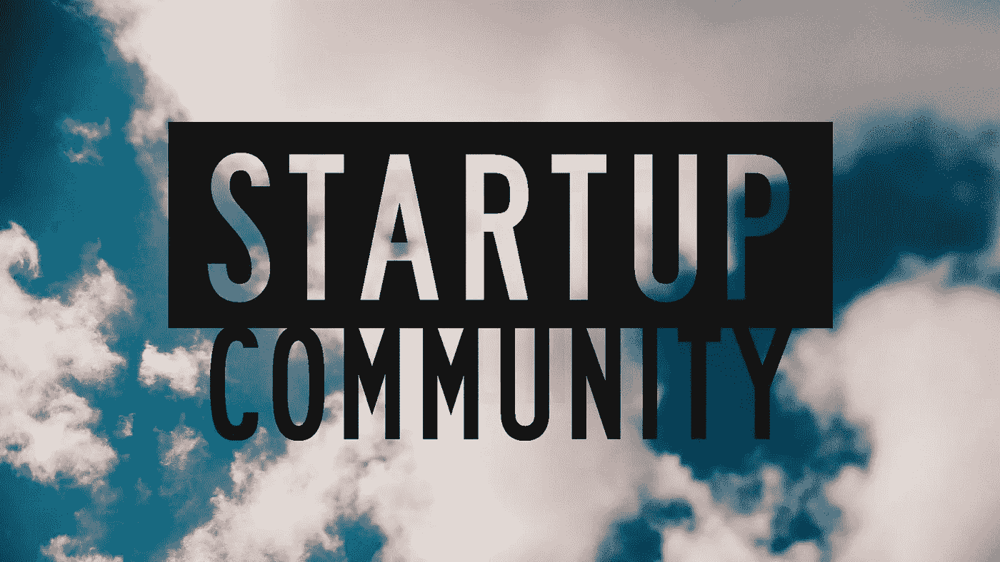
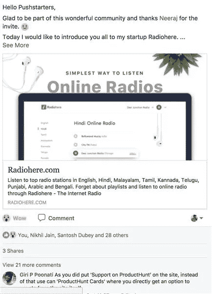
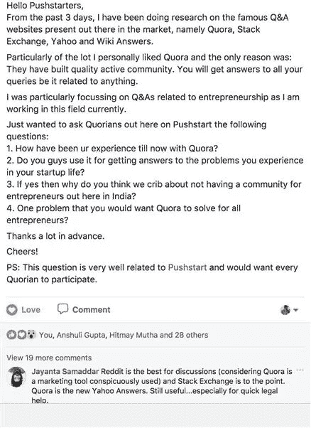

# 我如何建立 Pushstart，印度最活跃的创业社区之一

> 原文：<https://medium.com/hackernoon/how-i-built-the-most-active-startup-community-of-india-dfd83e8fe687>

## [推送开始](https://www.pushstart.in/)面试 01:

## 我的建造之旅从零到一

Credits: [http://www.asianentrepreneur.org/](http://www.asianentrepreneur.org/)

每当我们谈论[初创企业](https://hackernoon.com/tagged/startup)社区时，我们都会把它们描绘成这样:

Credits: To the many startup communities out there :P

当你加入的每一个其他创业社区都是一个市场，人们在那里兜售他们自己，他们的产品，活动，事件，他们的百万美元想法，还有什么比这更好的呢？(订婚最让我吃惊。)

他们甚至可以被称为社区吗？这是我浏览这类社区时，脑海里弹出的第一个问题。</figcaption></figure><blockquote class=)

[我从未停止从我的社区成员那里获取反馈。这是一个永恒的过程。"](https://medium.com/u/c4ec9163657c#Idealaunch)</figcaption></figure><blockquote class=)

[从那以后，Pushstart 就演变成了现在的样子。五个月前的今天，Pushstart 作为一个*想法验证平台*成立，现在它已经变成了一个*企业家家庭，他们* *分享他们的* *创业想法，启动他们的创业，讨论他们的创业问题，以提出可持续的解决方案。*](https://medium.com/u/c4ec9163657c#Idealaunch)</figcaption></figure><blockquote class=)

> [“在一个社区发展的过程中，你不能真正限制它。让它根据市场需求进化。记得在这个过程中保持你的视野完整。”](https://medium.com/u/c4ec9163657c#Idealaunch)</figcaption></figure><blockquote class=)

## [浏览下面的截图，看看我们如何滚动:](https://medium.com/u/c4ec9163657c#Idealaunch)</figcaption></figure><blockquote class=)

## [这是我们启动的方式:](https://medium.com/u/c4ec9163657c#Idealaunch)</figcaption></figure><blockquote class=)

</figcaption></figure><blockquote class=)

[Startup launch on](https://medium.com/u/c4ec9163657c#Idealaunch)</figcaption></figure><blockquote class=) [Pushstart](https://www.pushstart.in/) (#Startuplaunch)

## 这就是我们提问的方式:

Ask Us Anything sessions on [Pushstart](https://www.pushstart.in/) (#AUA)

做了太多的炫耀；现在让我们谈谈增长。

在过去的 5 个月里，我们的发展速度非常缓慢。(这是在脸书的众多福利之一。开玩笑！).但没错，增长并不是首要关注点。

不过，我可以自豪地说，增长都是有机的。

## 以下数据显示了我们对敬业度的痴迷:

Engagement data of [Pushstart](https://www.pushstart.in/)

> “在建立社区的早期阶段，注重参与，建立强大的基础，然后发展壮大。”

**以下几点将帮助你建立一个可持续发展的社区:**

1.  你应该清楚*为什么要建，为谁建*？
2.  应该是独一无二的，解决一个问题。如果不解决核心问题，这个社区就不会在印度蓬勃发展。我们太忙太年轻，没有时间讨论最新的技术/事件/创业。(我已经尝试了多种形式，但不幸的是，它不起作用。我们不是福音派。)
3.  首先，如果你有观众，这就相对容易了。 [*产品猎奇*](https://www.producthunt.com/)*[*所以*](https://stackoverflow.com/) *和*[*Quora*](https://www.quora.com/)*创始人*在创业之初就有一大批粉丝和人脉。*
4.  *将你的朋友作为社区的初始成员。如果你的朋友退出；走出去，和相关的人交谈，结交新朋友。*
5.  *对文化要清楚，沟通好。从一开始就保持邀请制，这样文化才能渗透得更好。*
6.  *把体验放在你优先考虑的事情的首位。很多时候你不得不多走一步，但这是值得的。如果你能达到他/她的期望，他/她会到处谈论你，我可以看到你有机地成长。(直到今天，我还在拼命工作，以满足人们的期望。)*
7.  *一个社区是民有、民治、民享的。你不能成为独裁者，还指望他们追随你。请记住，这不是一个政治事件，群众有选择的权利。(《我们不是我》)*
8.  *让他们觉得自己是独一无二的一部分。(我们在 Pushstart 的入口处进行了严格的质量检查。)*
9.  *倾听他们，给他们权力，让他们参与决策。(我收集与社区相关的所有反馈。)*
10.  *让外面的世界保持有趣。(我每周都会发起一个新的计划。)*
11.  *最后，社区是关于人际关系、人际关系和信任的。(我通过定期与同事互动、尽可能打电话和见面，与他们建立了信任。线下会面有助于加速建立信任的过程。)*

## ***6。你未来的目标是什么，你打算如何实现它们？***

*通过 [Pushstart](https://www.pushstart.in/) *我想通过让* *知识和拥有这些知识的人能够被数百万像我一样的年轻创业者所获取，来缩小目前存在于创业生态系统中的知识鸿沟。**

*建立一个可持续发展的创业社区，让真正的创业问题由最相关的人来解决，并建立一种文化，让人们互相帮助和尊重彼此的观点，不管他们的个人资料和资历如何，这是我实现使命的第一步。*

**这次采访标志着我下一步的开始，那就是创造一个媒介，通过这个媒介，成功企业家的重要的可操作的见解、学习和知识可以被转移给那些开始创业的人*。*

*这也将把 [Pushstart](https://www.pushstart.in/) 推向更多的观众，间接推动我们的增长。*

*在接下来的几个月里，我将采访一些创业者，他们白手起家，几乎没有技术专长，追随自己的热情，建立了成功的可持续技术企业。*

> *主要重点将是提供可操作的见解，而不是讲故事和产品营销。此外，受访者还可以接触到 Pushstarters，以便将来进行知识传授。*

*一个主要的重点也将是使 Pushstart 在收入方面可持续发展。我将探索和尝试各种选择来实现这一目标。在我追求可持续发展的过程中，正确的合作和伙伴关系将发挥重要作用。*

## *7。到目前为止，你面临的最大挑战是什么？你是如何应对的？*

*到目前为止，我面临的最大挑战是在印度建立并渗透这种新的文化，在这种文化中，人们互相帮助，不管他们的背景和资历如何。*

> *“我们印度人不会真的把宝贵的时间投资在某样东西上，直到我们从中寻求直接的金钱利益。”*

***以下事情帮助我建立并维护了 Pushstart 的文化:***

1.  *我很清楚 Pushstart 的文化高于一切；连我都不能破坏它。*
2.  *我确保它是清晰、准确和沟通良好的。每次谈话都有它的精髓。*
3.  *我通过让最初的成员相信它的重要性，让他们明白了这一点。(我曾经多次 ping 人们，以评论和分享他们的专业知识。)*
4.  *一旦我有了足够多的信徒，这种文化就自己渗透进去了。*
5.  *从那以后，我一直保持着这种文化，因为它随着每一个新的加入而变得有点扭曲。*

*此外，很难找到相信我和我的愿景的合适的联合创始人。在过去的五个月里，我和超过五个不同的人一起工作过，但是事情并没有真正解决。*

> *“当你独自工作时，很难保持动力。但当我看到我周围数百名 Pushstarters 追随他们的热情和忙碌时，这提醒我，我在这个旅程中并不孤独，我有一个 6k 成员，一个强大的家庭。”*

## *8.你对初出茅庐的人有什么建议？*

> *“不要仅仅为了创业和筹集资金而创业；你最终会失败。如果你真的热衷于解决问题，就开始吧。”*

*在我开始 Pushstart 之前，我有过一些想法，但都失败了。动机只是启动一家创业公司，因为每个人都在创业。*

> *我失败了，不是因为我的想法不好，而是因为我没有足够的动力坚持不懈地去实现它们。*

*有了 Pushstart，我真的很想解决一个问题。我以前每天都在想这件事。这让我很困扰，所以我最终决定建立一个解决方案。*

> *“有清晰的愿景，相信自己，努力；很辛苦。”*

*努力工作是无可替代的。我非常努力地打造了 [Pushstart](https://www.pushstart.in/) ，我每天都在努力让它变得更大。*

## *非常感谢你的阅读！如果你喜欢，请鼓掌支持👏🏻还有分享帖子。请随意发表评论💬下面。*

## *想成为印度最活跃的创业社区的一员吗？*

**在* [***上发送请求 Pushstart***](https://www.pushstart.in/join-network-community) *成为我们不断壮大的大家庭的一员。**

**嘿！Neeraj 这里，* [***的创始人，Pushstart***](http://pushstart.in/feed) *，印度最活跃的企业家群体。我每周都会发布对成功企业家的采访。**[***脸书***](https://www.facebook.com/jneeraj0807)***|***[***Linkedin***](https://www.linkedin.com/in/jneeraj0807)***| neeraj . Joshi @ pushstart . in |***[***Twitter***](https://twitter.com/jneeraj0807)**

## **还有，如果你想获得面试机会，你可以随时联系我[**Linkedin**](https://www.linkedin.com/in/jneeraj0807)**|**[**脸书**](https://www.facebook.com/jneeraj0807) **|** [**邮件**](http://neeraj.joshi@pushstart.in) **|** [推特](https://twitter.com/jneeraj0807)。**

## **感谢[阿舒托什·斯里瓦斯塔瓦](https://medium.com/u/abeb9313f837?source=post_page-----dfd83e8fe687--------------------------------)、[穆亚·Bvs](https://www.facebook.com/bmourya)、[尼希尔·贾因](https://medium.com/u/e874c13596aa?source=post_page-----dfd83e8fe687--------------------------------)、[谢利·帕塔克](https://medium.com/u/f87e10c81957?source=post_page-----dfd83e8fe687--------------------------------)、[杰特·帕雷克](https://medium.com/u/9ecec0adf1b0?source=post_page-----dfd83e8fe687--------------------------------)、[乌尔米尔·沙阿](https://www.facebook.com/profile.php?id=100008506866151)、[沙尚克·谢哈尔](https://medium.com/u/5a0bc33a9802?source=post_page-----dfd83e8fe687--------------------------------)、[阿努帕姆·沙阿](https://medium.com/u/91b8d1e1a6d8?source=post_page-----dfd83e8fe687--------------------------------)、[艾提杰雅·萨尔卡尔](https://medium.com/u/d0ebbfcf0848?source=post_page-----dfd83e8fe687--------------------------------)、[瓦伊巴](https://medium.com/u/1f63f5389415?source=post_page-----dfd83e8fe687--------------------------------) [安舒曼·毗湿奴](https://medium.com/u/bf1922c918e5?source=post_page-----dfd83e8fe687--------------------------------)、[桑杰·耶夫](https://www.facebook.com/profile.php?id=100009297920009)、[阿尔温德·纳拉亚南](https://www.facebook.com/arvind.narayanan.9)、[瓦鲁恩](https://medium.com/u/71cf7086e594?source=post_page-----dfd83e8fe687--------------------------------)、[维韦克·桑谢蒂](https://medium.com/u/1c7fdbe184b2?source=post_page-----dfd83e8fe687--------------------------------)、[古塔姆·库马尔](https://www.facebook.com/goutham1494)、[拉维·卡迪](https://www.facebook.com/abhishek.kaddy)、[萨加尔·瓜拉尼](https://medium.com/u/e44c140dba8e?source=post_page-----dfd83e8fe687--------------------------------)、[安基塔·班达里](https://medium.com/u/5428be0d69e9?source=post_page-----dfd83e8fe687--------------------------------)、[卡尔](https://medium.com/u/cd71ab497edd?source=post_page-----dfd83e8fe687--------------------------------)**

## **我还要感谢瑞安·胡佛、T2、考特兰·艾伦、T4、埃里克·里斯、尼尔·埃亚尔和乔尔·斯波尔斯基，他们激励了所有像我一样的年轻企业家。**

## **特别感谢 [Namit Hans](https://medium.com/u/4a84ae58a3d0?source=post_page-----dfd83e8fe687--------------------------------) 、 [Anjali Arora](https://medium.com/u/7a4170dee4a6?source=post_page-----dfd83e8fe687--------------------------------) 、 [Ashutosh Srivastava](https://medium.com/u/abeb9313f837?source=post_page-----dfd83e8fe687--------------------------------) 、 [Manikaa Upadhyay](https://www.facebook.com/profile.php?id=100008935356230) 和 [Anish Agarwal](https://www.facebook.com/anish.agarwal.35) 帮助我顺利完成这篇博客。**