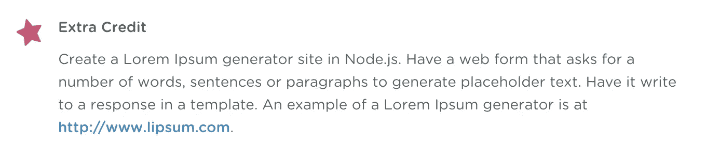
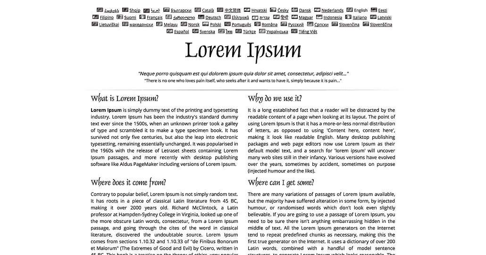
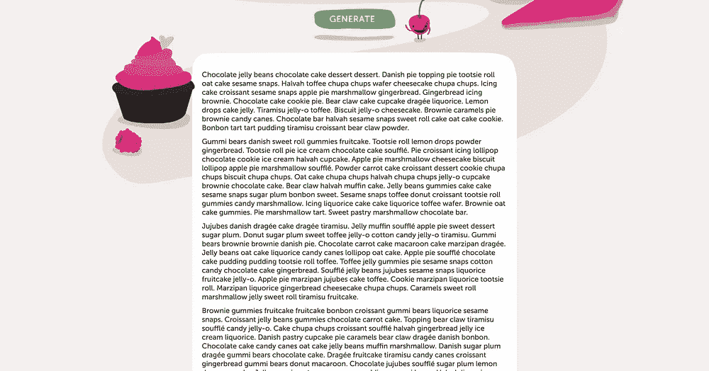
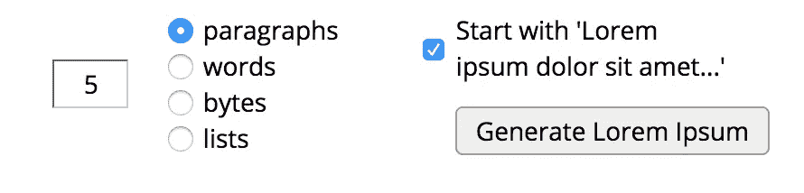
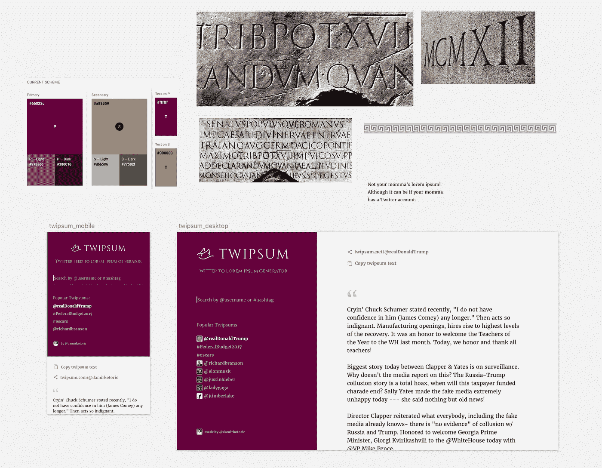
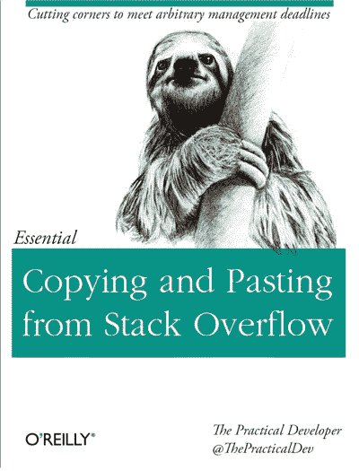
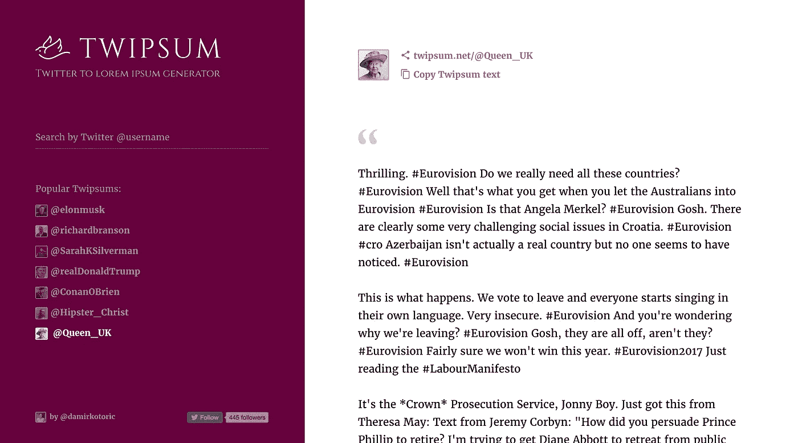

# 从构思到发布只需两周时间

> 原文：<https://medium.com/hackernoon/how-i-built-twipsum-in-two-weeks-9cdbcf996443>

我决定使用神奇的[teamtreehouse.com 来学习全栈开发。](https://teamtreehouse.com/)我不仅想设计，还想完全构建自己的网络应用。

作为课程的一部分，有以下奖励任务:

嗯， [lorem ipsum](https://en.wikipedia.org/wiki/Lorem_ipsum) 发生器。我在代理公司工作的时候用过很多次。它是占位符文本，当你用错误的方式制作网站时使用——设计时没有内容。谢天谢地，我现在不怎么用 lorem ipsum 了。当我真的使用它的时候，我很欣赏简单的香草拉丁语的有趣替代品。

The classic [lipsum.com](http://lipsum.com/) along with some fun variants: [Gangsta Lipsum](http://lorizzle.nl/), [Cupcake Ipsum](http://www.cupcakeipsum.com/) and [Hipster Lipsum](https://hipsum.co/).

我不喜欢这些生成器的一点是，当你登陆页面时，它们不会给你内容。为了得到上面的截图，你首先要找到可以生成 lorem ipsum 的表单。

我不在乎所有这些设置。给我罗瑞姆·伊普斯姆！

对我的 lorem ipsum 网站的要求将是它只是工作。最重要的是，我不想把它局限于一个主题。我希望它是灵活的。为什么没有一个生成器，可以吐出 gangsta lipsum，cupcake lipsum，hipster lipsum，[Trump lipsum](http://twipsum.net/@realDonaldTrump)(1984 年风格的网站)，都在一个？

我最想要的是什么？听起来像我或我认识的人。

# 明确想法

如何制作一个灵活的 lorem ipsum 生成器，可以模仿名人和我的朋友？这会是某种人工智能产品吗？我可以从人们的社交媒体上抓取内容，扔给一些机器学习代码来生成文本？然后我突然想到…

> 为什么不直接使用人们的 Twitter feeds，而不使用任何花哨的 AI 机器学习呢？它很容易构建，所有好的内容都已经在 Twitter 上了。

我把这叫做什么？

> Twipsum！

完美。我有一个好主意，可行，而且我给它起了个名字。让我检查一下这是否已经存在。

# "[西普森做到了"](https://www.youtube.com/watch?v=ecM-qHYqKCQ)

当然啦！5 年前就已经有人想到了。😑

结果那家伙把它卖了，从那以后它就从网上消失了。我甚至再也找不到界面截图了。哦好吧。一个人的垃圾…

# 将想法转化为概念

这么简单的应用程序不应该有一个以上的屏幕。我把屏幕一分为二。一个用于输入，另一个用于输出。

草图提炼的想法，并设计一个标志。对于视觉风格，我想向 lorem ipsum 的拉丁词根致敬。一种罗马风格的字体是完美的。[鸽子图标来自名词项目](https://thenounproject.com/search/?q=bird&i=2259)。它补充了该应用程序的 Twitter-meets-Roman 风格。

Exploring the layout and visual direction in Sketch.

主导色是[提利昂紫](https://en.wikipedia.org/wiki/Tyrian_purple)，这在当时是一种时髦的颜色(现在仍然是！)lorem ipsum 听起来像是一个花哨的设计概念，所以我对它的结果很满意。

# 关键时刻

警告:前方是网络开发极客！

我花了一点时间来思考从哪里开始我的 Node.js 项目。我已经习惯了使用中间人来构建静态站点。我先构建了静态 HTML/CSS 前端。打开 localhost:3000，我就想“为什么我的网络浏览器没有显示出来？”

我建立了我的第一个网络服务器。当然，Node.js 可以做很多基础工作。但是，您必须完成所有的路由、获取、与 HTTP 调用交互等等。这让我对网络有了前所未有的了解。那时我也意识到为什么 [Express.js](https://expressjs.com/) 如此重要。没有它，您将做大量重复的手工工作。

[The repository on Github.](https://github.com/damirkotoric/twipsum)

建立网站花费了 95%的时间。大量的阅读、调试和大量的:

快进 [23 Git 稍后提交](https://github.com/damirkotoric/twipsum)，我已经发货 [Twipsum](http://twipsum.net/) 。Heroku 上托管的一个响应应用程序，它与 REST API 对话，在服务器上路由流量，并有希望让某人脸上露出微笑。当然，一个经验丰富的老手可以在一个周末完成这样的事情，但是你必须从某个地方开始。

现在，推广它将是另一篇博客文章，但是是学习快车。

The shipped Twipsum 🚀

[如果你想了解关于](https://twitter.com/damirkotoric) [Twipsum](http://twipsum.net/) 或我未来任何项目的更新，请在 Twitter 上关注我，并告诉我你对该应用的看法。

你是 Node.js 老手吗？想帮助一个新手进入这个领域吗？如果你能在这里对 Twipsum 做一个 5 分钟的代码回顾，我会很高兴:[https://github.com/damirkotoric/twipsum](https://github.com/damirkotoric/twipsum)

> [黑客中午](http://bit.ly/Hackernoon)是黑客如何开始他们的下午。我们是 [@AMI](http://bit.ly/atAMIatAMI) 家庭的一员。我们现在[接受投稿](http://bit.ly/hackernoonsubmission)，并乐意[讨论广告&赞助](mailto:partners@amipublications.com)机会。
> 
> 如果你喜欢这个故事，我们推荐你阅读我们的[最新科技故事](http://bit.ly/hackernoonlatestt)和[趋势科技故事](https://hackernoon.com/trending)。直到下一次，不要把世界的现实想当然！

