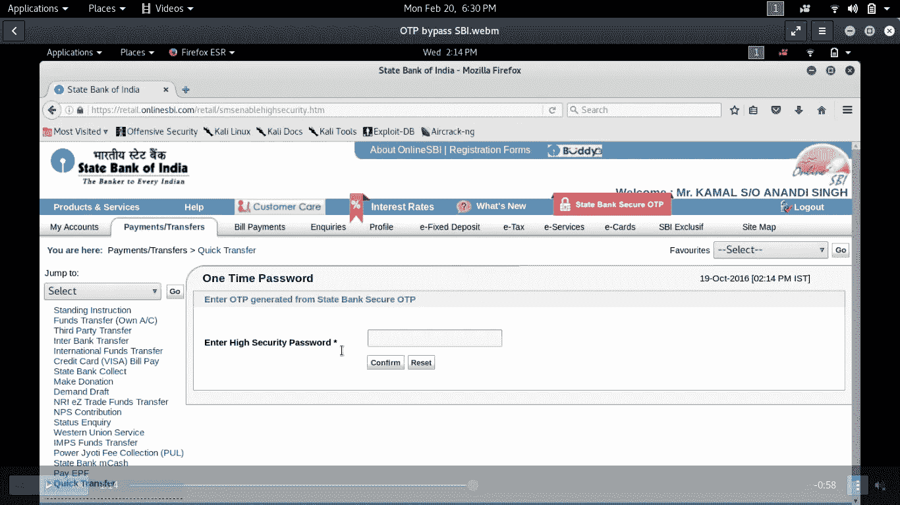
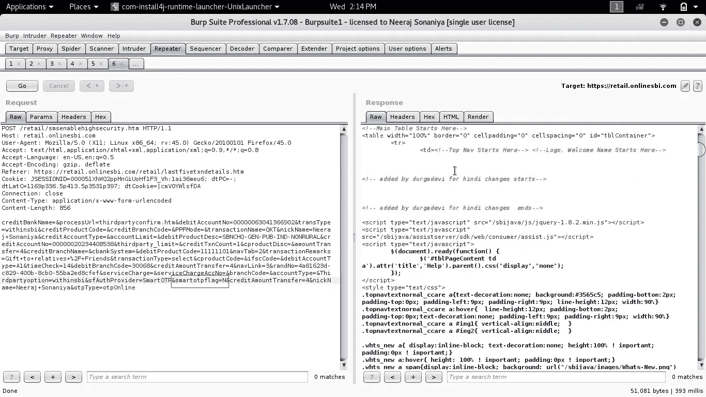
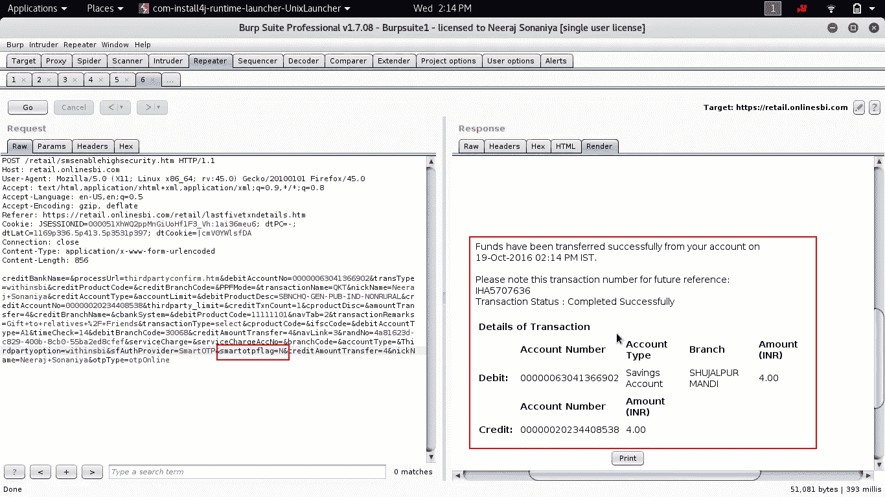

# 我是如何绕过印度国家银行 OTP 的？

> 原文：<https://medium.com/hackernoon/how-i-bypassed-state-bank-of-india-otp-f145469a9f1d>

现在，一天一次的口令(OTP)是大多数银行最流行的带外特征，用户通过它在银行开户时使用发送到在银行注册的移动设备的 OTP 进行交易并验证其身份。

但是如果我们能绕过 OTP 呢？是的，你想的没错，我在这里写的是我在一家银行的经历，我可以绕过 OTP，进行任何金额的交易。

印度最受欢迎的银行之一，印度国家银行(SBI)、

**开始了:**

当我们在最后阶段进行交易时，我们被发送到一次性密码屏幕。

OTP screen

大约 3 个月前，我在印度国家银行搜索 bug，在【https://retail.onlinesbi.com】花了 1 个小时后，我发现当我进行交易{在交易的最后阶段}时，在 POST 请求中有一个名为

**smartotpflag 设置为 Y，即 smartotpflag=Y**

smartotpflag=Y

最初它已经被设置为值 **Y**

这里我们很容易理解 smartotpflag 参数是用来生成 OTP 的，Y 代表是生成 OTP 并发送到我的手机上。

但是如果我们把这个 **Y** 改成 **N.** 呢

是的，我所做的就是把值从 Y 改为 N，结果令我震惊。

交易已成功完成，无需进入 OTP。

Finally Making smartotpflag=N and response.

# **注意:这个漏洞已经打了补丁。**

这是概念验证视频:

POC video

此视频显示了一笔金额较小的交易，但后来当我尝试进行 60，000 卢比的交易时，它成功了，没有进入 OTP。

甚至报纸都不支持我让整个印度知道这件事。

时间线:

2016 年 10 月 19 日

1.  立即搜索了 SBI 的安全部门，但没有找到与他们联系的人。
2.  我搜索了 SBI 主席的号码并联系了她，但她的助理拿走了电话，说这里没有安全团队，请联系其他地方。
3.  向一些朋友询问 SBI 安全团队的情况时，他们建议我去 CERT-India 团队(印度政府)报道。计算机应急小组)。
4.  通过邮件将所有关于漏洞的详细信息发送给 CERT-INDIA 团队，并直接发送给主席 SBI 邮件(可在互联网上找到)。
5.  即使在报告 1 个月后，漏洞仍未得到修补。
6.  再次联系 CERT-INDIA 团队了解状态，他们回答说，他们已经将此细节转发给 SBI，并将很快修复(取决于 SBI 何时修补此问题)。
7.  再次检查错误是否存在！(不存在，错误已在大约。1.5 个月的时间)。
8.  到目前为止，CERT-India 和 SBI 主席都没有回复关于 bug 的状态，既没有承认也没有奖励。

谢谢
问候
尼拉杰·爱德华兹

> [黑客中午](http://bit.ly/Hackernoon)是黑客如何开始他们的下午。我们是 [@AMI](http://bit.ly/atAMIatAMI) 家庭的一员。我们现在[接受投稿](http://bit.ly/hackernoonsubmission)，并乐意[讨论广告&赞助](mailto:partners@amipublications.com)机会。
> 
> 如果你喜欢这个故事，我们推荐你阅读我们的[最新科技故事](http://bit.ly/hackernoonlatestt)和[趋势科技故事](https://hackernoon.com/trending)。直到下一次，不要把世界的现实想当然！

