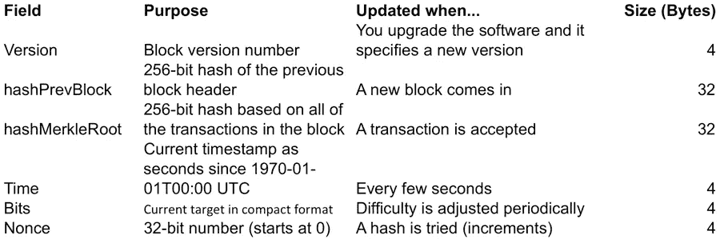
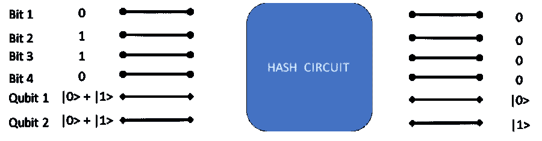
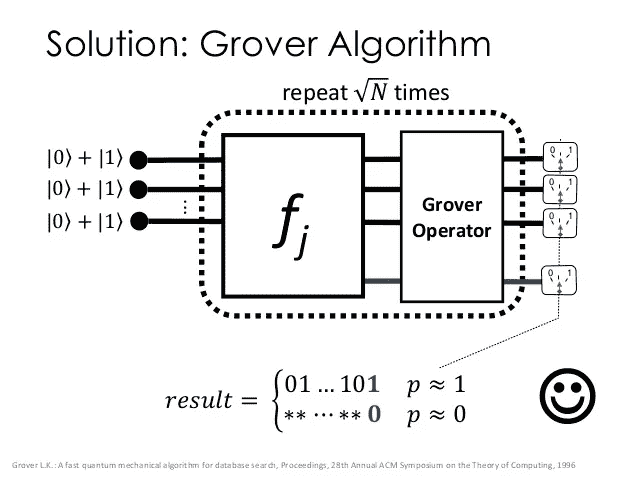

# 我是如何利用量子计算机垄断比特币挖矿市场的(理论上！)

> 原文：<https://medium.com/hackernoon/how-i-cornered-the-bitcoin-mining-market-using-a-quantum-computer-9e5dceba9f92>

每当我告诉我的朋友们量子计算的潜力，例如，量子计算机(QC)如何在平行世界中进行大量计算，他们都会看着我，好像我有点疯狂。

因此，与其抽象地谈论它，我决定向他们展示 QCs 可以有多激进。前几天我订购了一台，当我得到它时，我决定寻找一种可以展示这种新形式计算能力的应用程序。

我的一些朋友知道我是多年的比特币爱好者，甚至在它不流行的时候，我想到比特币挖矿可能是要解决的问题，以显示量子计算机的威力(并在我睡觉的时候赚点钱！)

正如你所料，能够解决比特币挖掘算法的量子计算机非常昂贵(这个特殊的品牌，QIntellize 量子计算机，至少价值 100 万美元)。由于挖掘一个比特币区块的奖励现在是 12.5 个比特币，每比特币 4000 美元，我应该可以在快速挖掘几个区块后还清！

所以我安排了一个 QC。让我的一台量子计算机做全世界数千台计算机目前正在做的挖掘比特币区块的工作并不容易；但是我终于想通了！

这篇文章旨在介绍比特币挖矿和 QC，讨论我以这种方式垄断比特币市场时遇到的一些困难。虽然我不会透露我所有的秘密(请注意，我宁愿保持我的垄断)，但如果你想复制我的实验，这里应该有足够的线索来指引你正确的方向！

## ***比特币挖矿工作原理:简要概述***

我不会深入比特币的所有细节(你可以对比特币进行简单的搜索，因为有成千上万的网站专门研究比特币)，或者比特币采矿(你可以在这里阅读更多信息:bitcoinmining.com)，但这是一个快速的总结。

比特币是一种去中心化的货币和分类账，其中有一个非常大的文件(称为区块链)，由块组成，每个块都有一个交易列表。区块链是总分类账，说明每枚比特币随着时间的推移发生了什么，去了哪里。由于多台计算机正在管理区块链，因此没有一台计算机负责正在发生的事情-系统建立在这些分布式计算机上，它们就区块链上应该有哪些块达成一致。

新的比特币是由比特币矿工创造的，他们实际上是试图向区块链添加区块的计算机。挖掘本身是一种调整难度的算法，因此平均每 10 分钟左右就可以添加一个新块。矿工电脑正在尝试一组随机数，看看它们是否“符合”新区块的当前标准。

添加一个小的随机数(4 个字节)作为块报头的一部分(基于提议的事务块生成)，并对生成的数字进行哈希运算(使用 SHA 256 算法两次)，最后生成一个随机数。如果随机数小于某个阈值，那么你已经成功地在区块链中生成了一个新的块，这个新的块被提出，然后被其他计算机验证。图 1 显示了这一过程的概况(来源:bitcoinmining.com)

Figure 1: How Bitcoin Mining Works (source: bitcoinmining.com)

所以何必呢？比特币挖矿有时被称为“彩票”，因为如果你成功生成区块，你会得到一些比特币作为回报。由于现在比特币的价格是每比特币几千美元，市值高达数十亿美元，这可能意义重大。

这有什么难的？因为到目前为止，作为使用安全密钥的当前密码术的基础的散列是单向操作。目前，如果不实际执行哈希算法，就不可能知道一组特定的位将哈希成什么，哈希算法需要多次循环移动位。

因此，目前最好的挖掘方式是不断尝试随机数，看看哪个随机数的难度小于目标难度。这就是为什么比特币矿池会突然出现，大量计算机并行工作，寻找问题的解决方案——如果其中一台计算机找到了解决方案，那么这个矿池就会获得奖励，并与所有其他矿工分享。

## ***量子计算如何工作:一个更简短的概述***

T 他的池并行工作的想法给了我使用量子计算机的想法。

虽然这听起来像科幻小说，但量子计算机是可行的，因为它考虑了量子物理学中存在平行世界的观点。我们每做一个决定，就分支到多个现实，或者按照一些物理学家的说法，有多个未来概率无时无刻不存在于我们身边。

这种由多个可能的现实组成的量子泡沫，可以被认为是一种量子概率波。量子物理学告诉我们，一个电子实际上是该电子*可能位于*的一组概率，或者一个光子可能是一种波或一种粒子。当我们观察一个粒子的位置或速度时，量子波据说会*坍缩*成一个特定的现实。

现在听起来更像东方神秘主义，而不是科幻小说，这是观察粒子的有意识行为，将概率波压缩成一个单一的，可测量的现实。

早在 20 世纪 80 年代，理查德·费曼就首次提出了量子计算机的想法，他说，如果我们能够创造出一种设备，能够利用这种概率波平行宇宙的想法来尝试特定变量的所有可能值，然后将其“折叠”成“正确”的答案。虽然花了几十年时间，但我们终于到了量子计算机变得可行的时候了。

量子计算机实际上使困难的问题(那些需要大量计算能力的问题)变得容易得多，因为你能够将处理能力分布在许多可能的现实中。

用计算机科学的术语来说，如果 x 是一个数，f(x)是 x 的一个函数，它产生一个输出 y，那么一台量子计算机可以在平行宇宙中尝试 x 的所有可能值，然后如果你进行正确的观察并以某种方式将不同宇宙的所有结果相加，你就可以计算出 x 的哪个值产生 y。

在常规的计算机科学中，也就是我在麻省理工学院学到的那种，所有的数据都被表示为由一系列位组成的数字。每一位要么是 0，要么是 1，要么是开，要么是关。通过收集位，我们可以用二进制表示任何数字(例如 b1011 是四位，表示数字 11。如果你有 x 位，你可以代表 2 的 x 次方。在大多数计算机中，32 位或 64 位是数字存储的标准

量子计算机与普通计算机的不同之处在于，除了普通比特，它们还能够使用*量子比特。*量子位是*量子*位，像量子粒子一样，可以有两种不同的状态。这意味着一个常规比特必须是 0 或 1，而一个量子比特可以是 0 或 1。你不知道，直到量子波根据有意识头脑的观察而崩溃。

如果您有一定数量的位，您可以通过遍历 0 和 1 的所有值来尝试所有可能的组合。例如，要尝试 0 到 512 之间的所有数字，需要 9 位。如果你写一个计算机程序来尝试这 9 位的每一个可能的值(每一位 0 和 1)，范围从 0=b000000000 到 1 = b000000001 到 511 = b11111111。

## ***如何使用 QC 进行比特币挖矿***

所以这就给我们带来了我是如何用量子计算机解决比特币挖矿问题的。

如果你有 9 个量子位，你可以同时尝试从 1 到 511 的所有值。如果你有 64 位，你可以尝试 x 的所有可能值的散列算法，以找出当输入到函数 f(x)时，哪些会导致 y 的结果，或者在比特币挖掘的情况下，小于某个目标值 y。

比特币算法依赖于图 1 所示的输入(来源:bitcoinmining.com)，如果您想到一个潜在的新交易块，您必须生成一个标头。数据块的报头由几个部分组成，包括一个随机的 32 位随机数。有关可能值的列表，请参见表 2。

确切的算法在这里描述:[https://en.bitcoin.it/wiki/Block_hashing_algorithm](https://en.bitcoin.it/wiki/Block_hashing_algorithm)。哈希的结果是一个 256 位的整数。

Figure 2: Table of Inputs for Bitcoin Hash

仔细观察会发现，在所有用作输入的字节中，只有 4 个字节，即随机数，或 32 位实际上是随机的。其他字节实际上来自事务块和时间戳等。输出是一个 256 位数，必须小于目标值。

然而，这很复杂，因为对于给定的事务块可能没有解决方案，所以您可能试图为没有解决方案的事务块找到一个随机数！

一个*量子位*是 8 个量子位。所以基本上，我需要的是给我的 QC 编程，使用 4 个*量子位*，或 32 个*量子位*，它们代表随机数、nonce 的所有可能值，并将这个值附加到一组 76 个常规字节，然后通过哈希算法运行它们。然后，我可以获得 256 位输出，并选择一个小于目标值的输出值。

## ***编程量子计算机电路***

没那么简单。今天，用我的量子计算机，我必须想出一个实际的电路来完成这个。在未来，将会有更简单的方法来为量子计算机编程——我设想一种简单的编程语言，让我们用 QBASIC 来编写量子 BASIC，它就像当年我用我的 Apple II 学习计算机编程时使用的 BASIC 语言。尽管首先我认为汇编语言需要由执行逻辑运算的基本电路组成，如 AND、NAND、OR、XOR 等。，然后有人可以编写，就像比尔·盖茨和保罗·艾伦在 1977 年为牛郎星计算机所做的那样，编写像 BASIC 这样的高级语言。

像这样的语言已经出现了 least，QCL，但是每一种语言在量子电路中都有不同的模型和结果，至少目前是这样。

我用的量子计算机没有很好的语言，只能自己搭建电路。图 3 显示了我如何对量子计算机编程的基本电路架构，但简化为 6 位。用更少的比特数就可以更容易地看出这一切是如何工作的。

前四位是“常规位”，后两位是量子位，它们处于 0 或 1 的叠加状态。在这种情况下，2 个量子位代表随机数，4 个常规位代表报头块的其余部分。

比特币(SHA-256)使用的实际哈希算法的实现留给读者作为练习。比特币挖掘中的想法是，哈希的输出必须小于 M，这是哈希的难度，在比特币网络中经常调整。

从二进制的角度来看，这意味着 n 位中的前 x 位(在我们的例子中，n = 6 位，在比特币的例子中，输出中的 n=256 位)必须为零，以使结果小于难度 m。对于每个难度级别，哈希输出前面的 0 的数量需要改变。

Figure 3: A simplified version of the Hash circuit

量子电路的困难之处不仅仅在于实际设计电路/程序，还在于找到一种方法来测量输出，从而给出“正确的”(或者在某些情况下，最优的)答案！

在量子计算机中，尽管量子位的所有可能值都在所有可能的世界中被处理，但当你不确切知道哪个输入值导致了你想要的输出值时，很难获得单个情况的输出。

当你观察输出比特时，量子概率波坍缩，你只看到一组可能的值。虽然量子计算机能够同时拥有*量子位*的所有可能值，但我们仍然需要遍历所有可能的输出值，以随机找到我们想要的值。

真正的问题是，你如何衡量所有可能的值来得到你想要的值？看起来我们仍然回到了第一步，因为我们必须一个接一个地循环所有可能的解决方案。

## ***从所有可能的世界中寻找最优解***

关键是找到某个函数 f2(x1，x2，x3..xn ),它总结了所有可能世界中的值。使用 f2 作为简单的加法，例如，如果 x1… xn 的值都是 0，那么您会观察到结果为 0。如果这些值都是 1，那么您将观察到 n (x1+x2+x3)的值。

关键是所谓的量子抖动。量子震动是一种产生波的方式，这样输出在量子宇宙/可能的现实中被调整，在那里正确的答案是存在的，不同于在其他宇宙中正确的答案是不存在的。它被称为量子震动，因为它调整了一个宇宙中的值。

通过进行一定次数的摇动，导致小于目标 t 的输出的随机数的输入值被隔离。我们只取这 4 个字节，将它们附加到作为输入的其他 76 个常规字节上，然后将事务提交给区块链。

另一种表示方法是使用 Grover 算法，这是一种众所周知的量子计算算法，可以缩短从许多可能的解决方案中找出一个所需的时间，如图 4 所示。在格罗弗算法的一个简单例子中，你可能有四个量子位作为输入，这将产生 2 的 4 次方，或者 16 个可能的值。

Figure 4: Using Grover’s Algorithm to Find the Optimal Solution

格罗弗的算法将此简化为 n 的平方根。因此，对于 16 个可能的量子位值，您必须通过 2 的 16 次方，即 65，536 个可能的输出值。这个的平方根是 256，差别很大。

*T 比特币挖矿哈希算法的输出产生 256 位输出(这就是为什么它被称为 SHA-256)这是一个非常大的数字。*

*虽然我不会详细介绍比特币挖掘，但最终的解决方案涉及一些常规计算(将交易组装到一个块中，计算提议块的 merkle 根，获得前一个块)，量子计算机对于“困难部分”是有用的，这是为了找到 nonce，如果存在的话，这将产生低于难度的输出。*

*使用电路组合进行位散列，然后使用 Grover 算法或量子摇动来减少解决方案的搜索时间，我能够通过搜索 256 个值来挖掘块——很容易！*

*正如我前面所说的，由于每开采一个区块有 12.5 个比特币的奖励，你可以算出这将使我很快变得非常富有！*

## ****好吧，我真的这么做了吗？****

*那些熟悉哈希算法和当今量子计算机状态的读者将意识到，我今天并没有真正做到这一点(我在 2016 年写了这篇文章的第一部分，现在比特币又回到了新闻中，我在 2017 年完成了它)。*

*一方面，你可以只看谁在开采这些区块，你会看到它们正在被矿池开采。另一方面，比特币挖掘算法使用 SHA256 算法，该算法可以占用非常大量的输入位，但总是输出 256 位。对于今天所有的量子计算机，输入和输出的比特数必须相同。精明的观察者会注意到，比特币算法实际上需要运行 SHA-256 两次，所以理论上你可以做我为第二个 SHA-256 提出的事情，如果你能设计一个量子电路来实现它的话。*

*此外，虽然现在有语言来帮助生成底层电路，但它们必须输入到量子计算机中。语言变得越来越好，尽管一些语言在传统硬件上模拟量子计算机，但量子计算的整个领域仍在不断变化，发展很快。*

*所以，事实是，我所“做”的全部是不可能的。*至少现在还没有。**

*虽然有一些算法可以被量子计算机用来破解公钥/私钥密码术(例如 Shor 的因子分解算法)，但计算机本身尚未实用化。然而，如果它们变得可行，今天的标准加密技术需要更新，新的算法需要发明。*

*如今 QC 的另一个问题是，由于用于叠加单个位的物理过程，误差可能会逐渐增加。虽然没有多少人知道这一点，但今天在计算机上一位有两个值而不是三个值的原因很简单，一个“0”由一个特定的电压范围表示，一个“1”由另一个电压范围表示。这些范围相距很远，误差很小。*

*量子位要复杂得多，物理实现也因每种量子控制而异。在处理量子计算机时，物理测量误差破坏您的结果的几率比普通计算机高得多。事实上，你需要多次运行该算法，以确保没有物理错误。*

*这篇文章本来是一个(理论上的)讨论，将介绍两个概念——比特币采矿和量子计算机——给那些在计算机程序员水平上没有接触过它们的人。这两个领域的专家毫无疑问会发现一些错误或遗漏，或者更多的原因，为什么这在今天是不可能的(至少现在还不可能！).*

*如果你认为这有可能实现，请随时发表评论。*