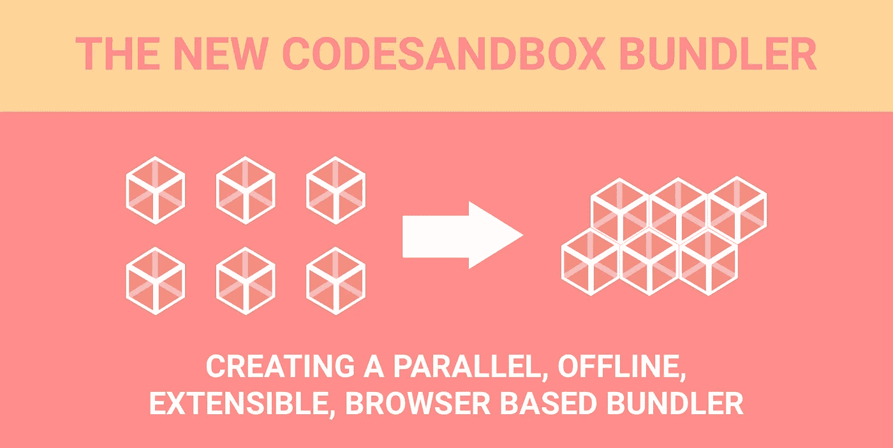

# 为 CodeSandbox 创建并行、离线、可扩展、基于浏览器的捆绑器

> 原文：<https://medium.com/hackernoon/how-i-created-a-parallel-offline-extensible-browser-based-bundler-886db508cc31>

当我第一次开始 CodeSandbox 时，我完全专注于 React 开发。起初我们甚至将其命名为 ReactSandbox，但我在最后一刻将其更改为 CodeSandbox，以便我们可以扩展到其他库。我很自豪地说，我们现在在这方面取得了成功！

过去一周，我们慢慢推出了对其他库的支持。我们现在支持 React、Vue 和 Preact 模板，并计划支持 Angular、ReasonML 和 Svelte(如果您有其他建议，请告诉我)。为了做到这一点，我不得不从头开始重写 bundler。在这篇博文中，我将主要解释新的 bundler 是如何建造的，以及我做出了哪些决定。

Vue

Preact

# 过去

我们使用的第一个捆绑器非常简单:对于每个请求的文件，我们首先传输它，评估它，然后缓存结果。当一个文件发生变化时，我们只需丢弃依赖于该文件的所有文件的缓存，然后重新开始。这适用于 Babel，但不适用于其他需要异步传输的加载程序，如 Sass。在旧系统中，为 Vue 等创建 transpilers 变得更加困难。很明显，如果我们想支持像 Vue 这样的库，我必须重新考虑捆绑过程，而且这也给了我改进捆绑器的机会。

## 浏览器中的 Webpack

我的第一个想法是让 Webpack 在浏览器中工作。几乎所有现有的 CLI 都已经使用了 Webpack，如果它已经与 Webpack 一起工作，那么添加新的加载程序就不需要任何工作。为下载功能导出到一个`webpack.config.js`也很容易，用户可以提供他们自己的配置。听起来很完美，对吧？对我来说也是！这听起来好得不像是真的，结果却是真的。

我让 Webpack 在浏览器中运行，但是包的大小是 3.5MB。由于动态需求，我不得不提供许多 polyfills，编译抛出了十几个警告。此外，只有一半的装载机工作。Webpack 假设了一个节点环境，事实证明模拟该环境的成本(在我看来)对于从中获得的优势来说太大了。我的第二个原因是 CodeSandbox 是一个非常特定的平台，如果我们自己构建 bundler，我们可以完全针对该平台进行优化。

## 浏览器中的 Webpack 加载器 API

我的第二个想法是写我自己的 bundler，但是用一个非常接近 Webpack 的 loader API。这样做的好处是 bundler“感觉”像 Webpack，但针对浏览器环境进行了优化。编写加载器将非常容易；我们可以只使用现有的 Webpack 加载器，去掉所有 SSR、节点和生产逻辑，它*应该*在 CodeSandbox 中工作。另一个**大**优势是我们假设了一个浏览器环境，所以我们可以滥用浏览器 API，比如 Web Workers、Service Workers 和代码分割！

# 履行

对于实际的实现，我试图做到两全其美:用 Webpack 关闭加载器 API surface，并对 CodeSandbox 进行全面优化。它应该比第一捆绑，离线工作速度更快，它应该是可扩展的。最终捆绑器区分三个阶段:配置、传输和评估。

## 配置

新的捆扎机是按照模板制造的。对于我们拥有的每个模板(目前为 React、Vue 和 Preact ),我们都定义了一个新的预设。这些预设包含的配置也可以在 Webpack 配置中找到:别名、默认加载器和默认扩展。`Preset`的功能是返回一个文件类型使用了什么加载器，以及文件是如何被解析的。Preact 的`Preset`如下所示:

## 蒸腾作用

蒸腾作用是最重要的阶段。顾名思义:它做编译，但也负责构建依赖图。对于每个传输的文件，我们遍历 AST，搜索所有 require 语句，并将它们添加到树中。这种情况不仅发生在`js`档，也发生在`typescript`、`sass`、`less`和`stylus`档。在编译期间构建树的优点是我们只需要构建一次 AST。

传输输出保存在`[TranspiledModule](https://github.com/CompuIves/codesandbox-client/blob/master/src/sandbox/eval/transpiled-module.js)`中。一个文件可以与多个`TranspiledModule`相关联，因为文件可能以不同的方式被需要。例如，`require(‘raw-loader!./Hello.js’)`和`require(‘./Hello.js’)`不一样。

Different require syntax is supported!

**Web Workers**
一个非常重要的改进是，几乎所有的传输都是基于您的内核数量使用 web worker 池管理器并行进行的。这意味着我们使用单独的线程进行传输，所以默认情况下传输是并行发生的。这消除了 UI 线程的负载(减少了停顿),并且极大地改善了传输时间:对我来说，传输时间(以及加载时间)缩短了 2 到 4 倍！蒸腾作用是三个阶段中唯一不同步的阶段。

What happens if you move Babel into a web worker?

**代码拆分**
每个加载器都是根据它们的用途动态加载的。如果你的沙箱只包含 javascript 文件，我们只会下载巴别塔加载器。这节省了大量的时间和带宽，因为传输器往往很大。

**离线支持** 捆扎机的要求之一是离线工作，这就是为什么所有未使用的加载程序仍然由服务人员在后台下载。在沙盒上工作时没有外部依赖性，所以下载 transpilers 后，它可以随时随地离线捆绑。

## 估价

尽管我将这个捆绑器称为“捆绑器”，但实际上并没有发生捆绑！我们已经可以访问所有代码，所以剩下的唯一任务就是评估正确的文件。使用一个简单的`eval`来评估入口点，我们提供了一个存根 require 来解析正确的`TranspiledModule`并评估它或者返回缓存(如果存在的话)。

## **‘热模块重装’**

传输和评估的输出被缓存。当一个文件改变时，我们丢弃了那个特定文件的编译和那个文件以及所有父文件的编译(所有文件`require`使用那个文件)。从那一点，我们再次从入口点传输和评估。我将 HMR 放在引号中，因为这与真正的 HMR 解决方案不是同一个实现。我们没有`​module.hot`，因为要让 HMR 在沙盒中工作需要一个设置，而我想让它开箱即用。*(编辑:我们现在从 CodeSandbox 2.5 开始就支持* `*module.hot*` *！)*

# 结论

我为这个 bundler 感到自豪，因为它允许我们做更多的事情，并且比以前的版本快得多。有了新的实现，我们拥有了两个世界的精华；我们有一个与 Webpack 相近的 API surface，它针对 CodeSandbox 和浏览器进行了优化。它当然没有 Webpack 等其他解决方案先进，但对于 CodeSandbox 来说非常完美。现在添加一个新模板不超过一个小时，加载器很容易从 Webpack 中移植过来。这使得我们在未来非常灵活。

## 表演

新捆扎机的性能也有所提高。初始加载时间可能很长，因为需要下载 transpilers。所有的 transpilers 都是使用服务工作者或浏览器缓存来缓存的，所以第二次尝试应该会快得多。在我的 Macbook 13" 2015 上，初始编译需要 1 到 2 秒，所有重新编译需要 35 到 40 毫秒(！).这些测试在 Redux 的 TodoMVC 实现上运行。它的速度更快，因为跨编译现在在不同的线程上并行发生，并且跨编译已经在获取依赖项时开始。

## 来源

如果你想看真货；可以在这里找到源码:[https://github . com/compu Ives/code sandbox-client/blob/master/src/sandbox/eval/manager . js](https://github.com/CompuIves/codesandbox-client/blob/master/src/sandbox/eval/manager.js)。这是`Manager`类，它负责连接`Sandbox`、`Preset`和所有的`TranspiledModule`

# 将来的

新的捆扎机提供了许多令人兴奋的可能性。最大的两个是自定义模板支持和完全离线支持。

## 自定义模板支持

我们现在有了所有这些加载器，如 sass 和 typescript，如果我们也能为 React 沙箱解锁这些就好了。应该有一个按钮`eject`一个沙箱，这使你能够指定加载器和自定义巴别塔配置之类的东西。这方面的主要工作已经完成，我们只需要 API 来支持它。

## 完全离线支持

一切都已经脱机工作，但为了完全脱机支持，我们需要允许您脱机保存沙箱。这让你可以永远离线工作，并随时上传到 CodeSandbox。唯一需要互联网连接的功能是 npm 依赖项，但我们已经缓存了所有 npm 结果。当您计划旅行或飞行时，我们将为您提供预先缓存组合的选项。

如果你想了解 CodeSandbox 的最新消息，你可以关注我的推特([https://twitter.com/CompuIves](https://twitter.com/CompuIves))或者 CodeSandbox 的推特([https://twitter.com/codesandboxapp](https://twitter.com/codesandboxapp))。