# 我如何创建漂亮的 web 表单:用 Zapier 集成 Paperform 和 Trello

> 原文：<https://medium.com/hackernoon/how-i-created-beautiful-web-forms-integrating-paperform-and-trello-with-zapier-49910eb7371b>

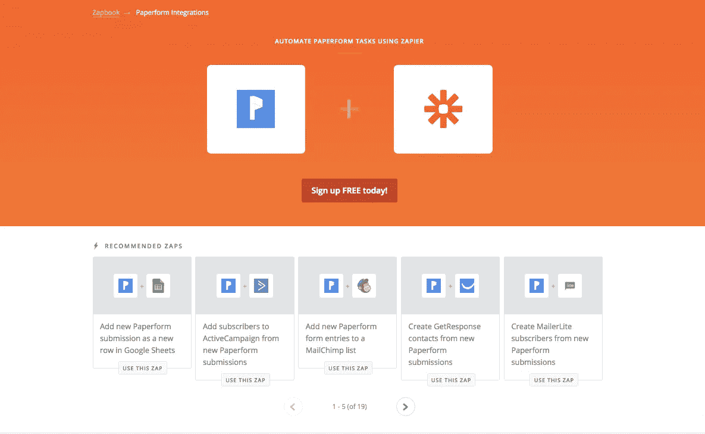

# 这个帖子能教会我什么？

这篇文章将教你如何将 [Paperform](https://hackernoon.com/tagged/paperform) 连接到 [Zapier](https://hackernoon.com/tagged/zapier) ，然后在 Trello 上自动创建卡片。

# 背景

不久前，我发现了这个来自澳洲的很棒的在线表单公司——[paper Form](http://bit.ly/2xyUZ9T)。

我很想知道 Zapier 是如何与 Paperform 一起工作的，因为最好的学习方式是给自己一个项目，所以我决定做一个。

虽然我已经从软件行业退休了，但我仍然会花时间和那些很酷的自由职业技术天才们在一起，他们可以满足我内心的极客需求。这些自由职业者一周几次在不同的咖啡馆见面和工作。位置是固定的，但是工作日可以变化。

我认为做一个简单的应用程序会是一个好主意，它可以帮助我们的小兄弟们快速交流他们每周在哪里，而不必登录日历或任何其他服务。

该应用程序应该:
①允许我们组中的任何自由职业者告诉团队的其他人他/她在任何特定工作日将在哪里工作
②允许组中的任何人看到每个人每周将在哪里
③不要求用户在任何地方登录
④使输入超级快速和直观
⑤使结果直观和易于阅读

# 解决方案的组件

*   特雷罗董事会看到每个人的每周时间表
*   将 Paperform 与 Trello 整合在一起
*   由 Paperform 托管的用于获取输入的表单

我使用 Paperform 管理面板制作的输入表单示例

[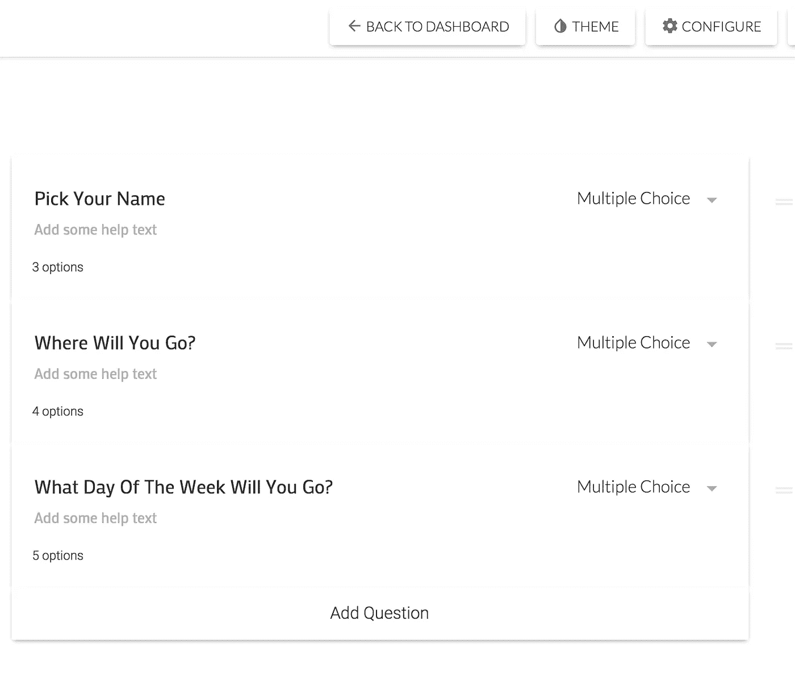](http://bit.ly/2xyUZ9T)

# 管理输出和输入

Trello 板捕获输出。

基本上是显示每个人周一到周五在哪里的仪表板

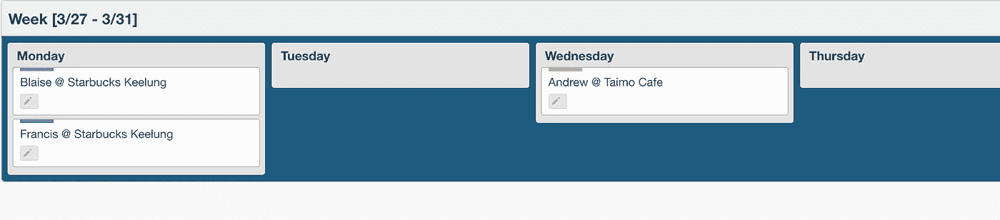

表单的前端用来获取用户的输入，(允许自由职业者选择他们要去的地方)

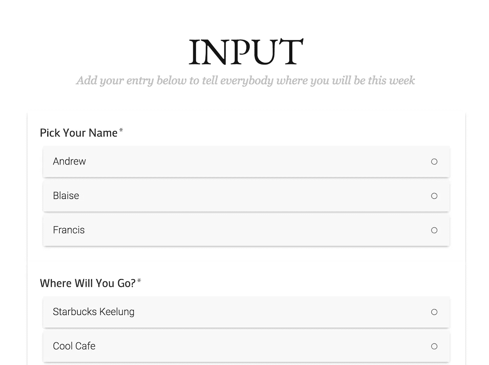

# 完成的应用程序

将所有组件集成到一个 HTML 页面中，这样用户只需去一个地方查看和做所有事情。

## 在开始之前

*   我真心推荐 [Paperform](http://bit.ly/2xyUZ9T) 。这是一家来自澳大利亚的小企业，由一些伟大的人经营，他们倾听客户的意见，并迅速做出改变。他们的平台也比其他一些表单构建器有更多的逻辑和功能。[看这篇文章我写了一段时间关于如何使用 Paperform 制作一个幽灵联系表单](http://ghost.skillshub.info/how-to-setup-a-contact-form-on-ghost/)。
*   你还将与**扎皮尔**和**特雷罗**合作
*   Zapier 和 Trello 都有免费的 T1 计划，你可以使用，直到你的工作流程需要更多的功能，因此必须升级到付费计划。

> 这个故事是由黑客中午的每周赞助商， [Paperform](http://bit.ly/2xyUZ9T) 带给你的。创造美丽的形式。《黑客正午》读者，[永久九折所有计划](http://bit.ly/2xyUZ9T)。

## 与 Zapier 合作的流程是:

①允许访问您希望 Zapier 操作的服务
②使用 Zapier 浏览您想要的服务，例如 [Paperform](http://bit.ly/2xyUZ9T) 或 Trello，并获取您想要操作的数据
③告诉 Zapier 如何处理您获取的数据

别担心，我们将使用的所有这些平台都非常直观。

# 好，我们开始吧！—以下是步骤:

**(1)** 在 [Paperform](http://bit.ly/2xyUZ9T) ，在 [Zapier](https://zapier.com/) 和 [Trello](https://trello.com/) 创建账户

你想从对扎皮尔进行电击开始

Zap 是 Zapier 语言，表示集成

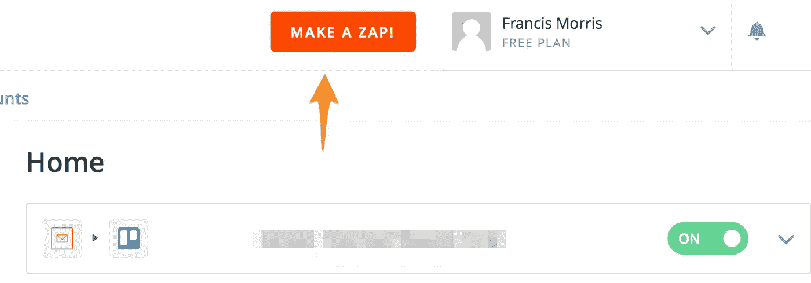

下一步，你必须决定用什么应用程序来触发一个动作。让我们选择纸质表单

一个触发应用程序是应用程序的 Zapier 语言，将触发以后的行动。在我们的例子中，它是以纸质形式提交表单。

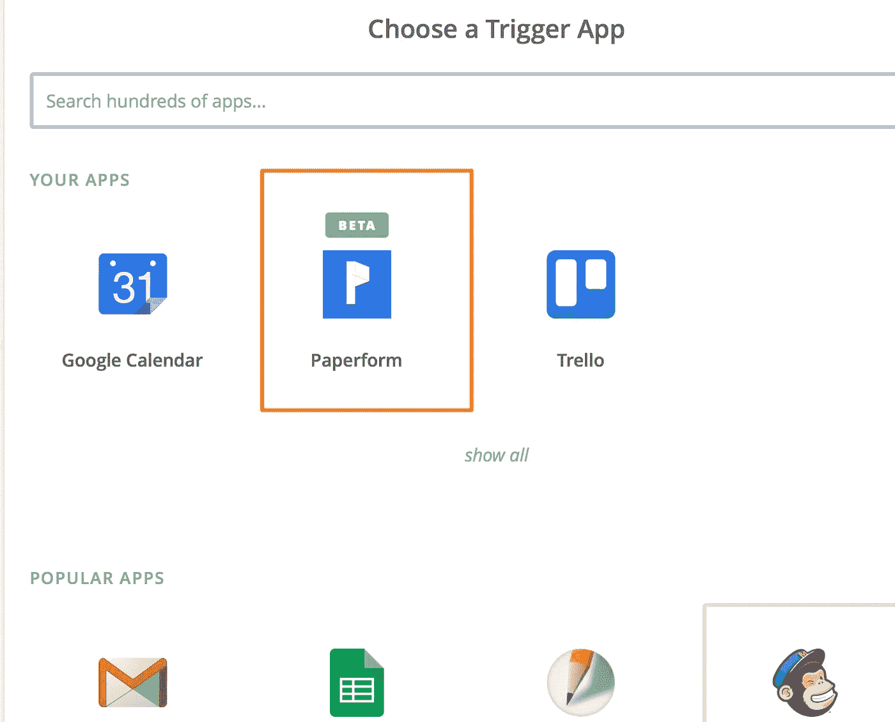

你必须将 Zapier 连接到你的纸质账户。单击“连接新帐户”后，您应该会看到一个弹出框，要求您输入纸质表单登录信息。

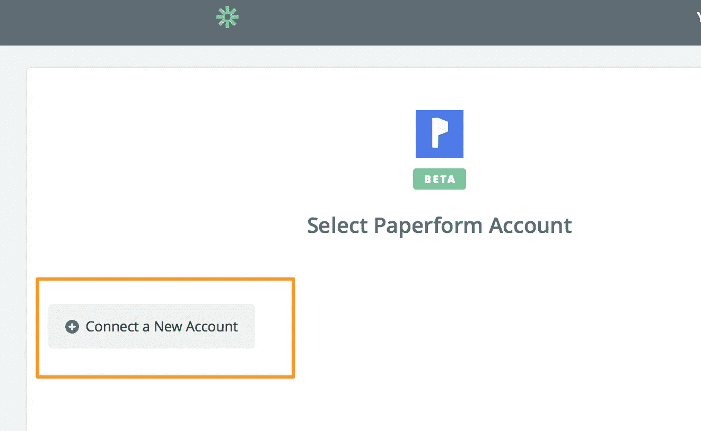

**(3c)** 如果成功，您应该会看到下面的内容:

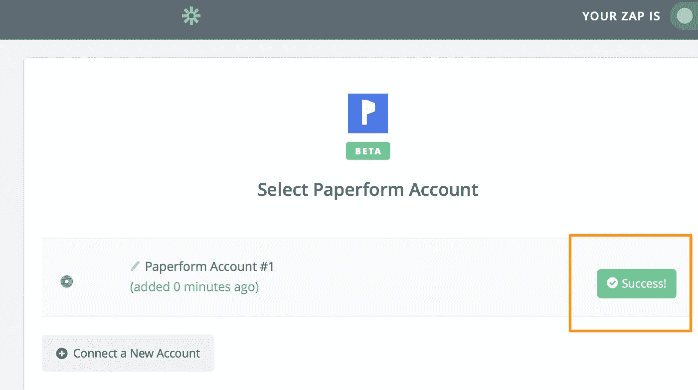

现在是时候选择我们想要在 Paperform 中访问的表单了

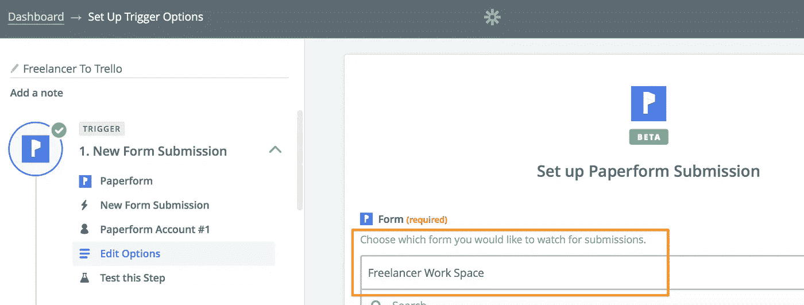

好了，我们应该在纸型面上完成。让我们把特雷罗和扎皮尔联系起来。当我们将 Paperform 连接到 Zapier 时，这是以与上面步骤 3b 相同的方式完成的

**(6)** 在 Zapier 中添加使用 Trello 作为下一步的动作

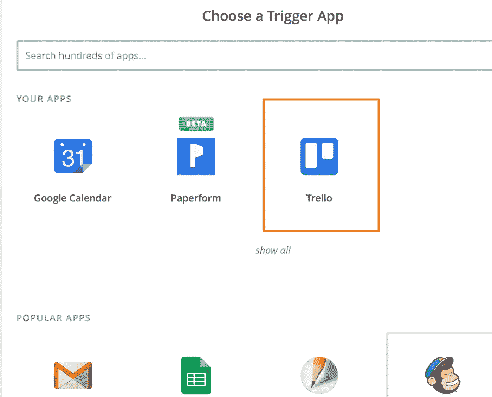

**(7)** 我们需要选择一个 Trello 动作，希望 Zapier 为我们执行。向下滚动列表，选择“查找列表”，然后继续。

动作是 Zapier 语言，表示在应用程序中要执行的事情。在我们的案例中，是找到正确的 Trello 板/列表，以及创建卡片

**(8)** 选择我们想要创建卡片的棋盘和列表。

这时事情变得有趣了，因为我们希望根据来自纸质表单的输入选择一个列表。

在这种情况下，如果用户在表单中输入了“星期一”，那么我们希望 Zapier 进入 Trello 并选择“星期一”列表来创建卡片。这就是为什么我们选择‘你会在一周的哪一天去？“答案”作为“列表名称”。

**(9)** 接下来，我们向 Zapier 流添加另一个 Trello 动作。这次选择“创建卡片”。

**(10)** 基本上，我们希望扎皮尔根据用户填写的纸质表单中的信息写一张新卡片。卡的名称和对 Trello 卡的描述都来自用户在提交纸质表单时已经填写的字段。

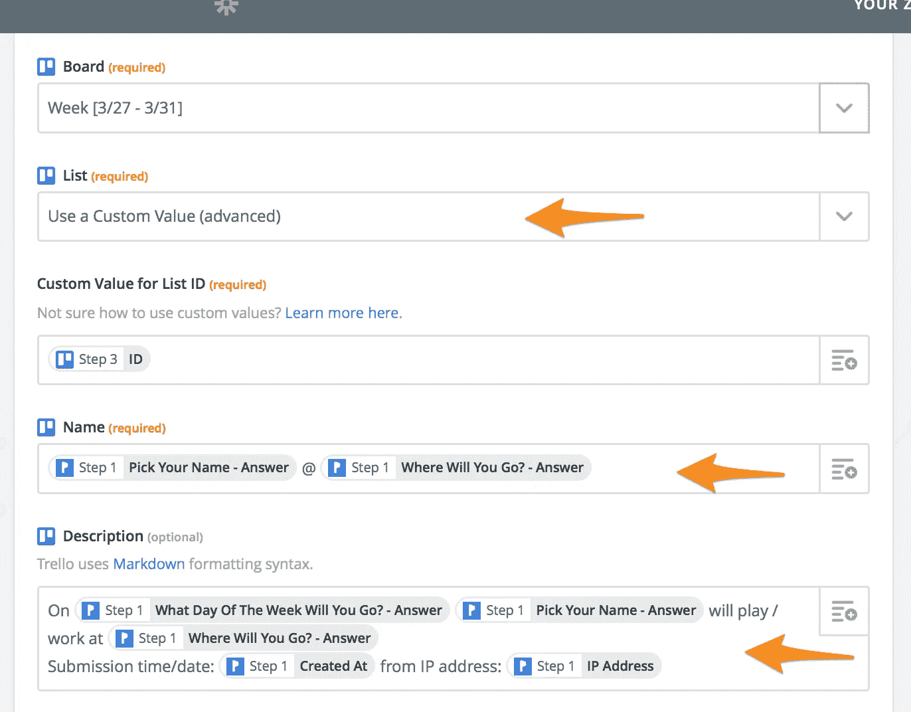

# 抓住你了

**选择正确的字段**——当你在 Zapier 中从纸质表单中选择字段时，确保总是选择“*答案*字段，因为它们是保存你想要的数据的字段。

例如，下面的两个字段:“选择你的名字—回答”和“你将在星期几去?”？回答。

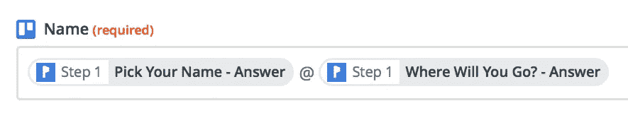

在这种情况下，我将创建名为“Andrew @ Taimo Cafe”的卡片，因为这些是提交的表单提供的**答案**。

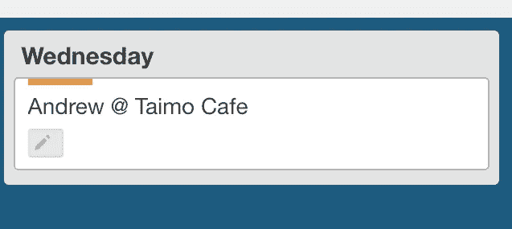

**预填充键** — Papeform 有一个很棒的新功能，叫做预填充键，它在 URL 中使用一个小的唯一代码。这有时会破坏 Zapier 中正确的字段名称的显示

例如，下面的字段:“你将在一周的哪一天去？'回答'

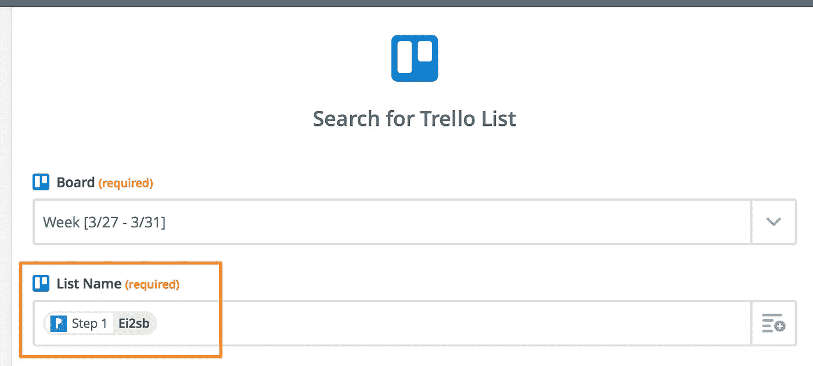

有时会在 Zapier 中显示为 **Ei2sb** ，这是因为如果我们在 Paperform admin 中查看该字段答案的预填充键唯一代码，代码是: **Ei2sb**

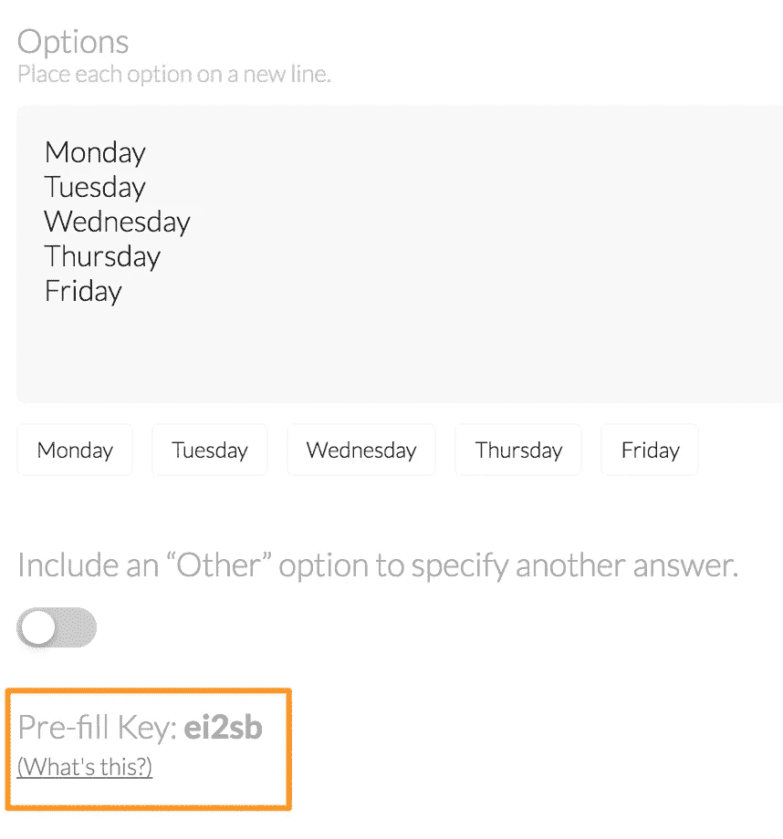

不过不要担心，Zapier 将始终正确处理该字段，并且它知道该特定字段是“你将在一周的哪一天去？'回答'

**ZAPIER 字段 ID 的** —在上面的步骤 10 中，如果您查看列表字段，它显示的是“ID”而不是列表的名称。这是为什么呢？

让我们来看一段截图。

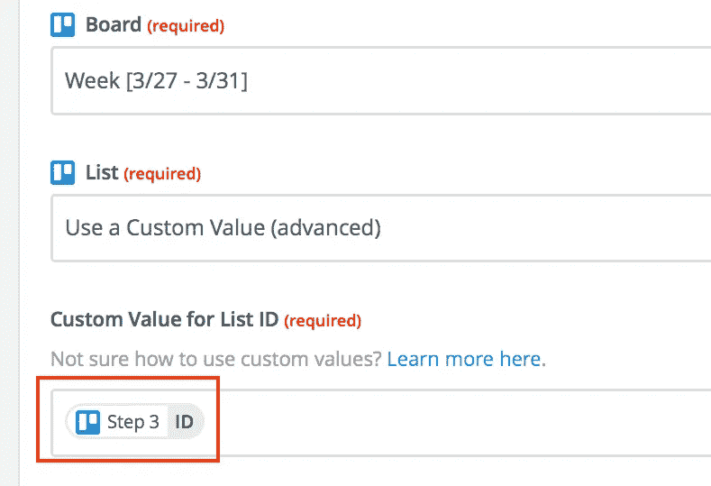

这是因为 Zapier 有时不能处理字段的名称，并且必须拥有字段的唯一 ID。这在这里有更详细的解释: [Zapier 字段 ID 的](https://zapier.com/help/using-custom-values-dropdown/#id-fields)

你只需要意识到这一点，有时给 Zapier 一个字段的 ID，而不是一个字段的名称。通常 Zap 不起作用的原因正是因为这个。

# 结论和附加信息

我希望这篇文章展示了一些 Zapier 和 Paperfom 魔法的可能性
如果你想看完整的概念验证应用程序，请到[这里](http://freebo.skillshub.info/)看一看。

下面我添加了一些额外的资源。
整合大家快乐！

**参考链接:**
[连接 Paperform 到 Zapier 教程](https://paperform.co/resources#zapier)
[其他连接 Paperform 的 Zapier app](https://zapier.com/zapbook/paperform/)
[paper form 上的预填是什么？](https://paperform.co/resources/prefilling)
[Zapier 字段 ID 的](https://zapier.com/help/using-custom-values-dropdown/#id-fields)

> 这个故事是由黑客正午的每周赞助商 [Paperform](http://bit.ly/2xyUZ9T) 带给你的。创造美丽的形式。对于黑客正午的读者来说， [10%的人永远计划着](http://bit.ly/2xyUZ9T)。了解更多关于[成为 Hacker Noon 的每周赞助商](https://weeklysponsor.paperform.co/)(剧透警告——本表格由 [Paperform](http://bit.ly/2xyUZ9T) 提供支持)。