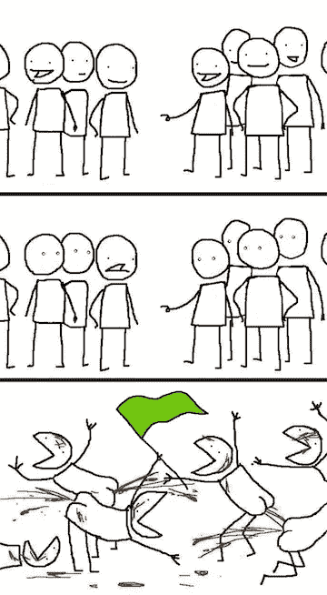

# 我如何处理意见分歧

> 原文：<https://medium.com/hackernoon/how-i-deal-with-differences-in-opinion-d3a6a6f65dda>

能够处理意见分歧是在工作或个人生活中建立牢固关系的关键。如果你想在一个组织中有所作为，这是不舒服但不可避免的。我把多年来的笔记整理成了这篇文章。

# **心态**

把你的自我排除在讨论之外。有两种方法可以做到:

***1)默认自己是错的***
即使你 100%自信自己是对的，也要彻底接纳对方的观点。允许你的盲点暴露出来，倾听相反的观点并理解它们的来源。

***2)对团队最有利的是什么>对你最有利的是什么***
当你参与讨论以解决意见分歧时，你的目标应该是在团队信息不完整的情况下做出最优决策。而不是把它当作一个战场，你的唯一目的是确保你的一方获胜。如果在讨论中你被证明在某一点上是错误的，尽管这很难，谦逊地接受它并继续前进。不要为了让别人觉得你立场一致而固执己见。

尽管这一切说起来容易做起来难。因为你的自我在某个时间点是讨论中在场的人的函数，明智地选择你的*论坛，即*参与者。

# **论坛**

你选择参与讨论的论坛是基础性的。在房间里有 7 个人在场的情况下进行讨论，与在 [Slack](https://hackernoon.com/tagged/slack) 上私下讨论 DM 有很大的不同。论坛决定*基调*。在一个更大的论坛上，你犯了礼貌方面的错误。我一般坚持一个尽可能小的。

# **语气**

在激烈地阐述你的观点时，不断检查自己，看看你是否有对抗性。另一方面，当另一方具有对抗性时——我更喜欢的解除对抗性的人的武装的方法是变得格外和平。微笑，点头*提问*代替。

# **提问**

每个人都会根据他们过去的经验、他们熟悉的东西以及他们能回忆起的例子来形成对主题的看法。需要自律才能让自己不坚持自己的观点，这样你就可以和他们一起探讨他们的观点。我试图以非对抗性的方式通过提问来做到这一点。这是消除偏见的好方法。

# **通讯齿轮**

我更喜欢早期阶段的讨论，相对于面对面/视频会议这样的高端渠道，我更喜欢电子邮件/ Slack 这样的低端渠道。原因很简单，低速通道比高速通道能更有效地帮助你理清思路。当你不得不写下一些东西，并在点击发送之前阅读一遍时，肾上腺素激发的狂热就没有多少空间了。这也给了每个人时间来思考问题，并在反驳他们第一次遇到的观点之前做一些快速的研究。

在后期讨论中，每个人对不同意见的立场已经同步。在这一点上，更高级的交流，如面对面的会议，更有意义，可以推动讨论得出结论。

# **做你的研究**

一个准备充分、有研究支持的论证将为你完成 3/4 的工作。(其余的是陈述、口才、可信度、跟踪记录等)收集支持证据和类似成功应用的例子。如果你还没有出色的记录，没人会在意你的“直觉”。所以用数据武装自己。当一个人面对令人信服的支持时，他很难驳倒这个论点。研究争论的所有方面，包括反对的方面。

# **打退堂鼓**

有时候争论会绕圈子。鉴于很多时候我们被迫在半信半疑的基础上做出决定，没有明确的“更好”的想法。为了节省时间，必须有人让步。如果我不像其他人那样强烈地感受到讨论的观点，或者认为两种观点都是正确的，我会首先放弃。

# **避免怨恨**

有时候观点没有对错之分。不止一个可以共存。这就是领导者介入并做出决定的地方。他们开始打“直觉”牌，并且因为他们的历史记录而被允许这样做。这就是为什么他们首先是领导者。另一方面，他们在做决定的背景下也会有自己的一套偏见。这就是信任之类的东西出现的地方。你必须相信领导者会做出他们认为最有可能成功的决定。理解这一点有助于一个人迅速从你的观点不被接受的状态中走出来。

# **总之**

进行讨论本身仍然会对参与者有所帮助。现在各方都面临着同样的问题，只是角度不同。如果每个人都能成熟地处理，意识形态和观点的多样性是有价值的。

一天结束时，只有当参与者离开讨论时，意见分歧才能成功解决

1.  *已经承诺决定他们是否同意它(信用杰夫·贝索斯)
    2)已经对正在讨论的问题形成了不同的观点
    3)没有感觉他们被忽视
    4)不后悔提出反对意见(由于反弹)*