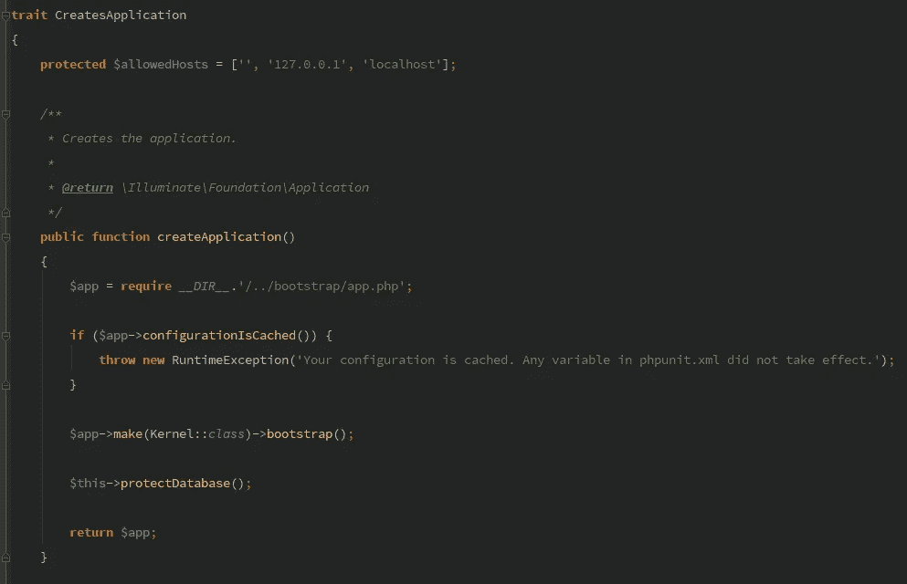

# 我是如何摧毁临时数据库的

> 原文：<https://medium.com/hackernoon/how-i-destroyed-the-staging-database-b435f98569ab>

## 以及我将如何防止它再次发生

*在此次事故中，没有客户数据受损。Amazon RDS 快照在 20 分钟内恢复了临时数据库，该数据库仅供内部使用。*

今天我犯了一个错误。这导致临时数据库中的每个表都被删除。好的一面是，这不是生产数据。

## 特性 1:配置:缓存

如果您在您的 Laravel 应用程序中运行`php artisan config:cache`，它将生成一个包含您的`config/*.php`文件夹中所有配置的`bootstrap/cache/config.php`文件。目标是通过在准备就绪的状态下缓存设置来加速 Laravel 的引导过程。

## 特性 2:刷新数据库

Laravel 5.5 附带了一个名为`RefreshDatabase`的新特性和一个名为`migrate:fresh`的优秀迁移命令。trait 将只迁移一次，然后使用事务来加速测试套件，但是它将在开始之前删除所有现有的表。当然，这意味着使用`sqlite :memory:`或本地数据库。

## 冲突

您的本地环境设置为使用每个开发人员共享的临时数据库。您这样做的原因是因为您想要测试一个特性的性能，而临时数据库有一些很好的数据集来测试这一点。但是既然你想测试性能，你显然想用**缓存**路由*和*配置*。*

你对结果很满意。是时候进入下一个专题了。作为一个 TDD 爱好者，您编写一个新的测试并运行它，看看哪里出了问题。它失败了。太好了，现在就实施吧。房间里有人喊道— *伙计们，临时数据库怎么了？*

您的测试套件没有从您的`phpunit.xml`加载您的`:memory:`值。这是不必要的，因为`bootstrap/cache/config.php`有所有必要的设置。遗憾的是，设置不正确。

你进入亚马逊控制台，恢复 5 分钟前的快照。在 15~20 分钟内，转移环境将再次运行，不会造成永久性损坏。

## 余波

在学习了如何炸毁一个非预期的数据库之后，让我们学习如何保护它。

## 1- 101:删除权限

不要偷懒。为您的项目设置一个新的数据库用户，该用户在登台环境中没有`DROP`权限。

## 2-测试设置白名单

`CreatesApplication`特性是检查特定设置是否是预期的最佳地方。它在测试套件之间共享，并在建立数据库之前执行。

这将确保如果你搞砸了，意外的环境不会受到影响。

## 3-[好处]使调试更容易

你的环境受到保护。一切都准备好了。这种事不会再发生了。但是下一次你缓存你的设置并忘记它的时候，你的测试会告诉你你有错误的设置。你可能会看着`phpunit.xml`文件困惑于这怎么可能。为了让未来的你更清楚和容易，多 3 行代码可以节省一些调试时间。

## 4-结论

第二天，我在站立会议上报告说，我已经测试了我们的数据库备份系统。他们工作得非常出色。好的一面是，我还报告说，我不会意外地再次测试它。

无论如何，要小心生产状态命令。在开发阶段缓存配置和路由通常会导致意外的行为。当您没有清除路由缓存时，可能会浪费一些时间来理解为什么会出现 404 页面未找到。配置缓存是一个有趣的发现。