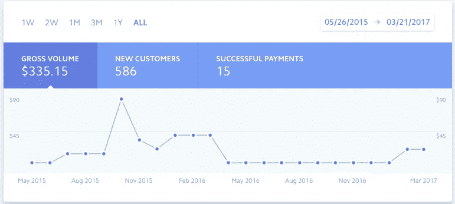
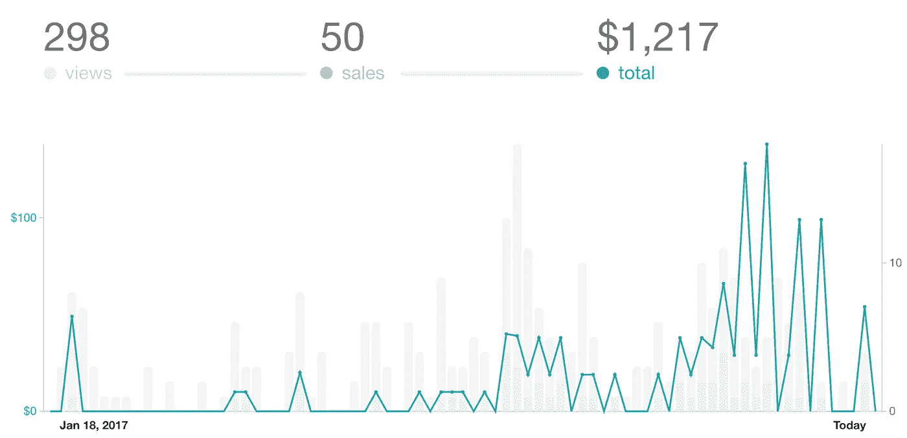

# 我如何通过两个月的图书销售赚得比 18 个月的 SaaS 还多

> 原文：<https://medium.com/hackernoon/how-i-earned-more-with-2-months-of-book-sales-than-18-months-of-saas-5c2b063b863b>

photo from unsplash.com

从 2014 年开始，我开始打造我公开发布的第一款 SaaS 产品，并试图赚钱。通过无数其他失败的应用程序和想法，我终于在 2 月份写了一本关于如何用 Ruby on Rails 构建 SaaS 应用程序的书，这本书已经超过了 SaaS 应用程序在 18 个月内获得的收入。

在这篇文章中，我将讲述我的经历，并深入到痛苦的细节中:

*   打造 SaaS 产品(以及如何去做)
*   说“去他的”，做些不同的事情
*   激情如何带来收入

# **是什么让我建立了 SaaS 产品**(以及如何去做)

是什么让我开发了 SaaS 产品(以及如何去做)
作为一名软件开发人员，我们大多数人都渴望做自己的东西。你知道，有一件事你可以称之为你自己的，而不必听从“那个人”的指示。

[StandupTime](https://standupti.me) 作为一个未命名的附带项目开始。我计划尝试不同的前端技术和框架。通过与朋友和同事的讨论。有人告诉我，有实时更新的在线每日站立工具会很棒！“那是确认”，我想。伙计，是我错了，不过以后再说。

我花了十个多月的时间来构建、重建和营销 StandupTime 的测试版。在 Twitter、Medium 或其他网站上没有任何追随者的情况下，我向几个测试版网站提交了 StandupTime。在 2015 年夏天，我最终有了一个测试版客户(这应该会让最天真的制造商感到震惊，但我没有注意到)。

最终，在 9 月份，我不知何故安排在同一天出现在 ProductHunt 和 LifeHacker 上。一周后，我创建了大约 500 个新账户，其中一些已经准备好付款了。

快进到 2016 年初，账户一直在波动，每月收入在减少。我决定开始与仍然在周围的用户交谈。事实证明，一个每日站立的应用程序，无论它的功能有多好，都需要更好地适应他们的工作流程。

一个理智的人会让这一切发生。我不是一个理智的人。我决定重写整个应用程序，并使用我多年来一直专业使用的另一个堆栈:Ruby on Rails。我花了大约六个月的时间重写这个应用程序，改变它的品牌(两次)和改变它的状态(两次)。结果估值过高(剧透提醒:此应用于 2017 年 3 月 30 日生命周期结束)。

这一次，在获得了一个应用程序的坚实基础之后，我把它更好地推向了市场。这一次，我提交了更多的测试网站，并承诺我不会做太多的编程，直到我有一些用户准备好去。我以为我已经有超过 100 个测试版注册了。又错了！

我确信一个成功的产品发布会有一个神奇的测试注册数。但是我不知道那个数字是多少，也没有足够的用户！

随着另一个企业的退出，它又开始了下一个。这一次，我可能犯了自举最大的错误。我决定不从我亲密的朋友圈子之外的任何人那里得到任何反馈。我秘密开发了一个应用程序。

我是个白痴。

我在 2016 年秋季构建了 [GetRoadmaps](https://getroadmaps.com) (总体思路是 StatusPage.io 用于公共路线图)，在几周内完成了大部分应用程序。此时，已经总共构建了大约 4 或 5 个 SaaS 应用程序(有些从未发布)，完成应用程序的标准部分变得相当容易。

在大约四个月的夜晚和周末之后，我低调地发布了 GetRoadmaps。去年 12 月末的一天早上，我醒来时发现我创建的一个应用程序又出现在了 ProductHunt 上。这个惊喜只占了大约十个注册。

看…我告诉过你我是个白痴。以下收入数字可以证明这一点:

Abysmal would be a compliment

虽然我有一些小的应用程序的想法，但我没有创造另一个失败的产品。我注意到我有一个通用的途径来快速地用 Ruby on Rails 构建 SaaS 应用程序，并且喜欢帮助别人。

我应该…写吗？

# 说“去他的”，做些不同的事情

我决定，管他呢。我在 AWS 上通过 Elastic Beanstalk 部署了一些应用。也许我应该写一个关于我的经历的快速[教程](https://hackernoon.com/how-to-setup-and-deploy-a-rails-5-app-on-aws-beanstalk-with-postgresql-redis-and-more-88a38355f1ea)，看看它是否能帮助到任何人。嗯，确实如此。它获得了几千次访问，发布在 Ruby 点击率最高的时事通讯上，并获得了 50 多条推荐。这是我迄今为止写的最好的回复。

在与一位刚刚经历过代码训练营的朋友交谈后。他觉得如果他建造了一个真实的产品，而不是一个模拟的想法，他们会获得更多的真实世界的经验。

灯泡。我的经历，一种新的激情，和一个可能的市场汇聚在一起。[在 Ruby on Rails 上搭建一个 SaaS App 5](https://buildasaasappinrails.com)诞生了。

一个问题…到底谁会买这个？

我决定做适合自己的事情，并通过教程和技术帖子帮助其他人编写更好的 Rails 应用程序。我只会链接到我的登录页面，看看会发生什么。

你可能会问，“它是如何工作的？”。

虽然开始的时候很慢，但是到目前为止，我已经有了 30 天的累计 23，000 的点击率。其中大约有 3-5%的人会访问构建 SaaS 应用程序登录页面。我是一个糟糕的创造者，从一开始就没有在我的登陆页面上使用谷歌分析。所以，把 Mixpanel 中的信息拼凑起来，看起来到目前为止我的总访问量还不到 1000 次。

一旦用户登陆登陆页面(好名字，嗯？)，其中约有 7%的人会在登录页面采取一些行动。跟踪的活动是“请求样本章节”或“单击售前”按钮。

但是，你仍然坚持，“说真的，它是如何工作的呢？”

# 激情如何带来收入

很顺利！到目前为止，距离登陆页面上线还有不到两个月的时间，还没有后续消息。我已经聚集了 50 个售前客户，他们相信我正在创造的产品。

我开始注意到写作会变得更容易。我觉得自己与我在 Medium 上写的文章有联系。这本书的章节在我脑海中飞快地闪现。我为每一个可以帮助这个世界上另一个人的机会而兴奋。我不再担心如何创收或推销自己。

另外，反馈非常好！尽管我可能不是最多产的 Ruby on Rails 开发人员，但大多数人都害怕分享他们的作品。我还没有收到比对某个特定方法的温和批评或修改某处打字错误的建议更糟糕的东西。

事实上，大多数反馈都是表扬和感谢。这种反馈是让人们继续前进的动力。我想说，当你找到激情时，收入就会到来。

# 离别的思念…

我能分享的最重要的事情就是不要放弃。不仅创作和分享很难，而且可能需要时间来找到你的激情。

另一个建议是写。为自己而写。写作是为了帮助别人。写下来记住一个奇怪的技巧，让顽固的错误消失。

我希望这能激励你去寻找和/或做一些你觉得有激情的事情。

> [黑客中午](http://bit.ly/Hackernoon)是黑客如何开始他们的下午。我们是 [@AMI](http://bit.ly/atAMIatAMI) 家庭的一员。我们现在[接受投稿](http://bit.ly/hackernoonsubmission)并乐意[讨论广告&赞助](mailto:partners@amipublications.com)机会。
> 
> 如果你喜欢这个故事，我们推荐你阅读我们的[最新科技故事](http://bit.ly/hackernoonlatestt)和[趋势科技故事](https://hackernoon.com/trending)。直到下一次，不要把世界的现实想当然！

