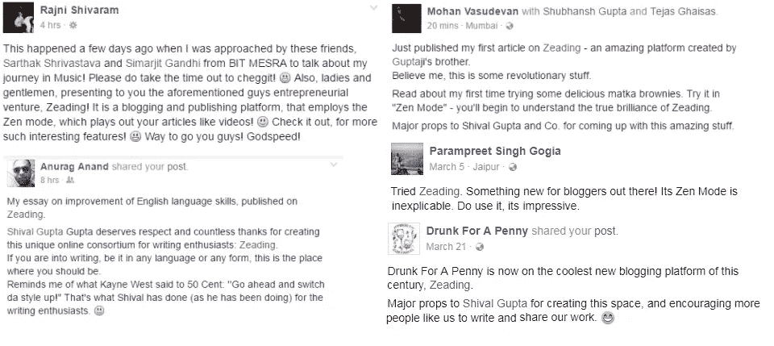
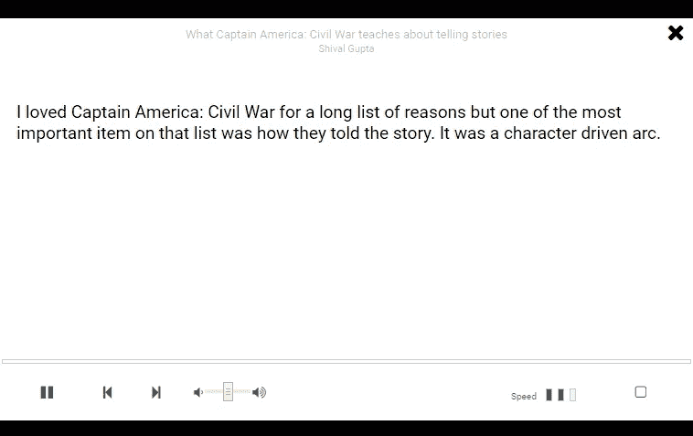
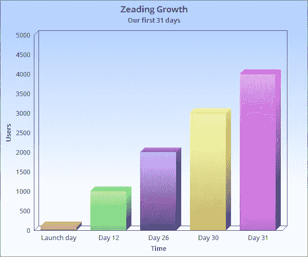
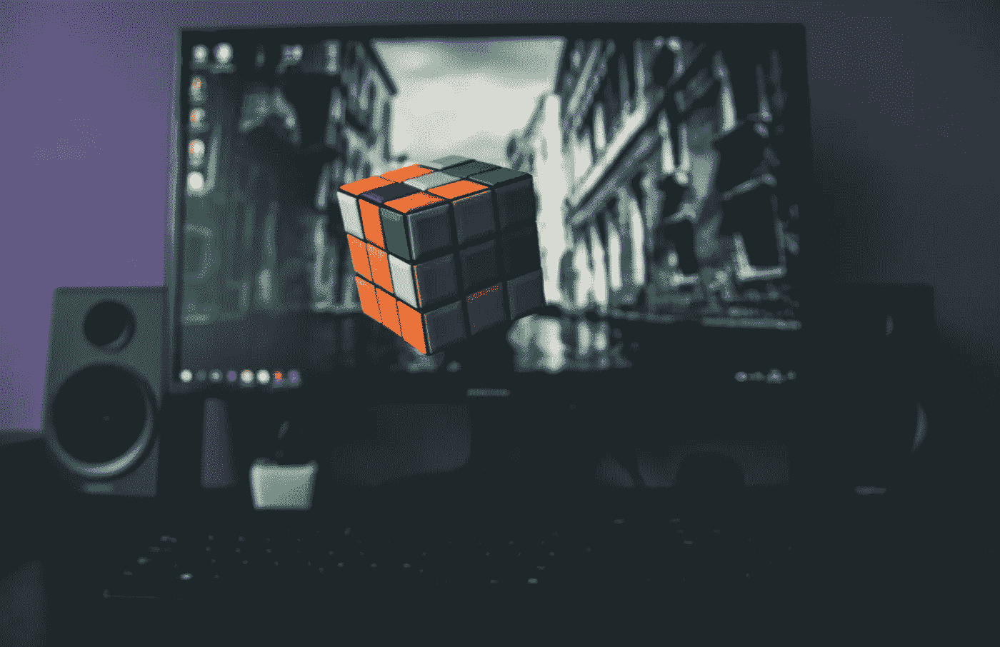

# 我是如何搞砸我的创业的——失败和内爆的人生教训

> 原文：<https://medium.com/hackernoon/how-i-fucked-up-my-startup-life-lessons-from-failing-and-imploding-f3b3540f8545>

## 燃尽真的比淡去好吗？

大约一个月前，我的整个信仰体系被颠覆了。我意识到，我从来没有在我的整个生命中犯过最大的错误，这是一个罕见的反思事件，承诺将永远伴随着我。

**在赛道上比赛前让车跑起来。**[2016 年 8 月我刚开始做 Zeading 的时候，创业中心](https://www.linkedin.com/in/vijayanands/)的 Vijay Anand 给了我这条绝妙的建议。唉，由于我对自己的悲剧性影响，我选择了无意识地忽视它，甚至更糟，严重误解它。3 年前，当我还在上大学的时候，我就已经在我之前的创业项目上失败了。我认为我有这种意识，并且是企业家通常会犯的错误的专家。

这就是我错的地方。

# 永远不要认为你已经搞定了

Z [eading](https://www.facebook.com/zeading/) 原本是一个让传统阅读过时的博客平台。借助我们的旗舰功能 Zen Mode，我发明了一种巧妙的方法，使用 Javascript 在客户端上将文章转换成类似视频的动画界面。在 HTML5 的[语音合成 API](https://developer.mozilla.org/en-US/docs/Web/API/SpeechSynthesis) 中，我们也增加了对 voiceover 的支持——所以它真的可以为你读出全部内容。这是一种真正身临其境的阅读故事的方式。我们的演示令人瞠目结舌，在测试版中，我们收到了大量积极的评论。

我们对 Zeading 的唯一雄心是成为文本内容的 Youtube。这是一个雄心勃勃的目标，源于我自己的现实生活问题。我患有弱视，这是一种罕见的疾病，一只眼睛的视力比另一只眼睛的视力差。无论我是否戴眼镜，试图在屏幕上阅读任何东西都会让我头疼。我的眼睛对压力非常敏感。为了改善这一点，我设想了我们的文本到视频界面，它提供了一种沉浸式的、无压力的方式来吸收屏幕上的文本内容。一旦完成，最初的评论令人鼓舞，是时候利用它了——至少我是这么认为的。

Zen Mode in Zeading — played stories like video.

我们有一个童话般的启动。在发布当天，我们有了第一批 100 名注册用户。在接下来的 30 天里，这个数字已经超过了 3000。在我们手术的第 31 天，已经是 4000 了。我和我的团队非常开心。人们在 Zeading 上到处发表文章，我们从最初的早期采纳者那里得到了很多鼓励。在某些方面，我们的第一个版本具备了成功 MVP 的所有要素。在最初的 30 天里，我们已经有了第一个影响者，我们需要超越我们自己的社交网络的界限。一群非常有经验的人也不时给我们提供建议。

Fairytale MVP launch

这或多或少有点像我公寓里社交网络上庆祝香槟的场景——这里同时也是我们小小冒险的全球总部。我们敏锐地认为，在这一点上绝对不会出错。

然后我们就倒霉了。

# 产品/市场契合度不会在农场里成长

这意味着，在你播下种子之后，你不可能收获一个[产品/市场契合度](https://en.wikipedia.org/wiki/Product/market_fit)。很抱歉打破你的幻想，但这就是这个世界的运作方式。你必须从顾客那里设计产品，而不是把顾客带到产品前。

## 我们通过艰难的方式了解到了这一切:

1.  如果你没有做任何客户研究，或者没有任何关于你正在解决的问题的定性数据，你将不会得到任何用户**。**
2.  如果你的市场规模太小，或者你对现有竞争的优势知之甚少，你的产品/市场契合度就没有任何价值**。**
3.  如果你的留存率太低，并且你没有一个可重复的模式来扩展到未知的市场，你将永远一无所知。
4.  如果你的团队成员都在做全职工作，而不是全职为你的创业工作，你将很难向前迈进哪怕一英寸。
5.  如果你的收入计划是广告，你就完了。

> 产品/市场匹配实际上是你的产品与你的用户之间的一种互惠关系。你的产品给他们的生活增加了价值，用户会不断回来购买更多的好东西。

现在回想起来，即使是我们平台上最热门的故事也只有大约 6 万的浏览量。不用说，我们一分钱也没赚到。

# 没有北极星指标是注定失败的

我们研究了所有的指标，除了一个真正重要的指标。作为缺乏经验的企业家，我们愚蠢地分析了谷歌分析所能提供的一切，以及我们从数据库中提取的任何东西——日浏览量、跳出率、日活跃用户、注册、帖子、点赞数、评论数、[脸书](https://hackernoon.com/tagged/facebook)页面到达、雅哒雅哒等等。

如果我们只关注浏览量，我们可以朝着我们的商业模式努力，并优化收入。如果我们只关注参与度，我们可以把自己标榜为一个社区。如果我们只专注于我们最常用的旗舰功能，我们可以专注于从博客平台门面成长为一个更有效的增值容器。

> 选择你要追求的指标是你要做的最重要的商业决定。它将塑造你的产品、业务和文化。

在一个没有月亮的漆黑夜晚，我们在树林里四处游荡，没有任何东西可以隐藏我们的尊严。我们曾经令人羡慕的[增长](https://hackernoon.com/tagged/growth)崩溃了，就像史奇雷克斯的一首歌坠落在 x 轴上。当太阳终于升起的时候，我们除了彼此的脸，什么也看不到。

我们看起来不漂亮。

# 说真的，去你的直觉。

没有经验的无知是一切失败之母。史蒂夫·乔布斯有很强的直觉，因为他是行业专家。你还没有。至少可以说，你的知识很贫乏，你的市场研究支离破碎，充斥着偏见和二手数据。你甚至不允许有一个直觉，直到你能在不到 60 秒的时间里向某人解释整个行业和它的机会。

这听起来可能有点争议，但创业公司是一种设计上靠直觉运行的工具。建立一个成功的产品或企业的唯一被证明的方法是要么跟随别人已经做的事情，要么进行试错，直到你发现一些独特的东西。但是，您将如何决定运行哪些试验呢？你的直觉会指引方向。

如果你的直觉本身是错的呢？你会浪费你所有的资源去做那些无关紧要的测试。更糟糕的是，一些测试会有假阳性——比如当我们在文章之前将 Zen 模式放在我们的文章视图上时，我们的跳出率从 80%下降到 4%。这是一个我们从来没有真正在意的衡量标准，因为大多数病毒式内容确实有相当高的跳出率，但由于这种戏剧性的减少，我们开始在其他网站上投入资源嵌入 Zen 模式。这也没有给我们带来回报，而是让我们走上了一条愚蠢的弯路，我们本应该更好地避免这条弯路。

> 相信自己直觉的唯一方法是训练它在大多数时候都是正确的。

经验和专业知识使你的思维过程一致，因此你的直觉大多是正确的。

我的朋友、产品专家和成长老手 Misbah Ashraf 建议我在做其他事情之前为我的产品争取 100 个超级粉丝。随着我们的北极星度量未知，确认偏见在我们体内以自己的荷尔蒙形式出现，我们开始根据我们的直觉选择我们的超级粉丝。在我们选择最活跃用户的方法中，没有什么可以量化的。

当我写这些的时候，我感到很尴尬，但是这是真的。这就是我们搞砸的程度。

# 盐和水不能形成海洋

对我们来说，也许会有更好的方式来打造和营销我们试图实现的目标。在另一个宇宙中，在一个平行的现实中，我愿意相信，有一些地方不会被我们自己的偏见设下的这些现在看起来很明显的陷阱所迷惑。有时候，我们因为怀疑太多而失败；有时我们也会因为过于自信而失败。

有一句古老的印度谚语说 *naach na jaane，aangan tedha —* 字面意思是如果你不知道如何跳舞，不要责怪地板。这似乎是结束这个故事的一个奇怪的方式，但是无论我多么深刻地反省，我觉得对市场的无知和不明智的决策是我们搞砸创业的主要原因。

我们在 Zeading 上工作了大约一年，这是我平常平静生活中情感停滞的一部分。不用说，所有这些停工都是怀着极其沉重的心情进行的。我花了整整一周的时间向我们的用户发布关于脸书的公告。告诉所有你认识的人你失败了，这太难了。

在全职工作的同时管理一家完全自主创业的公司，让我更加珍惜我所拥有的任何空闲时间。我开始读更多的书来填补我头脑中的空白，并变得更能接受和纠正我作为一名领导者、工程师和企业家的缺点。大多数情况下，我相信挫折是暂时的，我学到的东西将帮助我反弹，回到我真正喜欢的事情上来——制造惊人的东西。

## 感谢阅读！:)如果你喜欢这个，请一定要点击那个心形按钮。这给了我很多鼓励，也有助于其他人看到这个故事。

> [黑客中午](http://bit.ly/Hackernoon)是黑客如何开始他们的下午。我们是 [@AMI](http://bit.ly/atAMIatAMI) 家庭的一员。我们现在[接受投稿](http://bit.ly/hackernoonsubmission)，并乐意[讨论广告&赞助](mailto:partners@amipublications.com)机会。
> 
> 如果你喜欢这个故事，我们推荐你阅读我们的[最新科技故事](http://bit.ly/hackernoonlatestt)和[趋势科技故事](https://hackernoon.com/trending)。直到下一次，不要把世界的现实想当然！

