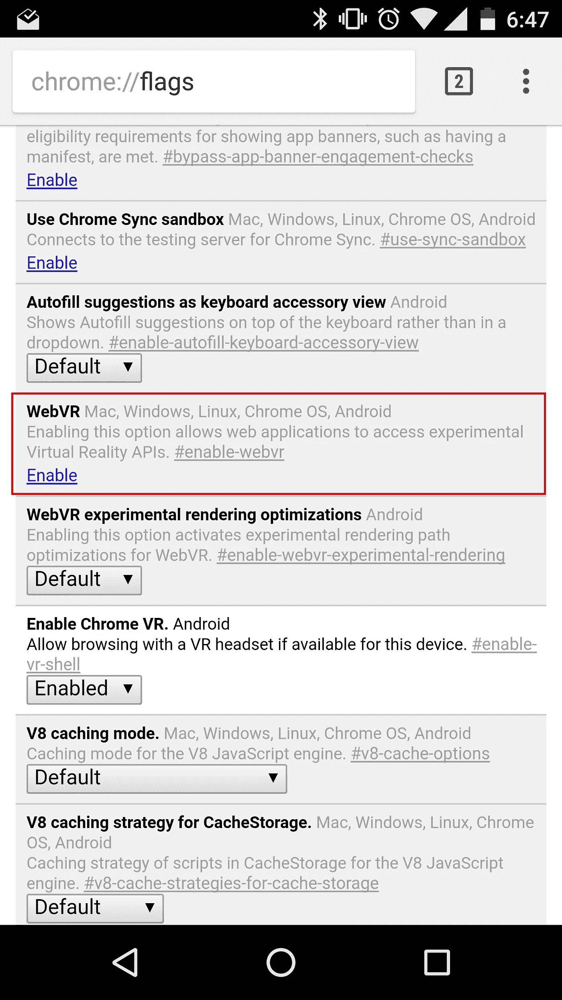

# 我如何得到一个使用安卓纸板 HMD 的 React VR 开发环境

> 原文：<https://medium.com/hackernoon/how-i-got-a-react-vr-dev-environment-working-with-an-android-cardboard-1fcaf00faebc>

我关注 React VR 已经有一段时间了，在最近宣布它可以使用后，我跳上了它，兴奋地把手弄脏了。虽然在我的机器上设置它很容易，但我遇到了很多困难，让它在我的 Android 设备上用谷歌 Cardboard 风格的 VR 耳机运行。我在这里记录了我的解决方案，希望其他人可以避免一个下午的挣扎。我只能对 Linux 的 Windows + Windows 子系统确认这一点，但是这些方法对任何操作系统都应该是合理的。我假设你的设备上安装了纸板。

如果您还没有，请浏览一下[入门指南。](https://facebook.github.io/react-vr/docs/getting-started.html)你将在浏览器中运行一个有趣的早期虚拟现实棋盘游戏室。现在沉浸其中。

首先，您需要打开所需的端口，以允许您的手机连接到您的计算机。您需要查找如何为您各自的操作系统做到这一点的方法。**允许流量进入端口 8000** (如果有必要，您可以更改这个，但是您需要稍后更改一些代码)。为什么是 8000，当打包程序在 8081 上运行时？你很快就会发现。

接下来，在你的安卓设备上安装 **Chrome Canary** 。我们需要这一点，因为 Chrome 的当前版本(截至本文撰写时为 57)在 WebVR 支持方面存在问题(可怕的黑屏)。然而，WebVR 不是开箱即用的，所以你需要通过标志来启用它。

在你的设备上进入`chrome://flags`，找到**网络虚拟现实**，点击启用。



Press Enable on WebVR

Chrome 会要求重启。这样做。现在，您的设备已经启用了 WebVR！

如果你像我最初做的那样打开 8081 端口，打开你的新 VR 演示并尝试切换到 VR 模式，你会发现一个大的痛点: [WebVR 不会在不安全的源上运行](https://lists.w3.org/Archives/Public/public-webvr/2016Jul/0000.html)！React VR 打包程序恰好就是这样运行的。啊哦。这是可能的，我不知道有什么方法可以在安全模式下运行打包程序。因此，让我们代理它，这样我们就可以。

我使用 http-proxy，一个节点库，来创建一个支持 https 的代理。因此，首先通过以下方式安装它:

```
npm install -g http-proxy
```

接下来，您需要创建一些证书，以便它可以通过 https 为它们服务。这将取决于您的操作系统。下面的命令应该可以在 Windows(通过 WSL)、Mac 和 Linux 上运行，虽然我不能确定是否适用于 Mac。

```
openssl req -x509 -newkey rsa:4096 -keyout key.pem -out cert.pem
```

请记住您设置的密码，您很快就会需要它。接下来，创建一个`proxy.js`文件并添加[这段代码，](https://gist.github.com/bakkerme/2730336d83b6f1cd85ace5a68a902819)确保使用上面设置的内容更新密码短语。通过`node proxy.js`运行。

现在在你的手机上，在 Chrome Canary 中，进入`https://<YOUR MACHINE IP HERE>/vr:8000`。由于我们创建的证书是自签名的，您将看到不安全的连接屏幕。点击高级并添加一个例外。

理想情况下，现在你的手机上会有同样的虚拟现实演示。点击左下角的**VR 视图**按钮。如果你没有它，再次检查以确保 WebVR 已启用，并且你没有意外地变回正常的 Chrome(这种情况会发生)。

Chrome 可能会要求你安装谷歌虚拟现实服务。如果有，安装它并重启 Chrome。再次尝试“在 VR 中查看”按钮。

幸运的话，VR 模式将启用，您可以在真实的 VR 环境中开始测试！黑客快乐！


IT’S ALIVE

[](http://bit.ly/HackernoonFB)[](https://goo.gl/k7XYbx)[](https://goo.gl/4ofytp)

> [黑客中午](http://bit.ly/Hackernoon)是黑客如何开始他们的下午。我们是 [@AMI](http://bit.ly/atAMIatAMI) 家庭的一员。我们现在[接受投稿](http://bit.ly/hackernoonsubmission)并乐意[讨论广告&赞助](mailto:partners@amipublications.com)机会。
> 
> 如果你喜欢这个故事，我们推荐你阅读我们的[最新科技故事](http://bit.ly/hackernoonlatestt)和[趋势科技故事](https://hackernoon.com/trending)。直到下一次，不要把世界的现实想当然！

