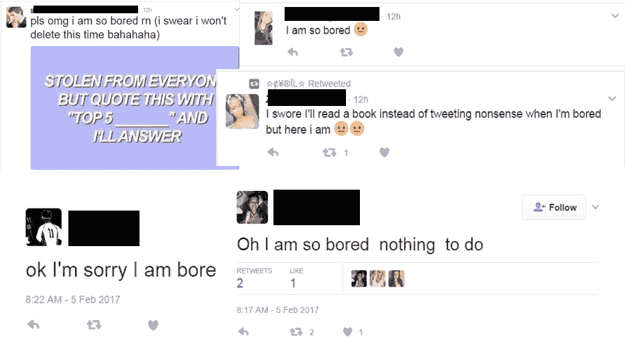
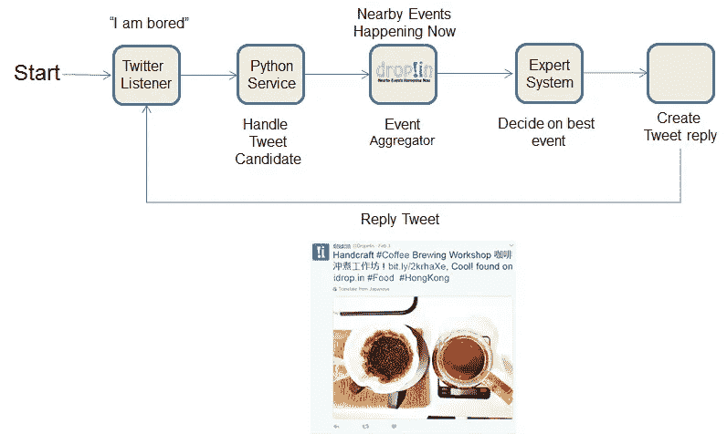
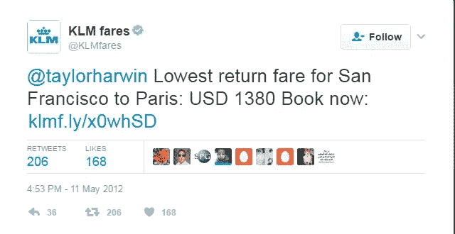
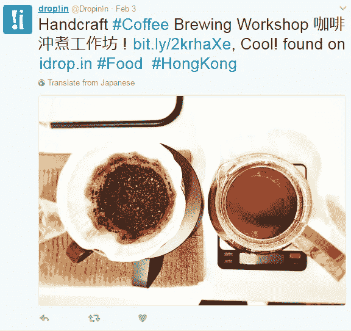
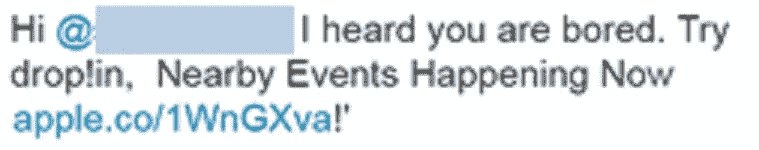

# 我是如何在推特上被禁的

> 原文：<https://medium.com/hackernoon/how-i-got-myself-banned-on-twitter-43427b099418>

## 为什么大家都这么无聊？

这都是我们的错。我的过失。我们大大低估了人们在 Twitter 上的无聊程度，以及有多少人会在 Twitter 上发帖表示无聊。

这一切都是几天前开始的，当时我了解到一种强大的新机制，有可能提高客户的意识，这种机制叫做“[社交倾听](https://www.quora.com/What-is-social-listening?share=1)”，我想我应该试一试。

为什么？初创公司面临的一个主要问题是在网上聊天的噪音中引人注意。T [enqyu](http://www.tenqyu.com) 在这里也不例外。与频繁出现的王牌、超级碗(Go Raiders！)、迷因、Gifwars，2017 年的许多在线交流都是由[机器人相互交谈](http://www.recode.net/2016/11/1/13488020/trump-bots-clinton-twitter-third-debate-twitterbots-election)形成的。

因此，为了被人看到，我认为，在社交媒体团队中自动化一个人并自己运行一个机器人是明智的。

从 python 实现机器人并不困难，实际上非常简单。在快速概述了流程后，创新实验室的团队连接了不同的部分，我们开始实施。#周末黑客马拉松

作为我们想要成为的好公民，我们认为我们提供类似于以下的服务是在遵循 Twitter 的指导方针:

周日下午，我们已经准备好系统进行第一次试运行。随着[下降！在](http://idrop.in)中，我们主要关注地理空间聚合，我们需要确定 tweeters 的位置，然后为这个特定用户创建一个定制的事件通知。和这个差不多。

当我们在模型构建过程中查看候选人时，我们注意到一些高音喇叭没有放在正确的位置。因此，在良好的工程实践中，我们定义在这种情况下，系统应该回复一个默认的应用程序链接。(提示:大错特错)

根据我们的计算和之前的样本数据，我们估计只有大约 5%的情况下，当我们无法确定用户的位置时，才会出现默认情况。

然后我们启动系统。

几分钟之内，我们就通知了几个用户这个应用，但没有一个事件。真扫兴。显然，我们的自动防故障选项已经成为新的常态。嘻嘻。为什么那么多人在推特上发无聊的微博！WTF！

总的来说，当应用程序出现可爱的错误 261“应用程序无法执行写操作”时，大约有 40 多条推文发出。

Twitter 立刻关闭了限制写访问的应用程序。我想这是理所应当的。

但是这个解决方案已经被证明是非常强大的，因此是一个巨大的成功。对我们来说，这显然是应用程序的前进方向，一旦应用程序恢复，我们将删除默认选项，因为它不会增加价值，当然也不会增加“哇！这是惊人的效果”而不是一个“WTF 垃圾邮件怪物！！BRRRGH！！!"。毫无疑问，这是 Twitter 和我们都不想要的。

也许我们从“我很无聊”转移到搜索关键词“活动建议”。

但是我把这个留到另一个帖子里，这里会发生什么。

你会使用哪个关键词？

谢谢你来这里。如果你喜欢这篇报道，请告诉我:

> [黑客中午](http://bit.ly/Hackernoon)是黑客如何开始他们的下午。我们是 [@AMI](http://bit.ly/atAMIatAMI) 家庭的一员。我们现在[接受投稿](http://bit.ly/hackernoonsubmission)，并乐意[讨论广告&赞助](mailto:partners@amipublications.com)机会。
> 
> 如果你喜欢这个故事，我们推荐你阅读我们的[最新科技故事](http://bit.ly/hackernoonlatestt)和[趋势科技故事](https://hackernoon.com/trending)。直到下一次，不要把世界的现实想当然！

