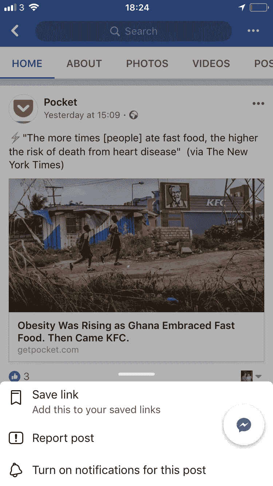
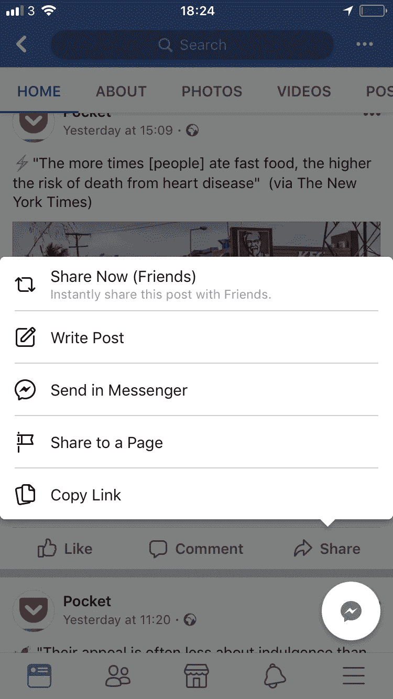
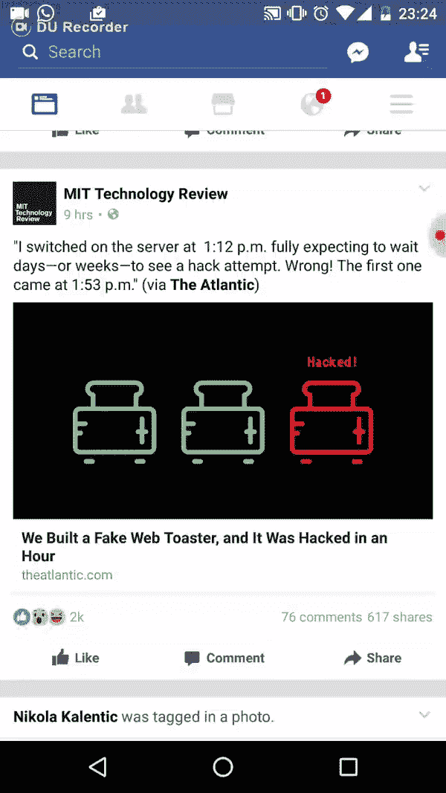
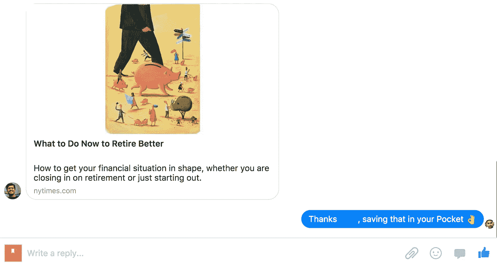

# 我如何在脸书四处乱砍，分享第三方应用程序的链接

> 原文：<https://medium.com/hackernoon/how-i-hacked-around-facebook-to-save-articles-to-a-third-party-app-116e970b287d>

Facebook is trying to lock us in so we only use their app to read articles. That’s not cool.

## 并且开源了解决方案。

我读了很多关于脸书的新闻，尤其是手机新闻。我喜欢的页面、我的朋友和学习我喜欢的内容的算法使它成为一个寻找精选新闻的神奇地方。

我通常不在飞行中阅读它们，而是把它们保存在[口袋](https://medium.com/u/c70f51225816?source=post_page-----116e970b287d--------------------------------)中，这是一个文章管理应用程序，允许我在离线时阅读这些文章。

然而，当在脸书的移动应用程序上浏览文章时，无法轻松地将它们发送到 Pocket。在移动端，你只能保存在脸书的“保存的文章”中，分享到你的墙上，或者通过 Messenger(脸书的聊天)发送给朋友

Example here with an article from the Pocket page. It is not possible to share the article to a third-party app such as Pocket, or even our mail client.

这令人沮丧。脸书应该公平对待第三方应用程序，如果他们希望我们在那里阅读，就改进他们的“已保存”部分，而不是把我们锁在他们的应用程序中。

产生这种沮丧情绪的是 [PocketBot](https://facebook.com/pocketsaverbot) :由于我们只能与脸书的朋友分享文章，我创建了一个 Messenger Bot，你可以与它分享文章，它会为你将文章保存到 Pocket(在你通过它登录你的 Pocket 账户后)

Demo of how the bot works. He’s like a friend you share your articles with :)

在分享了这个机器人的链接后，我意识到我不是唯一一个对此感到沮丧的人。一些人开始频繁使用这个机器人。

Users showing some love

# 隐私问题——开源代码

有几个人问我是否存储正在通过 bot 发送的文章:我不存储，将来也不打算存储。这个机器人的唯一目的是摆脱无法将在脸书上找到的文章存储到口袋中的沮丧。

然而，通过脸书页面仪表板，我可以看到人们与机器人的所有对话，所以技术上来说**我可以**看到你通过机器人发送的文章。

Looking ahead 👍

你可能在乎，也可能不在乎。但我知道人们可能会担心这个问题。

这就是为什么[我在 Github 上开源了代码(以及如何创建你自己的机器人的过程),这样你就可以构建你自己的](https://github.com/Tketa/pocket-bot)。

我将通过保持当前的机器人[运行，所以如果你有同样的问题，并且你不想设置自己的问题，你可以使用它！](https://www.facebook.com/pocketsaverbot/)