# 我如何黑掉谷歌白日梦控制器

> 原文：<https://medium.com/hackernoon/how-i-hacked-google-daydream-controller-c4619ef318e4>

反转并使其兼容苹果 iOS 设备。

# 关于；在…各处 ；大约

大家好，我是 [Matteo Pisani](https://it.linkedin.com/in/matteopisani) 一名富有创造力、好奇心和灵感的软件开发人员，有着黑客的态度和强烈的逆向工程倾向。
我在物联网、嵌入式系统开发以及弥合物理现实和数字世界之间的差距方面积累了多年的经验。

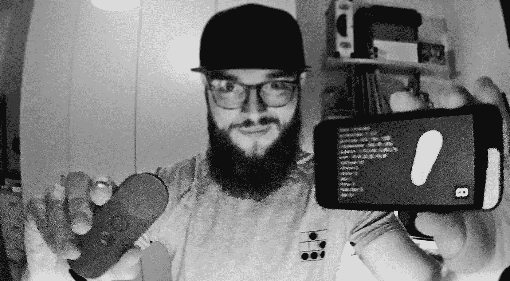

**E-mail**: matteo.pisani.91@gmail.com | **LinkedIn**: [https://it.linkedin.com/in/matteopisani](https://it.linkedin.com/in/matteopisani)

# 摘要

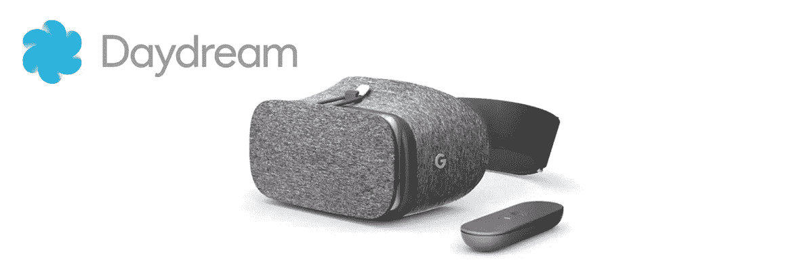

Google Daydream controller and headset

移动虚拟现实正在快速发展。谷歌白日梦平台上个月刚刚推出，它表明引人注目的虚拟现实体验可能会比预期更快地广泛提供给消费者。如今，像**智能手机+耳机+蓝牙控制器**这样的解决方案非常受开发者、媒体和娱乐公司的青睐，但是……有一个问题:**兼容性**。正如宣布的那样， **Daydream 控制器**只与一堆运行 **Android 7.0 牛轧糖**的 **Daydream-ready** 智能手机绑定。此外，据**克莱·巴沃** *(谷歌虚拟现实副总裁)***谷歌白日梦** *报道，“它目前与 iOS 不兼容，可能几年内都不会兼容。”*。

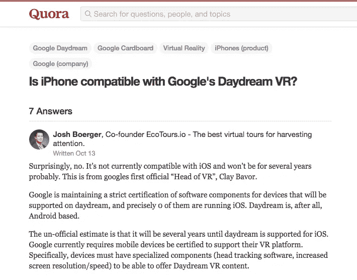

Original post: [https://www.quora.com/Is-iPhone-compatible-with-Googles-Daydream-VR](https://www.quora.com/Is-iPhone-compatible-with-Googles-Daydream-VR)

由于我喜欢挑战，我决定使用*代码*、*逆向工程*技能和一些*数学*来破解**谷歌白日梦控制器**，以扩展在**苹果 iOS** 设备上的兼容性:这很成功。

# 分析

**Google Daydream 控制器**通过**蓝牙 LE** *(低能量)*工作，但我在我的 **iPhone 5** 的*蓝牙设置*中未能发现它，所以我使用了**BlueCap***(*[*【github.com/troystribling/BlueCapapp*](http://github.com/troystribling/BlueCapapp)*)*，这样可以轻松实现*中央*和

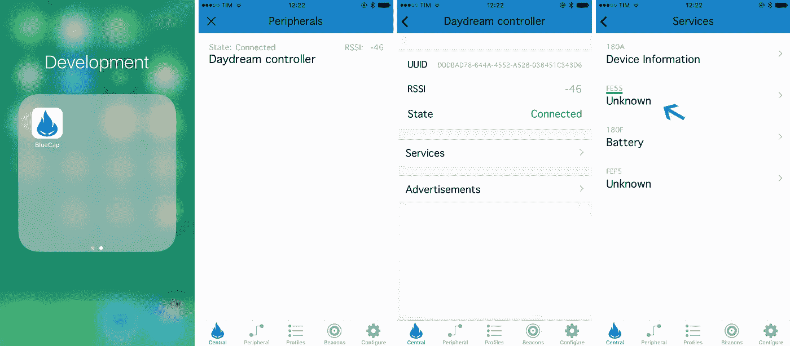

我查看了每个*服务*的可用数据:有已知的服务，如*设备信息*和*电池*，但我还在一个未知的服务 *FE55* 中发现了一些有趣的东西:

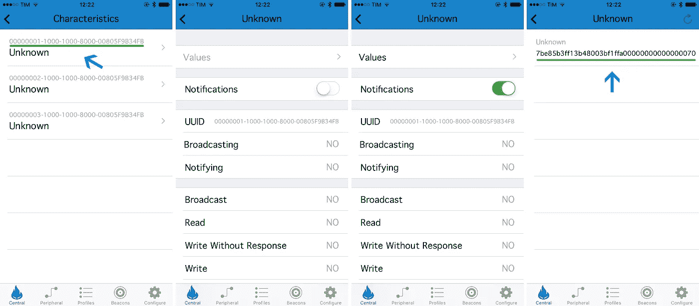

当我用**UUID***000000001–1000–1000–8000–00805 F9 b 34 FB*探索第一个*特征*内部，打开的**通知， **BlueCap** 开始显示 *BLE 数据包*。在空中挥动**白日梦控制器**，我可以看到传入的*数据*实时变化。同样的事情发生在触摸顶部的垫或随机按下按钮。**

根据**蓝牙 LE** 标准，每个*数据包*应重 **20 字节**:**7be 85 B3 ff 13 b 48003 BF 1 FFA 000000000000070**

*数据包*剖析显示，它们被编码并表示为**十六进制**符号。在*屏蔽数据的背后*奠定了控制器的整体状态，包括*加速度计*、*陀螺仪*、*磁力计*、*触摸板*、*按钮*等。

# 环境

第一步是建立一个*测试环境*，以方便所有的**调试**过程。我决定从头开始:我用**苹果 XCode** 开发了一个**沙盒**(在 **MacBook Pro** 上工作)和一个 **iOS app** (带有一些 **Objective-C** )，其中包括**core bluetooth \ core bluetooth . h***框架**(*[*developer.apple.com/reference/corebluetooth*多亏了这个，我可以通过蓝牙 GATT 协议建立和管理通信和数据流。](http://developer.apple.com/reference/corebluetooth)

在选择了*服务* **FE55** 并请求关于*特征***00000001–1000–1000–8000–00805 f9b 34 FB**的通知后，我能够获得流经控制台的数据输出:

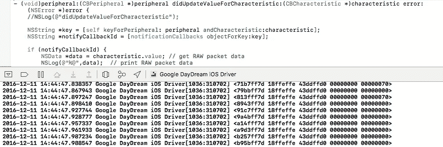

一旦数据被收集并及时解码，我决定把它表现成一个 3D 视图。因此，我将所有的 *iOS 原生代码*迁移到一个**混合** *环境*中，将它们全部打包到一个 **Cordova 插件**中:由于这个过程，我能够节省时间并执行一些优化。

使用 **JavaScript** 降低了整体复杂性，加快了实验速度，并允许我改进数据可视化嵌入，这也要感谢令人惊叹的 **A-Frame** *WebGL 框架**(*[*aframe . io*](http://aframe.io)*)*在 *HTML5+CSS3* 视图内。

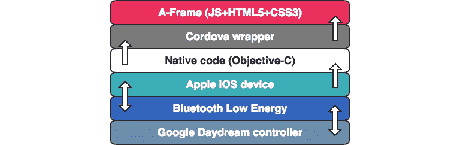

(the entire environment stack)

通过使用开源 3D 创作套件 [**Blender**](http://blender.org) ，我能够编辑互联网上找到的一个笨重的**谷歌白日梦控制器**模型，使其适合我的目的。编辑后，我将其导出为符合 **A 帧**的格式(**)。obj** 。

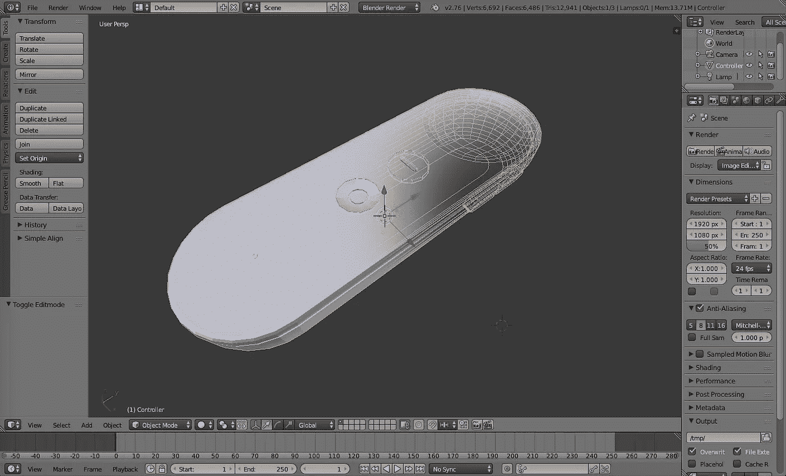

只用几行代码，我就完成了整个设置，结果如下:

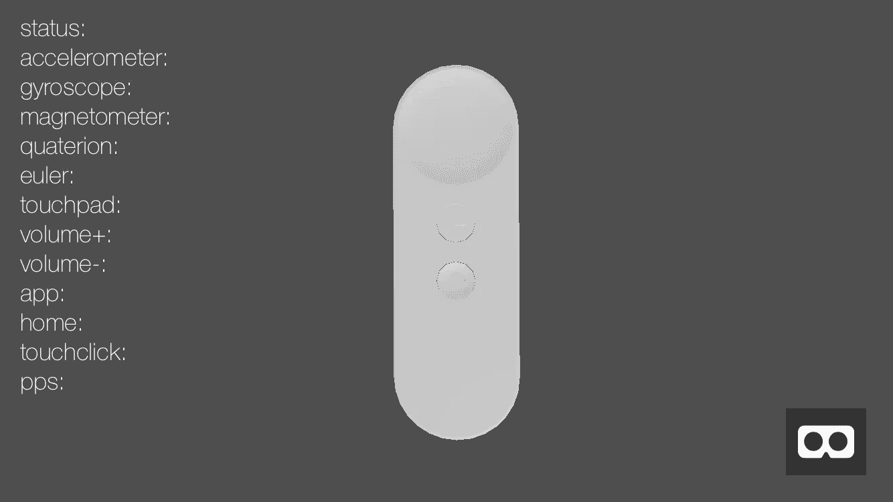

# 回动的

现在是最难的部分:理解原始数据。
从关于*十六进制*到*十进制*转换的一般知识出发，我将**的 40 个字符**拆分成**的 20 个组块**中的 **2 个字符**然后转换成*二进制*:

**7b E8 5b 3f f1 3b 48 00 3b f1 ff A0 00 00 00 00 00 00 00 00 70**

我只是想尝试一下，所以我测试了一个在线的十六进制转换器，这是输出

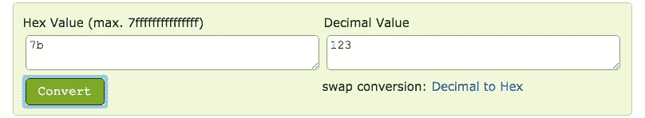

后来我也试过*十进制*到*二进制*转换器。

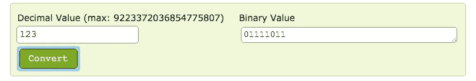

将一切带到 **JavaScript**

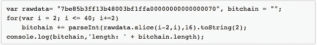

预期的输出是每个数据包的 **160** 位*长度链(8 位* 20 个块):*

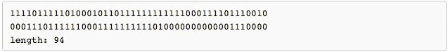

我只得到预期的 **94** 而不是 **160** *位*，所以我意识到有些不对劲。
深入问题后，我发现在*位*中转换的*十六进制*值有时会产生比 *8* 短的结果，换句话说，不是*把*塞到 *8* 的组中: **zeropad** 到 *8* 解决了所有问题。

一旦我添加了 **zeropad** 方法并更改了代码:

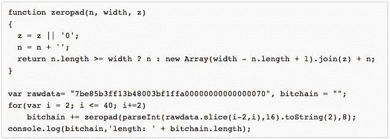

这一次，预期的结果是正确的。

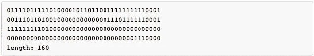

几个不眠之夜后，我开始给这个迷人的婊子链一个形状:关于 **IMU** *(惯性测量单元)*和 **MEMS** *(微机电系统)传感器*的综合知识，加上巨大的耐心和良好的观察技能，帮助我弄清楚发生了什么。

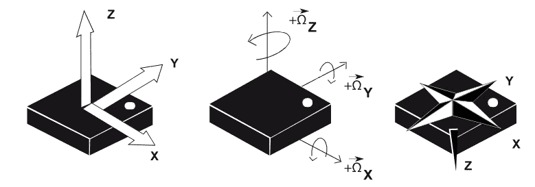

关键点是:

*观察所有振荡的*位*；
*用 *offests* 多玩一点。

这让我能够识别、提取和分类这些价值。我将它们全部报告如下:

**传感器**(值的 12 位*+符号*的 1 位

*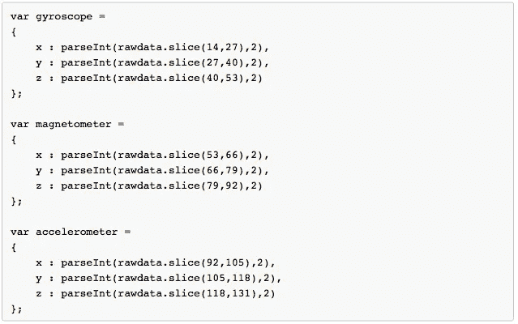*

***触摸板**(数值的 8 位*)**

*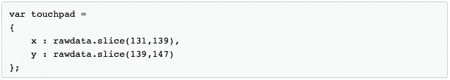*

***按钮**(值的 1 位*)**

*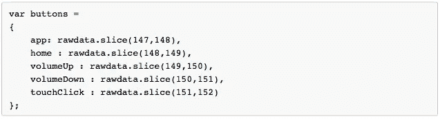*

*一旦我实现了这个目标，我试图操纵所有这些数据，通过 **A-Fram** e canvas 给 3D**Google Daydream controller**模型一个连贯的方向:不幸的是，屏幕上的输出导致了一个无意义运动的倾斜控制器。*

*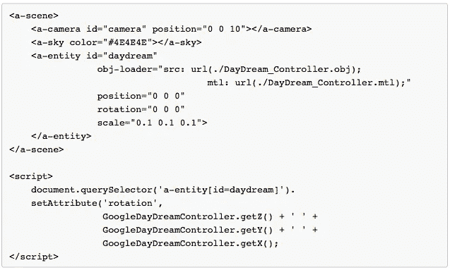*

*反转一些**。**谷歌虚拟现实服务**的 apk** (在**谷歌像素** *操作系统*中找到，允许通过 *BLE* 与**谷歌白日梦控制器**进行本地通信)，我能够得到有用的信息。*

# *工具*

*通过使用 **apktool** 、 **dex2jar** 、 **jd-gui** 转换**对 **Android** 、Java*app 进行逆向工程。apk*** 文件到**。java** ，有可能:*

**了解应用程序中的特定 UI 是如何构造的
*读取应用程序中的 AndroidManifest.xml、权限、活动、意图等
*发现应用程序中使用的本机库和映像
*查找废弃代码( **Android SDK** )，默认情况下，使用**progguard**工具，该工具通过删除未使用的代码和重命名具有语义模糊名称的类、字段和方法来缩小、优化和混淆代码。*

*我使用的工具:*

***ApkTool** ( *出自*[*http://code.google.com/p/android-apktool/*](http://code.google.com/p/android-apktool/)*)**

*提取 *AndroidManifest.xml* 和 res 文件夹中的所有内容(布局 xml 文件、图像、webview 上使用的 htmls 等..)，运行以下命令:*

**

*它还提取了**。所有**的 smali** 文件。类**文件，但是很难读取。*

***Dex2jar** ( *从*[*http://code.google.com/p/dex2jar/*](http://code.google.com/p/dex2jar/)*)*
生成**。来自**的 jar** 文件。apk** 文件，我们需要 **JD-GUI** 来查看来自这个**的源代码。震击器**。
运行以下命令:*

**

***JD-GUI** *(从*[*http://java.decompiler.free.fr/?q=jdgui*](http://java.decompiler.free.fr/?q=jdgui)*)*
它反编译了**。类**文件(在 **Android** app 的情况下被废弃，但在其他**的情况下获得可读的源代码。jar** 文件)。即我们得到**。java** 从应用程序回来了。
只需在你的*操作系统*上运行 jd-gui 可执行文件，然后*文件- >打开*查看 **Java** 代码**。震击器**或**。类**文件。*

*特别是，我在里面发现了有趣的信息:*

****com . Google . Android . VR . home . apk**
***com . Google . VR . VR core . apk***

*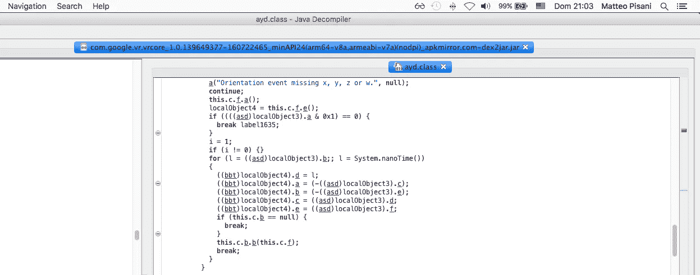*

*(magnetometer event)*

*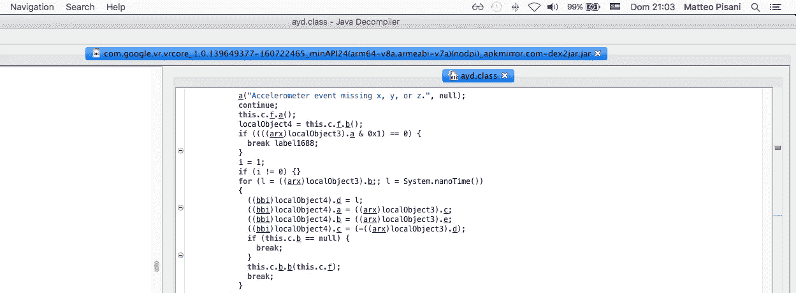*

*(accelerometer event)*

*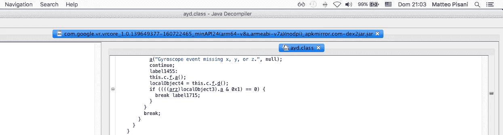*

*(gyroscope event)*

*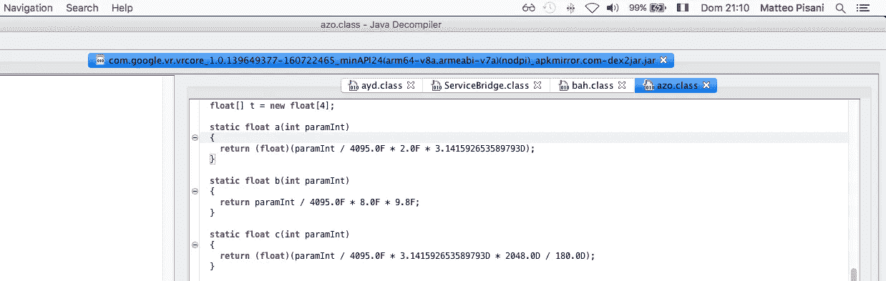*

*(compensation methods)*

*收集了我所有的开发者想法，并把它们组合在一起，我意识到最好的解决方案是使用 **AHRS** *(姿态航向参考系统)*计算用于**JavaScript***(*[*npmjs.com/package/ahrs*](http://npmjs.com/package/ahrs)*)*。*

**

*这可以计算带有以下所有传感器的设备的姿态和方向:磁力计、陀螺仪和加速度计。 *Madgwick* 或 *Mahony* 算法可用于实时过滤来自这些传感器的数据，获得极高的精确度。*

*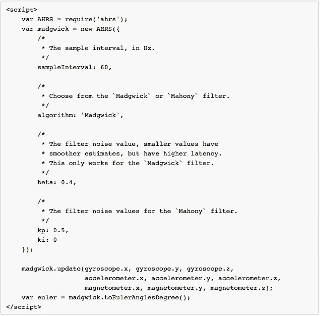*

***getEulerAnglesDegrees** 方法返回一个带有*欧拉角*(航向/偏航、俯仰、滚动)的对象，单位为*度*。*

*返回**对象**包含:*

** **航向**是从北往西(关于 *z 轴*)。
* **螺距**是从垂直，向前(关于 *y 轴*)。
* **滚**从垂直，向右(关于 *x 轴*)。*

*最后，我可以将模型方向设置为正确的坐标*

**

*结果是辉煌的:正如你在下面的 YouTube 视频中看到的，我记录了整个黑客的潜力*

*Google Daydream controller running on iOS (on an iPhone 5)*

*响应速度非常灵活，根据 **PPS** *(每秒数据包数)*参数， **~ 60** 足以覆盖一个 VR 游戏或 3D 体验。*

*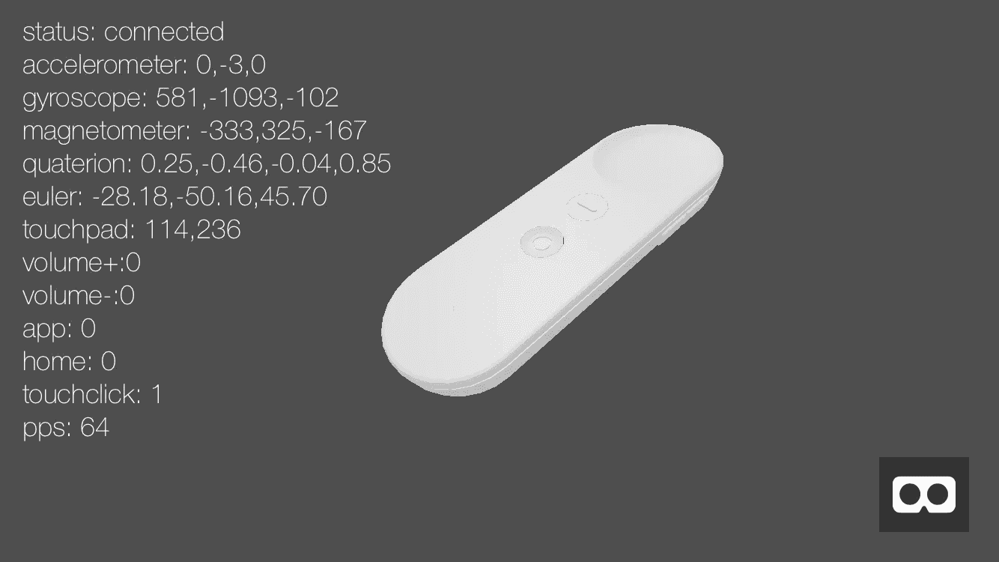*

*(Google Daydream controller running on an iPhone)*

# *结论*

*这种黑客开启的场景是多种多样的。既然秘方已经曝光，兼容性也扩展到了 **iOS** 设备，那么就有可能将这项工作复制到所有桌面平台。这将帮助开发者在桌面环境中调试他们自己的软件，而不需要每次都在智能手机上部署应用。在 **Android** 方面，这个黑客将释放 **Daydream 控制器**的全部潜力，因为它将不再局限于 *OS* **Nougat 7.0** 。*

**

*从这个角度来看，有可能看到 **Daydream 控制器**与旧版本的 **Android** *OS* 一起工作。另一方面，将这个控制器与像 **Raspberry PI** 或 **Arduino** 这样的开源平台绑定，将会扩展制作者和创意者的视野。你会想象用 **Daydream 控制器**来驾驶你的无人机或遥控汽车，演奏虚拟的架子鼓或者用虚拟的合成器制造一些声音吗？*

*你想看到**谷歌白日梦控制器**运行在 **Linux** 上吗？看看这个: [**我是如何黑掉谷歌 Daydream 控制器的(第二部分)**](/@matteo.pisani.91/how-i-hacked-google-daydream-controller-part-ii-2d27e6c46aac) **。***

******

> *[黑客中午](http://bit.ly/Hackernoon)是黑客如何开始他们的下午。我们是 [@AMI](http://bit.ly/atAMIatAMI) 家庭的一员。我们现在[接受投稿](http://bit.ly/hackernoonsubmission)并乐意[讨论广告&赞助](mailto:partners@amipublications.com)机会。*
> 
> *如果你喜欢这个故事，我们推荐你阅读我们的[最新科技故事](http://bit.ly/hackernoonlatestt)和[趋势科技故事](https://hackernoon.com/trending)。直到下一次，不要把世界的现实想当然！*

**