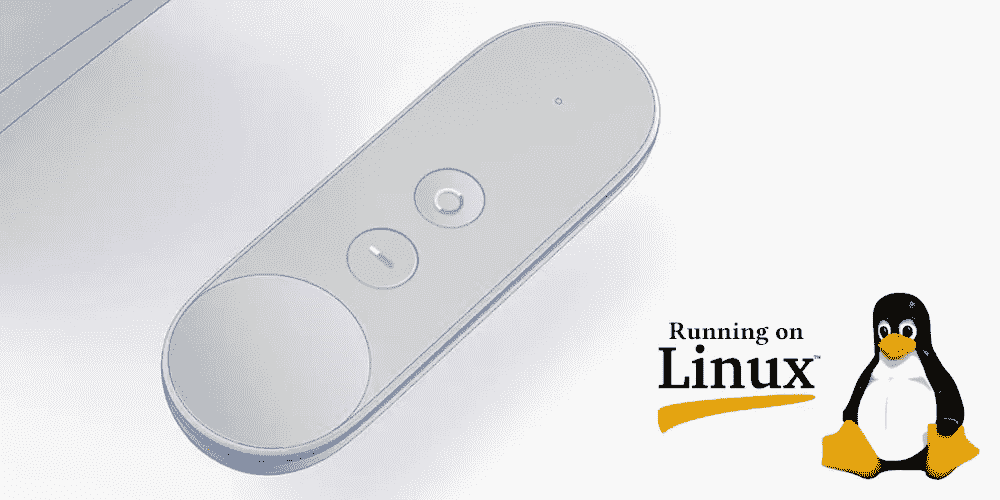
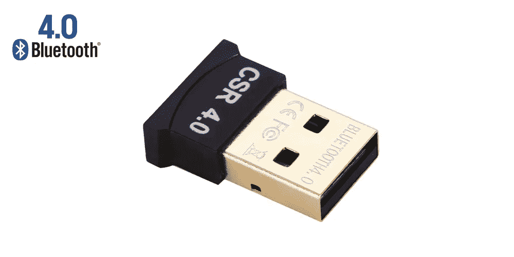
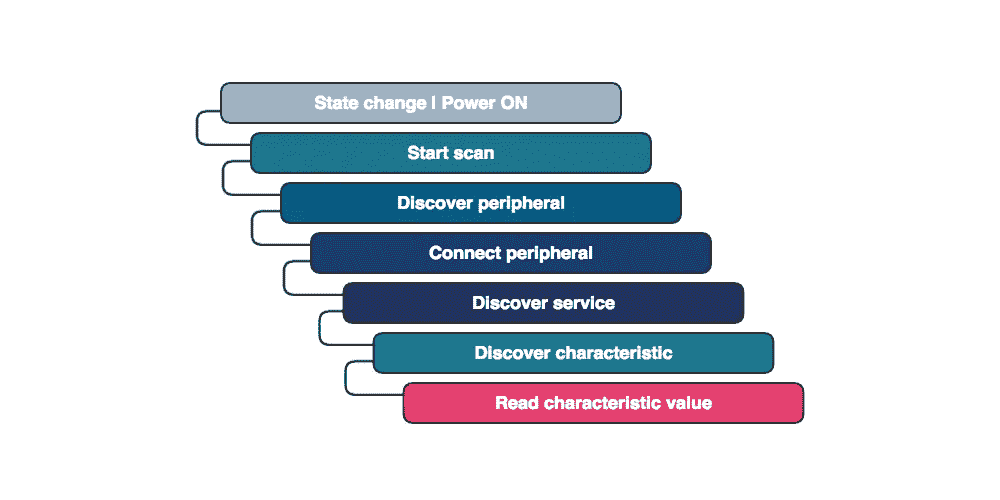
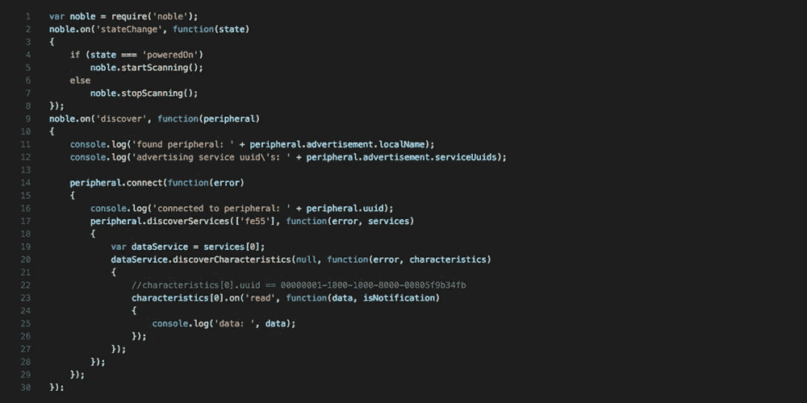
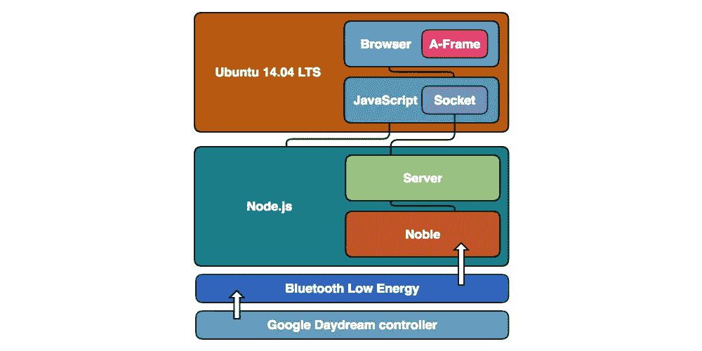

# 我如何黑了谷歌白日梦控制器(第二部分)

> 原文：<https://medium.com/hackernoon/how-i-hacked-google-daydream-controller-part-ii-2d27e6c46aac>

开发跨多个平台的兼容性。

如果你偶然发现了这个，很可能你会想发现这一切是如何开始的: [**我是如何黑掉谷歌白日梦控制器(上)**](https://hackernoon.com/how-i-hacked-google-daydream-controller-c4619ef318e4) 。


在过去的几周里，我继续开发我的黑客技术，任务是将**谷歌白日梦** **控制器**从它的枷锁中解放出来。我现在的目标是将它的兼容性从 **iOS** 扩展到*其他平台*。

首先，对我来说，尽可能多地从我作品的前一章中继承一些东西是很重要的。因此，我继续使用 JavaScript 作为主要的编程语言来快速前进。想到 **JS** ，我偶然发现**noble**([github.com/sandeepmistry/noble](http://github.com/sandeepmistry/noble))一个惊人的 [**Node.js**](https://nodejs.org) 模块，方便实现 **BLE** ( *蓝牙低能耗*)外设。



接下来，我安装了一台全新的[**Ubuntu 14.04 LTS**](https://www.ubuntu.com/)**(*长时间支持*)机器，打开了一个 **shell** 并作为 **sudo** 运行了我为此编写的安装*脚本*:**

```
#!/bin/sh
apt-get update  # To get the latest package lists
curl -sL https://deb.nodesource.com/setup_7.x | sudo -E bash -
apt-get install -y nodejs bluetooth bluez libbluetooth-dev libudev-dev npm
ln -s /usr/bin/nodejs /usr/bin/node # Symlink# Cleanings
apt-get clean
apt-get autoclean
apt-get autoremove
```

**上面的代码安装了入门所需的一切。然而，请记住，要使用 **BLE** 设备，你还需要一个*蓝牙 LE 4.x USB 加密狗*(如下)，以防你的机器不能本地运行它。**

****

**[Bluetooth LE 4.x USB Dongle](https://www.amazon.it/s/ref=nb_sb_noss?__mk_it_IT=%C3%85M%C3%85%C5%BD%C3%95%C3%91&url=search-alias%3Daps&field-keywords=bluetooth+usb+dongle+4.0&rh=i%3Aaps%2Ck%3Abluetooth+usb+dongle+4.0)**

**然后我开始创建一个新的 **Node.js** 脚本，通过[**NPM**](https://www.npmjs.com/)**(*节点包管理器*)安装 **noble** 库:****

```
**npm install noble --save**
```

****完成后，我设法编辑了脚本，添加了对 **noble** 的主要引用:****

```
**var **noble** = require('noble');**
```

****于是我开始实现所需的代码，让**谷歌 Daydream 控制器**与 **Node.js** 对话。****

****下图展示了我通过**蓝牙 LE** 读取 **Daydream 控制器数据**的整个流程:****

********

****这是它在可执行代码中转换后的样子:****

********

******注意**:不要忘记以 **sudo** 的身份运行 **Node.js** 脚本，在某些系统上，硬件接口对于*非 sudoer* 用户是不可访问的。****

****我重用了从我之前的[hack](https://hackernoon.com/how-i-hacked-google-daydream-controller-c4619ef318e4)继承来的基于 [**A 帧**](https://aframe.io/) 的沙盒。这样，我就可以很容易地在 Ubuntu 桌面上制作出谷歌白日梦控制器 T21 的数据包。****

********

****(Google Daydream Controller Desktop Driver Stack)****

****当我开始接收数据时，我通过一个本地 http 服务器即时过滤并公开它:想象一下用架构来处理事情是多么强大。****

****Google Daydream Controller Hacked (Running on Linux | Ubuntu 14.04 LTS)****

****你可能注意到了，这种互动的前景是数不胜数的。由于 **Node.js** 的跨平台特性及其多功能性，很快我们将能够在任何类型的设备上运行**Google Daydream controller**。****

****敬请关注。****

****你错过开头了吗？看看这个: [**我是如何黑掉谷歌 Daydream 控制器的(上篇)**](https://hackernoon.com/how-i-hacked-google-daydream-controller-c4619ef318e4) **。** 或者……也许你有兴趣看一下 ***两个*** **Google Daydream 控制器**同时运行: [**我是如何黑掉 Google Daydream 控制器的(第三部)**](/@matteo.pisani.91/how-i-hacked-google-daydream-controller-part-iii-12e75adc4829) **。******

****[](http://bit.ly/HackernoonFB)********[](https://goo.gl/k7XYbx)********[](https://goo.gl/4ofytp)****

> ****[黑客中午](http://bit.ly/Hackernoon)是黑客如何开始他们的下午。我们是 [@AMI](http://bit.ly/atAMIatAMI) 家庭的一员。我们现在[接受投稿](http://bit.ly/hackernoonsubmission)并乐意[讨论广告&赞助](mailto:partners@amipublications.com)机会。****
> 
> ****如果你喜欢这个故事，我们推荐你阅读我们的[最新科技故事](http://bit.ly/hackernoonlatestt)和[趋势科技故事](https://hackernoon.com/trending)。直到下一次，不要把世界的现实想当然！****

********