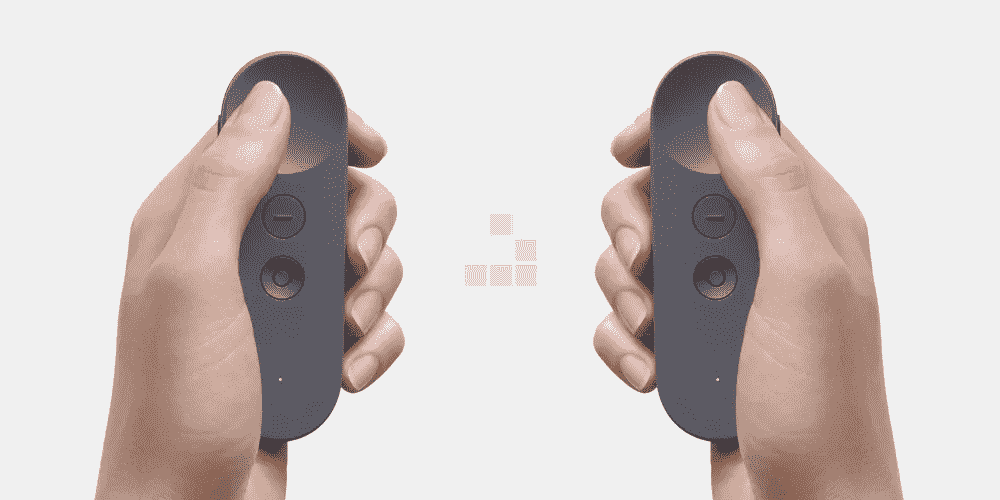
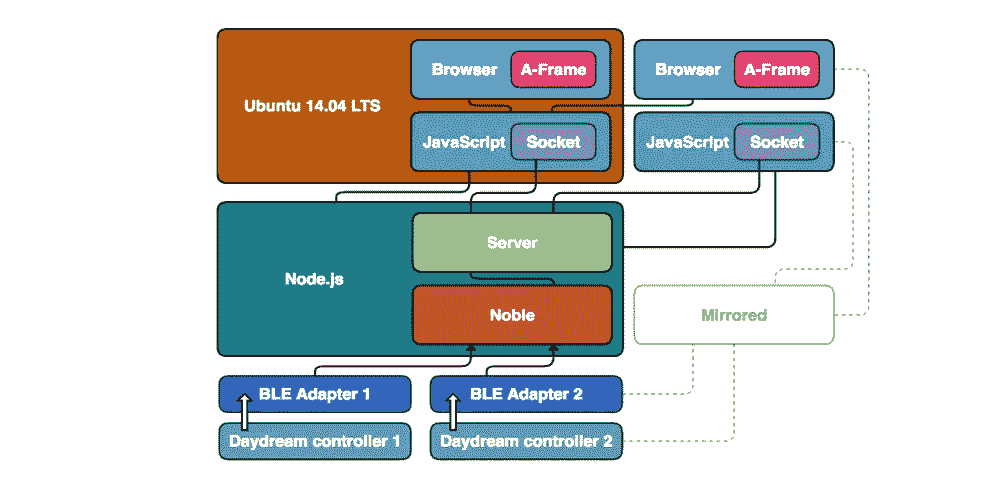

# 我如何黑了谷歌白日梦控制器(第三部分)

> 原文：<https://medium.com/hackernoon/how-i-hacked-google-daydream-controller-part-iii-12e75adc4829>

同时使用两个控制器怎么样？

如果你只是随机登陆到这里，建议你从头阅读一下这次黑客攻击背后的故事:
[**我是如何黑掉 Google Daydream controller 的(上篇)**](https://hackernoon.com/how-i-hacked-google-daydream-controller-c4619ef318e4)[**我是如何黑掉 Google Daydream controller 的(下篇)**](https://hackernoon.com/how-i-hacked-google-daydream-controller-part-ii-2d27e6c46aac)前面的章节会帮助你对这里发生的事情有一个清晰的了解。

一个古老的意大利电视广告的“回报”说“*两个比一个好*”，在 **Remoria VR** ，我们相信这也适用于其他背景，特别是当涉及到 ***虚拟现实时。*** 经过之前的经历，我意识到如果我可以在笔记本电脑上使用一个***谷歌白日梦控制器**，我也可以使用两个***。****

*由于我的笔记本(运行[**Ubuntu 14.04 LTS**](https://www.ubuntu.com))内部已经有了 BLE 适配器，我只需要插上一个外接 [*蓝牙 LE 4.x USB 加密狗*](https://www.amazon.it/s/ref=nb_sb_noss?__mk_it_IT=%C3%85M%C3%85%C5%BD%C3%95%C3%91&url=search-alias%3Daps&field-keywords=bluetooth+usb+dongle+4.0&rh=i%3Aaps%2Ck%3Abluetooth+usb+dongle+4.0) *。接下来，我开始从我之前的代码基础上扩展一点架构。
我镜像了与握手相关的过程，然后我[解码](https://hackernoon.com/how-i-hacked-google-daydream-controller-c4619ef318e4)并通过一个 [Node.js](https://nodejs.org) 脚本将从*第二控制器*捕获的所有数据包转发到它自己的[渲染输出窗口](https://aframe.io/)(位于浏览器中)。**

*最终的方案(从[升级到之前的](https://hackernoon.com/how-i-hacked-google-daydream-controller-part-ii-2d27e6c46aac))如下所示:*

**

*(Google Daydream Controller Desktop Driver Stack | Dual Mode)*

*…我们开始吧，最终结果是:*

*正如您可能已经想到的那样，这种攻击打开了一个机会的宝库:唯一的限制是开发人员的创造力。*

*你错过开头了吗？看看这个:
[**我是如何黑掉 Google Daydream controller 的(第一部分)**](https://hackernoon.com/how-i-hacked-google-daydream-controller-c4619ef318e4) 或者也许你更愿意退一步去看第一次运行在 **Linux** 上的**Google Daydream controller****:**
[**我是如何黑掉 Google Daydream controller 的(第二部分)**](/@matteo.pisani.91/how-i-hacked-google-daydream-controller-part-ii-2d27e6c46aac) **。** 如果你想看更严重的东西，看看这里: [**我是如何黑掉谷歌白日梦控制器的(第四部分)**](/@matteo.pisani.91/how-i-hacked-google-daydream-controller-part-iv-453c7b8c4df4) **。***

******

> *[黑客中午](http://bit.ly/Hackernoon)是黑客如何开始他们的下午。我们是 [@AMI](http://bit.ly/atAMIatAMI) 家庭的一员。我们现在[接受投稿](http://bit.ly/hackernoonsubmission)并乐意[讨论广告&赞助](mailto:partners@amipublications.com)机会。*
> 
> *如果你喜欢这个故事，我们推荐你阅读我们的[最新科技故事](http://bit.ly/hackernoonlatestt)和[趋势科技故事](https://hackernoon.com/trending)。直到下一次，不要把世界的现实想当然！*

**