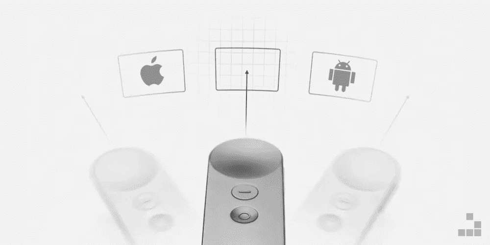
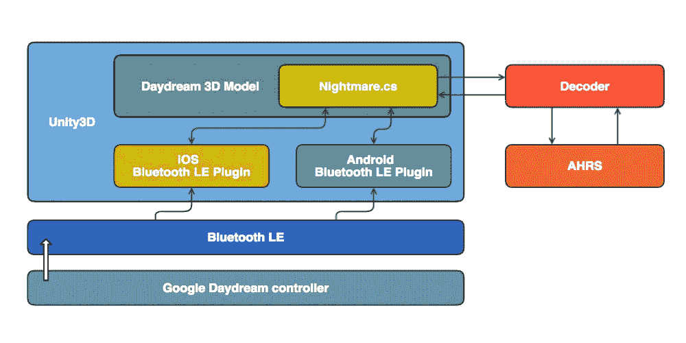

# 我如何黑了谷歌白日梦控制器(第四部分)

> 原文：<https://medium.com/hackernoon/how-i-hacked-google-daydream-controller-part-iv-453c7b8c4df4>

做事更加认真。

“**我是如何黑掉谷歌 Daydream 控制器**的前几章:
[**(上篇)** *反转并使其兼容苹果 iOS 设备。*](https://hackernoon.com/how-i-hacked-google-daydream-controller-c4619ef318e4)
[**(第二部分)** *开发跨多个平台的兼容性。*](https://hackernoon.com/how-i-hacked-google-daydream-controller-part-ii-2d27e6c46aac)
[**(第三部分)** *同时使用两个控制器怎么样？*](https://hackernoon.com/how-i-hacked-google-daydream-controller-part-iii-12e75adc4829)[**(第五部分)**贫民区位置追踪。](https://hackernoon.com/how-i-hacked-google-daydream-controller-part-v-a0ada411271e)

虚拟现实的未来是移动的。[多个消息来源](https://www.google.it/webhp?sourceid=chrome-instant&ion=1&espv=2&ie=UTF-8#safe=off&q=gear+vr+users)报道称，**三星** **Gear VR** **耳机**搭载 **Oculus** 是采用率最高的移动 VR 平台。然而，在这个平台上，移动虚拟现实体验仍然没有达到应有的沉浸感。这有几个原因，其中之一是缺乏跨平台的高性能控制器。

从开发者的角度来看，这种情况让你很难实施可行的解决方案来获得引人注目的移动 VR 体验。

另一方面，当然还有**谷歌 Daydream 控制器**。这是一个伟大的产品，流畅，反应灵敏，设计美观，电池续航时间长，但是……它生来就有一个装甲协议(直到[这个黑客](https://hackernoon.com/how-i-hacked-google-daydream-controller-c4619ef318e4))，并且只与它自己的平台兼容，这个平台很难被广泛采用，因为它只与很少的设备兼容。

“To be **open source**, or not to be **open source**, that is the question” (sorry Shakespeare)

这是一个不能忽视的限制，尤其是对于开发者来说。你越开放，就越容易被采纳。这种思维方式激发了我去破解谷歌白日梦控制器的灵感。

当**谷歌**发布了它的控制器和它的带有[优秀解释参考的平台](https://developers.google.com/vr/daydream/overview)时，它无情地奠定了移动虚拟现实的指导方针，为它所有的后继者打开了道路。

但现在我们试图解决上述所有限制:例如，考虑一个面向移动的 **Unity3D** 开发者，他想开发一个视频游戏或虚拟现实体验并发布它。如果他决定采用**谷歌 Daydream 控制器**作为主要的*输入系统*，他会发现自己不得不在**安卓** **7.x** 智能手机上使用它。只有少数设备可以使用它，这是一个遗憾，尤其是当你考虑到 **Unity3D** 是作为一个跨平台引擎而诞生的，它允许你创建一些可以跨多个平台移植的东西，如 **iOS** 和 **Android** 。

那么，我有没有提到**谷歌 Daydream 控制器**与**三星** **Gear VR 耳机的兼容性问题？**

惊喜，惊喜…

Google Daydream Controller Hacked (Running on Samsung Gear VR compatible smartphone through Unity3D)

## 这是怎么回事？

我在打破谷歌 Daydream 控制器链条方面的挑战，事实上也是我让它开源的宣传，必须继续。所以我决定让我的黑客技术更上一层楼:将它的兼容性扩展到 **Unity3D** 并使其普遍兼容。我想让它不仅能在 **iOS** 上运行，还能在**所有 **Android** 不支持的版本上运行(根据**蓝牙 LE** 兼容性， **≥4.4 KitKat** )。**

好吧，但是…怎么做？

首先，我重构了我的第一次攻击的源代码，其中我在特别的 **JavaScript** *类*中描述了**Google Daydream controller**规范。后来，我在 **C#** 中移植了**解码器**(通过它我解释了最初的 *BLE 包*)和 **AHRS** 系统(它负责*三轴* *跟踪*的绝对方位)。

Nightmare driver architecture: making Google Daydream an universal controller.

在 **Unity3D** IDE 里面导入了 **Google Daydream controller** 的一个 [**3D 模型**](https://github.com/TechnoBuddhist/VR-Controller-Daydream) 之后，我创建了一个“***nightman . cs***”脚本，我把它赋给了游戏对象。这个驱动通过原生插件抽象出*蓝牙*设备的底层通信接口(针对 **iOS** 和 **Android** )。它负责扫描和配对过程，以及通过可用通道进行数据通信。

握手程序完成后，司机需要几秒钟时间来找到*蓝牙*设备。最后，我能够以一种完全流畅且反应灵敏的方式与谷歌白日梦控制器互动。

Google Daydream Controller Hacked (Running on iOS through Unity3D)

你觉得自己一路走来错过了什么吗？阅读《**我是如何黑掉谷歌 Daydream 控制器**的》前几章可能会帮助你理解事情是如何开始的:
[**(第一部分)** *反转并使其兼容苹果 iOS 设备。*](https://hackernoon.com/how-i-hacked-google-daydream-controller-c4619ef318e4)
[**(第二部分)** *开发跨多个平台的兼容性。*](https://hackernoon.com/how-i-hacked-google-daydream-controller-part-ii-2d27e6c46aac)
[**(第三部)** *同时使用两个控制器怎么样？*](https://hackernoon.com/how-i-hacked-google-daydream-controller-part-iii-12e75adc4829)[**(第五部分)**贫民区位置追踪。](https://hackernoon.com/how-i-hacked-google-daydream-controller-part-v-a0ada411271e)

> [黑客中午](http://bit.ly/Hackernoon)是黑客们如何开始他们的下午。我们是 [@AMI](http://bit.ly/atAMIatAMI) 家庭的一员。我们现在[接受投稿](http://bit.ly/hackernoonsubmission)并乐意[讨论广告&赞助](mailto:partners@amipublications.com)机会。
> 
> 如果你喜欢这个故事，我们推荐你阅读我们的[最新科技故事](http://bit.ly/hackernoonlatestt)和[趋势科技故事](https://hackernoon.com/trending)。直到下一次，不要把世界的现实想当然！

