# 我如何黑了谷歌白日梦控制器(第五部分)

> 原文：<https://medium.com/hackernoon/how-i-hacked-google-daydream-controller-part-v-a0ada411271e>

贫民区定位追踪。

“**我是如何黑掉谷歌 Daydream 控制器**的前几章:
[**(上篇)** *反转并使其兼容苹果 iOS 设备。*](https://hackernoon.com/how-i-hacked-google-daydream-controller-c4619ef318e4)
[**(第二部分)** *开发跨多个平台的兼容性。*](https://hackernoon.com/how-i-hacked-google-daydream-controller-part-ii-2d27e6c46aac)
[**(第三部分)** *同时使用两个控制器怎么样？*](https://hackernoon.com/how-i-hacked-google-daydream-controller-part-iii-12e75adc4829)[**(第四部分)**做事更加认真。](https://hackernoon.com/how-i-hacked-google-daydream-controller-part-iv-453c7b8c4df4)

## 序

我从小就喜欢拆卸玩具。我喜欢浏览隐藏在塑料背后的东西，去发现赋予万物生命的魔力。当我发现电路而不是齿轮时，我感到很惊讶:这是我第一次遇到电子设备。

很快，我发现自己被一大堆拆开的玩具包围了。当时，我意识到我必须做些什么来拯救他们，否则有人会把他们都扔了。我很早就开始练习“修补”艺术来创作一些作品。我想创造更好的玩具，有一些额外的功能:一些独特的东西给我的朋友看。

时间过去了，但我的态度并没有改变，更确切地说，我只是换了我的玩具:这就是我发现**谷歌白日梦控制器**时发生的事情。

仅仅用一个乒乓球和一些硬件工具，我能做什么呢？一个 **DIY 位置跟踪**。

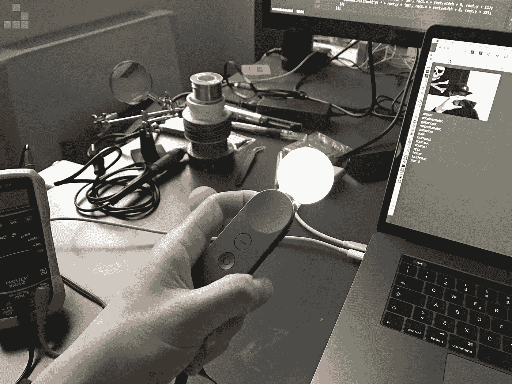

Google Daydream controller hack with a positional tracking light.

## 五金器具

我开始用一个结实的吉他拨片将**白日梦控制器**的两个主体分开，将它放入外缘的缝隙中。上半部分(装有*触摸板*的部分)用两个夹子固定在底壳上；两部分的下半部分粘在一起:我不得不用手稍微用力才能把它们分开。

我必须小心不要撕裂连接身体各部分的白色平板。后来，我拧开了固定主印刷电路板的 5 个螺丝，然后我断开了电池。

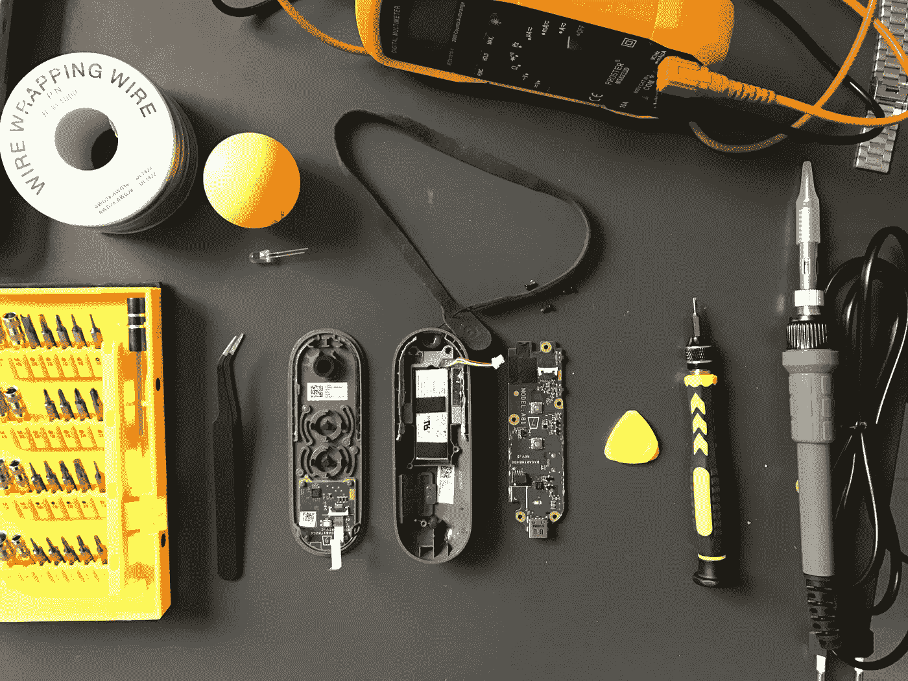

Google Daydream controller teardown.

我选了一个乒乓球，用手钻钻了个洞，然后在里面粘了一个白色的 LED。

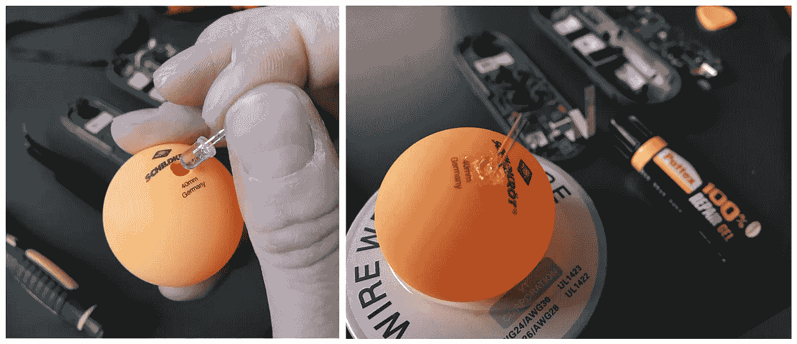

A ping-pong ball with a LED inside the hole.

接下来，我钻了 **Daydream 控制器**的下壳(允许现成按钮的外壳)和上壳(允许 led 的引脚访问内部电路)。

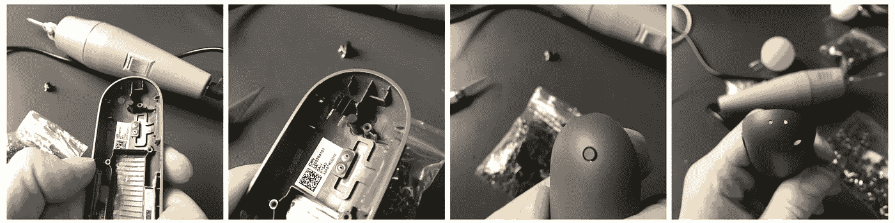

Drills and holes everywhere.

当烙铁的尖端变热时，我在助焊剂中浸泡了一点锡，然后我将两根电线焊接到电源插座的两极( **+** 和 **-** ):从这里我获得了点亮 LED 的电源。

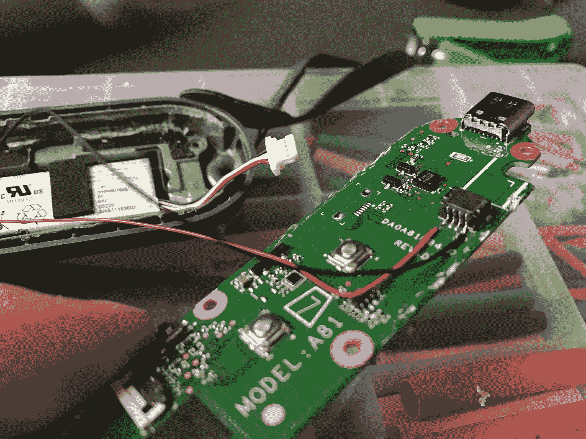

Google Daydream controller master PCB with power derivations from the battery socket.

我把发光二极管的插脚插入我在顶部做的槽中，并根据它们的极性把连接器和电线焊接在一起。

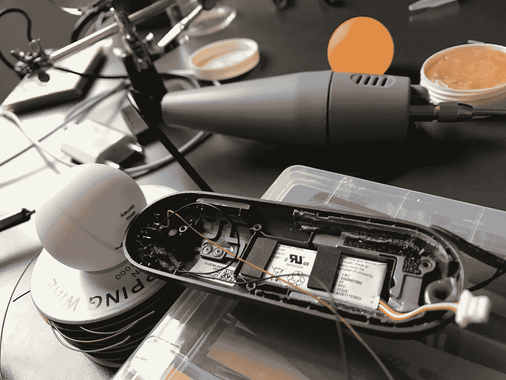

Something gonna happen.

测试一:它有效。

Google Daydream controller hack: positional tracking light test.

用一些绝缘胶带把细小的电线包扎起来。

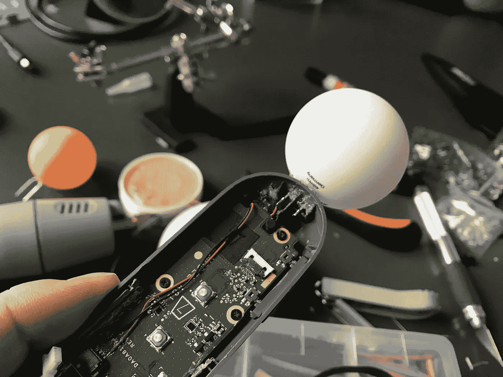

Google Daydream controller hack: positional tracking light

仔细重新组装后，结果如下:前视图和后视图。

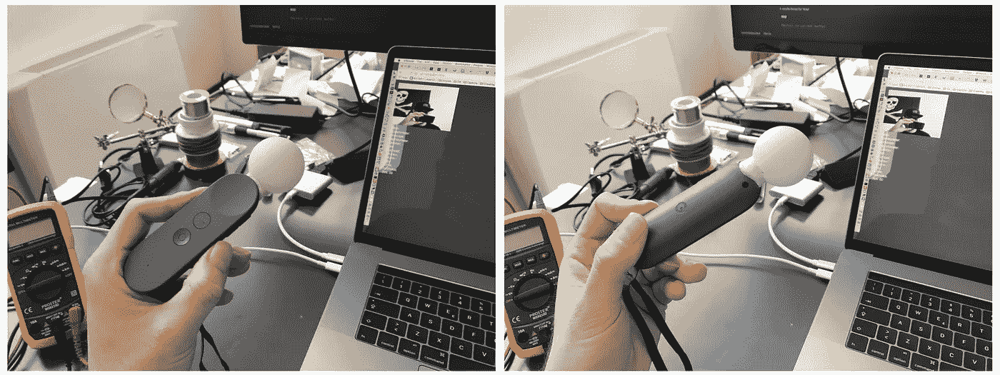

Google Daydream controller hack: positional tracking light (fixed to the bottom case with some putty).

## 软件

位置跟踪可能很难处理，但是……我敏捷地解决了“在浏览器内部”的问题。我找到了 [**tracking.js**](https://trackingjs.com/) ，这是一个令人惊叹的开源 **JavaScript** 库，我之前曾用它通过笔记本电脑的网络摄像头追踪物体。实现非常简单:快速阅读文档后，只需进行简短的代码设置就可以完成安装并运行。

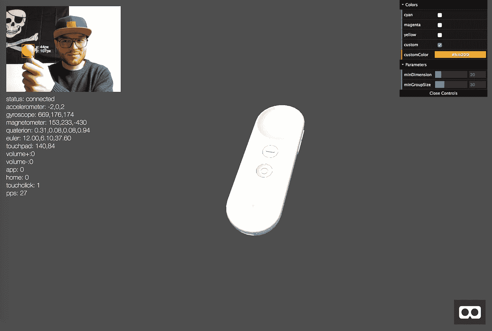

Google Daydream controller: ghetto positional tracking with [A-Frame.io](https://aframe.io/) + [tracking.js](https://tracking.js)

灯周围的跟踪区域根据其与网络摄像头的距离而变化(我将其解释为前后移动的 **z 坐标**)。网络摄像头 FOV 中投影的跟踪区域由一个 **x，y** 坐标系标识，该坐标系允许我沿着轴移动控制器。

作为一个*中间件，*我用[**tracking . js**](https://trackingjs.com/)**来服务于**白日梦控制器** **位置**和**距离**给我的**梦魇. js** *驱动。*这个用的是***框架*作为输出:对于不知道我们在说什么的人，可以查看一下[前面的章节](/@matteo.pisani.91)。****

****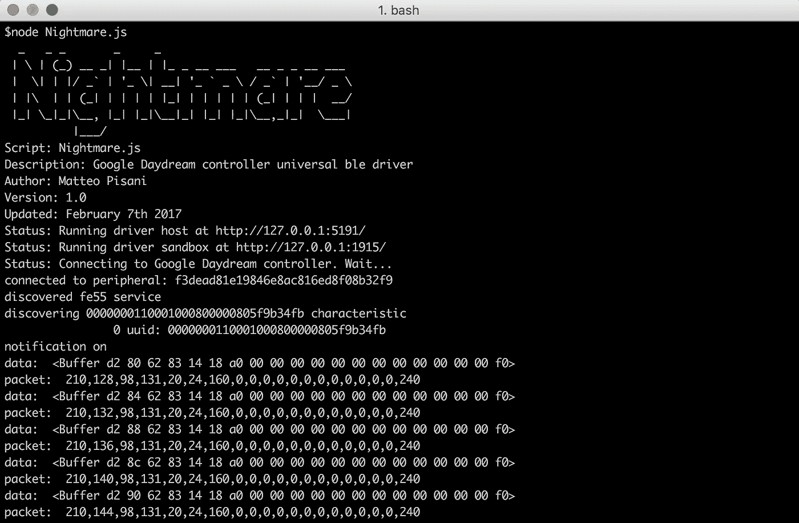****

****Nightmare.js: the Google Daydream controller universal ble driver****

****下面展示了允许我在所有桌面操作系统上使用 **Daydream 控制器**的整个架构。****

****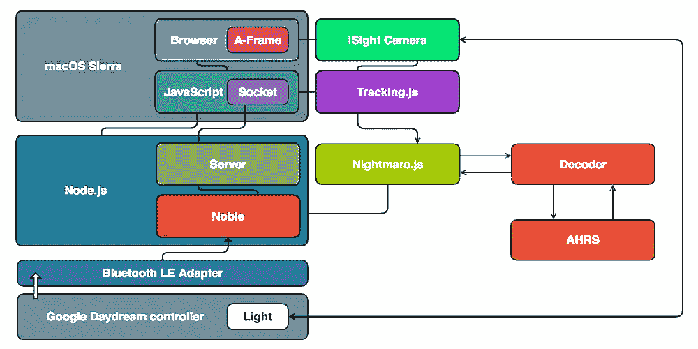****

****(Google Daydream controller universal ble driver stack)****

****好了，女士们先生们，我的贫民窟定位追踪:****

****你觉得自己一路走来错过了什么吗？阅读《**我是如何黑掉谷歌 Daydream 控制器**的》前几章可能会帮助你理解事情是如何开始的:
[**(第一部分)** *逆转并使其兼容苹果 iOS 设备。*](https://hackernoon.com/how-i-hacked-google-daydream-controller-c4619ef318e4)
[**(第二部分)** *开发跨多个平台的兼容性。*](https://hackernoon.com/how-i-hacked-google-daydream-controller-part-ii-2d27e6c46aac)
[**(第三部分)** *同时使用两个控制器怎么样？*](https://hackernoon.com/how-i-hacked-google-daydream-controller-part-iii-12e75adc4829)[**(第四部分)**做事更加认真。](https://hackernoon.com/how-i-hacked-google-daydream-controller-part-iv-453c7b8c4df4)****

****新章节可用！
[**(第六部分)** *利用 AI 构建更好的 VR/AR 打字系统*。](https://hackernoon.com/how-i-hacked-google-daydream-controller-part-vi-11297b9efe34)****

************************

> ****[黑客中午](http://bit.ly/Hackernoon)是黑客如何开始他们的下午。我们是 [@AMI](http://bit.ly/atAMIatAMI) 家庭的一员。我们现在[接受投稿](http://bit.ly/hackernoonsubmission)并乐意[讨论广告&赞助](mailto:partners@amipublications.com)机会。****
> 
> ****如果你喜欢这个故事，我们推荐你阅读我们的[最新科技故事](http://bit.ly/hackernoonlatestt)和[趋势科技故事](https://hackernoon.com/trending)。直到下一次，不要把世界的现实想当然！****

********