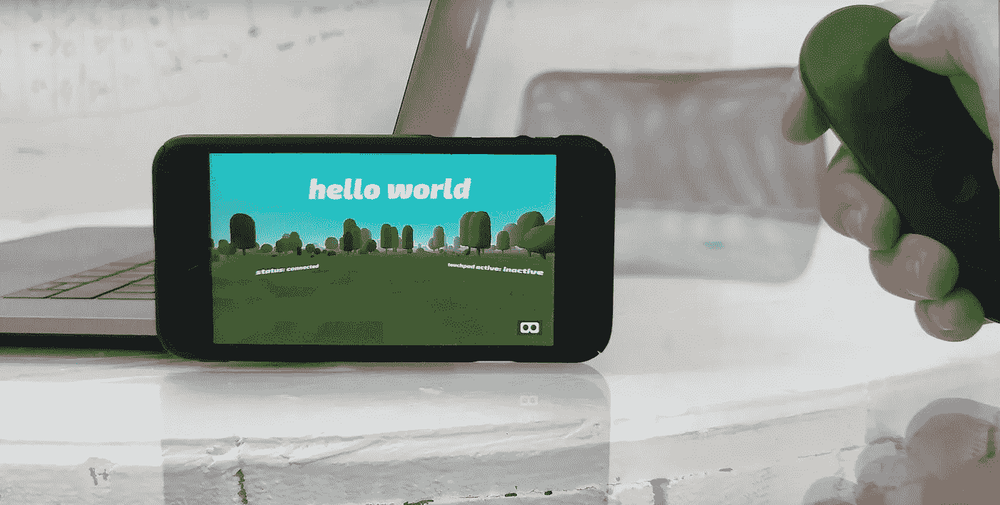
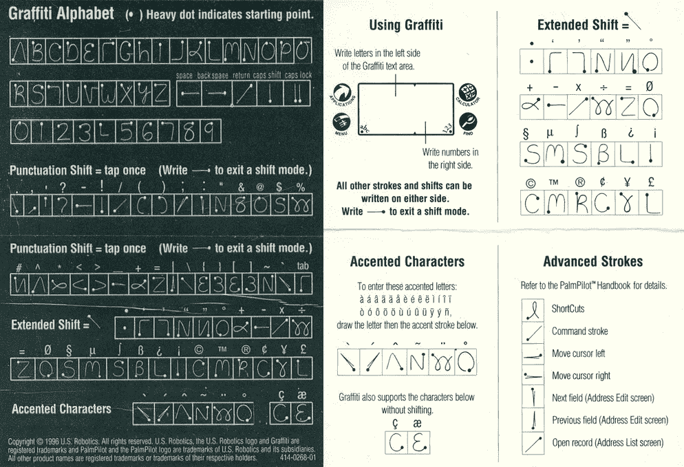
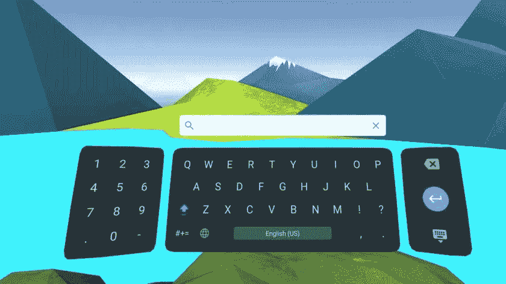
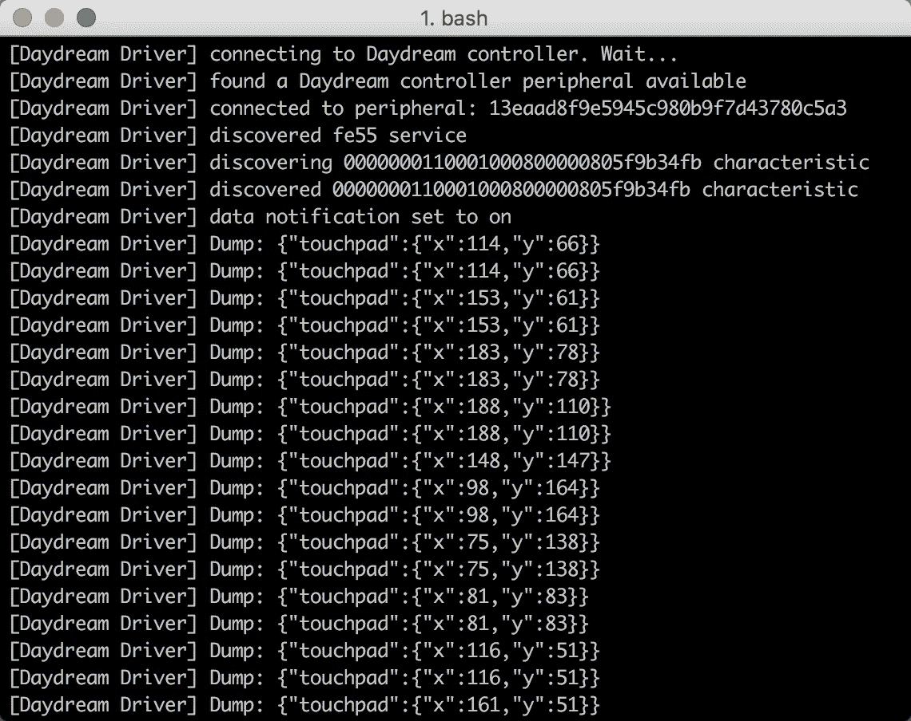
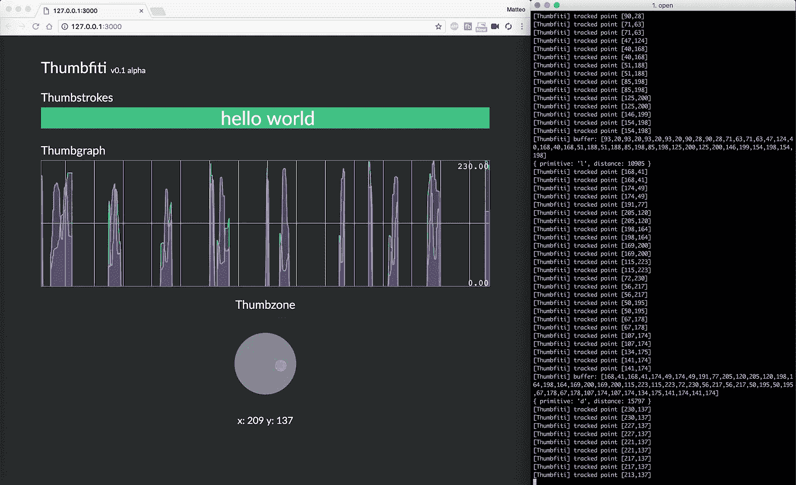
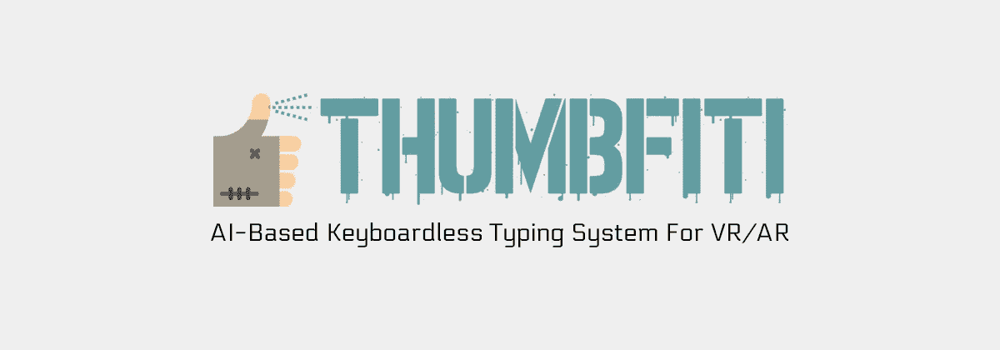

# 我如何黑了谷歌白日梦控制器(第六部分)

> 原文：<https://medium.com/hackernoon/how-i-hacked-google-daydream-controller-part-vi-11297b9efe34>

用 AI 构建更好的 VR/AR 打字系统。

“**我是如何黑掉谷歌 Daydream 控制器**的前几章:
[**(上篇)** *反转并使其兼容苹果 iOS 设备。*](https://hackernoon.com/how-i-hacked-google-daydream-controller-c4619ef318e4)
[**(第二部分)** *开发跨多个平台的兼容性。*](https://hackernoon.com/how-i-hacked-google-daydream-controller-part-ii-2d27e6c46aac)
[**(第三部分)** *同时使用两个控制器怎么样？*](https://hackernoon.com/how-i-hacked-google-daydream-controller-part-iii-12e75adc4829)[**(第四部分)**做事更加认真。](https://hackernoon.com/how-i-hacked-google-daydream-controller-part-iv-453c7b8c4df4)
[**(第五部分)**贫民区位置追踪。](https://hackernoon.com/how-i-hacked-google-daydream-controller-part-v-a0ada411271e)

Wait, what is this?! More details below.

## 序

“VR 会很大，但 AR 会更大，需要更长的时间。”现在，市场实际上已经启动，主要科技公司的策略也已经出现。无论如何，移动 VR 仍将为 VR 产生占主导地位的“探索者”安装群，与**谷歌** [**白日梦视图**](https://vr.google.com/daydream/) 移动事物从 [**纸板**](https://vr.google.com/cardboard/) 天。与此同时，数字体验开始变得越来越身临其境，让人们在虚拟世界中呆得更久。在所有现实生活与虚拟生活重叠的领域，人们开始有基本需求，比如:写作。

时至今日，与此同时在其他领域虚拟现实技术正在快速发展并在场景中占据稳固的位置， [**输入系统**](https://www.youtube.com/results?search_query=vr+keyboard) 似乎还停留在 [**石器时代**](https://en.wikipedia.org/wiki/Stone_Age) 。

But… Can something old be futurist?

## 开始

有一个神秘的词叫做**，它在我大脑的理性和创造性之间架起了一座桥梁。当我怀旧的时候，某种神奇的事情发生了。作为一名对技术充满热情的 90 后，意味着至少拥有一台这样的掌上电脑:**

****

**R.I.P. [Palm Inc](https://en.wikipedia.org/wiki/Palm,_Inc.).**

**第一个模型离数字议程还很遥远。装备了电阻屏幕笔尖的武器*他们真的玩了老派*。作为所有者，通过浏览手册，我发现了一个奇特的功能，叫做 [**涂鸦**](https://en.wikipedia.org/wiki/Graffiti_(Palm_OS)) 。**

****

**Graffiti Alphabet stickers (on the left) | A Palm Pilot User Manual page (on the right).**

**基本上，用笔尖在位于用户界面底部的区域(所谓的“ [**涂鸦**](https://en.wikipedia.org/wiki/Graffiti_(Palm_OS)) 文本区域”)上绘图，可以书写字符和笔画。**

## **回到未来**

**除了游戏，应用程序和网络的相关部分也在向虚拟现实转移。但是……”人们在虚拟环境中打字的真实感受是什么？!"。毫无疑问，数字键盘很可爱，预测算法也很有帮助，尽管在每个字母上点击*来写一个单词可能会令人沮丧。另一个缺点是它们占据了可见空间。***

**也许一个秘密的阴谋想要我们所有的鼓手…**

****

**[Google’s Daydream Keyboard](https://play.google.com/store/apps/details?id=com.google.android.vr.inputmethod) promises “easy typing” in Virtual Reality.**

**通常一个想法始于正确的问题，但很多时候答案并不完全在当下。挖掘我过去的记忆，我发现)**的涂鸦与此同时 [**艾**](https://en.wikipedia.org/wiki/Artificial_intelligence) 的蚊子在我耳边嗡嗡作响。****

****下一步很容易预测:**给 touchpad 一个大脑，让它在虚拟世界中更智能地打字**。****

## ****新生****

****作为一个需要准备药剂的炼金术士，一切都从掸去旧魔法书的灰尘开始。我把一些“ **npm 安装**”和一些 **JavaScript** 果汁放进大锅里，然后我把它们和一些 [**数学算法**](https://en.wikipedia.org/wiki/K-nearest_neighbors_algorithm) 和显然是龙的指甲混合在一起。从我之前的 [**破解中分离出一些功能**](/@matteo.pisani.91) 我毒化了主驱动程序脚本(它允许我通过**蓝牙 LE** 与**谷歌 Daydream** 控制器通信)来直接在我的笔记本电脑上读取**原始触摸板数据**。****

********

****[Node.js](https://nodejs.org/it/) Daydream Driver running on macOS.****

****于是，我迅速设置了一个工具来存储和分类所有由**拇指手势触发的**触摸板** **交互**。**更少的过滤来提高记录的质量**训练数据集**和我得到的开始一个 [**监督学习**](https://en.wikipedia.org/wiki/Supervised_learning) 的过程。再多一些[**socket . io**](https://socket.io/)**绑定在幕后让它活起来然后，再用一点 [**自举**](http://getbootstrap.com/) 造型来美化它。******

****最终的结果令人惊讶，作为一个传统，我决定将这个工具命名为 **Thumbfiti** 。****

********

****Thumbfiti v0.1 alpha.****

****Thumbfiti v0.1 alpha video demo.****

****(为了避免成为 **Palm** 和 **Xerox** 之间关于折磨**涂鸦**的笔画地图的专利侵权的争论的一部分，我应用了一些编辑来构建第一个字母表)。****

## ****一些具体的东西****

****大多数时候，看到一个原型成型意味着几次迭代，磨难和明确的，它可能需要很长一段时间，但是…幸运的是，我真的喜欢在我的项目名称后面加上一个“阿尔法”，啊哈！(开玩笑)。受到鼓舞的感觉加上雄心和相当大的热情推动 Thumbfiti 向前发展。****

********

****看一看 [**这里的**](https://www.youtube.com/watch?v=QoTIzP3AeYc) 来看看它的行动和品味潜力。****

****那都是乡亲们！
谢谢你。****

******我是如何黑掉谷歌 Daydream 控制器**的前几章:
[**(上篇)** *反转并使其兼容苹果 iOS 设备。*](https://hackernoon.com/how-i-hacked-google-daydream-controller-c4619ef318e4)
[**(第二部分)** *开发跨多个平台的兼容性。*](https://hackernoon.com/how-i-hacked-google-daydream-controller-part-ii-2d27e6c46aac)
[**(第三部分)** *同时使用两个控制器怎么样？*](https://hackernoon.com/how-i-hacked-google-daydream-controller-part-iii-12e75adc4829)[**(第四部分)**做事更加认真。](https://hackernoon.com/how-i-hacked-google-daydream-controller-part-iv-453c7b8c4df4)
[**(第五部分)**贫民区位置追踪。](https://hackernoon.com/how-i-hacked-google-daydream-controller-part-v-a0ada411271e)****