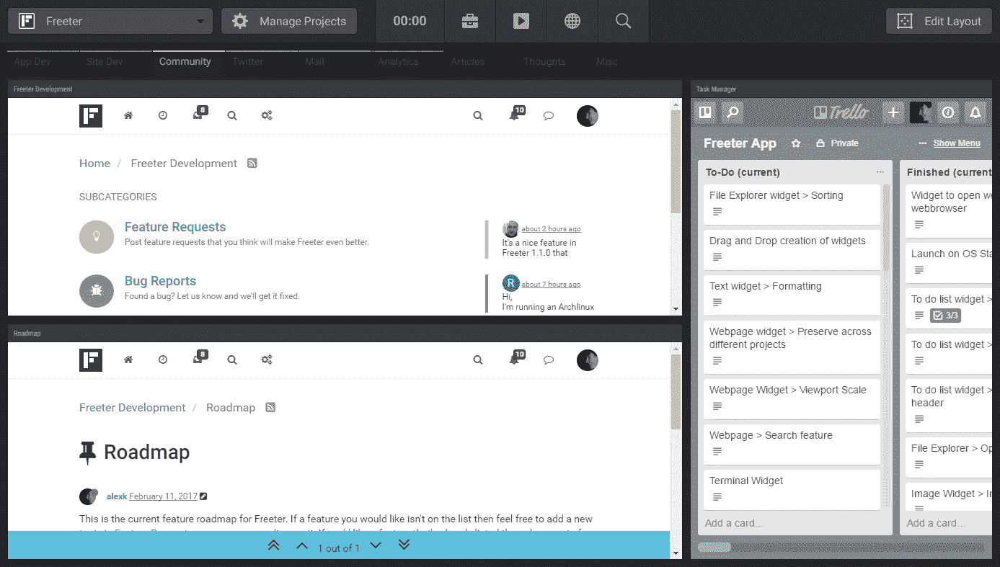
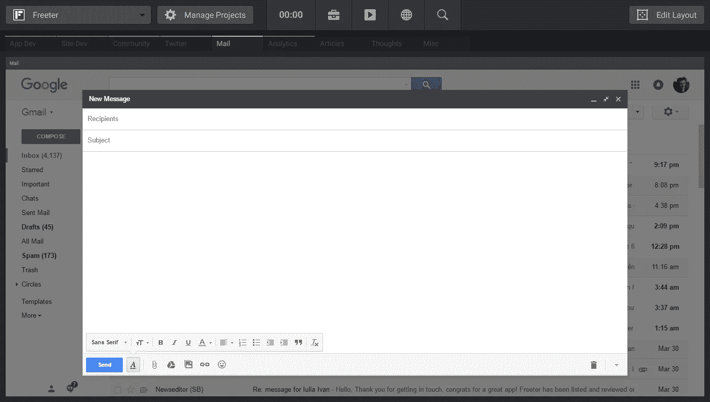
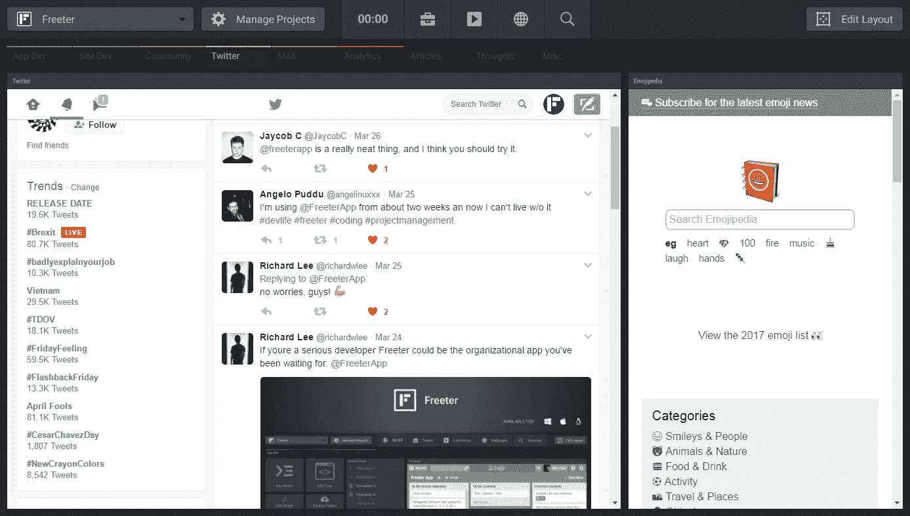
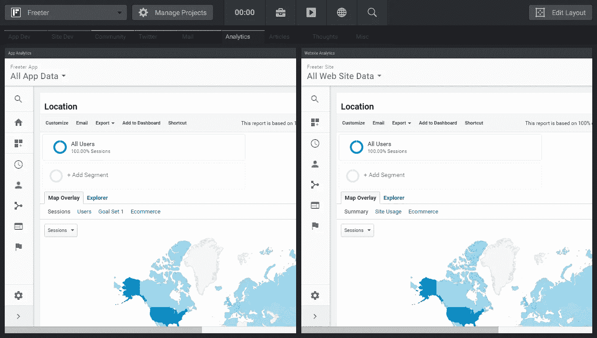

# 我如何侵入我的工作流程

> 原文：<https://medium.com/hackernoon/how-i-hacked-my-workflow-45e328ad8d9b>

作为一名自由职业的 web 开发人员和产品制造商，我必须不断地在编辑代码和模型、管理待办事项列表、执行命令行、检查电子邮件和 Twitter 以及分析用户行为之间来回切换。这需要一直做大量重复的动作。启动代码或图像编辑器并打开项目文件。打开 web 浏览器，导航到 Trello 中的项目板。启动终端并在其中键入命令。每样东西都有不同的访问方式，存储在不同的地方。这使得[工作流程](https://hackernoon.com/tagged/workflow)变得一团糟，尤其是在处理多个项目的时候。我认为通过把我工作中需要的所有东西都集中到一个地方，并按照项目和工作流程进行组织，我可以极大地提高我的[工作效率](https://hackernoon.com/tagged/productivity)。每件事都有一个正确的背景，在工作中找到我需要的东西不会再变成一场噩梦。这就是我如何想出 [Freeter](https://freeter.io/?ref=medium) 的原因——这款应用就是这么做的。

在这篇文章中，我将通过一个工作流程的例子来展示我是如何使用 [Freeter](https://freeter.io/?ref=medium) 提高我的工作效率的。希望这也能帮助你了解如何改进你的工作流程。

# 工作流程

首先，我分析了我的工作流，包括所有“子工作流”和我经常使用的任何东西，以找到我在从事 Freeter 项目时需要的东西:

1.  当我开发一个应用程序或网站时，我需要用代码和图像编辑器打开应用程序/网站文件，访问我的任务管理器，启动文件监视器，用 GitHub 打开存储库，进行备份，并构建应用程序/网站版本。
2.  当我与社区讨论新特性时，我需要访问 Freeter 开发论坛、路线图帖子和我的任务管理器。
3.  当我查看电子邮件时，我需要进入我的一个谷歌邮件账户。
4.  当我在 Twitter 上查看提及和回复推文时，我需要访问通知和 Emojipedia。
5.  当我在应用程序/网站中分析用户行为时，我需要访问 Google Analytics 中的报告。

现在是时候在 Freeter 中将工作流转换成仪表板了——每个工作流一个仪表板，以保持一切井然有序且易于访问。

# 应用程序/网站开发

为了快速访问开发应用程序/网站所需的所有内容，我设置了一个包含以下小部件的仪表板:

*   文件打开器，它用代码编辑器打开项目文件夹。
*   文件打开器，用图像编辑器打开设计模型。
*   文件打开器，用 GitHub 打开项目资源库。
*   文件资源管理器，有助于浏览项目文件夹和打开文件。
*   Commander，它会启动文件查看器(大口查看)。
*   Commander，构建应用程序/网站的生产版本。
*   指挥官，它支持这个项目。
*   网页，它将 Trello 板嵌入到仪表板中。

App Dev dashboard

这个仪表板使我能够立即切换到开发工作流，通过简单的点击启动所有开发项目，并快速访问我的任务。

# 社区

为了与社区讨论新功能和错误报告，将新功能添加到公共路线图中，并将其转化为 Trello 板上的任务，我添加了一个仪表板，上面有三个网页小部件:

1.  将 Freeter 开发页面嵌入到仪表板中。
2.  将路线图帖子嵌入仪表板。
3.  将 Trello 板嵌入仪表板。

Community dashboard

有了这个仪表板，我可以讨论新的特性请求，将它们添加到路线图中，并从一个窗口向 Trello 添加任务。

# 电子邮件

为了检查电子邮件，我添加了一个仪表板，其中的网页小部件嵌入了我的一个谷歌邮件帐户。我在 widget 设置中设置了 Session = Project，以便从每个项目访问不同的 Google 帐户。

Mail dashboard

这个仪表板允许我快速访问一个特定的谷歌邮件帐户，而不需要注销和登录，如果我以前使用另一个帐户。

# 推特

为了在 Twitter 上查看通知和推文，我添加了一个带有两个网页小部件的仪表板:

1.  将 Twitter 的通知页面嵌入仪表板。我还在小部件设置中设置了 Session = Project，以便从每个项目访问不同的 Twitter 帐户。
2.  将 Emojipedia 嵌入仪表板。

Twitter dashboard

有了这个仪表盘，我可以轻松地查看来自 Twitter 的通知，并用表情符号写一条推文。

# 分析学

为了分析用户在应用/网站中的行为，我添加了一个仪表板，其中有两个嵌入了 Google Analytics 的网页小部件。

Analytics dashboard

这个控制面板允许我同时查看两个属性(应用程序和网站)的报告。

# 像超级英雄一样在工作流程之间切换

现在，当我需要做一些事情时，我只需按下 *Ctrl+Shift+F* 将 Freeter 带到前面，打开一个包含我现在需要的东西的仪表板，然后立即开始做事情。不再有在许多不同的地方寻找东西的麻烦！我可以轻松地在项目中的工作流之间切换，同时保持专注。

> [黑客中午](http://bit.ly/Hackernoon)是黑客如何开始他们的下午。我们是 [@AMI](http://bit.ly/atAMIatAMI) 家庭的一员。我们现在[接受投稿](http://bit.ly/hackernoonsubmission)并乐意[讨论广告&赞助](mailto:partners@amipublications.com)机会。
> 
> 如果你喜欢这个故事，我们推荐你阅读我们的[最新科技故事](http://bit.ly/hackernoonlatestt)和[趋势科技故事](https://hackernoon.com/trending)。直到下一次，不要把世界的现实想当然！

