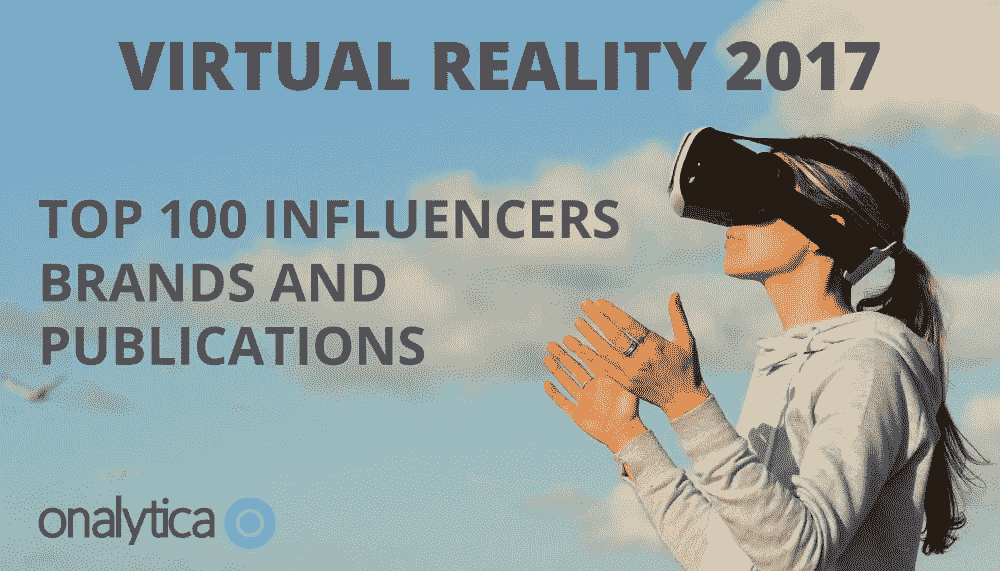
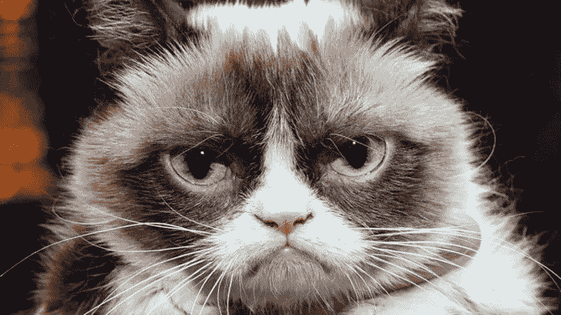
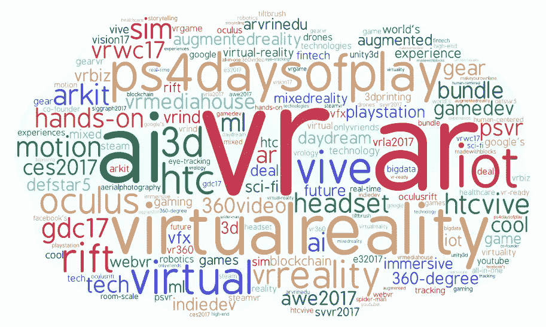
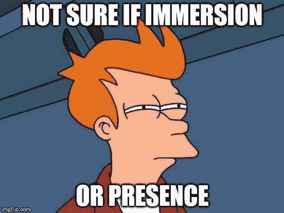
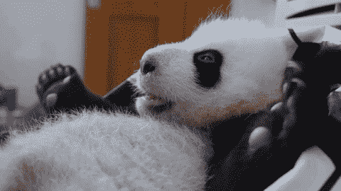

# 我如何成为虚拟现实的影响者(…你也可以)

> 原文：<https://medium.com/hackernoon/how-i-have-become-a-virtual-reality-influencer-and-you-can-too-dbd5c3c4280c>

那是 2017 年 10 月 4 日。我在参加完当地的一个小小的中国中秋节活动后，坐在回家的公交车上，嘴里还残留着我吃过的月饼的味道。我开始查看我的 facebook 通知，和一些朋友聊天。有一条来自 **VR 爱好者**

## [虚拟现实 2017:前 100 名影响者、品牌和出版物](http://www.onalytica.com/blog/posts/virtual-reality-2017-top-100-influencers-brands-publications/)

### [2016 年是虚拟现实行业关键的一年，全球出货了近 1 亿台 VR 设备。我们…](http://www.onalytica.com/blog/posts/virtual-reality-2017-top-100-influencers-brands-publications/)

[www.onalytica.com](http://www.onalytica.com/blog/posts/virtual-reality-2017-top-100-influencers-brands-publications/)

在那一刻，我发现我已经成为了虚拟现实的影响者。

哇哦。去年，我几乎无人问津，而现在**我已经跻身虚拟现实世界影响力前 50 名！这是怎么发生的？**

因为要进入这个分类，我使用了网上阅读的建议，**我想回报这个社区**，告诉你我是如何获得我的一点点人气的，这样你就可以从这篇文章中受益，并成为一个有影响力的人……希望比我更好(老实说，**我对被定义为有影响力的人感到奇怪**，我甚至讨厌这个词，正如我在[我的另一篇文章](https://skarredghost.com/2017/10/06/top-50-virtual-reality-influencers-2017/)中解释的那样)。

Header of the Onalytica report that identified the top 100 brands, magazines and influencers of VR ecosystem

# 漫长的道路

老实说，要成为有影响力的人没有简单的方法。或者更好，有一些，但并不总是可行的:

1.  如果你有很多钱，你可以开始在营销上花很多钱，为你的帖子代笔，影响者营销等等，很容易获得追随者；
2.  你可能会有运气。也许你只是在网上发布一张你的猫的照片，然后变得超级有名。也许你的视频在 Youtube 上火了。也许吧。**但这种情况真的很少发生。**。这就像中了彩票一样。所以，不要指望这个…如果真的发生了，我真的为你高兴。

No, it won’t happen

不幸的是，**我没钱，运气更差。所以，随着时间的推移，我必须努力克服一切。该死的每一天。如果生活给了你柠檬，那就做一杯杜松子酒吧。**

你将需要大量的时间和努力才能到达你想要到达的地方，这将是非常漫长和艰难的。记住这一点。

The long road. Actually, this is even too short…

# 开始吧

当我在我的 [Immotionar 初创公司](http://www.immotionar.com)工作时，我的好友 [Gianni Rosa Gallina](http://twitter.com/giannirg) 有一天告诉我，我必须恢复我休眠的 Twitter 账户，开始发送一些关于我们项目的垃圾信息。那可能是 2015 年，我绝对不喜欢社交媒体。我不愿意这样做(我太懒了)，但 Gianni 鼓励我开始，只是在推特上发布一些我们博客文章的链接。最后，我照做了，第一次我只是开始发一些他给我看的虚拟现实相关链接。我开始在推特上发布一些随机的标签(#VR、#gamedev、#VirtualReality 等等)，我注意到我开始有了一些追随者。我仍然感谢詹尼最初的努力:它帮助我走到了现在的位置。

这就是一切的开始。正如你所看到的，并没有什么史诗般的开始:我只是再次开始使用几年前我休眠的 twitter 账户，并在 Twitter 上发布随机的虚拟现实相关链接。

从这里可以学到:

*   如果你不买票，你就不能中彩票。因此，如果你想拥有知名度，你必须开始拥有一个社交账号并使用它。这似乎是显而易见的，但事实并非如此；
*   **你一定不是以一种完美美好的方式开始的。**这些年我学到的是，最好的是在持续改进的迭代中做事。**开始做蹩脚的事情，然后随着时间不断改进**。如果你想以完美的方式开始，你开始阅读大量的营销链接，但最终你从未开始。开始吧。

I’ll report this sentence that everyone uses because it is very cool quoting some Chinese people

# 随着时间的推移而改进

以一种蹩脚的方式开始是令人敬畏的，并且**让你在平均**中获得自信。随着时间的推移，你会开始意识到你犯的所有错误，并改正它们。**随着时间的推移，你必须改进你的社交媒体策略**，否则你将陷入成为另一个社交媒体用户的困境。你必须瞄准星星，所以你想充分利用你的数字工具。

我做了什么来提升自己？嗯，各种各样的事情……例如:

*   **我开始分析什么时候推文最受关注**。我知道，如果我在意大利上午 10 点发微博，几乎不会有人转发。如果我在晚上 10 点发同样的微博，我会得到赞和转发。所以我把我的推文集中在最有希望的时机上；
*   我开始使用正确的标签:一些标签会给你一些 twitter 机器人的转发:例如，当我开始使用时，添加#alldev 会自动给我一个来自“All Dev Bot”的转发，这个“All Dev Bot”有大约 700 个追随者。所以，当我在推特上发布一些与发展相关的东西时，我总是会加上那个标签；
*   **我开始使用**[**Tweetdeck**](http://tweetdeck.twitter.com/)**来安排我的推文**；
*   我开始关注并与其他 VR 影响者互动。我了解了他们的行为方式，他们成功的原因，并试图模仿他们。再者，与他们互动，我得到了他们一些追随者的关注；

These are the most used VR-related hashtags on Twitter (Image by Onalytica)

然后我进入下一个层次，混合不同的平台:

*   我开始使用其他社交媒体，如 Linkedin、Reddit、Medium、Hacker News、Quora，并尝试在所有这些媒体上发表自己的观点。成为社区的一员让我获得了更多的关注者(例如，已经在脸书被提及的恩里科·斯佩兰萨现在是我在 Twitter 上的关注者),并且在新的有趣新闻一出来就阅读它们，这样我就可以在我的社交媒体上转发它们，增加我的用户群。更多的社交媒体意味着更多开始和改善的地方……例如，我现在正在改善我在 Linkedin 上的形象，之前我在那里的开始也很糟糕；
*   我打开了我的博客。社交媒体不足以表达我的观点，博客才是最适合我的:**所以我从** [**【幽灵嚎叫】**](https://skarredghost.com/2017/08/17/year-vr-blogging-takeaway/) **开始了我的冒险。发布有趣的内容让我有了更多的关注者，自从我在 4 月 1 日重新设计我的博客以来，我的关注者每天都在增加。即使有了我的博客，**我开始写非常粗糙的帖子，然后发展到写复杂的帖子**，就像这个关于[大脑计算机接口和 VR](https://skarredghost.com/2017/10/01/need-know-brain-computer-interfaces-virtual-augmented-reality/) 的帖子。**

因此，过程总是这样:以某种方式开始。然后学习如何改进和迭代。继续这样，永远。然后开始以一种平庸的方式使用一个新的平台，并以此开始改进。

但是，如何才能提高呢？嗯，有三种方法:

1.  **你刚刚注意到的事情**。例如，如果你注意到每次你写“土豆”，你会得到 3 次转发，只要每次都谈论土豆；
2.  你模仿别人。如果你看到你最喜欢的 YouTubers 上有人以某种成功的方式发推，你可以复制他的一点风格；
3.  你通过专门的文章来学习。在谷歌上搜索“如何成为推特影响者”、“如何使用社交媒体”、“推特 10 大秘密策略”，你肯定会在推特上找到很多建议。然后就是专门的课程和书籍。

为了向你展示在我看来你只需要开始，然后改进，我将向你展示我不久前做的这个糟糕的视频。我想尝试一下 Twitch 和 Youtube，所以我对一款游戏做了这样的评价，只是在评价过程中发现，这种体验实际上并不是一款游戏。结果非常可怕，我收到一个人的评论，他说看这个视频就像“看一个婴儿拉第一次屎”。

不过没关系，我刚开始使用这种媒介…我会好起来的。但是我很自豪我尝试了一个新的平台。

# 个性化

没有人喜欢跟着机器人只是发消息。开始表达你的观点，开始与其他人互动。例如，在 Linkedin 上，我发现在我分享的每个链接中加入一点个人句子会更好。

把你的个人风格融入到每一件事情中，人们必须认可你。例如，在我的博客中，当谈论虚拟现实时，我喜欢非正式的风格和使用迷因。可能有人不喜欢…但是对于那些人来说，有更严肃的杂志像 Upload VR 或者 Road To VR。

The meme used in my post where I explained the difference between presence and immersion

这也意味着找到你的正确道路:**例如，我更喜欢写长长的虚拟现实帖子，而不是制作视频**(我想你看了上面那个可怕的视频就明白了)，所以即使大多数人更喜欢制作视频，成为 Youtubers，我仍然喜欢 Wordpress 和 Medium。那就是我。

# 棒极了

除了个人接触，**我的建议是也要试着变得善良、乐于助人、有趣。想象一下你希望遇到的那种有影响力的人，并成为那样的人。例如，我试着:**

*   总是回复电子邮件、评论和推文(或者至少放一个赞)；
*   **帮助其他虚拟现实爱好者提高知名度**:我发关于独立虚拟现实项目的推特，我写关于这些项目的文章，如果多亏了我，他们能得到哪怕一个客户，我也会很高兴；
*   **跟所有给我写信的人开玩笑；**
*   **不拘礼节**。

我认为这种乐于助人并与他们保持良好关系的态度是我成功的原因之一。**这个帖子本身就是我愿意帮助其他人进入 VR 社交世界的产物**。我建议你这样做，无论是在社交媒体上还是在生活中，因为人们会把你视为一个积极的人，这真的很美。

这些都是我喜欢所有其他有影响力的人身上的东西。**例如，我喜欢在 Twitter** 上与超级 XR 影响者 [**玛丽娅·普罗布斯特**](https://medium.com/u/37d5b45c2363?source=post_page-----dbd5c3c4280c--------------------------------) **互动，因为她不仅是一个非常有才华的人，而且她的评论总是让我发笑。像她一样牛逼。**

# 要自信

我从来都不是房间里最聪明的人。我的大部分关注者在 XR，创业公司之类的方面都比我强。没关系。我接受这一点，并继续发微博。我很荣幸我的社区里有这么聪明的人，我很高兴能和他们一起学习。

不要让“我不够聪明”的综合症阻止你。正如中国人所说，“人外有人，天外有天”，意思是“不管你认为自己有多好，总有人比你更好”。即使是你羡慕的聪明人，也有比他们更聪明的人。这是游戏的一部分。刚开始，改进。

Believe in yourself

# 有趣点

你必须写出有趣的东西，才能让人们追随你。“有趣”可能意味着不同的事情，但要点是**跟随你一定是值得的。**

谈到虚拟现实，这可能意味着，例如:

*   **虚拟现实新闻**一发生就报道；
*   **制作令人惊叹的虚拟现实 hs/sw 评论**(如果这发生在预览版的产品上就更好了)。测试过的 VR 家伙已经这样流行了；
*   **给出你对虚拟现实生态系统各种事件的个人观点**；
*   **制作虚拟现实教程**，尤其是针对文档记录较差的主题；

还有很多其他有趣的例子。但是我想你明白了:对你的读者要有趣。记住那句老话“**要获得价值，就得付出价值**”。

就我而言，在我的博客里，我写了一点以上的内容。此外，每周**我会向我的时事通讯订阅者发送精选的本周最有趣的虚拟现实新闻**，这样他们就可以避免每天阅读所有的虚拟现实新闻，并保持更新。我尽力帮忙。

例如，有些人只是在虚拟现实上发些无聊的帖子，假装有很多追随者。它不是这样工作的:只是报道上传 VR 新闻不会带你去任何地方。

# 坚持不懈

如果你在某个特定的周日看过这部电影，你肯定记得阿尔·帕西诺对他的球员做的激励性演讲。否则，花 5 分钟看。

这正是你要做的，日复一日，为你的每一个目标一寸一寸地奋斗。你必须为每一寸而死。你征服的每一寸都会让你付出很大的代价，但最终你可能会到达触地区域。

我这么说是因为**开头真的很令人沮丧**:你发推特，却没有一条转发。你在博客上写了一篇令人惊叹的文章，但只有 10 个人阅读。你给记者和有趣的人写信，他们甚至不考虑你。你投入了大量时间却一无所获……你开始考虑放弃:那些社交媒体太没用了。

你必须争取每一个新的追随者，争取每一个喜欢的人。随着时间的推移，你会成功的……但这真的需要很多时间才能看到你最初的成果。不要放弃。从来没有。如果结果没有如你所愿，那就意味着你必须改进:学习新的战术，再试一次。试错加坚持能让你走得更远。

这将需要你很多时间，这将需要你生活的一部分。因为每天你都必须打开你的社交媒体渠道并使用它们，**即使你很累并且不想这样做**。这是你必须做的投资。一种牺牲。使用社交媒体不仅有趣，还是一项工作。

所以，你必须今天就种下一颗种子，用水、肥料和疲劳让小树继续生长，直到有一天，从最初的那一刻起多年后，你开始看到第一个苹果。**它会很甜，咬着它你会意识到你所有的努力都是值得的。**

如果你想放弃，[给我发一条推特](http://twitter.com/skarredghost)，我会记得你，你必须继续战斗，我还会可选地给你发一张熊猫 GIF。

# 永远继续

没有哪一个阶段你可以说“好吧，我是一个有影响力的人”，然后你就可以开始休息了。相反，你越往前走，你就越需要提高，给你的追随者带来价值。这个过程永远不会结束，所以只有当你有信心一辈子都做这份工作时，才开始。

看着我:**我只是排名第 34 位** …我想爬上梯子，至少在明年达到第 25 位。我想要更多的参与。我希望与 Oculus 和 Valve 等虚拟现实公司建立更好的联系。我想帮助更多的虚拟现实社区。我还有很长很长的路要走。我希望能和大家一起继续这段旅程。

—

希望你喜欢这篇文章。如果是这样的话，请在你的社交媒体上分享它，并来访问我的 AR/VR 博客****。****

**如果你想和我联系，就在 Twitter 或者 Linkedin 上联系我。我很高兴收到你的来信。**