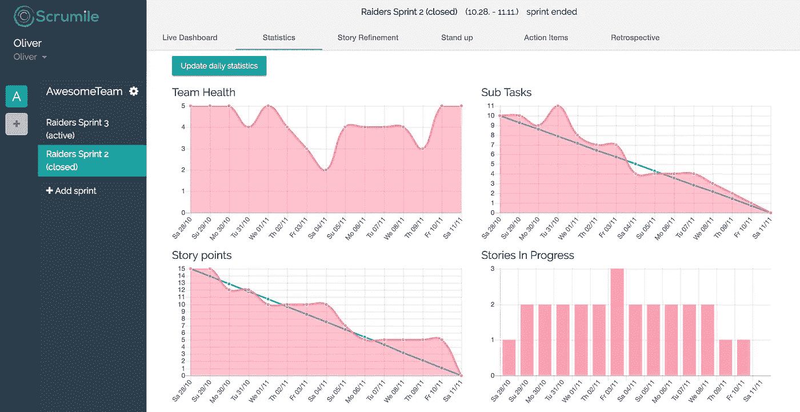
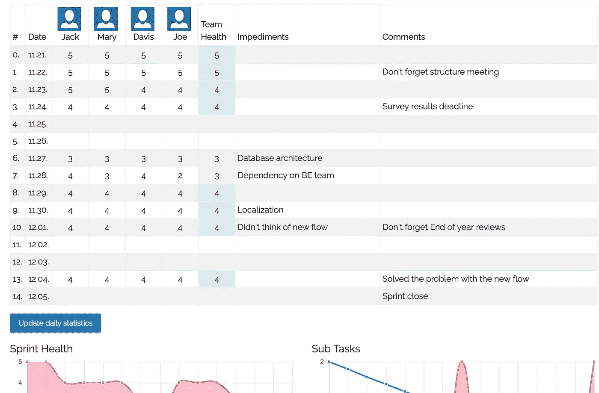

# 我如何通过新的议程和 Scrumile 的引入来改善我们的日常站立

> 原文：<https://medium.com/hackernoon/how-i-improved-our-daily-stand-ups-with-a-new-agenda-and-introduction-of-scrumile-ece2eaf5bf44>

最近，我花了相当多的时间专注于改进我的团队如何做单口相声，我想到的是，在多个团队中出现了糟糕的实践模式。

## 我们的主要问题

我从我的团队中收集并分析了数据，看起来有两个主要问题使得团队生活更加艰难，我们的日常站立效率更低。

1.  团队未能制定当天的计划
2.  并不是所有重要的话题都会出现

## 每日站立期望

为了解决上述问题，我设定了一些期望，作为一个团队，我们应该在未来实现这些期望。

1.  确保我们有一天的计划(*很高兴听到你昨天做了什么，但这对今天没有帮助*
2.  确保所有的话题都被提出来(*站起来 15 分钟没关系*
3.  确保每个人都明白他们今天必须做什么，这样团队才能在当天和冲刺阶段取得成功
4.  确保团队和产品负责人完全了解 sprint 的进展情况(*，以便我们可以在需要时尽早重新规划 sprint*

最近，我开始使用 Scrumile 工具，它有很多很棒的特性，可以帮助我的团队变得更加成功和高效。幸运的是，它也有很好的每日站立支持，所以我开始使用它，为我们的每日站立创建了一个新的议程和规则。

## 每日站立议程

*   首先打开 [Scrumile](https://www.scrumile.com) 中的 **Live Dashboard** 选项卡(它支持对正在发生的事情进行很好的概述，没有太多分散注意力的信息)
*   四处走动，每个团队成员通过回答以下问题来解释他们的计划和进展:

> 你今天打算做什么？
> 
> 如果你成功完成了今天的计划，这会对你正在写的故事产生什么影响？(本质上是制定一个故事何时结束的计划)
> 
> 有人能帮你写你正在写的故事吗？(帮助团队关注重要的事情)
> 
> 你面前有什么障碍吗？

*   打开[scrum le](https://www.scrumile.com)中的**起立**拉环。
*   写下工具中出现的障碍和重要信息。(在以后做回顾等工作时，这将是一个很好的参考。)
*   看看工具中显示的每日统计数据(子任务分解图、故事点分解图、故事 WIP 图)。

image from [www.scrumile.com](http://www.scrumile.com)

*   做一个*五拳(团队冲刺健康)*。听我的口令，每个队员拿出一个从 1 到 5 的数字。

> 一切都很好，我们一定会有一个成功的冲刺
> 
> 4 —我们需要密切关注，冲刺的最后阶段可能会很紧张
> 
> 3——我们需要重新思考 sprint，也许我们需要删除一个故事
> 
> 2——我们肯定需要从 sprint 中删除一个或多个故事才能成功
> 
> 1 —让我们停止冲刺，开始新的冲刺，没有理由这样继续下去

*   写下团队成员展示的每一个数字(Scrumile 从中绘制图表，并可能智能地建议如何处理结果)

image from one of our teams last sprint’s daily stand ups

*   如果需要，一起评估团队冲刺健康的结果
*   分享影响团队的信息(任何组织范围的变化等。)我使用 Scrumile 中的信息栏，这样我就不会忘记分享任何信息

## 结果呢

作为我们回顾的结果(顺便说一句。我们用 [Scrumile](https://www.scrumile.com) 来做我们的复古，我的团队很喜欢它)几乎我的每个团队成员(15 个成员)都分享了以下内容:

*   他们觉得我们日常站立的效率直线上升(是的，我可以用一些数据点来证实这一点:)
*   在单口相声中，我们讨论了所有需要讨论的重要话题
*   每个团队成员都同意，在每天的站立会议后，他们变得更加自信和有动力，因为他们知道当天需要做什么
*   我们的 PO 说他比以往任何时候都有更多关于 sprint 的信息

希望这篇文章能帮助你重新评估并提升你的单口相声的质量和效果。

菲尔·t。