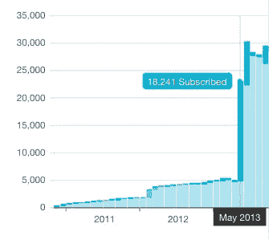

# 我如何将注册人数提高了 20，730%(通过非 A/B 测试)

> 原文：<https://medium.com/hackernoon/how-i-increased-sign-ups-20-730-by-not-a-b-testing-26ff5a21e51>

我以前平均每天有 10 个注册。但是，在 12 天的时间里，我平均每天有 2083 个注册——注册量增长了 20，730%。

在那 12 天里，我为黑客 设计的 [*的邮件列表从 5000 封增加到了 30000 封。*](http://designforhackers.com)

**我是通过非 A/B 测试做到的。**如果我专注于 A/B 测试，*也许*我可以把我体面的 9%转换率提升到 10%。我每天会有 11 个注册，而不是 10 个。

为了得到与我通过*而不是 A/B 测试*得到的结果相同的结果，我必须将转化率提高 20，944%。换句话说，我需要为每个访问者获得 19 个注册。

即使我通过 A/B 测试将转化率提高了两倍或三倍，我也要花*年*才能达到 30，000 订户。

我做了什么而不是 A/B 测试？我没有花费我有限的资源想出各种变化，设计和实现测试，然后不断地检查这些测试的结果——同时冒着被那些结果完全误导的风险——而是*用* ***我的头脑*** *想出一些吸引人的、原创的、强大的*。

扩大我的订户基础的是一个电子邮件课程公式，它使用“病毒循环”来推动注册。从那以后，我建议其他许多人使用这个方法，也取得了类似的成功。诺亚·卡根的《营销之夏》增加了 10000 名注册用户，米利扎·莫里增加了 20000 名注册用户，并与《如何成为一个早起的人》达成了一本书的协议，乔希·杜迪把他的《无畏的薪资谈判》变成了一本书，并在他的亚马逊图书类别中排名第一。

我用我对人类行为的知识设计了一些不可能通过 A/B 测试生产出来的东西。

如果你问*这和非 A/B 测试有什么关系？你认为这才是重点。你很想把你的智力看作是一种无限的资源:*为什么不参加电子邮件课程和 A/B 考试呢？但是你的大脑不是那样工作的。**

**你选择专注的每一件事都会阻止你专注于其他事情。**这叫做*机会成本*。更糟糕的是，你天生就完全意识不到这一点。丹尼尔·卡内曼称之为*你所看到的就是所有的*偏差。

我不能否认 A/B 测试，当在一个真正拥有资源的组织中正确使用时，可以是一个有利可图的努力。更多的时候，是个人或者小的创业公司真的负担不起 A/B 测试，并且容易被结果[误导](http://kadavy.net/blog/posts/aa-testing/)。

不要在 A/B 测试上浪费你宝贵的[精神资源](http://kadavy.net/blog/posts/mind-management-intro/),学会用你的观点、你对世界的理解和你的创造力来做一些不仅能给你带来增量增长，还能带来爆发性增长的事情。

***我不为我的播客做 A/B 测试，*爱你的作品。这只是关于按照你自己的定义创业成功的真实对话和课程。先从** [***贾森炸***](http://kadavy.net/blog/posts/jason-fried-basecamp/) ***的采访说起，或者在 iTunes 上订阅*******。****

******

> *[黑客中午](http://bit.ly/Hackernoon)是黑客如何开始他们的下午。我们是 [@AMI](http://bit.ly/atAMIatAMI) 家庭的一员。我们现在[接受投稿](http://bit.ly/hackernoonsubmission)并乐意[讨论广告&赞助](mailto:partners@amipublications.com)机会。*
> 
> *如果你喜欢这个故事，我们推荐你阅读我们的[最新科技故事](http://bit.ly/hackernoonlatestt)和[趋势科技故事](https://hackernoon.com/trending)。直到下一次，不要把世界的现实想当然！*

**