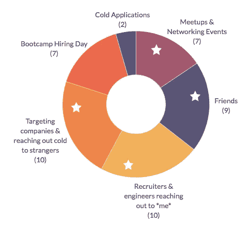
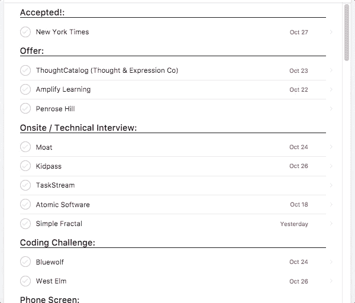
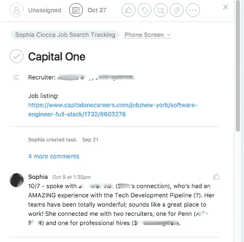
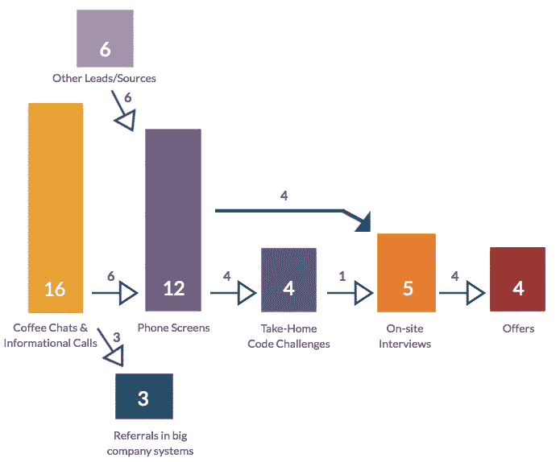
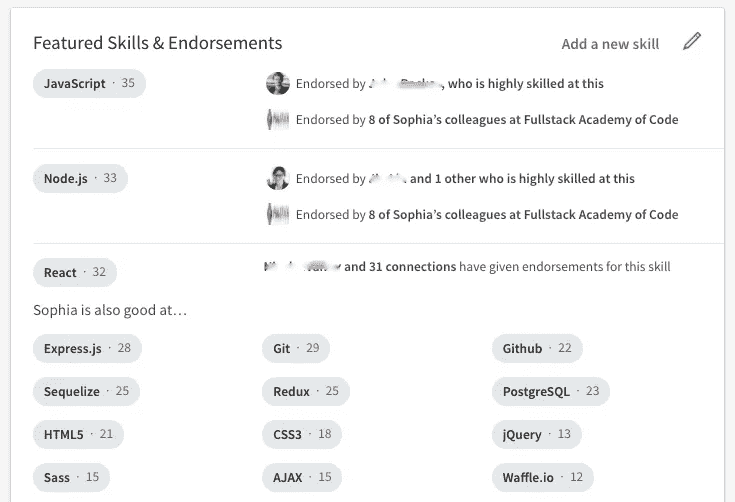
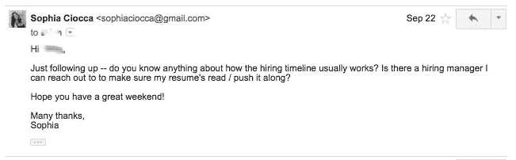

# 我是如何在短短七周内找到训练营结束后的软件开发工作的

> 原文：<https://medium.com/hackernoon/how-i-landed-my-post-bootcamp-software-developer-job-in-just-seven-weeks-7b213c1bb867>

Image credit: Viktor Hanacek

今年夏天从格蕾丝·赫柏项目(一个全女性的编码训练营)毕业后，我花了接下来的三个月时间从事教学研究，指导下一批 GH 学生，并在 9 月的第二周开始了我的后训练营求职。

在我寻找工作的七周时间里，我联系了 45 家公司，收到了四份邀请。现在是十月底，我刚刚和《纽约时报》签约。我确实抓住了一些幸运的机会，我自己的特权当然在我的成功中发挥了作用。但我也非常努力地让这一切发生，我很乐意和你分享我是如何找工作的。

# 我的方法

人们通常认为找工作需要发出数百甚至数千份申请才能得到一份工作。但就我个人而言，**我联系了不到 50 家公司**，实际只发出了三份申请。(其中一张是采访后的*，这样我就正式备案了。)不一定是数字游戏。这是一种“质量重于数量”的求职成功之道。怎么，你问？*

在我看来，人们找工作有两种截然不同的方式:一种是“质量”途径(建立关系网)，另一种是“数量”途径(提交冷冰冰的申请)。我的直觉告诉我“高质量”的路线会产生更多的收益，所以我全力以赴。

我的策略很简单: ***与“一个真实的人”取得联系，请他们买咖啡或打电话聊天。对我来说，求职过程的开始总是与一个人交谈，不管这个人是我已经认识的人，是我在 LinkedIn 上觉得冷淡的人，是我在 Twitter 上关注的人，是我猜对了邮箱地址的人，还是 Slack 上的校友。这些不同来源的人是如何比较的？***

**我公司销售线索的主要来源:**

我的线索来自很多不同的地方，但我会把它们分成几类:

Each white star indicates an offer received from one of the leads in that category.

*   **朋友们，**他们会将我与他们自己的公司或他们在其他公司的关系联系起来。这绝对是联系一家公司最简单的方法之一——一个朋友会简单地把我介绍给他们团队的招聘经理或工程经理，或者另一家我感兴趣的公司的朋友。如果一个朋友是线索的来源，下一步通常是咖啡聊天。
*   **我瞄准并联系了 cold 的公司，**在 LinkedIn 上找到在那里工作的工程师并给他们发信息。令人惊讶的是，人们愿意帮助那些对他们感兴趣的热心友好的人。我会说我对此的回复率是 50%。再说一次，我总是会要求喝杯咖啡或者打个电话。
*   **聚会和社交活动，**尤其是面向招聘的活动。我尤其在以女性为重点的招聘活动中取得了成功，其中一次我在那里见到了我未来的[经理](https://hackernoon.com/tagged/future)，并初步听说了我后来接受的职位！
*   **通过 LinkedIn 或电子邮件联系*我*、**的招聘人员和工程师。一些被动的线索来到我面前，只是因为我有一个完整的 LinkedIn 个人资料，突出地列出了我的技能，使我很容易被搜索到。其他人来是因为人们在 Medium 上找到了我的技术文章，然后联系了我。我的一个提议来自这些被动线索之一。
*   **我的训练营的招聘日，**一个小型面试活动，从中我获得了*许多*线索，但在我的过程中来得太晚了。(因为我是一名助教，所以我在招聘日之前五周就开始找工作了，所以我在去大多数招聘日公司之前就收到了工作邀请。)
*   **冷冰冰的申请，**正如我提到的，这些申请只占我线索的很小一部分，最终让我一无所获。

## **跟踪工具:**

为了跟踪我的求职，我训练营的职业成功部门建议我使用 [Asana](http://www.asana.com) 和 *boy，*有用吗。

In Asana, each company has its own listing with comments, making it easy to track everything at once.

如你所见，我给每家公司都列了一个“任务”清单，其中我会列出工作清单和我在那里的关系，以及对我到目前为止在那家公司采取的每一项行动的评论，无论是联系某人、喝咖啡、完成电话面试等等。，并记录下进展情况。

每当我进入一家公司招聘流程的新阶段时，我会将该公司的列表拖到下一个类别(例如，电话筛选、编码挑战、现场等)。)

这个系统让我可以随时了解自己在每家公司的情况。它还使我能够在一个地方找到我与特定公司关系的所有细节，并设置最后期限来提醒自己何时跟进。如果我没有这么做，我会和这么多公司混在一起！

# 招聘渠道:

每个公司的招聘流程都有不同的组成部分——一些公司有招聘人员的电话屏幕，然后立即带我去现场，另一些公司给我技术电话屏幕，或带回家的编码挑战(有些有时间限制，有些没有时间限制)。有些现场面试涉及白板，有些不涉及。有些涉及架构组件，有些则没有。

总的来说，公司越小，我发现他们的面试过程越轻松。见鬼，在一家小公司，我从来没有为他们写过代码——我只是向他们展示了我的 Github，这就足够了。另一方面，科技巨头们经常会有几轮紧张的面试。

无论如何，我的管道是这样的:

I had pretty high yields from step to step, since I avoided sending applications cold into the abyss.

正如你所看到的，“咖啡聊天”方法导致了比你通常看到的更广泛的漏斗——我的咖啡聊天超过一半导致了电话筛选或推荐，而不是许多求职者的管道，其中 300 多份申请产生了一打电话筛选。事实上，我的四个邀请中有两个来自于一次咖啡聊天或信息电话，另外一个来自于在一次社交活动中与某人见面。

对于没有任何结果的咖啡聊天，通常是因为(a)公司没有招聘，或者(b)我已经准备接受一份工作，所以在我的过程中已经太晚了。故事的寓意:咖啡聊天很棒。

总的来说，一旦我抢到了一个手机屏幕，我发现我的机会很大。我的手机屏幕中有 66%导致了下一步，而没有的一半是我拒绝的公司。只有两家公司把 *me* 的手机屏幕关掉后。(很简单，我把这种成功归功于大量回答基本技术问题的练习，以及在打电话时面带微笑、听起来愉快而兴奋。)

此外，我发现大公司系统中的推荐通常不是特别有帮助；我优雅地接受的三个坐在大型人力资源系统，从来没有成为他们。

# 我学到的:

好了，现在是我分享我来之不易的智慧的时候了——我从简单的方法(从做这些事情并获得成功)和艰难的方法(从*而不是*做这些事情并失败)中学到的教训:

## 1.找出你在求职中最弱的部分，并相应地优先安排你的时间。

在我看来，在我找工作的过程中，有三种主要的消磨时间的方式:

*   建立关系网/挖掘潜在客户
*   构建我的投资组合
*   学习算法/练习白板

在这三者中，我觉得网络部门最弱，所以我把大部分求职时间都花在了接触和建立联系上。我已经完成了一些作品集，而且我一直在训练营练习白板，所以与公司联系无疑是最有价值的消磨时间的方式。

也就是说，如果你觉得你在面试中没有任何作品可谈，或者如果你从未站在白板前，你的优先事项可能会有所不同。

## 2.完整填写你的 LinkedIn 个人资料，以获得招聘人员的关注。

我的训练营的职业成功部门要求我们所有人在 LinkedIn 上更新一张职业照片和一份推介/总结，以及**列出每一项我们认为是技能的技术**。通过列出这些技能，你会出现在招聘人员的搜索中，所以确保你的个人资料中有这些技能！

我的同事们也全都**为那些技能** **互相**背书，并且**为我们最亲密的队友写推荐信**，这让我们的个人资料有了更强的合法性。这有时感觉很傻，但我现在很自信，因为我强大的 LinkedIn 是这么多招聘人员和工程师联系我的原因之一。

## 3.先去那些你不太感兴趣的公司面试，但也不要等太久才去接触你梦想中的公司。

时间是我求职过程中最困难的部分之一。我的总体策略是，一开始去我不太感兴趣的小公司面试。这有好有坏——这是很好的实践，但也意味着我甚至在进入我真正想为之工作的公司的流程之前就收到了邀请。

我建议的方法是:

1.  **开始搜索，通过简单线索** — 校友在 slack 频道上发布的关于他们公司职位空缺的信息。告诉每个人你感兴趣，接受任何给你的面试。你参加的面试越多，你在未来的面试中就会表现得越好，无论是在行为上还是技术上。(嘿，你甚至可能会发现，一旦你来到一家你从未听说过的公司，你就会爱上这家公司！)
2.  **在你完成大约 5 次“练习”后，联系你梦想中的公司，**尤其是如果它们是科技巨头。大公司的招聘过程可能比你预期的要长，你不想开始得太晚，甚至在你完成更让你兴奋的大公司的招聘过程之前就感到接受小公司的压力。

## 4.列一个你真正想要答案的问题清单，并把它带到咖啡聊天和面试中。

我的朋友兼同学雷切尔·伯克维兹给了我这个建议，它绝对是非常宝贵的。她建议我列出 5-10 个“工作场所中我最关心的因素”，对我来说包括以下因素:

*   现代技术组合
*   明确的期望和反馈
*   当一个人“不知道”某事时，一种开放、合作和脆弱的文化
*   工作与生活的平衡
*   结构化入职培训

然后，我将这些因素转化为 5-10 个问题，我可以在咖啡聊天或面试结束时问这些问题，比如:

1.  你的团队有什么反馈机制？工程师如何知道他们做得怎么样？
2.  团队里的人都是怎么学习的？合作还是独立？
3.  什么样的性格倾向于在 X 公司/X 团队茁壮成长？*(这个问题经常导致一些启示性的答案，让我确定我不想在某些地方工作！)*

这些问题不仅让我在面试官和熟人面前显得好奇和感兴趣，也让我更好地了解这家公司是否符合我的要求。记住，你在面试这家公司，就像他们在面试你一样！

## 5.在面试前，一定要在谷歌上搜索“常见[此处插入语言]面试问题”。

即使你以前做过，一个复习者所能做的事情也是惊人的。每次面试前，我都会查阅*“常见的 JavaScript 面试问题”*，令人惊讶的是，这些问题竟然有这么多在我的面试中出现。因为我看过并准备了它们，所以我已经准备好了聪明的答案。

此外， **Glassdoor 面试总结**通常包括公司过去问过申请人的具体问题。我强烈建议在面试前也看看这些。

## **6。与任何人见面后，发送 LinkedIn 请求并附上说明。**

在任何咖啡聊天、社交活动或面试之后，我会立即登录 LinkedIn，并向我遇到的每个人发送连接请求。我总是附上一张便条，以便对方记得我是谁以及我们谈了些什么。在信中，我会感谢对方抽出时间，并询问下一步该怎么做，或者如何最好地与他们公司的机会保持联系。

这是我做过的最有价值的事情之一，无论是对我求职过程中的即时收获还是对未来的价值。我建立了自己的关系网，现在，即使在这次我没有接受邀请的公司，我也可以与我遇到的人建立关系，并在未来轻松接触他们。一切都是为了建造新的桥梁！

## 7.要进入大公司，想办法联系工程经理或招聘经理。

最初，我认为推荐会是我进入梦想中的大公司的黄金通行证。如果我能让公司里的某个人——任何人——在内部“把我放在系统里”,我就能进去了。对吗？

不对。虽然在小公司，随机的员工推荐可能就足够了，但我发现，即使我的名字旁边有红色的推荐标志，在大公司，我的申请仍然被遗忘在巨大的人力资源系统中。我在大公司的三次正式员工推荐毫无进展。

更好的方法是找到一个与工程或招聘经理的直接联系。我通常会在咖啡聊天结束时问人们是否可以“帮我联系他们团队的工程经理或招聘经理”，但主动接触也可能奏效。关键是，经理正在寻找一个真正的人来满足他们的真正需求。如果你能与他们交谈，建立面孔和姓名识别，并证明为什么*你*是能解决他们的问题并适合他们团队的人，你出现在电话屏幕前的机会就会成倍增加。

## 8.始终跟进，即使你的信息被忽视。

最初，跟进是我从来没有做过的事情——如果有人没有回复我的电子邮件，或者如果他们传递了我的简历后我没有收到回复，我认为这意味着我被拒绝了，我打扰了他们，或者他们没有时间陪我或者不想和我说话。

但是职业成功团队很快纠正了我——如果有人没有回复，可能只是你的邮件在一周的电子邮件中丢失了。你发信息的人通常不会坐在家里看他们的收件箱。**等五个工作日，然后跟进。**我无法告诉你有多少次我自己的跟进重新点燃了一条线索。

## 9.为自己创造一个品牌和/或写技术博客。

除了建立关系网，我在找工作时做得最好的两件事是(1) **在媒体上写关于技术的文章**，以及(2) **创建一个个人作品集网站**，在那里人们可以在阅读我的文章后联系我。

我一直喜欢写作，所以当有人向我推荐我在学习技术的时候写一些关于技术的东西时，我欣然接受了这个机会，从来没有意识到它会对我的求职有多大帮助。*但它确实发生了*——我收到了一些开发者的电子邮件、LinkedIn 请求和 Twitter 关注，他们阅读了我的文章，并有兴趣*为他们的公司采访我*。写作也是回馈科技社区的一种很好的方式。

关于如何作为一名新的软件开发人员建立个人品牌的更多细节，[这篇文章](https://medium.freecodecamp.org/building-your-personal-brand-as-a-new-web-developer-f6d4150fd217)做了很好的分解。TL；博士:**在 Medium、Twitter、Github 和 LinkedIn 上有一个专注于技术的社交形象**。在不同渠道之间交叉发布原创内容。成为开发者社区的积极参与者，**在你的工作和在线展示中展示一些个性和激情**。

如果你正在找工作，我希望这是有帮助的，我祝你好运！从这里开始只会变得更容易，因为我们在软件领域获得了经验，在一个供应短缺的市场中变得非常受欢迎。现在，去迷惑一些招聘经理，获得第一份技术工作吧！

—
*如果你喜欢这首曲子，我希望你能按下鼓掌按钮*👏所以其他人可能会偶然发现它。你可以在[*GitHub*](https://github.com/sophiaciocca)*上找到我的代码，在*[*Twitter*](https://www.twitter.com/sophiaciocca)*上找到我的沉思，在*[*http://www.sophiaciocca.com*](http://www.sophiaciocca.com)*上找到更多我的写作和项目。*