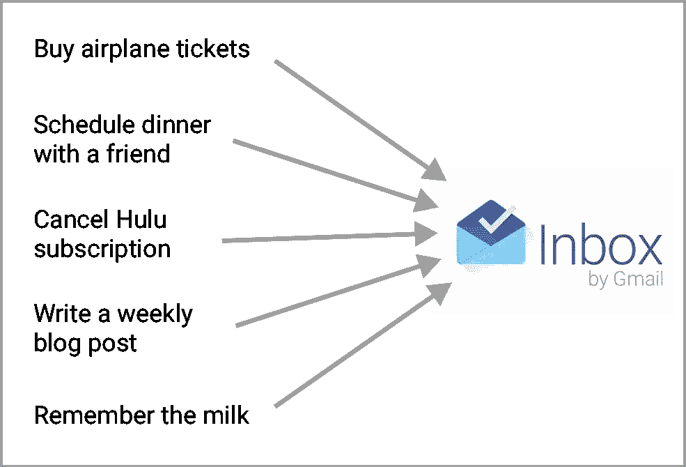
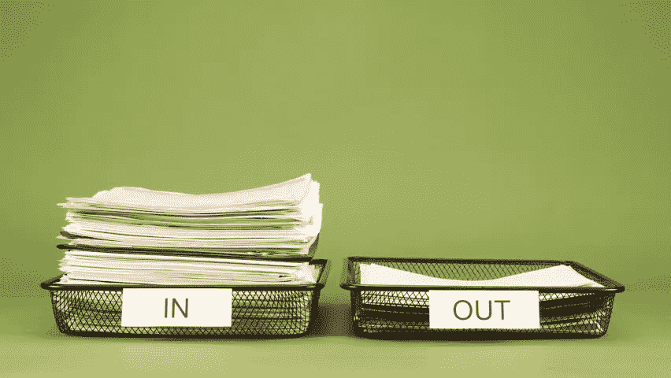
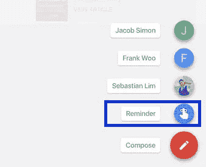
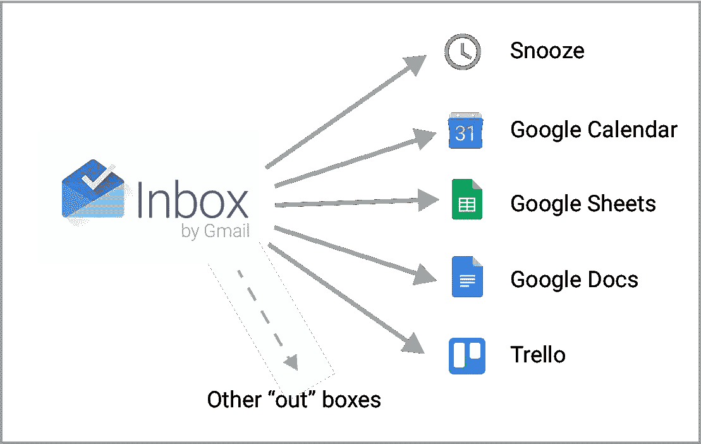

# 我如何生活:让收件箱成为真正的“收件箱”

> 原文：<https://medium.com/hackernoon/how-i-live-making-the-inbox-an-actual-in-box-7757428bc449>

这篇文章是我分享帮助我组织生活的个人“系统”的一部分。通过分享我的系统，我希望得到反馈并激励其他人也来分享。

# 我为什么要关心这个？

你每年都忘记你阿姨的生日。你从来不记得去买牛奶。你总是忘记跟进你朋友发给你的那篇关于脸书的文章。你永远也完成不了你的长期项目，而且你总是推迟去街区那家很酷的新餐馆。你现在是一个不体贴的人，从不跟进，从不记得事情，无法完成个人目标。

不管目标是什么，拥有一个简单、清晰、有效的系统来完成生活目标是我生活中最基本的方面之一。是的，以正确的方式设置事情需要一些时间，但是一旦我做了，我的投资回报绝对是值得的。

# 电子邮件:所有任务的中心

受[做事(GTD)](http://amzn.to/2qCbnng) 哲学的启发，我在我的电子邮件收件箱里应用了以下几条规则。

**规则 1:** 如果你接到一个新任务，而且可以在五分钟内马上完成，那么现在就去做。

**规则 2:** 如果你有一个超过五分钟的新任务，使用**一个**关键服务(在我的例子中，这是我的电子邮件帐户)，并把它作为记录你所有新任务的单一位置(这是“在”框)。

All of my tasks go through my Inbox account — keeping all my tasks flowing through one reliable application.

**规则 3:** 定期花时间检查你的任务，然后**筛选和过滤**它们。

> 当我说**筛选和过滤**你的电子邮件时，我基本上是在说做邮局处理邮件的事情——接收所有收到的邮件，区分优先次序，并将其移动到相应的“已发送”箱中——无论是将邮件发送到有标签的地址，返回无标签的邮件，还是将损坏的邮件作为垃圾扔掉。任务管理的一个关键方面是每个任务都有一个合适的目的地，即使它把任务放在一个“我现在不知道该怎么办”的文件夹里。

这个系统让你不再担心写下哪些任务，给自己适当的时间来完成任务，并确保没有任务从你的视线中溜走。

# “In”框

我们大多数人都忘记了我们的电子邮件主页被称为“收件箱”，因为它是传统纸质“收件箱”的改编版，如下所示。

为了遵循“把事情做完”的理念，这就是你希望你的电子邮件成为的——一个捕捉每一个进来的任务的工具，然后由你来把进来的任务分类并归类到适当的“出去”箱中。

那么，我该怎么办？我使用 Gmail 恰如其分地命名为[的收件箱。在我的电子邮件中，有两类内容。](https://www.google.com/inbox/)

**电子邮件。**我每天会收到几十封电子邮件，来自朋友、订阅或正在进行的任务(如填写申请)。我把每封邮件都当作一个任务项目，有一个合适的地方或目的地。通常，任务是回复邮件。

In the Inbox app, click the blue “Reminder” button to set a new task.

**任务。**每当我接到新任务时(例如，“嘿，斯蒂芬，你能把你提到的那篇金融文章发给我吗？”)，我会打开收件箱，给任务设置一个提醒。所以在这个例子中，我会记下“把我提到的金融文章发给克里斯。”

> 不用收件箱？如果你更愿意使用不同的电子邮件客户端，你仍然可以通过给自己发送包含任务的电子邮件来记录任务。

这样做之后，我每天都会收到源源不断的任务和电子邮件。下一步是**分类**——找出这些任务和电子邮件应该去哪里。当我有至少 30 分钟的时间集中在我的任务管理上时，我做我所有的分类。但接下来:理解如何处理这些任务，以及将它们放入哪个“出”框。

# 我最喜欢的“外出”盒子:打盹

在我们继续讨论我使用的其他各种“外出”框之前，我需要滔滔不绝地介绍一下我最喜欢的任何待办事项列表应用程序的功能:打盹。打盹任务将它们暂时移出你的收件箱，以便它们在选定的时间重新出现。我使用小睡的方式有以下几种:

## 暂停基于时间的任务

*   任务:获得朋友的生日礼物。一直睡到他们生日前两周。
*   任务:取消 Hulu 的免费月试用。推迟到订阅到期前一周。
*   任务:为我的暑假买机票。小睡一个月，我可能会得到更便宜的机票。

## 打盹需要一些额外信息的任务

*   任务:我需要买一辆新车，但我想先和我的几个朋友谈谈这件事。推迟到一周以后，这样我就可以先和朋友谈谈这件事。
*   任务:选择新的个人资料图片。几周后小睡一会儿，直到人们上传了最近一次活动的照片。

## 打盹重复提醒

*   任务:每半年给我的朋友发一封电子邮件，告诉他们生活的最新动态。每半年小睡一次。
*   任务:每周写一篇博文。每周小睡一次。

## 对需要回复的已发邮件进行休眠

*   任务:我已经给一个朋友发了一封邮件，我需要在接下来的两天内得到回复来完成一个相关的任务。推迟两天再发邮件。

> 注意:这是我最喜欢的收件箱技巧之一。你需要转到你的已发送邮件文件夹来找到这封邮件，然后你就可以在那里打盹了。如果你经常这样做，你可以随时提醒你的收件人给你回邮件，如果他们忘记回复你的邮件。

# 我该如何处理其他不可打盹的任务？

Other than snoozing my tasks, I often filter them into other applications, such as Google Sheets or Trello.

除了打盹，还有很多地方我的任务会被过滤掉。我在下面列出了几个关键的例子，但最终我的“Out”box 组织对我个人来说是有用的，并且需要一些个人定制。

## 回忆牛奶

如果我知道我会在某个时候去杂货店，我会在那之前暂停收件箱提醒。否则，我会在我的谷歌日历中添加一个访问杂货店的时间段。

## 获得文章推荐

我会将文章的链接保存在收件箱提醒中。我通常会忽略链接，直到我回到我的桌面，在那里我会阅读文章。如果它很长，我可能会把它添加到我的“稍后阅读”收件箱包中。否则，[我的大部分文章都是通过我的 RSS 阅读器](https://hackernoon.com/how-i-live-my-finite-news-system-9389631f05d8)来的。

## 获得书籍推荐

在提醒中，我会保存书名和谁推荐给我的。然后我会过滤我的电子表格书籍的标题，我在[我的“我如何阅读”中间文章](https://hackernoon.com/how-i-live-reading-books-so-they-last-6f93c7e7d702)中对此有更详细的描述。

## 长期项目

我会记下一些关于我想完成的项目的笔记。如果我喜欢，我会在谷歌文档中充实它，并在我的特雷罗板上记下它，我用它来组织长期项目。

## 支付账单

我在月底有一个周期性的提醒，给我的室友发信息，收房租和上网费用，付清账单。如果我错过了一笔付款，我会把它记下来，一周后再睡觉，这样我就可以提醒我的室友。

如果你觉得这很有趣，请推荐这篇文章，并注册我的时事通讯！在推特上关注我，地址是 [@stervyc](http://twitter.com/stervyc) 。

> [黑客中午](http://bit.ly/Hackernoon)是黑客如何开始他们的下午。我们是 [@AMI](http://bit.ly/atAMIatAMI) 家庭的一员。我们现在[接受投稿](http://bit.ly/hackernoonsubmission)并乐意[讨论广告&赞助](mailto:partners@amipublications.com)机会。
> 
> 如果你喜欢这个故事，我们推荐你阅读我们的[最新科技故事](http://bit.ly/hackernoonlatestt)和[趋势科技故事](https://hackernoon.com/trending)。直到下一次，不要把世界的现实想当然！

