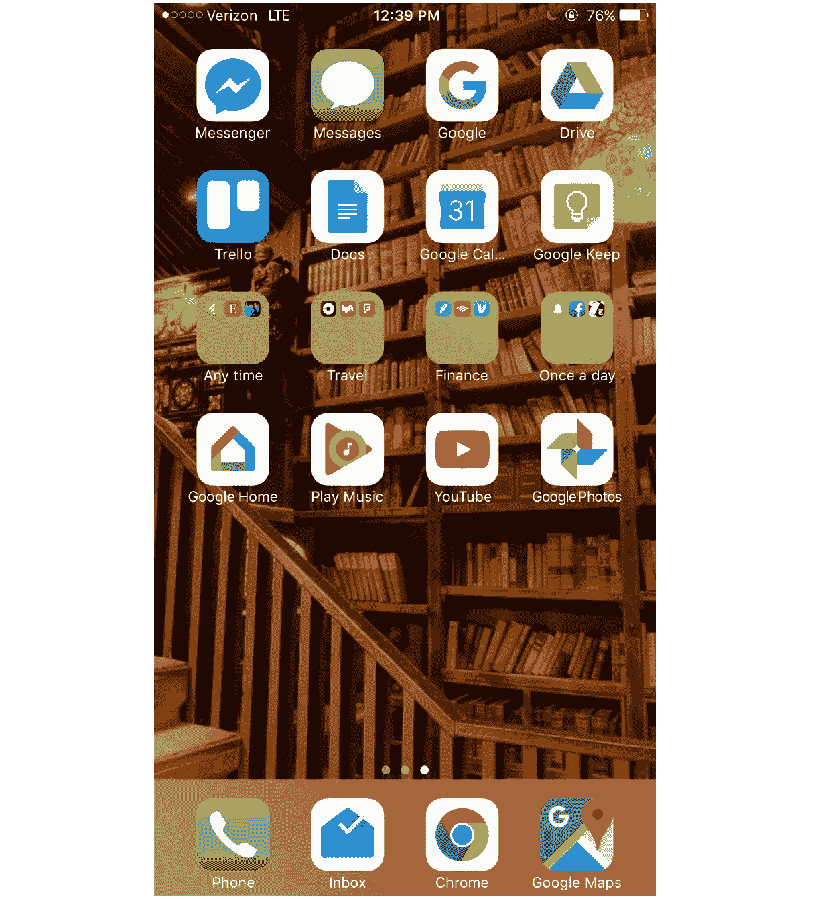
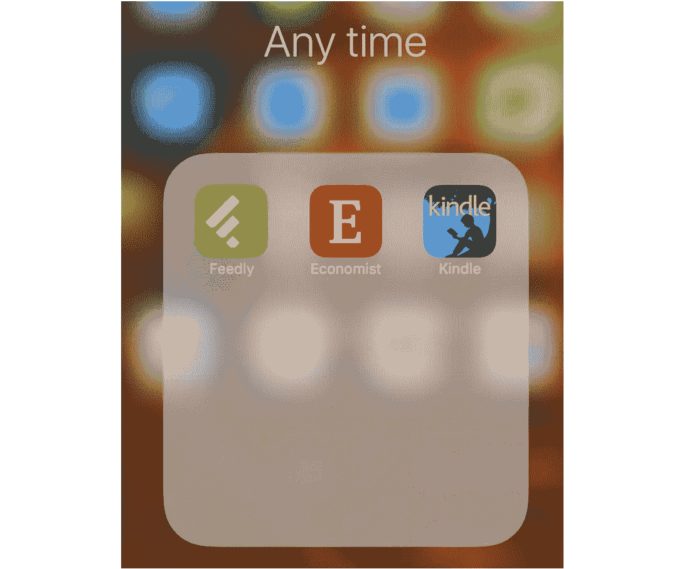
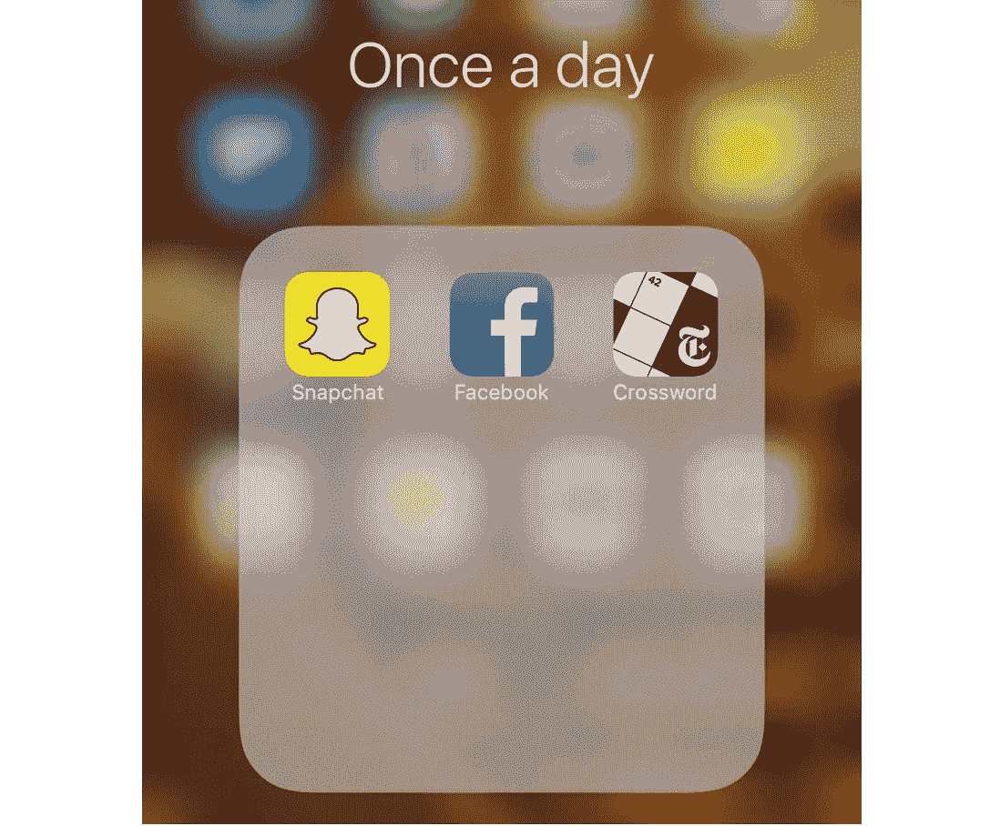

# 我的生活方式:我的 iPhone 主屏幕

> 原文：<https://medium.com/hackernoon/how-i-live-my-iphone-home-screen-ec8f82b6707d>

这篇文章是我分享帮助我组织生活的个人“系统”的一部分。通过分享我的系统，我希望得到反馈并激励其他人也来分享。

# 主屏幕，你的虚拟卧室

在很多方面，你手机的主屏幕就是你的虚拟卧室。这是一个你每天都会去的熟悉的、定制的地方，符合你的兴趣和个性。类似于卧室，我发现精心策划和组织家庭屏幕空间以营造合适的氛围非常重要。例如，在我的床边睡在一个大巧克力棒旁边不太符合我的糖摄入量目标——但是在那里放一本书可以帮助鼓励我读更多的书。

# 我的 iPhone 主屏幕

这是我的 iPhone 主屏幕，以及我有意组织它的几种方式。

## 徽章和通知关闭

我对[缓慢的网络运动](http://theslowweb.com/)越来越感兴趣，这是为了让你作为用户能够选择何时与网络互动，而不是相反。因此，我禁用了我的大多数应用程序的徽章和通知(你可以在设置应用程序中这样做)。这样，我可以避免在工作或社交时收到通知，并且可以更有意识地花时间上网。不要让你的应用通知和徽章阻止你实现目标！

> 徽章是那些带有数字的红色小圆圈，出现在 iOS 应用程序的右上角。

## 眼不见，心不烦:将大多数应用程序放入一个“附加”文件夹

我也是极简主义的忠实粉丝(我写的关于[我如何只拥有 115 样东西](https://hackernoon.com/how-i-live-my-115-things-53558259575b)的文章就是证明)。这种极简风格可以通过只下载你需要的应用程序应用到主屏幕上。然而，有一些应用程序我很少使用，但仍然希望在我的手机上使用(例如，我旅行时使用的谷歌翻译，或者我手机上只有与其他应用程序集成的 Bitmoji)。对于这些应用程序，我在 iPhone 的另一个屏幕上有一个名为“Extras”的文件夹，我很少与之互动。

> 在我的 iPhone 的另一个屏幕上，我放了所有不可移动的 iOS 应用程序，以及任何我不想看到的东西(包括“Extras”文件夹)。

## 我的“随时”文件夹

我保存了一个名为“任何时间”的文件夹，这意味着我可以(也应该)在我喜欢的任何时候访问这个文件夹。这个文件夹有三个与我的目标一致的应用程序，鼓励我继续学习和消费教育内容。

*   **Feedly** :我用它来阅读我的 RSS 提要，这在[我的新闻组织系统文章](https://hackernoon.com/how-i-live-my-finite-news-system-9389631f05d8)中有更详细的描述。
*   **《经济学人》**:我用它来阅读每周*《经济学人》*编辑推荐。
*   **Kindle** :我用它来阅读我所有的书。这是一个流畅、简单的应用程序，它真的帮助我在移动中阅读，而无需携带另一个物理对象。我在另一篇文章中描述了我的完整阅读系统。(出于好奇，我正在阅读和欣赏维克多·弗兰克尔的《人类对意义的探索》

## 我的“每天一次”文件夹

这是一个我打算每天只点击一次的文件夹，这样我就可以专注于我的目标，减少分心。按照我的预期使用频率将这些应用程序分开是很好的。

*   **Snapchat** :我一般晚上会检查一下这个，看看大家都给我发了什么，回复一下。
*   **脸书**:我其实没有脸书的 app！这个图标是 Facebook.com Safari 网页的书签，因为我不想让脸书应用程序分散我手机上的注意力。Facebook.com 移动网站消耗的电池更少，功能也更少，因此对我的注意力干扰更少。
*   纽约时报填字游戏:我喜欢做免费的每日迷你填字游戏，作为不到五分钟的快速消遣。我把这个应用程序放入“每天一次”文件夹，因为每天只有一个新的填字游戏。

## 值得一提的应用

除了我上面描述的，我还有几个最喜欢的应用。我最喜欢的应用是 Gmail 收件箱，我用它来设置提醒和过滤新任务(更多信息请点击这里)。除此之外，我喜欢使用 Trello 的移动应用程序，作为一种简单流畅的方式来组织和浏览我的一些长期想法和项目。

最后，我为我的 iPhone 主屏幕壁纸选择了一个图书馆图片，以激励我继续学习和阅读！这是那张图片的链接。

如果你对此感兴趣，请点击💚下面，并在上面注册我的简讯！

> [黑客中午](http://bit.ly/Hackernoon)是黑客如何开始他们的下午。我们是 [@AMI](http://bit.ly/atAMIatAMI) 家庭的一员。我们现在[接受投稿](http://bit.ly/hackernoonsubmission)，并乐意[讨论广告&赞助](mailto:partners@amipublications.com)机会。
> 
> 如果你喜欢这个故事，我们推荐你阅读我们的[最新科技故事](http://bit.ly/hackernoonlatestt)和[趋势科技故事](https://hackernoon.com/trending)。直到下一次，不要把世界的现实想当然！

