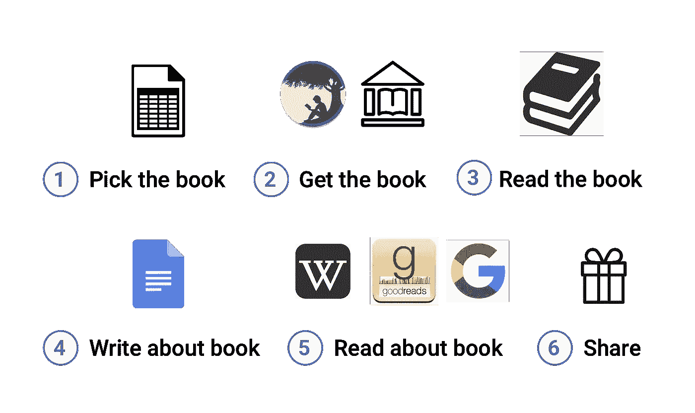

# 我的生活方式:阅读书籍，让它们经久不衰

> 原文：<https://medium.com/hackernoon/how-i-live-reading-books-so-they-last-6f93c7e7d702>

这篇文章是我分享帮助我组织生活的个人“系统”的一部分。我不是专家，但通过分享我的系统，我希望得到反馈并激励其他人也来分享。

# 我为什么要关心这个？

> “读书有两种动机；第一，你喜欢它；另一个，你可以夸耀它。”—伯特兰·罗素

在过去的五年里，我对书籍过敏(除非我可以夸耀它们)。我认为小说类书籍纯粹是为了好玩，非小说类书籍总是比网络文章更长、更不切题。我嘲笑读书人，听我的 30 分钟信息播客——浏览维基百科比花两周时间看一本书要快得多！

在最近再次阅读书籍后，我意识到播客和文章是一本书提供的五道菜餐的小胡萝卜。书籍在深入探究感兴趣的特定主题方面很有效，也能检验哲学假设(例如，“如果……世界会是什么样子？”)。例如，*《美丽新世界》*让我了解了乌托邦在平等和自由之间的紧张关系，而*《智人》*则完全改变了我对企业的看法，现在将它们视为精心构建的“想象的现实”更重要的是，在以书为媒介的长篇大论中，我能真正感同身受，进行哲学思考，并得出深刻的概念联系。

# 我如何阅读

## (1)挑选书

虽然我喜欢 Goodreads，但我个人更喜欢在电子表格中跟踪我的待阅读书籍，这样我就可以轻松地重新安排优先顺序，写笔记，并记下谁向我推荐了这本书或谁也对阅读这本书感兴趣。

你可以看看这个样本电子表格，它模拟了我如何跟踪我的待读书籍和推荐书籍。我根据主题与我最新想法/问题的相关性，或者是否有人同时在读这本书，来区分优先顺序。

## (2)拿到书

我个人更喜欢在 iPhone 上的 Kindle 应用上看书。随身携带这本书意味着我可以停止无休止地翻阅脸书，而是花 30 分钟的时间来阅读我的书的一部分。Kindle 书籍也非常适合批注。

## (3)阅读这本书

我在智能手机上的 Kindle 应用程序上看书，所以我会经常为了看书而放弃我的脸书订阅(我已经删除了手机上的大多数社交媒体应用程序)。这个习惯帮助我每天平均阅读 30 分钟到 1 小时。

我通常会从头到尾读完这本书，但是如果需要，我会跳过这本书或者略读不感兴趣的部分。当我翻阅这本书时，我会做两种类型的注释:重点和笔记。

**亮点**。这是为了当我在书中遇到一句引语或一句台词时，我真的想记住，或者是听起来像作者要表达的主要观点，或者是我想抓住的写得很漂亮的东西。

**笔记。当我阅读时，我经常会有问题、批评，或者与我读过的其他作品有联系。我会突出相关的段落，并立即记下相关的笔记。**

## (4)写书

接下来，我会迅速找到一份谷歌文档，写一份图书摘要。我通常不会为除了我自己以外的读者写这些，所以我会检查一下我的注释，将引用和注释转储到文档中，并对它们进行一些处理。

> 重要的部分:我为每本书做了一个标题为“我想记住的五件事”的部分，并在页面顶部写了一个编号列表。

你可以看看这本[为阿尔杰农](https://docs.google.com/document/d/1uJNFg7c51A6q4KiigOn_yvcdVYPtVzTAGtrINvBepzQ/edit#) 准备的*花的书摘要，了解一下我的矿井是什么样子的。*

## (5)阅读有关书籍

接下来，我会在网上阅读这本书。我通常会在维基百科上搜索作者和书，并写下任何有趣的见解或事实。接下来，我会用谷歌搜索这本书，看看是否有分析这本书的好书评，与我写的关于这本书的内容进行对比。最后，我会查看 Goodreads，其中有一个部分突出了这本书的热门引文。

## (六)股份

在我收集完所有我想记住的信息后，我会在我的 Goodreads 账户上给这本书打分，看看我的哪些朋友读过这本书。我会问他们我的问题，分享我的谷歌文档摘要，或者只是告诉他们这本书有多棒。

如果你觉得这很有趣，请推荐这篇文章，并注册我的时事通讯！在 Twitter 上关注我，地址是 [@stervyc](http://twitter.com/stervyc) 。

> [黑客中午](http://bit.ly/Hackernoon)是黑客如何开始他们的下午。我们是阿妹家庭的一员。我们现在[接受投稿](http://bit.ly/hackernoonsubmission)并乐意[讨论广告&赞助](mailto:partners@amipublications.com)机会。
> 
> 要了解更多信息，[请阅读我们的“关于”页面](https://goo.gl/4ofytp) , [喜欢/在脸书给我们发消息](http://bit.ly/HackernoonFB)，或者简单地，[发推文/DM @HackerNoon。](https://goo.gl/k7XYbx)
> 
> 如果你喜欢这个故事，我们推荐你阅读我们的[最新科技故事](http://bit.ly/hackernoonlatestt)和[趋势科技故事](https://hackernoon.com/trending)。直到下一次，不要把世界的现实想当然！