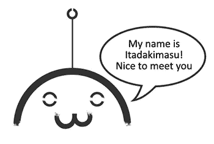
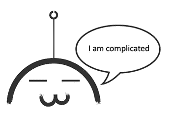
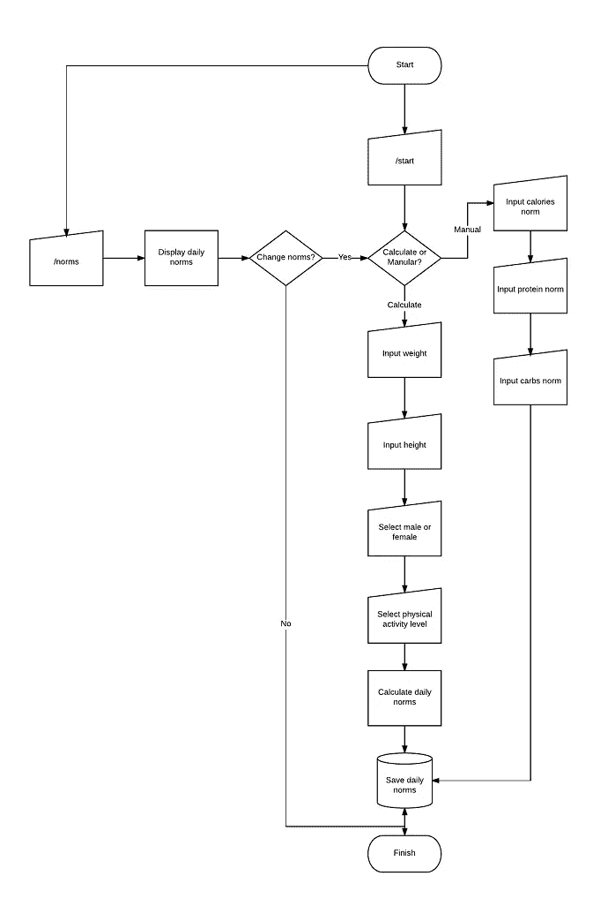
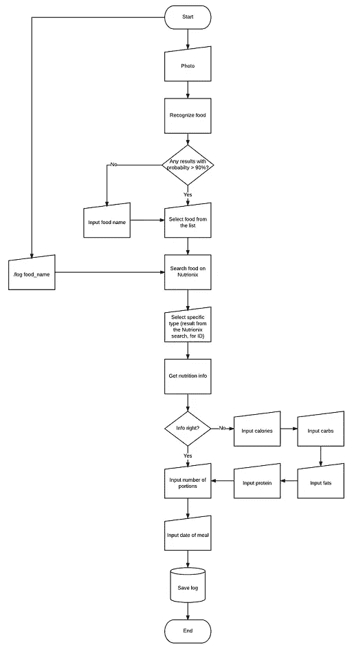
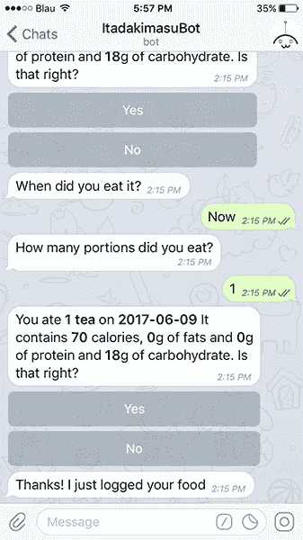
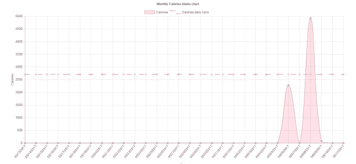

# 我如何为 Telegram 制作一个食物识别机器人，为什么它没有未来

> 原文：<https://medium.com/hackernoon/how-i-made-a-food-recognizing-bot-for-telegram-and-why-it-doesnt-have-a-future-yet-c97d9c6e249b>

认识一下 **@ItadakimasuBot。**他是一个真正的好人，被创造出来帮助你维持你的饮食。他记录下你吃的所有东西，并给你相关的统计数据。

但是他很特别——他能从你的照片中认出食物**。你不需要手写下所有的营养信息——他会自己做所有的事情。**

*注 1:这个项目主要是以学习为目的的，所以它仍然需要大量的工作*

*注 2:在文章的第一部分，我将解释是什么让机器人工作，所以如果你对技术部分不感兴趣，跳过它，开始阅读第二部分，在那里我解释了我对机器人现状的看法。*

## 第一部分。@ItadakimasuBot 如何工作

**@ItadakimasuBot** 是一个针对**电报**(暂时)的 Bot，纯 **JavaScript** 编写。它将 Node.js 用于 Bot 逻辑和统计页面的生成。

为了识别食物，我使用了**clari fai**API——尽管它远非完美(它不能识别品牌食物，例如，士力架和 bounty 都会被标记为“巧克力棒”)，但它目前已经足够好了，所以我决定不开发自己的系统。

为了得到营养信息，我找到了两个可能的选择: **FatSecret** 和 **Nutrionix** 。它们都支持完整的美国农业部信息，但是 FatSecret 支持自定义部分。

我决定继续使用 Nutrionix，因为我认为，它的信息更加用户友好。

由于 bot 没有内置会话，我决定使用 **Redis** 来获取中间信息，比如当前 bot 状态。

为了保存长期信息，比如食物日志、统计 URL 和用户信息，我使用了 **Postgres。**

除了机器人，我也有一个服务器来处理显示用户建立的统计数据。它构建于 **Express.js 之上。**它实际上非常简单，只管理两个不同的请求——一个返回*。html 页面，一个返回数据。

我没有在前端使用任何花哨的框架，如 **React** 或 **Angular** ，因为老实说，为一个包含 3 个图形的页面使用大框架是荒谬的。因此，我只是使用了 **jQuery** (我不想使用它，但因为我选择的 DatePicker 使用了它，所以我就用了它)，用于图形的 **Chart.js** 和用于最小化的 **Webpack** 。

机器人对下一个命令做出反应:

**/help** —简单地显示一条带有命令列表的消息

**/定额** —显示每日定额并允许更改

**/记录食物名称** —根据名称记录食物

**/start** —显示开始消息，为用户设置日常定额，并创建用户对象

**/stats** —生成并发送用户 URL 以查看统计数据

**【图片】** —识别食物并记录

为了与用户交流，我决定使用 **InlineKeyboard** ，因为 **ReplyKeyboard** (修改后的 OS 键盘)不允许设置自定义键值，这需要额外使用会话或额外使用 API。

Daily norms input flowchart

Food logging flowchart

## 第二部分。为什么机器人没用。暂时如此。

玩机器人很有趣。你不需要安装独立的应用程序，它们在任何平台上都是一样的。

开发机器人既容易又有趣。你根本不用担心 GUI 或者平台。

但是有几个严重的缺陷。

第一个问题是，每一个简单的操作，比如营养值的输入，都变得非常笨拙，需要额外的验证——你想让用户每次都验证他们的信息，还是只在最后才验证？但是如果用户不小心从 info 输入到其中一个字段，他应该重新输入所有内容吗？

可以通过允许自定义输入法、禁用普通键盘和自定义输入法来解决。

截至目前，有两种不同的输入法: **InlineKeyboard** 和 **ReplyKeyboard。他们都有自己的优点，但也有自己的问题。**

InlineKeyboard 没有隐藏普通的输入框，这需要额外的验证，以防用户输入列表之外的内容。由于 InlineKeyboard answer 发送 InlineQuery 而不是普通的消息事件，这个问题得到了一定程度的解决，但是由于旧的 InlineKeyboard 没有被禁用，它没有完全解决这个问题。

**ReplyKeyboard** 用于替代普通键盘，并对用户隐藏原稿。然而，原来的 QWERTY 仍然可以访问。它的另一个问题是，目前不可能用它来发送自定义信息 key 发送的数据将与它上面的文本完全一样，这将需要额外使用会话或 API。

Even without entering the nutrition info, a minimum of two validations is required

第二个问题是缺乏任何视觉控制。目前，不可能在机器人内部显示图形和表格，只有两种选择:

1.  在后端生成图形图像。非常糟糕的选择，因为大多数机器人用户使用小屏幕的手机。另外，它删除了大部分图表信息——不可能看到精确的值。
2.  发送一个 URL 到包含所有内容的网页。这很有效，但话说回来，我们为什么需要机器人？

Imagine looking at this on your mobile phone screen

2017 年的机器人与 20 年前我们在 IRC 或 Jabber 中使用的机器人没有太大区别。它们有一个非常光明的未来，但是现在——很难让它们对任何比控制你房子里的灯更复杂的事情变得用户友好。

## 第三部分。将来的

到目前为止，@ItadakimasuBot 并不真的打算在日常生活中使用。我在几周内完成了它，作为一名学生( ***请雇用我*** )，我真的不能再为它工作了。

但如果我愿意，我会:

1.  把它传到 Facebook Messenger。
2.  制作我自己的食物识别系统和营养数据库
3.  添加对不同语言的支持
4.  添加对英国/美国单位的支持(我可能会在不久的将来这样做)

我把它开源了，所以如果有人想对它进行代码审查(作为一个有抱负的程序员，我希望有更有经验的人来审查我的代码！)或者用它做点什么——不客气。

GitHub:【https://github.com/nausik/ItadakimasuBot 

机器人:[https://t.me/Itadakimasubot](https://t.me/Itadakimasubot)

感谢您的宝贵时间！

> [黑客中午](http://bit.ly/Hackernoon)是黑客如何开始他们的下午。我们是 [@AMI](http://bit.ly/atAMIatAMI) 家庭的一员。我们现在[接受投稿](http://bit.ly/hackernoonsubmission)并乐意[讨论广告&赞助](mailto:partners@amipublications.com)机会。
> 
> 如果你喜欢这个故事，我们推荐你阅读我们的[最新科技故事](http://bit.ly/hackernoonlatestt)和[趋势科技故事](https://hackernoon.com/trending)。直到下一次，不要把世界的现实想当然！

