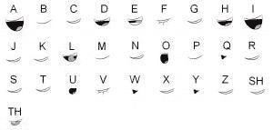

# 我用普通表情符号和 JavaScript 做了一个会说话的表情符号

> 原文：<https://medium.com/hackernoon/how-i-made-a-talking-emoji-using-regular-emojis-and-javascript-fe20e62ba10>


今天，在我工作的时候，有人在一个聊天群里发了一个有趣的小脚本:[http://jsbin.com/nijohi/edit?js,output](http://jsbin.com/nijohi/2/edit?js,output)。最初的代码是由 Martin Kleppe 编写的——为他简短的实现向他致敬。

代码很简单，但是效果很有趣。表情符号[看起来像是在说话。](https://hackernoon.com/tagged/emoji)

现在我们要看看代码做了什么。代码的第一部分`[ ..."😮😀😁😐😑😬" ]`将表情符号串转换成一个数组。这样，我们可以从数组中选择单个元素。

你可能想知道为什么我们把一个字符串转换成一个数组来从中选择一个字符。这是因为表情符号不是单个字符，通常是四个字节(实际上，表情符号看起来像这样:“\xF0\x9F\x98\x81”)。

使用这种技术，可以让 [JavaScript](https://hackernoon.com/tagged/javascript) 引擎保留 Unicode 字符的结构，并以正确的方式拆分表情列表。

正如你所看到的，我们有两种有效的方法来访问正确的表情符号，数组一要短得多，也更容易记住。

数组方法的工作要感谢字符串对象的[迭代器实现。不是像`""[n]`一样遍历每个字节，而是在每个码位之间迭代(一个 unicode 字符就是一个码位)。](https://developer.mozilla.org/en-US/docs/Web/JavaScript/Reference/Global_Objects/String/@@iterator)

既然这个字符串是一组分离良好的表情符号，那么就有可能一个接一个地选择它们来获得一个有效的表情符号。使用`[new Date%6]`依次选择表情符号。这段代码每毫秒返回一个不同的序列表情符号，`%6`确保我们不会越界。

最后，`document.body.innerHTML = "<h1>" +`将表情符号设置为页面的唯一内容。

但是，正如你所看到的，表情符号并没有变化得那么快，也不是每毫秒都在变化，但仍然是连续的。

这是因为

```
setInterval(_=>{ },99)
```

每 99 毫秒执行一次函数，通过每次 99 毫秒，我们使`%6`每减少一个数字。

当我写这篇文章时，Martin 写的代码仍然是最初的代码。
在我发布之后，我注意到他修改了两次代码，以解决两个错误:

第一个错误如 [didymospl](https://news.ycombinator.com/item?id=16009437) 所指出的，`99%6 === 3`。
这意味着如果浏览器在正确的时间正确执行超时，只会显示 2 个表情符号，0 和 3。我将省去你的数学计算，如果`x%y`是`y`的任何除数(不包括 1)的倍数，你将丢失一些数字。
检查你选择的数字组合是否正确的一个快速方法是检查`x`和`y`的最大公约数是否为 1 ( `GCD(99,6) === 3, GCD(97,6) === 1`)。
因此 [Martin 将超时时间更新为 97](http://jsbin.com/nijohi/3/edit?js,output) 这不是 3 或 2 的倍数。

即使进行了这种修正，代码在一些浏览器上仍然运行不正常，这是因为浏览器上的 *setTimeout* 不可靠，如果浏览器忙于做任何事情，它将在另一个时刻执行 setTimeout。为了使它在浏览器中更加一致，他选择使用`~~(Math.random()*6)`而不是`new Date()%6`来使它总是随机的。这是另一段有趣的代码，Math.random 返回一个介于 0 和 1 之间的随机数(1 除外)，所以如果你把它乘以 6，它会返回一个介于 0 和 6 之间的数。唯一的问题是，这个数字是一个浮点数，我们不想访问位置 1.2 的表情符号，而是位置 1 的表情符号。为了使它成为整数，他使用了深奥的运算符`~`，这个运算符是一个按位 not，在数学术语中它返回`(Math.floor(n) + 1) * -1`，通常这个运算符用于另一个技巧，[检查一个数是否不是-1](https://www.joezimjs.com/javascript/great-mystery-of-the-tilde/) (对于 indexOf 非常有用)。但是在 [code golf](https://en.wikipedia.org/wiki/Code_golf) 中它有另一个用途，将任何东西转换成整数，通过使用它两次，它只保留了`Math.floor`的效果。

> 如果你想在你的代码 golf competition 上节省 11 个字节，你可以用~

先前的代码正在反转。我需要避免这种情况，所以我需要一个增加的数字。为了获得这个，我使用了`Math.floor (new Date/delay)`。它不返回当前的毫秒数，而是返回当前的十分之一秒。

既然数字是递进的，我只需要把它限制在一个范围内。对于表情符号，我需要坚持表情符号的数量(6)，对于文本，我需要文本的长度+ 1(我使用+1 来显示最新的字符，记住 length%length == 0)。

结果还不错:表情符号动了动嘴，下面出现了一条文字。但是嘴的运动是完全不相关的。我从出生开始就一直在看配音电影，那些配音很差的电影总是让我很恼火，所以我必须做点什么，让那个表情符号以更好的方式动画化。

我搜索的第一个东西是一张图片，它展示了每个字母的各种嘴部动作。在谷歌搜索了五分钟后，我终于找到了正确的图片:



是时候将不同的表情符号映射到每个字母上了。为此，我需要一个漂亮的页面，上面有我可能需要的所有表情符号:[https://emojipedia.org/apple/](https://emojipedia.org/apple/)。

在为图片中每个独特的嘴部动作选择一个之后，我开始创建地图:

非字母字符的默认表情符号( "，"！"、“、“… ) —现在我只需要修改代码来检索正确的表情符号。

这部新法典分为两部分:

1.  查找表情符号当前正在发音的字符:

代码很简单，因为我们使用了显示消息的相同代码逻辑，但是只选择了一个字符。主要的区别是`message.toLowerCase()`，因为当我检查字符是否与我的表情地图中的字符匹配时，我需要它不区分大小写。

2.选择正确的表情符号:

这段代码首先将表情地图转换成表情数组。这样，我就可以用表情符号作为键，一个一个地检查每个值。例如:

find 函数将逐个检查这些值，直到我为该值执行的函数返回 true。在我们的例子中，我使用的函数是`emoji => emojiMap[emoji].includes(character)`。这只是检查该表情符号的字符集是否包含我要搜索的字符。

如果 find 没有找到任何东西，它将返回`undefined`，那是一个假值。通过使用`|| defaultEmoji`，我可以让我的代码在 find 没有找到任何东西时返回`defaultEmoji`。

现在功能正常，表情符号说话正确，但在手机上看起来很糟糕(在 Android 上)。我希望它甚至可以在移动设备上工作，所以我需要让代码返回一个在每个平台上都平等的表情符号。为此，我将使用 [twemoji](https://github.com/twitter/twemoji) 。

Twemoji 是 Twitter 的一个库，可以在任何地方使用他们的表情符号。这个库很容易使用，有一个名为 parse 的方法来解析一个文本字符串，并返回一个 HTML 字符串，其中每个表情符号都是一个图像。

这在目前来说是完美的，并且实现起来非常简单。我首先将脚本包含在页面中，并做了一点小小的改动，将我的表情符号转换成图像:

图像质量有点低。也许我们可以做点什么。查看文档时，我注意到我可以使用 SVG。

让我们使用它们:

表情符号现在在手机上看起来很好，但文本太多了。为了解决这个问题，我把我要展示的文本分成几个单词，我只展示最后两个:

诀窍很简单。为了拆分单词，我使用了`.split(' ')`，它将一个字符串分解成一个由空格分隔的字符串数组。

```
const words = message.substr(0, Math.floor(new Date / delay)%(message.length+1)).split(' ')
```

然后，我使用`.pop()`获取表情符号正在说的当前单词

```
const current = words.pop()
```

我将所有内容添加到页面中，在最新的一个单词之前弹出这个单词。

```
document.body.innerHTML = "<h1>" + ... + "</h1><h3>" + words.pop() + "</h3><h2>" + current
```

最后，唯一剩下的小问题是，在带有嘴部位置的图像上，不仅有单个字符，还有组合字符，像`sh`和`th`。

如果剧本能抓住他们，那就太神奇了。

为了捕捉这两个字符组合，我不仅需要查看当前字符，还需要查看上一个和下一个字符。

我刚刚写的代码创建了三个变量:当前字符、当前字符和前一个字符、当前字符和下一个字符。

现在我们有了所有这三个变量，我们需要优先考虑几个字符。为此，我们首先在表情地图上搜索`previousDouble`。如果我们什么也没找到，我们搜索`nextDouble`，最后搜索当前的`character`。

最后，稍微修饰一下，会说话的表情符号就完成了！

仍然有很大的改进空间，如果您想进一步扩展这个脚本，这里有几个想法:

1.  使用[网络语音 API](https://developer.mozilla.org/en-US/docs/Web/API/Web_Speech_API) 让表情符号真正说话。这将有几个挑战，例如同步“嘴唇运动”与声音。
2.  使用 [D3](https://d3js.org/) 制作从一个表情符号到另一个表情符号的过渡动画，使其更加自然和真实。
3.  停止使用表情符号，使用更有表现力的图片，也可以识别更多的双元音。这更容易，因为代码几乎不需要修改。

这个故事最初发表在[共同导师](https://www.codementor.io/mauriziocarboni/how-i-made-a-talking-emoji-using-regular-emojis-and-javascript-etmz7svtg)上。