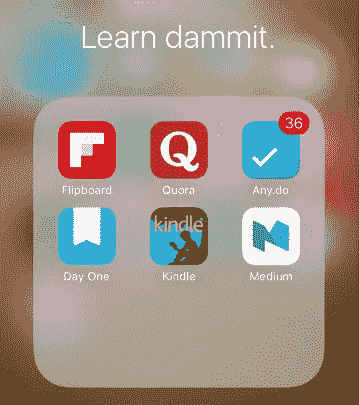
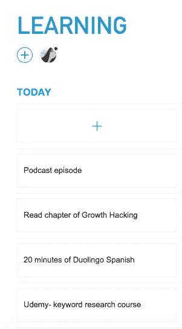

# 我是如何挤出时间学习的

> 原文：<https://medium.com/hackernoon/how-i-make-time-to-learn-99aeb3f3139f>

对于像我这样的企业，我能真正做好工作的唯一方法就是不断学习。

不幸的是，我也必须做好我的工作。我现在的日子很长，因为自从搬到西班牙巴塞罗那后就只有我一个人在打理事情。

我已经养成了一些技巧和习惯，帮助我在繁忙的日程中适应持续的学习，甚至不用去想它。

在一天中下意识地获取信息实际上帮助我以后想出最好的主意。

**我是这样做的。**

# 拖延和学习:

在我的第一个屏幕上的一个标签中，我将这四个应用程序组合在一起，这样当我需要休息时就可以打开它们:

**iPhone 版 Kindle 应用:**

每周，我都会挑选两本书:一本关于自我提升，一本关于与我的业务相关的东西。我尽量挑选 200-500 页范围内的书。早上喝咖啡的时候，我会花 20 分钟浏览每本书的几章。每当我在工作时间喝咖啡的时候，我都会这样做(喝得太多了)。现在，我正在第一千遍阅读迈克尔·a·辛格的《无拘无束的灵魂》。

[**Flipboard**](http://flipboard.com/)**:**

这是我用来看与工作相关的新闻和趋势的。Flipboard 为我提供了一个超级可视化的界面，可以快速查看我所关注主题的热门文章。我关注创业、商业、技术和营销方面的话题，这样我就可以很容易地掌握我需要知道的任何新信息或趋势。我把它们保存起来，以后可以更深入地研究。

**中等:**

我只想知道你们在做什么，听听你们的故事。

[**Quora**](https://www.quora.com/profile/Sophia-Ellis-10):

对我来说，这是几件事:内容研究、观众反馈、喜剧救济，以及一半时间因为深刻的答案而让我哭泣。

[**多林戈**](http://duolingo.com/) **:**

自从搬到西班牙，我不得不加强西班牙的业务。在等地铁、下班休息、等咖啡时等等。我只是打开 Duolingo，到处练习一些短语。这实际上很容易上瘾。

# 流汗和学习:

没有什么比分心更能让我锻炼了。

播客:我不能让自己中途打断任何人，所以 1 小时播客= 1 小时锻炼。完美。我最喜欢的是大卫·卡达维的 [**爱你的作品**](http://kadavy.net/blog/posts/love-your-work-my-new-podcast/)。他也离开了在美国的工作和生活，在一个说西班牙语的国家做自己的事情，他的建议总是非常值得遵循。

# 躺在床上学习:

如果我要变得没有效率，我还不如把它变成被动学习的时间。

[**Udemy:**](http://udemy.com/)**这是我的新网飞。我一周大概会买两门不同技能的课程。我“狂看剧集”，晚上做笔记。我用第一天的时间做笔记，以便以后回顾。这是非常有用的工具之一，可以快速、直接地学习新技能，更好地帮助我的客户。**

# **我是如何提醒自己去学习的:**

**为了掌握所有这些学习途径，我在我的个人效率跟踪应用程序 [**Any.do**](http://any.do/) 中创建了一个新列表，以确保我浏览了我的书籍、课程、功课等。**

****

**我每周经历的比我预期的要多得多。你会惊讶地发现，用这几个应用程序，你可以偷回多少分钟。**

> **[*——索菲亚*](http://sophiaellis.co)**