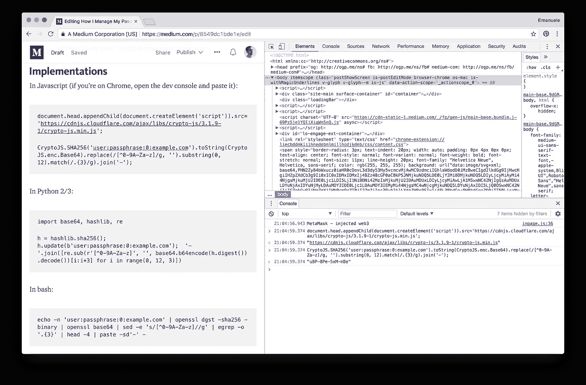

# 我如何管理我的密码(技术版)

> 原文：<https://medium.com/hackernoon/how-i-manage-my-passwords-technical-version-8549dc1bde1e>

**更新:**我们发布了 [MemPa，一个现代的确定性密码管理器](/@0x0ece/mempa-a-modern-deterministic-password-manager-2c0f28fa108b)，实现了本文中的想法。

在过去的一年里，我改进了一种方法来处理我的密码，因为我与现有的经理有一个主要问题:有一些密码——谷歌、银行——我**从来不想存储**，但我**总是想访问**。

我开始在一个亲密的群体中分享我的想法，邀请了一些朋友，现在我认为是时候打开它了，看看你怎么想。

这是一个为可用性而设计的确定性密码管理器。对于每一个*服务*(站点或应用)，我们从*密码短语*(需要*知道的事情*)中生成一个唯一的*秘密*(存储在服务中的密码)。我们只需要记住一个密码，或者很少一部分——我个人有一个默认密码，一个用于重要网站(谷歌、脸书等等)，一个用于银行。这是高级算法:

```
secret = ...**hash(** ...passphrase, service... **)**
```

这些是常见问题。

## 问:你真的散列密码吗？！？！

不。我们没有“散列密码来安全地存储它”，这将是错误的。Secret *就是*密码，而且:1。我们从不储存它，2。该服务将存储它的密码加密。(希望如此！)
我们是“哈希生成随机位串”。

## 问:为什么不使用密钥派生函数？！？！

KDF 需要盐，这是记不住的东西，这是一个交易破坏者。主要目标是能够只用我们能记住的信息重建任何秘密。

# 算法

具体算法是这样的:

```
secret = format(hash( username, passphrase, counter, service ))
```

其中:

*   *用户名*，用于登录的用户名或邮箱
*   *密码*是组密码，即对于一组服务来说是相同的
*   *计数器*是一个能够在需要时生成新秘密的计数器，它几乎总是 0
*   *服务*是服务，按照惯例主机名去掉了“www”，比如 pinterest.com——注意没有严格强制，我们甚至可以使用“pinterest.com”登录“pinterest.co.uk”
*   散列值是 sha256，选择它是因为它在许多环境中都可用——我们将尽快用 sha3 替换它
*   *format* 是一个将 hash 的输出转换成“格式正确”的字符串的函数。我们决定使用 base64，去掉所有非字母数字字符，截断为 12 个字符(60 位)，并每 3 个字符添加一个破折号，例如“uBP-8Pe-5xM-mBe”(与 Safari 使用的格式相同)

# 履行

在 Javascript 中(如果你在 Chrome 上，打开开发控制台并粘贴):

```
document.head.appendChild(document.createElement('script')).src='[https://cdnjs.cloudflare.com/ajax/libs/crypto-js/3.1.9-1/crypto-js.min.js](https://cdnjs.cloudflare.com/ajax/libs/crypto-js/3.1.9-1/crypto-js.min.js)';CryptoJS.SHA256('user:passphrase:0:example.com').toString(CryptoJS.enc.Base64).replace(/[^0-9A-Za-z]/g, '').substring(0, 12).match(/.{3}/g).join('-');
```



在 Python 2/3 中:

```
import base64, hashlib, reh = hashlib.sha256(); h.update(b'user:passphrase:0:example.com');  '-'.join([re.sub(r'[^0-9A-Za-z]', '', base64.b64encode(h.digest()) .decode())[i:i+3] for i in range(0, 12, 3)])
```

编辑:我朋友 Paolo 建了[自己的 Python app](https://github.com/psmiraglia/python-dpg) ！

在 bash 中:

```
echo -n 'user:passphrase:0:example.com' | openssl dgst -sha256 -binary | openssl base64 | sed -e 's/[^0-9A-Za-z]//g' | egrep -o '.{3}' | head -4 | paste -sd'-' -
```

这就是我们想要的可用性。参数和核心算法很容易记住，加密函数(sha256，base64)也很容易获得。

上面的一行程序只是花哨的附加程序，我个人不太记得它们，但是一旦我运行了 sha256 和 base64(在示例中，getting:" uBP 8 PE 5 xmbbeeopleasg+ppkpbkbbmvorbaavofwis 0 = ")，我就可以很容易地手动导出格式化字符串" uBP-8Pe-5xM-mBe "。

我已经开始用几个密码做实验，现在我在我的大多数网站和应用程序中使用这种方法。

很明显，它不适用于现有的秘密，也不适用于你必须频繁输入的密码，比如解锁我的笔记本电脑的密码。在实践中，我没有遇到其他“明显”的限制，例如，对于有特殊要求的站点，secret 的格式很容易适应和记住。

接下来，我打算开发一个管理秘密的应用程序，让它更容易在手机上复制和粘贴。所有这些都保留了核心思想，即一些密码永远不应该被存储，但总是可以访问的。(即使没有 app！)

是时候听听你的意见了:你怎么看？你喜欢这个算法吗？你看到自己在使用它吗？如果你有批评，这些批评是针对确定性密码管理器的，还是针对这个的？如果你很喜欢它，你会觉得少了什么吗？任何反馈都是非常受欢迎的，在下面的评论中，在黑客新闻上，或者在 Twitter [@0x0ece](https://twitter.com/0x0ece) 上。

**更新:**看看 [MemPa，一个现代的确定性密码管理器](/@0x0ece/mempa-a-modern-deterministic-password-manager-2c0f28fa108b)，它实现了本文中的想法。