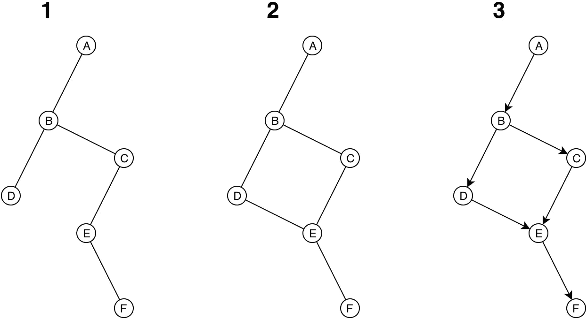

# 我如何搞砸了我的艺术应用的发布

> 原文：<https://medium.com/hackernoon/how-i-messed-up-my-artsy-apps-launch-e684111de532>

前几天，我在 Medium 上写了一篇文章，讲述了我是如何制作一个基于科学的艺术应用的。结果，我的下载量大幅增加，崩溃次数也比我希望看到的多了一些。

事故报告实际上相当神秘，直到我在 iPad 上启动我的应用程序。这个应用程序看起来很好，但是当我敢触摸浮动的顶部栏时，这个应用程序崩溃了。很糟糕。事实上，糟糕到我花了一整天才想明白。

> **第一课**:当你的女朋友问你，在广泛宣传你的应用程序之前，你是否检查过它是否工作正常，你应该听她的。

该应用程序崩溃是因为各种手势识别器的设置方式。手势识别器是那些检测你的手指如何在屏幕上移动并让你的应用程序执行各种事情的软件。看起来，在我的例子中，GRs 被设置在一个循环图中。这是个坏消息。糟糕到我需要一个草图来解释。

图 1 称为非循环图。它没有周期。从一个节点到另一个节点只有一种方法。当你的手指触摸 iPad 屏幕时，它会产生一个事件，这个事件会传播到你的应用程序中所有可能想要处理它的小东西。这些东西通常排列在一个非循环图中。当手势识别器设置正确时，它们或多或少会模仿那些东西的结构。过度简化，如果你的事件从 A 开始，向下到 B，然后“同时”到 D 和 C，再从 C 到 E，最后到 f。

然而，如果手势识别器设置不当，它们可能会出现图 2 所示的情况。这就是所谓的循环图。可以有多条路径——甚至无限长！—从任何节点到任何其他节点。假设每个节点将触摸事件传播到它的任何连接，而不是事件来自的连接，这就是非循环图的工作原理，你从节点 A 到节点 B，然后到节点 C 和 D，C 和 D 然后到 E，但是 E 在任何单一时间只获得其中一个事件，所以如果 E 从 C 获得事件， 然后它必须把它发送到 F 和 D，F 是没问题的，但是 D 必须把事件传播到它的所有出口，这意味着回到 B，B 会把它发送到 A 和 c，清洗和重复，你得到了一个无限循环。 无限循环大多是坏消息。

我包括了图 3——一个**定向的**循环图——因为它可能减轻循环图的一些问题，但它可能不是在所有情况下都有效。底线是:如果你在一个图中路由东西，要么你确保一段时间后你的东西“死亡”，并以合理的速度，要么你跟踪你已经发送的东西，浪费宝贵的内存，或者[你只是为了我们大家而避免循环图](https://en.wikipedia.org/wiki/Morris_worm)。

现在，我对 iOS 的内部情况一无所知，但鉴于错误消息提到了图形和手势识别器，我猜有些东西以类似的方式搞砸了。这对我没有太大帮助，这个错误似乎只影响 iOS 10 的事实也没有帮助。最没用的一点是，没有多少开发人员遇到这样的崩溃。一个家伙成功地用一个奇怪的边缘案例再现了它，在这个案例中，用户界面在应用程序中的某个特定时间被初始化，而它本不应该被初始化。

正如我提到的，我使用 [Cinder](https://libcinder.org/) 作为我的应用程序的主干。Cinder 并不是专门设计来制作应用程序的，大多数时候你不会使用原生操作系统的控件来制作 Cinder 应用程序的用户界面，所以人们必须初始化应用程序以使其适合常规 UIKit 框架的方式有点违反直觉。无论如何，通过我自己的代码，以及 Cinder 附带的示例代码，我注意到我正在使用故事板初始化我的周围界面——这是一种非常好的技术——而不是徒手完成。事实证明，故事板打乱了用户界面上初始化事物的顺序，因此很可能导致手势识别器处于不一致的状态。

瞧，一行代码。

最让我生气的是，在 iOS 10 之前，故事板没有把这搞乱。然而，苹果在幕后做事情的方式——事实上，任何封闭和不透明的技术在幕后做事情的方式——是阻止我更容易理解这一点的原因。

> 第二课:当 iOS 测试版——或者你所依赖的任何足够封闭和不透明的技术——出现时，你会拼命跑，趁你还有时间，检查你所有的应用程序是否还能工作。

新的，固定版本的[圆形铃铛现在出来了](https://itunes.apple.com/us/app/circular-bells/id1062362784?mt=8)，并且仍然是免费的！请原谅这个打嗝——上面写着:大麻烦——尽情享受吧！如果你觉得慷慨，你可以扔一些硬币给我，我不会抱怨的！

 [## 欢迎捐款！

paypal.me](https://paypal.me/AFranceschini) 

> [黑客中午](http://bit.ly/Hackernoon)是黑客如何开始他们的下午。我们是 [@AMI](http://bit.ly/atAMIatAMI) 家庭的一员。我们现在[接受投稿](http://bit.ly/hackernoonsubmission)，并乐意[讨论广告&赞助](mailto:partners@amipublications.com)机会。
> 
> 如果你喜欢这个故事，我们推荐你阅读我们的[最新科技故事](http://bit.ly/hackernoonlatestt)和[趋势科技故事](https://hackernoon.com/trending)。直到下一次，不要把世界的现实想当然！

