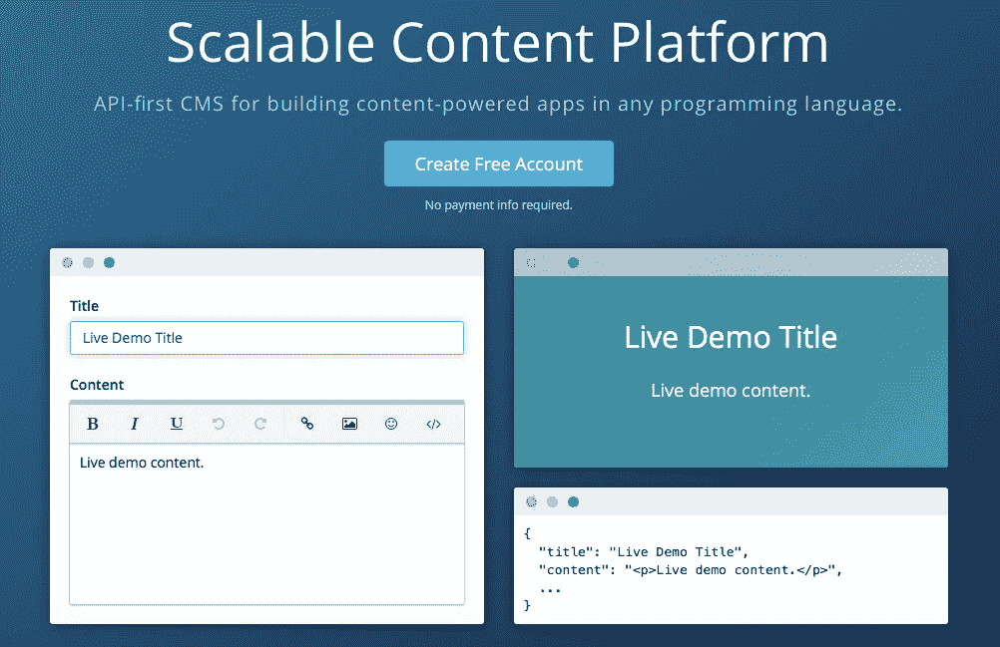

# 我如何把我的博客从 WordPress 转移到 Cosmic JS

> 原文：<https://medium.com/hackernoon/how-i-moved-my-blog-from-wordpress-to-cosmic-js-ab49848f351a>

在这篇博文中，我将告诉你我是如何将我的博客内容从 WordPress 迁移到它在 [Cosmic JS](https://cosmicjs.com/) 上的快乐云内容驱动的新家的。 [Cosmic JS](https://cosmicjs.com) 提供了一个直观的 API，可以向任何网站或应用程序交付内容，让您可以自由地使用任何编程语言构建应用程序，同时允许您的开发团队更容易扩展。

[Cosmic JS](https://cosmicjs.com) 提供了一种简化的编辑体验，为您提供快速、轻松发布内容所需的一切。由于没有 CMS 安装，您可以在开发的任何阶段轻松构建内容，并避免不必要的流程瓶颈。

## 从 WORDPRESS 导出

我必须采取的第一步是从我的旧博客中导出数据。由于 [Cosmic JS](https://cosmicjs.com) 使得将数据导入 bucket 变得非常容易，我所要做的就是找到一个 WordPress 插件，将 WordPress 数据导出到一个 JSON 文件中，这个 JSON 文件经过适当的格式化，可以导入到 Cosmic JS bucket 中。幸好有这样的插件存在:)[https://github.com/cosmicjs/cosmicjs-wp-export](https://github.com/cosmicjs/cosmicjs-wp-export)。安装插件后，我所要做的就是选择我想导出的文章类型，然后点击导出。这给了我一个 JSON 文件，其中包含了我执行迁移到 [Cosmic JS](https://cosmicjs.com) 所需的所有数据。

 [## cosmicjs/cosmicjs-wp-export

### cosmicjs 的导出插件。

github.com](https://github.com/cosmicjs/cosmicjs-wp-export) 

## 导入宇宙 JS

下一步是将数据导入到 [Cosmic JS](https://cosmicjs.com) 中。为了导入到一个新的 bucket 中，我创建了一个新的 bucket 并导航到 Bucket >设置>导入/导出数据。然后我把从 WP 导出的 JSON 文件拖到页面上，几秒钟内我的数据(和文件！)都进口到我的桶里了。(插件未导入)

## 构建新的博客应用程序

我的下一个任务是建立一个新的博客应用程序。我选择的应用是在[宇宙 JS 应用页面](https://cosmicjs.com/apps)上可用的未来不完美应用。它有一个圆滑、现代的前端(由 HTML5UP.net[的](http://html5up.net/) [@n33co](https://twitter.com/n33co) 设计)并且建立在一个轻量级 Node.js 服务器之上(再见 PHP！).我从 GitHub repo 中获取了未来不完美的应用程序，并对其进行了编辑以适应我的需求。[Cosmic JS NPM 模块](https://www.npmjs.com/package/cosmicjs)使得从 Cosmic JS API 获取内容到新的 JavaScript 后端变得很容易。mustache 模板(Hogan)成为了 Cosmic JS JavaScript 客户端提供的名称空间对象属性的完美补充，例如:{ { Cosmic . object . nav . metafield . site-title . value } }，这有多简单？！？

## 部署！

下一步也是最后一步是部署应用程序，让全世界看到和惊叹！我决定使用我的 [Cosmic JS](https://cosmicjs.com) bucket 中的部署特性来部署我的新博客应用。这样做的途径是桶>设置>部署 Web 应用程序。为我的新博客添加[公共 GitHub url 并点击部署真的很容易！几分钟后，我的新博客就发布了。](https://github.com/tonyspiro/tonyspiro.com)

我很高兴地说，你现在正在阅读的博客是建立在这个新的易于管理、快速的 Node.js / Cosmic JS 应用程序堆栈之上的！有了这个新设置，我的博客现在速度更快了，在页面速度测试中表现得也更好了。这是因为我的博客现在运行在一个轻量级的服务器/ [CMS API](https://cosmicjs.com/) 堆栈上，而不是一个安装了大量应用程序和插件的堆栈上。

我希望你喜欢我的故事，我是如何把我的内容从已安装的 CMS 的束缚中解放出来的。[今天就创建一个免费的宇宙 JS 账户](https://cosmicjs.com/signup)，看看免费**你的**内容有多简单！如果你有任何问题或评论，请在下面的评论区告诉我。你也可以在推特上联系我。

# 比较宇宙 JS 和 WordPress

 [## 宇宙 JS vs. WordPress

### Cosmic JS 是一个 API 优先的 CMS，帮助开发人员和内容编辑团队更快地构建应用程序。64.5%的开发人员…

hackernoon.com](https://hackernoon.com/cosmic-js-vs-wordpress-668608df4e22) 

[Cosmic JS](https://cosmicjs.com/) 是一个 API 首创的基于云的内容管理平台，可以轻松管理应用和内容。如果你对 Cosmic JS API 有任何疑问，请通过 [Twitter](https://twitter.com/cosmic_js) 或 [Slack](https://cosmicjs.com/community) 联系创始人。

> [黑客中午](http://bit.ly/Hackernoon)是黑客如何开始他们的下午。我们是 [@AMI](http://bit.ly/atAMIatAMI) 家庭的一员。我们现在[接受投稿](http://bit.ly/hackernoonsubmission)并乐意[讨论广告&赞助](mailto:partners@amipublications.com)机会。
> 
> 如果你喜欢这个故事，我们推荐你阅读我们的[最新科技故事](http://bit.ly/hackernoonlatestt)和[趋势科技故事](https://hackernoon.com/trending)。直到下一次，不要把世界的现实想当然！

